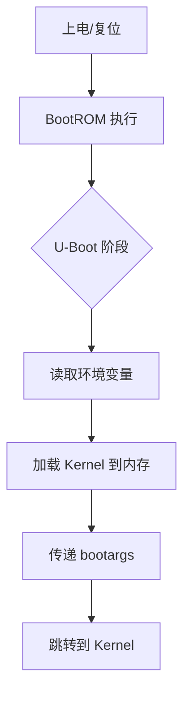
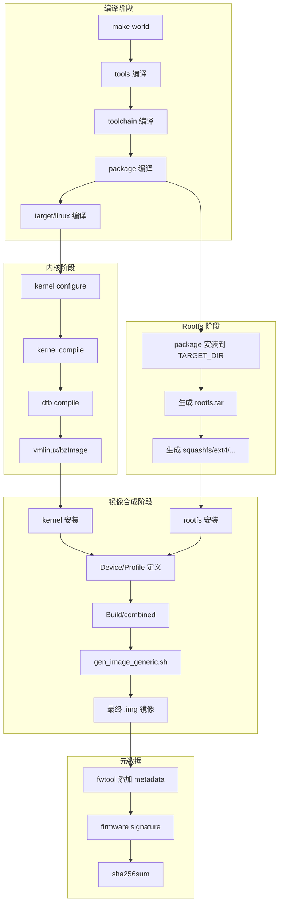

# OpenWrt 固件打包流程：Kernel + Rootfs + 分区镜像合成原理

## 概述

OpenWrt 固件是将多个组件（Bootloader、Kernel、Rootfs、配置）打包成单一可烧录镜像的过程。本文档详细说明从源码编译到最终固件镜像的完整打包流程。

## 系统组件架构

### 启动流程五阶段

```
┌─────────────────────────────────────────────────────────────┐
│  1. Bootloader (U-Boot/similar)                             │
│     - 硬件初始化                                            │
│     - 加载 Kernel                                           │
│     - 传递启动参数                                          │
├─────────────────────────────────────────────────────────────┤
│  2. Kernel (Linux)                                         │
│     - 内核镜像: vmlinux/bzImage/zImage/uImage              │
│     - 设备树: .dtb 文件                                     │
│     - 内核命令行参数                                        │
├─────────────────────────────────────────────────────────────┤
│  3. Root Filesystem (根文件系统)                            │
│     - SquashFS/EXT4/JFFS2/UBIFS/EROFS                     │
│     - 系统库、程序、配置                                   │
├─────────────────────────────────────────────────────────────┤
│  4. fstools (文件系统工具)                                  │
│     - mount_root, blockd, hotplug mount                    │
│     - 动态挂载 /overlay                                    │
├─────────────────────────────────────────────────────────────┤
│  5. 用户空间服务 (procd, netifd, uci)                     │
│     - 服务自举                                              │
│     - 网络配置                                              │
└─────────────────────────────────────────────────────────────┘
```

---

## 第一阶段：Bootloader

### U-Boot 集成方式

OpenWrt 中 U-Boot 作为独立的 package 构建（`package/boot/uboot-*`），不包含在最终固件镜像中，而是在设备出厂时预烧录。

**U-Boot 构建位置：** `package/boot/uboot-*/Makefile`

**U-Boot 变量（`include/u-boot.mk`）：**

| 变量 | 含义 |
|------|------|
| `UBOOT_IMAGE` | 输出的镜像文件名，默认 `u-boot.bin` |
| `BUILD_TARGET` | 构建目标平台 |
| `BUILD_SUBTARGET` | 子平台变体 |
| `ATF` | ARM Trusted Firmware 文件（如需要） |
| `TPL` | 第二阶段 loader（如 DDR 初始化） |

### U-Boot 与固件关系

```
设备出厂时 ──────────────────┐
                             ▼
                    ┌──────────────────┐
                    │  U-Boot 预烧录   │
                    │  (ROM/Flash)    │
                    └──────────────────┘
                             │
                             ▼
                    ┌──────────────────┐
                    │  Kernel + Rootfs │
                    │  (可升级)        │
                    └──────────────────┘
```

**关键理解：** U-Boot 通常不随固件升级更新，而是设备出厂时一次性烧录。

### Bootloader 启动流程



---

## 第二阶段：Kernel 构建

### 内核镜像类型

| 镜像格式 | 说明 | 位置变量 |
|---------|------|---------|
| `vmlinux` | 原始 ELF 格式 | `LINUX_KERNEL` |
| `bzImage` | x86 PC 引导格式 | `KERNEL_NAME=bzImage` |
| `zImage` | ARM/mips 压缩格式 | 内核自动生成 |
| `uImage` | U-Boot 专用格式 | 通过 `mkimage` 包装 |

### Kernel 构建流程

**1. 内核配置（`include/kernel.mk`）：**
```makefile
KERNEL_BUILD_DIR := $(BUILD_DIR)/linux-$(BOARD)_$(SUBTARGET)
LINUX_DIR := $(KERNEL_BUILD_DIR)/linux-$(LINUX_VERSION)
```

**2. 设备树编译（`include/image.mk`）：**
```makefile
define Image/BuildDTB
    $(TARGET_CROSS)cpp -nostdinc ... -o $(2).tmp $(1)
    $(LINUX_DIR)/scripts/dtc/dtc -O dtb -o $(2) $(2).tmp
endef
```

**3. 内核安装（`target/linux/Makefile`）：**
```makefile
$(KDIR)/$(KERNEL_NAME):: image_prepare
    $(call Kernel/Compile)
    $(call Kernel/Install)
```

### 内核镜像输出位置

```
build_dir/linux-x86_64/linux-6.12/
├── vmlinux              # 原始 ELF
├── arch/x86/boot/bzImage  # x86 PC 引导
├── System.map
└── .config
```

---

## 第三阶段：Root Filesystem 构建

### 支持的文件系统类型

| 文件系统 | 配置选项 | 特点 |
|---------|---------|------|
| SquashFS | `CONFIG_TARGET_ROOTFS_SQUASHFS` | 只读、压缩、适合嵌入式 |
| EXT4 | `CONFIG_TARGET_ROOTFS_EXT4FS` | 可写、适合硬盘/SD卡 |
| JFFS2 | `CONFIG_TARGET_ROOTFS_JFFS2` | NAND 闪存专用 |
| UBIFS | `CONFIG_TARGET_ROOTFS_UBIFS` | 大容量 NAND |
| EROFS | `CONFIG_TARGET_ROOTFS_EROFS` | 只读、高压缩比 |

### Rootfs 构建流程

**1. 基础目录准备（`package/Makefile`）：**
```makefile
$(curdir)/stamp-install: $($(curdir)/stamp-compile)
    # 安装所有选中的 packages 到 TARGET_DIR
```

**2. 文件系统镜像生成（`include/image.mk`）：**
```makefile
# SquashFS
define Image/mkfs/squashfs
    $(STAGING_DIR_HOST)/bin/mksquashfs4 \
        $(TARGET_DIR) $@ \
        -nopad -noappend -root-owned \
        -comp $(SQUASHFSCOMP) $(SQUASHFSOPT)
endef

# EXT4
define Image/mkfs/ext4
    $(STAGING_DIR_HOST)/bin/make_ext4fs -L rootfs \
        -l $(ROOTFS_PARTSIZE) $@ $(TARGET_DIR)/
endef
```

**3. SquashFS 特性（`include/image.mk` 第 88-93 行）：**
```makefile
SQUASHFS_BLOCKSIZE := $(CONFIG_TARGET_SQUASHFS_BLOCK_SIZE)k
SQUASHFSOPT := -b $(SQUASHFS_BLOCKSIZE)
SQUASHFSOPT += -p '/dev d 755 0 0' -p '/dev/console c 600 0 0 5 1'
SQUASHFSCOMP := gzip  # 或 xz/lz4 等
```

---

## 第四阶段：分区镜像合成

### 分区概念

| 分区 | 挂载点 | 内容 | 典型大小 |
|-----|-------|------|---------|
| Boot | `/boot` | Kernel + DTB | 8-128MB |
| RootFS | `/` | SquashFS 只读系统 | 剩余空间 |
| Overlay | `/overlay` | 可写层 (JFFS2/UBI) | 可选 |

### 分区工具：ptgen

`scripts/gen_image_generic.sh` 使用 `ptgen` 创建分区表：

```bash
# 第 24 行：创建分区表
ptgen -o "$OUTPUT" \
    -h $head -s $sect \          # 柱面/磁头/扇区
    -t "${KERNELPARTTYPE}" \     # Kernel 分区类型 (83=LINUX)
    -p "${KERNELSIZE}m" \        # Kernel 分区大小
    -t "${ROOTFSPARTTYPE}" \     # RootFS 分区类型
    -p "${ROOTFSSIZE}m"         # RootFS 分区大小
```

### 镜像合成脚本

**`scripts/gen_image_generic.sh` 核心逻辑：**

```bash
# 1. 创建分区镜像
head=16; sect=63
ptgen -o "$OUTPUT" -h $head -s $sect ...

# 2. 写入 RootFS
dd if="$ROOTFSIMAGE" of="$OUTPUT" bs=512 seek="$ROOTFSOFFSET" conv=notrunc

# 3. 创建 Kernel FAT 文件系统
mkfs.fat -L kernel -C "$OUTPUT.kernel" -S 512 "$((KERNELSIZE / 1024))"
dos_dircopy "$KERNELDIR" /   # 递归复制内核文件

# 4. 写入 Kernel 分区
dd if="$OUTPUT.kernel" of="$OUTPUT" bs=512 seek="$KERNELOFFSET" conv=notrunc
```

### x86 组合镜像示例

**`target/linux/x86/image/Makefile` 第 37-52 行：**
```makefile
define Build/combined
    # 复制 Kernel 和 grub
    $(CP) $(KDIR)/$(KERNEL_NAME) $@.boot/boot/vmlinuz
    $(CP) $(STAGING_DIR_IMAGE)/grub2/boot.img $@.boot/boot/grub/
    $(CP) $(STAGING_DIR_IMAGE)/grub2/$(grub_variant)-core.img ...

    # 调用 gen_image_generic.sh 生成最终镜像
    PADDING="1" SIGNATURE="$(IMG_PART_SIGNATURE)" \
        $(SCRIPT_DIR)/gen_image_generic.sh \
        $@ \
        $(CONFIG_TARGET_KERNEL_PARTSIZE) $@.boot \   # Kernel 大小和目录
        $(CONFIG_TARGET_ROOTFS_PARTSIZE) $(IMAGE_ROOTFS) \  # RootFS 大小和镜像
        256
endef
```

---

## 第五阶段：Device/Profile 与镜像关联

### Device 定义结构

**`target/linux/ath79/image/generic.mk` 示例：**
```makefile
define Device/tplink_tl-wr1043nd-v5
  DEVICE_VENDOR := TP-Link
  DEVICE_MODEL := TL-WR1043ND
  DEVICE_VARIANT := v5
  DEVICE_PACKAGES += kmod-ath9k wpad-basic-mbedtls
  IMAGE_SIZE := 16000k
  KERNEL := kernel-bin | append-dtb
  KERNELNAME := vmlinux
endef
TARGET_DEVICES += tplink_tl-wr1043nd-v5
```

### 镜像构建命令链

`include/image.mk` 第 756-776 行：
```makefile
define Device/Build/image
    # $(1) = filesystem type (squashfs, ext4, etc.)
    # $(2) = image type (combined, rootfs, etc.)

    # 依赖：Kernel 镜像 + Rootfs 镜像
    $(KDIR)/tmp/$(DEVICE_IMG_NAME): \
        $(KDIR_KERNEL_IMAGE) \
        $(KDIR)/root.$(1)

    # 调用镜像构建命令（如 grub-config | combined | grub-install）
    $(call concat_cmd,$(IMAGE/$(2)/$(1)))
endef
```

### IMAGE 变量语法

**`target/linux/x86/image/Makefile` 第 104-108 行：**
```makefile
IMAGE/combined.img := grub-config pc | combined | grub-install | append-metadata
#        │            │        │         │              │
#        │            │        │         │              └── 添加元数据/sha256
#        │            │        │         └── 安装 GRUB 引导扇区
#        │            │        └── 合成 kernel + rootfs
#        │            └── 生成 GRUB 配置
#        └── 镜像类型
```

---

## 完整构建流程图



---

## 关键配置文件清单

| 文件路径 | 用途 |
|---------|------|
| `include/kernel.mk` | 内核构建变量和编译规则 |
| `include/image.mk` | 镜像构建核心（1017行） |
| `include/image-commands.mk` | 镜像构建命令定义 |
| `include/rootfs.mk` | Rootfs 安装逻辑 |
| `include/u-boot.mk` | U-Boot 构建集成 |
| `target/linux/<board>/image/Makefile` | 平台镜像定义 |
| `target/linux/<board>/image/*.mk` | Device/Profile 定义 |
| `scripts/gen_image_generic.sh` | 分区镜像合成脚本 |
| `scripts/ubinize-image.sh` | UBI 镜像生成 |

---

## 典型镜像输出

### x86/64 镜像结构

```
bin/targets/x86/64/
├── openwrt-x86-64-generic-rootfs.tar.gz    # Rootfs tar 包
├── openwrt-x86-64-generic-combined.img.gz  # Kernel + Rootfs + GRUB
├── openwrt-x86-64-generic-vmlinux.efi      # EFI 格式内核
├── openwrt-x86-64-generic-initramfs-kernel.bin
└── packages/                                # IPK 包目录
```

### 组合镜像内部结构

```
┌────────────────────────────────────────┐
│  MBR + 分区表                           │
├────────────────────────────────────────┤
│  Boot Partition (FAT)                   │
│  ├── vmlinuz (Kernel)                   │
│  └── grub/                              │
│      ├── grub.cfg                       │
│      └── core.img                       │
├────────────────────────────────────────┤
│  RootFS Partition (SquashFS/EXT4)       │
│  ├── /bin, /etc, /lib, /usr            │
│  └── /overlay (可写层)                  │
└────────────────────────────────────────┘
```

---

## 总结

1. **Bootloader (U-Boot)**：设备出厂预烧录，不随固件更新，负责硬件初始化和加载 Kernel
2. **Kernel**：通过内核配置和编译生成 `vmlinux`/`bzImage`，结合设备树 `.dtb`
3. **Rootfs**：通过 OpenWrt 的包管理器安装所有软件包，生成 SquashFS/EXT4 等格式
4. **分区合成**：`gen_image_generic.sh` 通过 `ptgen` 创建分区表，将 Kernel 和 Rootfs 写入对应分区
5. **元数据**：通过 `fwtool` 添加设备兼容性信息和签名

固件升级时通常只更新 Kernel 分区和 Rootfs 分区，Bootloader 保持不变。
