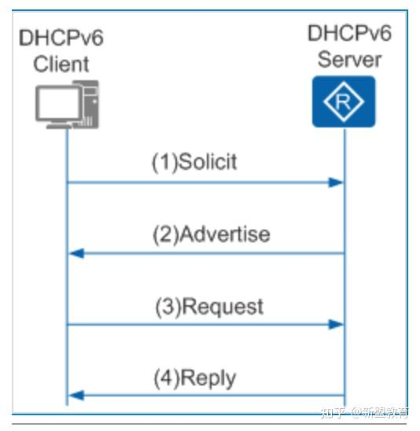
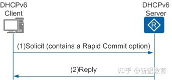
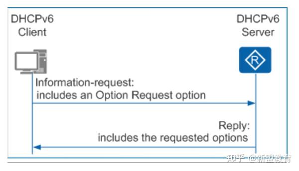
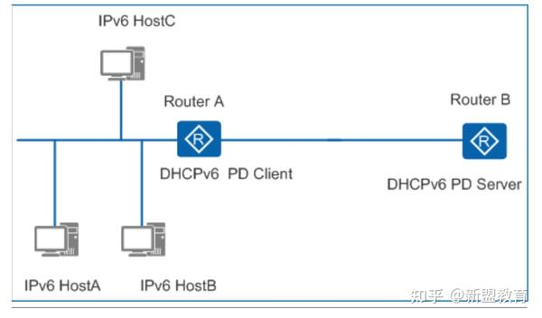
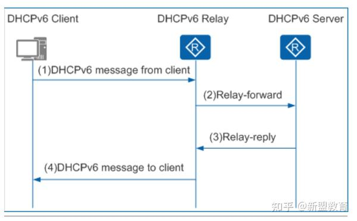

# DHCPv6工作原理
DHCPv6自动分配分为DHCPv6有状态自动分配和DHCPv6无状态自动分配。   

## DHCPv6有状态自动分配
DHCPv6服务器自动配置IPv6地址/前缀，同时分配DNS、NIS、SNTP服务器等网络配置参数。   

DHCPv6服务器为客户端分配地址/前缀的过程分为两类   
1. DHCPv6四步交互分配过程   
四步交互常用于网络中有多个DHCPv6服务器的情况。DHCPv6客户端首先通过组播发送Solicit报文来定位可以为其提供服务的DHCPv6服务器，在收到多个DHCPv6服务器的Advertise报文后，根据DHCPv6服务器的优先级选择一个为其分配地址和配置信息的服务器，接着通过Request/Reply报文交互完成地址申请和分配过程。   
   
2. DHCPv6两步交互分配过程   
两步交互常用于网络中只有一个DHCPv6服务器的情况。DHCPv6客户端首先通过组播发送Solicit报文来定位可以为其提供服务的DHCPv6服务器，DHCPv6服务器收到客户端的Solicit报文后，为其分配地址和配置信息，直接回应Reply报文，完成地址申请和分配过程。   
需要服务器和客户端都支持快速两步分配地址，以及客户端报文中带有Rapid Commit选项   
   

## DHCPv6无状态自动分配
主机IPv6地址仍然通过路由通告方式自动生成，DHCP服务器只分配除IPv6地址以外的配置参数，包括DNS、NIS、SNTP服务器地址等参数。   

   
1. DHCPv6客户端以组播方式向DHCPv6服务器发送Information-Request报文，该报文中携带Option Request选项，指定DHCPv6客户端需要从DHCPv6服务器获取的配置参数。

2. DHCPv6服务器收到Information-Request报文后，为DHCPv6客户端分配网络配置参数，并单播发送Reply报文，将网络配置参数返回给DHCPv6客户端。DHCPv6客户端根据收到Reply报文提供的参数完成DHCPv6客户端无状态配置。

## DHCPv6前缀代理
DHCPv6前缀代理DHCPv6 PD(Prefix Delegation)是由Cisco公司提出的一种前缀分配机制，并在RFC3633中得以标准化。在一个层次化的网络拓扑结构中，不同层次的IPv6地址分配一般是手工指定的。手工配置IPv6地址扩展性不好，不利于IPv6地址的统一规划管理。   

通过DHCPv6前缀代理机制，下游网络设备不需要再手工指定用户侧链路的IPv6地址前缀，它只需要向上游网络设备提出前缀分配申请，上游网络设备便可以分配合适的地址前缀给下游设备，下游设备把获得的前缀(一般前缀长度小于64)进一步自动细分成64前缀长度的子网网段，把细分的地址前缀再通过路由通告(RA)至与IPv6主机直连的用户链路上，实现IPv6主机的地址自动配置，完成整个系统层次的地址布局。   

   
1. DHCPv6 PD客户端发送Solicit报文，请求DHCPv6 PD服务器为其分配IPv6地址前缀。

2. 如果Solicit报文中没有携带Rapid Commit选项，或Solicit报文中携带Rapid Commit选项，但服务器不支持快速分配过程，则DHCPv6服务器回复Advertise报文，通知客户端可以为其分配的IPv6地址前缀。

3. 如果DHCPv6客户端接收到多个服务器回复的Advertise报文，则根据Advertise报文中的服务器优先级等参数，选择优先级最高的一台服务器，并向该服务器发送Request报文，请求服务器确认为其分配地址前缀。

4. DHCPv6 PD服务器回复Reply报文，确认将IPv6地址前缀分配给DHCPv6 PD客户端使用。

## DHCPv6中继
DHCPv6客户端通过DHCPv6中继转发报文，获取IPv6地址/前缀和其他网络配置参数（例如DNS服务器的IPv6地址等）。   

   

1. DHCPv6客户端向所有DHCPv6服务器和DHCPv6中继发送目的地址为FF02::1:2（组播地址）的请求报文。

2. 根据DHCPv6中继转发报文有如下两种情况：   
如果DHCPv6中继和DHCPv6客户端位于同一个链路上，即DHCPv6中继为DHCPv6客户端的第一跳中继，中继转发直接来自客户端的报文，此时DHCPv6中继实质上也是客户端的IPv6网关设备。DHCPv6中继收到客户端的报文后，将其封装在Relay-Forward报文的中继消息选项（Relay Message Option）中，并将Relay-Forward报文发送给DHCPv6服务器或下一跳中继。   
如果DHCPv6中继和DHCPv6客户端不在同一个链路上，中继收到的报文是来自其他中继的Relay-Forward报文。中继构造一个新的Relay-Forward报文，并将Relay-Forward报文发送给DHCPv6服务器或下一跳中继。   

3. DHCPv6服务器从Relay-Forward报文中解析出DHCPv6客户端的请求，为DHCPv6客户端选取IPv6地址和其他配置参数，构造应答消息，将应答消息封装在Relay-Reply报文的中继消息选项中，并将Relay-Reply报文发送给DHCPv6中继。

4. DHCPv6中继从Relay-Reply报文中解析出DHCPv6服务器的应答，转发给DHCPv6客户端。如果DHCPv6客户端接收到多个DHCPv6服务器的应答，则根据报文中的服务器优先级选择一个DHCPv6服务器，后续从该DHCPv6服务器获取IPv6地址和其他网络配置参数。