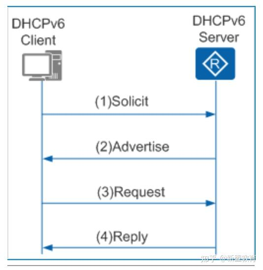
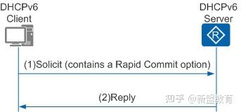
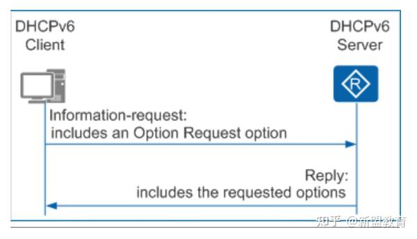
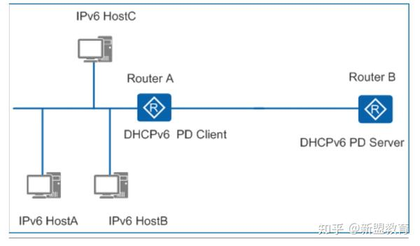
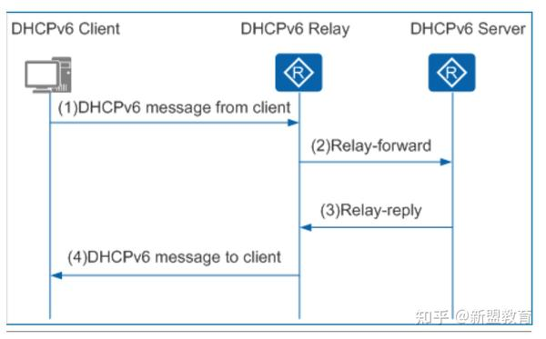

# DHCPv6 协议详解

## 1. 概述 — DHCPv6在IPv6地址配置中的角色

IPv6 主机获取地址不再依赖 DHCPv6 单独完成，而是由 ICMPv6 邻居发现协议（NDP）与 DHCPv6 协同工作。完整流程如下：

1. **主机启动**：接口 UP 后，主机以组播方式向 `FF02::2`（All Routers）发送 **RS**（Router Solicitation）报文，寻找链路上的路由器。
2. **路由器响应**：路由器收到 RS 后，周期性或立即回复 **RA**（Router Advertisement）报文。RA 中包含前缀信息、以及 M / O 两个标志位。
3. **依据 RA 标志位分支**：
   - **M=1**：地址和其他参数均从 DHCPv6 服务器获取（有状态 Stateful DHCPv6）。
   - **M=0, O=1**：地址通过 SLAAC 自动生成，仅 DNS 等参数从 DHCPv6 获取（无状态 Stateless DHCPv6）。
   - **M=0, O=0**：纯 SLAAC，不使用 DHCPv6。

DHCPv6 与 DHCPv4 的关键差异：

| 对比项 | DHCPv6 | DHCPv4 |
|--------|--------|--------|
| 传输层 | UDP，服务器端口 **547**，客户端端口 **546** | UDP，服务器端口 67，客户端端口 68 |
| 报文类型 | 13 种类型（见第 3 章），由报文 type 字段区分 | 8 种类型（DISCOVER/OFFER/REQUEST/ACK/NACK/DECLINE/RELEASE/INFORM） |
| 客户端标识 | 使用 DUID（DHCP Unique Identifier）标识客户端 | 使用 MAC 地址 + chaddr 字段 |
| 地址分配方式 | 地址与配置参数分离，可有状态/无状态两种模式 | 一般地址与参数绑定分配 |
| 链路层寻址 | 无广播，全部使用**组播**（Multicast）或单播 | 依赖广播（Broadcast）或单播 |
| 目的地址 | 链路范围组播 `FF02::1:2`（All_DHCP_Relay_Agents_and_Servers） | 广播地址 `255.255.255.255` |
| 地址冲突检测 | 独立于 DHCP，由 DAD（重复地址检测）完成，冲突后触发 Decline | 由 DHCP 服务器通过 ping 探测等方式完成 |
| 链路范围 | 报文只在链路内有效，跨链路需中继（Relay Agent） | 同样需要中继，但实现方式不同 |
| 时钟与时间 | 使用 T1 / T2 定时器管理租约续期 | 使用 T1 / T2 定时器管理租约续期（语义相似） |

## 2. DHCPv6与ICMPv6/NDP的协作

### 2.1 NDP基础简介

NDP（Neighbor Discovery Protocol，RFC 4861）是 IPv6 的基础协议，使用 ICMPv6 报文实现。四种核心报文：

| ICMPv6 类型号 | 报文名称 | 方向 | 作用 |
|---------------|----------|------|------|
| 133 | RS（Router Solicitation） | 主机 → 路由器 | 主机启动后请求路由器立刻发送 RA |
| 134 | RA（Router Advertisement） | 路由器 → 主机 | 通告前缀、M/O/A 标志位、跳数限制等 |
| 135 | NS（Neighbor Solicitation） | 任意节点 → 组播/单播 | 查询邻居的链路层地址，也用于 DAD |
| 136 | NA（Neighbor Advertisement） | 任意节点 → 请求方 | 回应 NS，通告自己的链路层地址 |

### 2.2 RA报文中的M/O标志位如何决定DHCPv6行为

RA 报文的标志字段由两位组成，控制 DHCPv6 的参与方式：

| M 标志 | O 标志 | 模式 | 行为 |
|--------|--------|------|------|
| 1 | 1 | 有状态（Stateful） | 地址 + 其他配置参数均从 DHCPv6 服务器获取 |
| 0 | 1 | 无状态（Stateless） | 地址通过 SLAAC（RFC 4862）自动生成，仅 DNS、SNTP 等参数从 DHCPv6 获取 |
| 0 | 0 | 纯 SLAAC | 不使用 DHCPv6，参数也通过 RA 的其他选项（如 RDNSS）下发 |
| 1 | 0 | 理论上存在 | 地址从 DHCPv6 获取，但其他参数不通过 DHCPv6 下发；实践中少见，一般不使用这种组合 |

> M 标志位意为 "Managed Address Configuration Flag"（受管地址配置标志），O 标志位意为 "Other Configuration Flag"（其他配置标志）。实际路由器配置中常写作 `managed-address` 和 `other-config`。

### 2.3 A位（自治标志，Autonomous Flag）

RA 前缀信息选项（Prefix Information Option）中的 **A 位**（Autonomous Flag）控制 SLAAC 是否启用：

- **A=1**：前缀可以用于 SLAAC，主机基于该前缀自行生成 IPv6 地址（EUI-64 或 RFC 7217 随机接口标识）。
- **A=0**：主机**不得**使用该前缀进行 SLAAC 自动配置，只能通过 DHCPv6 等其他方式获取地址。

注意 A 位与 M / O 标志位相互独立。即使 M=1（有状态），路由器仍可在 RA 前缀选项中置 A=1，主机可以同时保留 SLAAC 地址和 DHCPv6 地址，形成"双栈地址"并存的情况。

### 2.4 DAD（重复地址检测，Duplicate Address Detection）

SLAAC 生成的地址、以及 DHCPv6 分配的地址，在真正使用之前都必须通过 DAD 验证唯一性：

1. 主机向待检测地址对应的**请求节点组播地址**（`FF02::1:FFxx:xxxx`）发送 NS 报文，目标地址（Target Address）为待检测地址，源地址为未指定地址 `::`。
2. **收到 NA 回应**：说明链路上已有节点占用该地址，地址冲突。若该地址来自 DHCPv6，客户端向服务器发送 **Decline** 报文（见 4.5）；若来自 SLAAC，主机重新生成一个新的接口标识重试。
3. **等待超时未收到 NA**：地址唯一，进入"乐观"（Optimistic）状态并最终成为首选（Preferred）地址，可以正式使用。

> 每个 IPv6 地址在接口启用时都要经过 DAD，即使来自 DHCPv6 也一样。DAD 是 DHCPv6 不重复做冲突检测的原因，两者职责互补。

### 2.5 完整时序：从链路UP到地址可用

```
链路 UP
   │
   ▼
发送 RS（组播 FF02::2）─────────────► 路由器
   │                                    │
   │  ◄──────── RA（M=1,O=1,A=1）───────┘
   ▼
根据 M/O 标志分支
   │
   ├── M=0,O=0（纯 SLAAC）：立即基于 RA 前缀 + EUI-64 生成地址
   │
   └── M=1/O=1：发送 Solicit（组播 FF02::1:2）──► DHCPv6 服务器
              ◄── Advertise / Reply（分配地址 + T1/T2 + 租约时间）
                     │
                     ▼
   地址分配完成 ──► DAD（NS/NA 验证唯一性）
                     │
                     ▼
   验证通过 ──► 地址正式可用（此时才能收发业务流量）
```

整个时间线可以总结为：**链路 UP → RS/RA 交互 → 依据标志位走 SLAAC 或 DHCPv6 → DAD 验证 → 地址可用**。DAD 之前分配的地址即使写入了接口，也不能承载业务流量。

## 3. DHCPv6报文类型汇总

DHCPv6（RFC 8415）共定义 13 种报文类型，type 字段占 1 字节：

| 类型号 | 报文名称 | 方向 | 作用 | 典型场景 |
|--------|----------|------|------|----------|
| 1 | SOLICIT | 客户端 → 服务器 | 发现链路上可用的 DHCPv6 服务器 | 客户端启动，有状态地址获取的第一步 |
| 2 | ADVERTISE | 服务器 → 客户端 | 响应 Solicit，提供可分配的地址/前缀和配置参数 | 多服务器场景下各服务器向客户端"报价" |
| 3 | REQUEST | 客户端 → 服务器 | 向选定服务器正式请求分配地址/前缀 | 四步交互的第三步 |
| 4 | CONFIRM | 客户端 → 服务器 | 验证当前地址在新链路上是否仍可用 | 客户端检测到链路变化（如无线漫游、网线重插） |
| 5 | RENEW | 客户端 → 服务器 | 向**原**服务器续租地址，延长租约 | T1 定时器到期 |
| 6 | REBIND | 客户端 → 服务器 | 向**任意**服务器续租地址 | T2 定时器到期，原服务器无响应 |
| 7 | REPLY | 服务器 → 客户端 | 确认分配、续租、释放、Decline 等操作的应答 | 四步交互的最后一步，几乎所有交互的应答 |
| 8 | RELEASE | 客户端 → 服务器 | 主动释放不再使用的地址/前缀 | 客户端关机、接口 DOWN、地址不再需要 |
| 9 | DECLINE | 客户端 → 服务器 | 告知服务器分配的地址已被其他节点占用（DAD 失败） | DAD 检测到地址冲突 |
| 10 | RECONFIGURE | 服务器 → 客户端 | 服务器主动要求客户端重新获取配置 | 服务器配置变更（DNS 变化、参数更新） |
| 11 | INFORMATION-REQUEST | 客户端 → 服务器 | 仅请求配置参数，不涉及地址分配 | 无状态 DHCPv6 模式 |
| 12 | RELAY-FORW | 中继 → 服务器/下一跳中继 | 中继把客户端请求封装后转发 | 客户端与服务器不在同一链路 |
| 13 | RELAY-REPL | 服务器 → 中继 | 服务器把应答封装后经中继回传 | 中继收到服务器应答后解封装转发给客户端 |

> 前 11 种类型是客户端与服务器之间的直接报文；类型 12 / 13 是中继与服务器之间的封装报文，客户端本身不直接收发 RELAY-FORW / RELAY-REPL。

## 4. DHCPv6有状态自动分配（Stateful DHCPv6）

### 4.1 适用场景

- RA 中 **M=1（O=1）** 触发，主机从 DHCPv6 服务器获取 IPv6 地址和全部网络参数。
- 服务器维护完整的**地址池**（Address Pool），统一规划、分配和回收地址。
- 适用于企业网络、运营商接入等需要**集中管理**的场景，方便审计、追溯和精细的地址策略。

### 4.2 四步交互过程（多服务器场景）

| 阶段 | 报文 | 方向 | 关键选项 | 说明 |
|------|------|------|----------|------|
| 阶段1 | Solicit | 客户端 → 组播 `FF02::1:2` | Client Identifier、Option Request Option（ORO，请求参数列表）、IA_NA（请求非临时地址）/ IA_PD（请求前缀） | 广播式"谁可以为我服务" |
| 阶段2 | Advertise | 各服务器 → 客户端（单播） | Server Identifier、Client Identifier、IA_NA（含提议地址和租约时间）、DNS 等配置参数 | 客户端可能收到**多个** Advertise，需选择 |
| 阶段3 | Request | 客户端 → 选定服务器（单播） | Server Identifier（确认选定对象）、IA_NA（确认接受地址） | 客户端根据 Server Preference 选项或实现策略选择服务器 |
| 阶段4 | Reply | 服务器 → 客户端（单播） | IA_NA（含最终地址、T1/T2、Preferred/Valid lifetimes） | 分配完成，地址可以进入 DAD 验证 |



> 四步交互主要解决**多服务器**场景下的选择问题：Solicit/Advertise 让客户端了解有哪些服务器、各自能提供什么，Request/Reply 完成最终确认，避免多个服务器重复分配同一地址。

### 4.3 两步交互 Rapid Commit（快速提交）

- **适用条件**：Solicit 报文中携带 **Rapid Commit 选项（option 14）**，且服务器支持快速分配。
- **流程**：`Solicit（含 Rapid Commit 选项）` → 服务器直接回复 `Reply`，跳过 Advertise 和 Request 两步。
- **约定**：采用 Rapid Commit 后，服务器对该地址负有"已分配"责任，即使没有收到确认也视为绑定。
- **风险与限制**：Rapid Commit 假定链路上只有一个（或少数协同）服务器，否则可能产生地址冲突。因此多服务器共享链路时需谨慎，实践中常用于单一服务器的小型网络。



> 两步交互要求**服务器和客户端都支持**快速分配，且客户端的 Solicit 中必须携带 Rapid Commit 选项。任一条件不满足则回退到四步交互。

### 4.4 地址租约管理（Renew / Rebind / Release）

DHCPv6 通过 **T1、T2 两个定时器** 和 Preferred / Valid lifetime 管理租约：

| 事件 | 触发条件 | 动作 |
|------|----------|------|
| T1 到期 | T1 = 0.5 × preferred-lifetime | 客户端向**原服务器**单播发送 **Renew** 报文续租，收到 Reply 后刷新 T1/T2 并重置定时器 |
| T2 到期 | T2 = 0.8 × preferred-lifetime | Renew 未收到 Reply，客户端向**任意服务器**组播发送 **Rebind** 报文，收到 Reply 后同样刷新定时器 |
| preferred-lifetime 到期 | 地址进入 **deprecated（不推荐使用）** 状态 | 已有连接可继续使用，但不接受新连接；若后续续租成功则恢复 preferred 状态 |
| valid-lifetime 到期 | 地址**失效**（invalid） | 地址从接口移除，客户端必须重新走完整分配流程（Solicit） |
| 主动释放 | 客户端不再需要地址 | 客户端单播发送 **Release** 报文，服务器回收地址并回复 Reply（若支持，否则超时处理） |

### 4.5 地址冲突处理（Decline）

- **触发条件**：DAD 检测失败，即客户端针对 DHCPv6 分配地址发送 NS 探测后收到了 NA 回应，说明地址已被占用。
- **处理流程**：
  1. 客户端向服务器单播发送 **Decline** 报文，携带 Client Identifier 和发生冲突的 IA_NA（含冲突地址）。
  2. 服务器收到后将该地址标记为**不可用**（进入一个冷却期，如 `decline-wait-time`），避免再次分配。
  3. 客户端重新发起 Solicit，获取其他地址。
- **服务器回应**：RFC 8415 规定服务器收到 Decline 后可以回复 Reply 确认，也可以不回复（客户端不依赖该回复）。

### 4.6 服务器主动重配置（Reconfigure）

- **适用场景**：服务器侧配置变更（如 DNS 地址变化），需要客户端刷新配置，而客户端租约尚未到期。
- **流程**：
  1. 服务器向客户端单播发送 **Reconfigure** 报文，携带 **Reconfigure Message 选项（option 19）**，指明客户端应发送 Renew 还是 Information-Request。
  2. 客户端收到后，按选项要求发起 **Renew**（有状态）或 **Information-Request**（无状态）重新获取配置。
- **安全限制**：为防止攻击者伪装服务器滥用 Reconfigure，RFC 8415 要求：
  - 客户端必须在 Solicit / Request 中携带 **Reconfigure Accept 选项（option 20）**，明确表示接受 Reconfigure。
  - 服务器和客户端都必须启用相应支持，双方协商一致才可启用。
  - Reconfigure 报文本身不可被重放攻击利用，实际部署常配合认证（Authentication 选项）。

## 5. DHCPv6无状态自动分配（Stateless DHCPv6）

### 5.1 适用场景

- RA 中 **M=0, O=1** 触发。
- IPv6 地址由主机基于 RA 通告的前缀，通过 **SLAAC（RFC 4862）** 用 EUI-64 或随机接口标识自动生成，**不需要 DHCPv6 分配地址**。
- DNS、NIS、SNTP、SIP 服务器地址等配置参数通过 DHCPv6 获取。
- 典型场景：家庭网络、公共 Wi-Fi，路由器只需下发前缀，地址由终端自己生成，省去了地址池管理和租约维护。

### 5.2 交互流程：Information-Request → Reply

1. 客户端以组播方式向 `FF02::1:2` 发送 **Information-Request** 报文。
2. 关键选项：
   - **Option Request Option（ORO）**：指定需要的参数类型，如 DNS Server = 23、Domain Search List = 24、SNTP = 31。
   - **Client Identifier**：标识客户端。
3. 服务器收到后，单播回复 **Reply** 报文，包含请求的参数（无地址、无租约、无 T1/T2）。



> 无状态模式不涉及地址绑定，所以**不需要 T1/T2 定时器**，也不需要 Renew/Rebind/Release/Decline 等报文。

### 5.3 参数刷新

- 客户端可在配置参数的有效期（info-refresh-time，option 32）到期前，主动重新发送 Information-Request 刷新参数。
- 路由器也可以通过 RA 中 O 标志位的变化，或通过 Reconfigure 机制通知客户端更新配置。
- 由于是无状态，服务器不需要维护任何客户端记录，刷新开销极低。

## 6. DHCPv6前缀代理（PD, Prefix Delegation）

### 6.1 使用场景（RFC 3633）

- **层次化网络拓扑**：ISP → CPE（PE 路由器）→ 下游网络设备 → 终端主机。
- 手工规划每一层的前缀地址扩展性差，不利于统一管理。PD 机制让下层设备自动向上层申请前缀。
- **核心思路**：CPE 向上游 ISP 的 PD 服务器申请前缀（如 `/56`），再细分为多个 `/64` 子网，通过 RA 通告给 LAN 侧终端，实现**整层地址布局自动化**。



### 6.2 四步交互

| 阶段 | 报文 | 说明 |
|------|------|------|
| 1 | Solicit | PD 客户端请求前缀，携带 **IA_PD** 选项 |
| 2 | Advertise | PD 服务器回复可分配的前缀，携带 **IAPREFIX** 子选项（前缀值 + 前缀长度 + 租约时间） |
| 3 | Request | 客户端确认选择某台服务器和具体前缀 |
| 4 | Reply | 服务器确认分配，携带最终的前缀和 T1/T2 |

- 若 Solicit 携带 Rapid Commit 选项且服务器支持，PD 同样可以走两步快速分配。
- 若服务器暂无可分配前缀，Advertise/Reply 中 IA_PD 会带 `NoPrefixAvail`（no addresses available）状态码。

### 6.3 PD特有选项

| 选项号 | 选项名 | 作用 |
|--------|--------|------|
| 25 | **IA_PD**（Identity Association for Prefix Delegation） | 承载前缀请求，包含 IAID、T1、T2 和若干 IAPREFIX 子选项 |
| 26 | **IAPREFIX** | IA_PD 的子选项，包含具体前缀地址、前缀长度、Preferred / Valid lifetimes |

IA_PD 的 IAID 由 PD 客户端管理，标识"这一组前缀的请求上下文"；T1/T2 的语义与地址租约相同（0.5 / 0.8 × preferred-lifetime）。

### 6.4 前缀细分与RA下发

1. PD 客户端获得前缀后（如 `2001:db8::/56`），细分为 `2^(64-56)=256` 个 `/64` 子网（如 `2001:db8:0:1::/64`、`2001:db8:0:2::/64` ...）。
2. 在每个 `/64` 子网对应的接口上使能 RA，通告该子网前缀（A=1）。
3. LAN 侧终端收到 RA 后通过 SLAAC 自动配置地址，无需任何手工 IPv6 配置。

## 7. DHCPv6中继（Relay Agent）

### 7.1 中继的用途

- DHCPv6 客户端与服务器**不在同一链路**时，客户端报文无法直接到达服务器，需要通过中继（Relay Agent）转发。
- 中继通常是客户端所在链路的**网关设备**（第一跳路由器），也可是服务器侧的接入设备。
- 典型场景：用户侧接入网（如 DSL/FTTH）中，CPE 作为中继把终端的 DHCPv6 请求转发到 ISP 的服务器。



### 7.2 Relay-Forward / Relay-Reply 报文封装

- **Relay-Forward（类型 12）**：中继将客户端报文整体封装在 **Relay Message Option（option 9）** 中，再构造新的 Relay-Forward 报文头（含 hop-count、link-address、peer-address）发给服务器或下一跳中继。
- **多级中继（嵌套结构）**：若中继与服务器之间还有另一级中继，则下一级中继把收到的 Relay-Forward 报文整体作为新的 Relay Message Option 内容，构造新的 Relay-Forward，逐级嵌套转发。
- **Relay-Reply（类型 13）**：服务器回复 Relay-Reply，将应答封装在 Relay Message Option 中。中继收到后逐级解封装，最终把原始应答还原为客户端可识别的报文并转发给客户端。

```
客户端 ──Solicit──► 中继1 ──Relay-Forward(封装Solicit)──► 中继2 ──Relay-Forward(封装Relay-Forward)──► 服务器
客户端 ◄──Reply──── 中继1 ◄──Relay-Reply(解封装)────────── 中继2 ◄──Relay-Reply(解封装)──────────────── 服务器
```

- **Link-address 字段**：中继填写客户端所在链路的前缀地址，服务器据此判断该链路属于哪个地址池，实现"按链路分池"。
- **Peer-address 字段**：填写客户端（或上一级中继）的地址，用于服务器回程寻址。

### 7.3 中继添加的选项

| 选项号 | 选项名 | 作用 |
|--------|--------|------|
| 18 | **Interface-ID** | 标识客户端接入的物理/逻辑接口 |
| 37 | **Remote-ID** | 标识远程主机（通常携带接入设备的信息） |
| 38 | **Subscriber-ID** | 标识用户/订阅者（运营商用于区分不同用户） |

这些选项由中继在 Relay-Forward 中追加，帮助服务器为不同接口、不同用户制定差异化分配策略（如不同前缀长度、不同地址段、不同租期）。

## 8. 报文交互时序总结

### 8.1 完整生命周期状态机

DHCPv6 客户端的状态迁移（文本描述）：

1. **INIT（初始）**：接口 UP，客户端无地址，启动后进入本状态。
2. **→ SOLICIT**：发送 Solicit（组播 `FF02::1:2`），若携带 Rapid Commit 选项，等待 Reply；否则等待 Advertise。
3. **→ REQUEST（收到 Advertise 后）**：选定服务器，单播发送 Request。
4. **→ BOUND（收到 Reply 后）**：获得地址，启动 T1/T2 定时器，地址进入 DAD 验证并正常使用。
5. **→ RENEW（T1 到期）**：单播 Renew 给原服务器；收到 Reply 则刷新租约返回 BOUND；超时则进入 REBIND。
6. **→ REBIND（T2 到期）**：组播 Rebind 给任意服务器；收到 Reply 则返回 BOUND；一直无响应则进入 EXPIRED。
7. **→ EXPIRED / RELEASED**：
   - 续租彻底失败且 valid-lifetime 到期 → 地址失效，返回 INIT 重新 Solicit。
   - 客户端主动释放 → 发送 Release，进入 **RELEASED**，地址可被服务器回收。

### 8.2 各场景报文序列对照表

| 场景 | 报文序列 |
|------|----------|
| Stateful 四步 | Solicit → Advertise → Request → Reply |
| Stateful 两步（Rapid Commit） | Solicit（含 Rapid Commit）→ Reply |
| Stateless | Information-Request → Reply |
| PD（前缀代理） | Solicit（含 IA_PD）→ Advertise（含 IAPREFIX）→ Request → Reply |
| 中继场景 | 客户端报文 → 中继封装为 Relay-Forward → 服务器 → Relay-Reply → 中继解封装 → 客户端 |
| 续租 | T1：Renew → Reply；T2：Rebind → Reply |
| 冲突 | Decline →（可选 Reply）→ 重新 Solicit |
| 服务器重配置 | Reconfigure → Renew / Information-Request → Reply |
| 跨链路验证 | Confirm → Reply（地址可用 / 不可用） |

### 8.3 DHCPv6相关组播地址

| 组播地址 | 名称 | 范围 | 用途 |
|----------|------|------|------|
| **FF02::1:2** | All_DHCP_Relay_Agents_and_Servers | 链路范围（link-local） | 客户端发送 Solicit、Rebind、Information-Request 等报文的默认目的地址 |
| **FF05::1:3** | All_DHCP_Servers | 站点范围（site-local） | 中继转发 Relay-Forward 报文时的目的地址（可配置） |

> 注意：`FF02::1:2` 同时覆盖中继和服务器，是因为中继也需要监听该地址才能收到客户端的请求；而站点范围的 `FF05::1:3` 用于中继定位同一站点内的服务器。

## 9. 参考标准

| RFC | 标题 | 与本主题的关系 |
|-----|------|----------------|
| **RFC 8415** | Dynamic Host Configuration Protocol for IPv6 (DHCPv6) | DHCPv6 主规范，替代 RFC 3315，并完整合并 RFC 3736 的内容，定义全部报文类型与状态机 |
| **RFC 3633** | IPv6 Prefix Options for DHCPv6 (Prefix Delegation) | 定义 IA_PD / IAPREFIX 选项与前缀代理机制 |
| **RFC 4861** | Neighbor Discovery for IP version 6 (IPv6) | NDP 基础，定义 RS/RA/NS/NA 报文与 M/O/A 标志位 |
| **RFC 4862** | IPv6 Stateless Address Autoconfiguration | SLAAC 地址生成与 DAD 流程 |
| **RFC 3736** | Stateless Dynamic Host Configuration Protocol (DHCP) Service for IPv6 | 无状态 DHCPv6 服务（Information-Request / Reply 流程），后被 RFC 8415 合并 |
