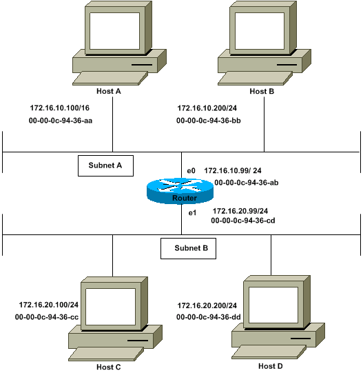
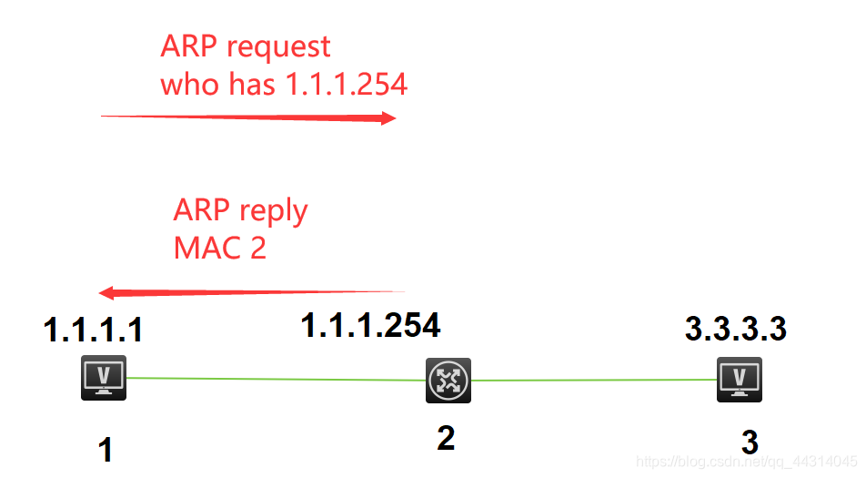
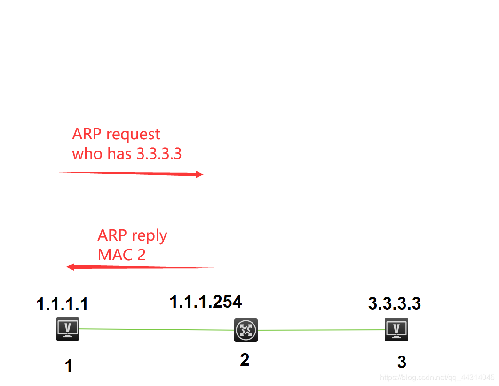

# ARP协议详解

## 1. ARP简介

地址解析协议，即ARP（Address Resolution Protocol），是根据IP地址获取物理地址的一个TCP/IP协议。

协议在发送数据包时，首先要封装第三层（IP地址）和第二层（MAC地址）的报头，但协议只知道目的节点的IP地址，不知道其物理地址，又不能跨第二、三层，所以得用ARP的服务拿到MAC地址。

### 1.1 为什么需要ARP

- 数据链路层帧的转发依赖MAC地址（48位），网络层依赖IP地址（32位），两层地址无法互相推导。
- 上层只知道目的节点的IP地址，不知道其物理地址，两者之间需要一次"解析"来建立映射。
- ARP工作在OSI第二层与第三层之间，核心任务就是把已知的IP地址解析为对应的MAC地址。

### 1.2 ARP的适用边界

- ARP请求以广播方式发出，只能在本网段（同一广播域）内传播，路由器不会转发广播帧。
- 因此跨网段通信时，主机先解析**网关**的MAC地址，把数据交给网关，由网关继续转发（见第5章）。

## 2. ARP报文格式

ARP报文由以太网帧头加ARP报文本体组成。以太网帧头中的Type字段为 `0x0806` 表示上层是ARP（IPv4为 `0x0800`，IPv6为 `0x86DD`）。

| 字段 | 长度 | 说明 |
|------|------|------|
| 硬件类型（Hardware Type） | 2字节 | 链路层网络类型，以太网取值为1 |
| 协议类型（Protocol Type） | 2字节 | 上层协议类型，IPv4为 `0x0800` |
| 硬件地址长度（HLen） | 1字节 | MAC地址字节数，以太网为6 |
| 协议地址长度（PLen） | 1字节 | IP地址字节数，IPv4为4 |
| 操作码（Opcode） | 2字节 | 1=ARP请求，2=ARP响应，3=RARP请求，4=RARP响应 |
| 发送端MAC地址（Sender Hardware Address） | 6字节 | 发送方的MAC地址 |
| 发送端IP地址（Sender Protocol Address） | 4字节 | 发送方的IP地址 |
| 目标端MAC地址（Target Hardware Address） | 6字节 | ARP请求时填全0，ARP响应时填请求方的MAC |
| 目标端IP地址（Target Protocol Address） | 4字节 | 需要解析的IP地址 |

> ARP请求报文共28字节（不含以太网帧头）。请求中目标MAC填全0，因为发送方正是不知道目标MAC才发起请求；目标IP则必须填写，用于让接收方判断"这条请求是不是问我"。

## 3. ARP工作过程

### 3.1 同网段解析流程

假设主机A和主机B在同一个网段，主机A要向主机B发送信息，具体的地址解析过程如下：

1. 主机A首先查看自己的ARP缓存表，确定其中是否包含主机B对应的ARP表项。如果找到了对应的MAC地址，则主机A直接利用ARP表中的MAC地址，对IP数据包进行帧封装，并将数据包发送给主机B。
2. 如果主机A在ARP表中找不到对应的MAC地址，则将该数据报文缓存起来，然后以广播方式发送一个ARP请求报文。ARP请求报文中的发送端IP地址和发送端MAC地址为主机A的IP地址和MAC地址，目标IP地址为目标主机B的IP地址，目标MAC地址为全0。由于ARP请求报文以广播方式发送（目的MAC为 `FF-FF-FF-FF-FF-FF`），该网段上的所有主机都可以接收到该请求，但只有被请求的主机（即主机B）会对该请求进行处理。
3. 主机B比较自己的IP地址和ARP请求报文中的目标IP地址，当两者相同时进行如下处理：先将ARP请求报文中的发送端（即主机A）的IP地址和MAC地址存入自己的ARP表，之后以**单播**方式发送ARP响应报文给主机A，其中包含了主机B自己的MAC地址。
4. 主机A收到ARP响应报文后，将主机B的MAC地址加入到自己的ARP表中以用于后续报文的转发，同时将缓存的IP数据包进行帧封装后发送出去。

```
主机A                         主机B（及网段内其他主机）
  │  ARP请求（广播，目标MAC全0）   │
  ├────────────────────────────►│
  │                              │  其他主机丢弃该请求
  │  ARP响应（单播，携带B的MAC）    │
  │◄────────────────────────────┤
  │                              │
  │  封装帧，发送IP数据包 ────────► │
```

> 要点：**请求是广播，响应是单播**。请求方不知道目标MAC所以只能广播，响应方已从请求报文中取得请求方的MAC地址，因此可以直接单播回复。

### 3.2 跨网段解析流程

当主机A和主机B不在同一网段时，主机A就会先向网关发出ARP请求，ARP请求报文中的目标IP地址为网关的IP地址。当主机A从收到的响应报文中获得网关的MAC地址后，将报文封装并发给网关。

网关收到报文后，如果缓存中没有主机B的ARP表项，网关会广播ARP请求，目标IP地址为主机B的IP地址，当网关从收到的响应报文中获得主机B的MAC地址后，就可以将报文发给主机B；如果网关已经有主机B的ARP表项，网关直接把报文发给主机B。

```
主机A ──ARP请求(目标=网关IP)──► 网关 ──ARP请求(目标=主机B IP)──► 主机B
  ◄──ARP响应(网关MAC)──┤   ◄──ARP响应(主机B MAC)──┤
  ──数据帧(目的MAC=网关)──► 网关 ──数据帧(目的MAC=主机B)──► 主机B
```

## 4. ARP缓存表（ARP Cache）

网络设备一般都有一个ARP缓存（ARP Cache），ARP缓存用来存放IP地址和MAC地址的关联信息。在发送数据前，设备会先查找ARP缓存表。如果缓存表中存在对方设备的MAC地址，则直接采用该MAC地址来封装帧，然后将帧发送出去。如果缓存表中不存在相应的信息，则通过发送ARP请求报文来获得它。

学习到的IP地址和MAC地址的映射关系会被放入ARP缓存表中存放一段时间。在有效期内，设备可以直接从这个表中查找目的MAC地址来进行数据封装，而无需进行ARP查询。过了这段有效期，ARP表项会被自动删除。如果目标设备位于其他网络，则源设备会在ARP缓存表中查找网关的MAC地址，然后将数据发送给网关，网关再把数据转发给目的设备。

### 4.1 动态ARP表项

动态ARP表项由ARP协议通过ARP报文自动生成和维护，可以被老化，可以被新的ARP报文更新，可以被静态ARP表项覆盖。

每个动态ARP缓存项的潜在生命周期是10分钟。新加到缓存中的项目带有时间戳，如果某个项目添加后2分钟内没有再使用，则此项目过期并从ARP缓存中删除；如果某个项目已在使用，则又收到2分钟的生命周期；如果某个项目始终在使用，则会另外收到2分钟的生命周期，一直到10分钟的最长生命周期。

> 不同操作系统/设备的默认老化时间不同。Linux默认约30秒~3分钟，Windows约2分钟，华为等交换机默认为动态老化（默认1200秒可配置）。上文的"2分钟/10分钟"为教材中的典型取值。

### 4.2 静态ARP表项

静态ARP表项通过手工配置和维护，不会被老化，不会被动态ARP表项覆盖，直到重新启动计算机为止。

静态ARP表项分为**短静态ARP表项**和**长静态ARP表项**：

- **长静态ARP表项**：配置IP地址和MAC地址项外，还必须配置该ARP表项所在的VLAN和出接口。长静态ARP表项可以直接用于报文转发。
- **短静态ARP表项**：只需要配置IP地址和MAC地址项。如果出接口是三层以太网接口，短静态ARP表项可以直接用于报文转发；如果出接口是VLAN虚接口，短静态ARP表项不能直接用于报文转发，当要发送IP数据包时，先发送ARP请求报文，如果收到的响应报文中的源IP地址和源MAC地址与所配置的IP地址和MAC地址相同，则将接收ARP响应报文的接口加入该静态ARP表项中，之后就可以用于IP数据包的转发。

## 5. 代理ARP（Proxy ARP）

当局域网内部主机发起跨网段的ARP请求时，出口路由器/网关设备将自身MAC地址回复该请求时，这个过程称为代理ARP。



地址解析协议工作在一个网段中，而代理ARP（Proxy ARP，也被称作混杂ARP（Promiscuous ARP））工作在不同的网段间，其一般被像路由器这样的设备使用，用来代替处于另一个网段的主机回答本网段主机的ARP请求。

### 5.1 代理ARP的典型场景

| 场景 | 说明 |
|------|------|
| 主机未配置网关 | 主机把所有跨网段流量当作同网段处理，直接广播ARP询问目标IP，路由器代答自身MAC |
| 子网被路由器分隔 | 两台主机物理上通过路由器相连，各自认为对方在同一网段，路由器代为解析 |
| 透明桥接/二层隔离 | 接口被配置为同一子网但二层互相隔离时，用代理ARP打通三层路径 |

### 5.2 代理ARP的工作原理

1. 主机A要向不同网段的主机B发送数据，但主机A没有配置默认网关，于是它直接广播ARP请求，询问主机B的MAC地址。
2. 该请求到达连接主机A网段的路由器接口。路由器如果开启了代理ARP功能，就会检查自己是否有到达主机B的路由。
3. 路由可达时，路由器用自己的接口MAC地址作为"目标MAC"回复主机A。主机A误以为这个MAC就是主机B的MAC，把数据封装发给路由器。
4. 路由器收到数据后，按正常路由流程把数据转发给主机B。

> 代理ARP对主机是**透明**的。主机完全不知道网关的存在，也不关心谁在帮它转发，只看到"我广播问谁，谁就回我了"。

## 6. 跨网段ARP中正常ARP与代理ARP区别

不管是那种形式的ARP，不同网段都是要查网关的MAC地址，代理ARP不会告诉你是他充当了你的网关，而是直接告诉你，他就算你要找的那个目的地；而正常ARP是在你知道他是网关的前提下，你直接找这个网关来帮你转发数据。

### 6.1 正常ARP跨网段

PC设置了网关，PC在访问不同网段的时候，PC就直接会去找网关，发送的是同网段的数据包，在发送和接收数据包的时候，要找的IP地址对应的MAC地址都是这个网关的MAC地址。



### 6.2 代理ARP跨网段

PC没有设置网关，在和不同网段通信的时候，直接发送ARP广播包，直接询问目的网段，而这时，最近的一个网关路由器充当一个代理的功能，回应自己的MAC地址给它，前提是这个路由器有ARP代理的功能。



### 6.3 区别对照

| 对比项 | 正常ARP跨网段 | 代理ARP跨网段 |
|--------|---------------|---------------|
| 主机是否配置网关 | 配置了默认网关 | 未配置网关 |
| 主机ARP请求的对象 | 网关（已知网关IP） | 目的主机（直接问目标IP） |
| 谁返回MAC地址 | 网关正常返回自己的MAC | 路由器"冒充"目标返回自己的MAC |
| 主机是否感知 | 知道数据要交给网关转发 | 完全不知道，以为对方就是目标主机 |
| 依赖条件 | 主机侧配置正确 | 路由器开启代理ARP功能 |

## 7. 免费ARP（Gratuitous ARP）

免费ARP（Gratuitous ARP）包是一种特殊的ARP请求，它并非期待得到IP对应的MAC地址，而是当主机启动的时候，发送一个免费ARP请求，即请求**自己**的IP地址的MAC地址。该报文的特点是：发送端IP与目标端IP相同，都是本机IP，目标MAC为全0。

### 7.1 免费ARP的三个作用

1. **宣告作用**：它以广播的形式将数据包发送出去，不需要得到回应，只为了告诉其他计算机自己的IP地址和MAC地址，让邻居更新ARP缓存。
2. **检测IP地址冲突**：当一台主机发送了免费ARP请求报文后，如果收到了ARP响应报文，则说明网络内已经存在使用该IP地址的主机，本机应停止使用该IP并告警。
3. **更新其他主机的ARP缓存表**：如果该主机更换了网卡，而其他主机的ARP缓存表仍然保留着原来的MAC地址，这时可以发送免费的ARP数据包。其他主机收到该数据包后，将更新ARP缓存表，将原来的MAC地址替换为新的MAC地址。

### 7.2 免费ARP在HA/VRRP中的典型应用

- **VRRP/HA虚拟MAC通告**：VRRP主备切换时，新的Master设备立即发送免费ARP，通告**虚拟IP对应的虚拟MAC**，让下游交换机和主机的ARP缓存在一瞬间刷新，避免流量继续发往旧的主设备。
- **VRRP通告间隔**：VRRP主设备周期性（默认1秒）发送免费ARP，持续刷新下游的ARP缓存，防止老化后把流量发给错误的设备。
- **网卡更换/故障转移**：业务网卡切换后通过免费ARP让全网立即学习到新MAC，无需等待老化时间。

> 免费ARP同时也是攻击者最常利用的工具：伪造免费ARP即可篡改网络中所有主机的ARP缓存，见第8章。

## 8. ARP欺骗与防御

### 8.1 ARP欺骗原理（中间人攻击）

ARP缓存表的更新机制"无条件信任"收到的ARP报文，且支持被新的ARP报文覆盖，这给攻击者留下了利用空间。ARP欺骗（ARP Spoofing）的基本过程：

1. 攻击者主机C向主机A发送伪造的ARP响应（或免费ARP），声称"主机B的IP地址对应我的MAC地址"。
2. 主机A无条件更新自己的ARP缓存，此后所有发往主机B的数据都会先发给攻击者C。
3. 攻击者C把数据转发给真正的B（或篡改后再转发），从而实现了**中间人攻击**：窃听、篡改、阻断流量而不被双方察觉。

```
正常路径：  主机A ──────────────────────────────► 主机B
受骗路径：  主机A ──► 攻击者C（转发/篡改）──────────► 主机B
```

### 8.2 ARP欺骗的危害

| 危害 | 说明 |
|------|------|
| 中间人攻击 | 窃听或篡改通信内容，如抓取明文账号密码 |
| 会话劫持 | 截获并接管TCP会话，冒充合法用户 |
| 拒绝服务（DoS） | 向目标主机发送不存在的MAC映射，使其通信全部失败 |
| 网关欺骗 | 冒充网关MAC，使整个网段上网中断 |

### 8.3 防御措施

| 防御手段 | 说明 |
|----------|------|
| **DAI（Dynamic ARP Inspection，动态ARP检测）** | 交换机基于DHCP Snooping建立的IP-MAC绑定表，校验所有ARP报文；非法报文直接丢弃 |
| 静态ARP表项 | 关键主机（网关、服务器）配置静态ARP，防止被ARP报文覆盖 |
| ARP报文合法性校验 | 操作系统校验ARP报文中的源MAC是否与以太网帧头一致 |
| 端口安全 | 交换机限制端口上学习的MAC地址数量，防止伪造 |
| 802.1X接入认证 | 控制非法设备接入网络，从源头杜绝攻击者 |

> **DAI工作原理**：交换机开启DHCP Snooping后，根据DHCP交互学习到合法的IP-MAC绑定关系。DAI把收到的ARP报文与绑定表比对，源IP/源MAC不匹配的ARP报文被判定为非法并丢弃，同时对入端口速率做限制，防止ARP风暴。

## 9. RARP简介

RARP（Reverse Address Resolution Protocol，反向地址解析协议）与ARP的解析方向相反：ARP根据IP地址解析MAC地址，RARP根据MAC地址反查IP地址。

RARP的适用场景主要是**无盘工作站**：主机只有MAC地址，启动时不知道自己的IP地址，于是向RARP服务器广播RARP请求（操作码为3），RARP服务器查找MAC与IP的对应表后单播RARP响应（操作码为4）告知其IP地址。

### 9.1 RARP与ARP的区别

| 对比项 | ARP | RARP |
|--------|-----|------|
| 解析方向 | IP地址 → MAC地址 | MAC地址 → IP地址 |
| 请求操作码 | 1 | 3 |
| 响应操作码 | 2 | 4 |
| 请求方 | 需要对方MAC的主机 | 需要自己IP的无盘工作站 |
| 响应方 | 目标主机自己 | RARP服务器（需手工维护MAC-IP表） |
| 典型应用 | 常规IP通信 | 无盘工作站启动 |

> RARP的缺陷：服务器需要手工维护MAC-IP映射表、无法跨网段、只解决IP分配一个环节，已被BOOTP和DHCP完全取代。DHCP的Client Identifier（chaddr字段）正是从RARP继承下来的设计。

## 10. 参考标准

| RFC | 标题 | 与本主题的关系 |
|-----|------|----------------|
| **RFC 826** | An Ethernet Address Resolution Protocol | ARP协议原始定义，报文格式与工作流程的权威标准 |
| **RFC 903** | A Reverse Address Resolution Protocol | RARP协议定义 |
| **RFC 1027** | Using ARP to implement Transparent Subnet Gateways | 代理ARP（Proxy ARP）定义 |
| **RFC 5227** | IPv4 Address Conflict Detection | 免费ARP与IPv4地址冲突检测的标准方法 |
