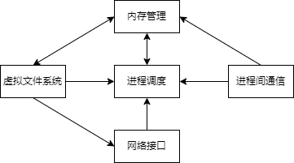
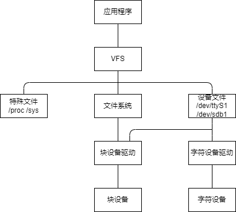
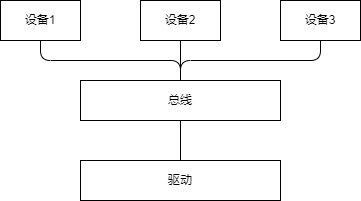
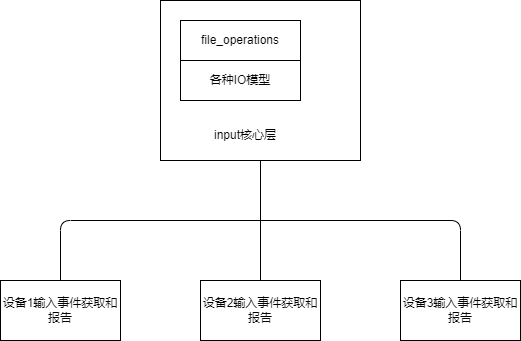
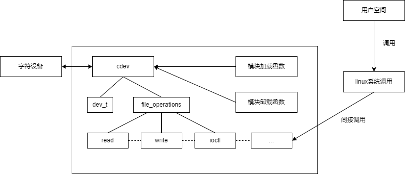
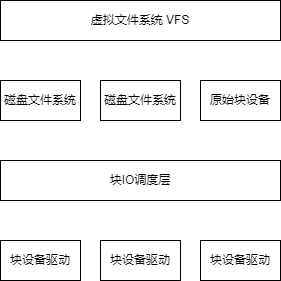
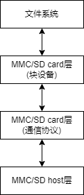
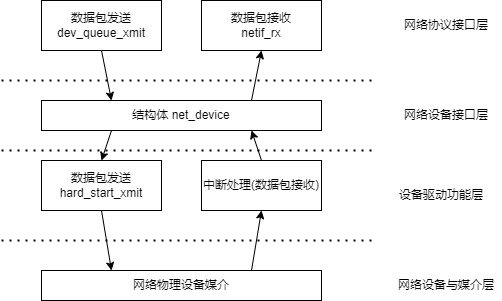
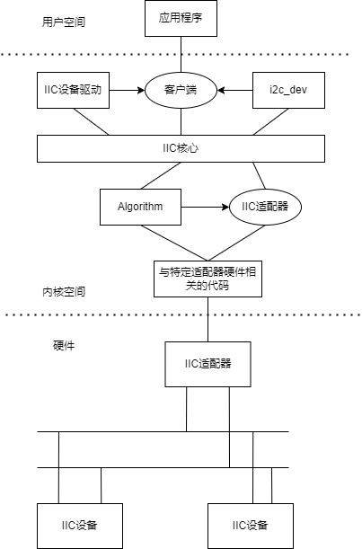
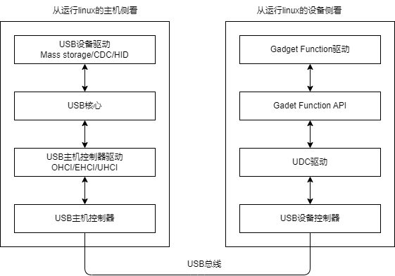

# 驱动基础
## 内核
### linux内核组成部分
linux内核主要由进程调度SCHED、内存管理MM、虚拟文件系统VFS、网络接口NET、进程间通信IPC组成。   
   

## 文件系统
文件系统与设备驱动关系   

## 并发
### 竞态的产生
多个执行单元同时访问共享资源时就会产生竞态，如中断处理程序与进程、多核CPU上的两个进程、以及进程与软中断之间。驱动的并发控制就是保证共享资源在同一时刻只能被一个执行单元访问。

### 自旋锁spinlock
自旋锁在等待锁期间不睡眠，而是忙等待（自旋），因此只适用于临界区很短的场合。
| 分类 | 说明 |
| :--- | :--- |
| spin_lock | 自旋锁，获取失败时原地自旋 |
| spin_lock_irq | 获取锁的同时关闭本CPU中断 |
| spin_lock_irqsave | 保存中断状态后关闭中断再获取锁 |
| spin_lock_bh | 获取锁的同时屏蔽下半部（软中断） |

使用自旋锁时临界区禁止睡眠，否则会死锁；中断上下文只能使用自旋锁。

### 互斥锁mutex
互斥锁在获取失败时进入睡眠等待，适用于临界区较长、可以睡眠的场合。mutex由count、wait_list、owner等字段组成，同一时刻只有一个持有者，且持有者负责解锁。与自旋锁相比，mutex有内核调度开销，但不会浪费CPU时间。

### 信号量semaphore
信号量允许同时有多个执行单元访问，count表示可用资源数。count为1时等价于互斥锁（二值信号量）。down()减少计数，资源被占满时进程睡眠，up()增加计数并唤醒等待队列中的进程。信号量适合用于进程上下文，不适用于中断上下文。

### 原子操作
原子操作是不可被中断的指令级操作，用于保护简单的整型变量或位操作。
| 接口 | 说明 |
| :--- | :--- |
| atomic_set / atomic_read | 设置 / 读取原子变量 |
| atomic_inc / atomic_dec | 原子加一 / 原子减一 |
| atomic_add / atomic_sub | 原子加 / 原子减指定值 |
| set_bit / clear_bit / test_bit | 位操作 |

### completion
completion用于一个执行单元等待另一个执行单元完成某件事。init_completion初始化，wait_for_completion睡眠等待，complete唤醒一个等待者，complete_all唤醒所有等待者。典型应用是驱动卸载时等待打开设备的进程退出、或异步操作完成的通知。

## 阻塞与非阻塞io
### 阻塞与非阻塞的概念
阻塞操作指进程在条件不满足时进入睡眠等待，直到条件满足才返回；非阻塞操作则立即返回，条件不满足时返回-EAGAIN。open()时传入的O_NONBLOCK标志决定文件以何种方式访问。

### 等待队列wait_queue
等待队列是内核中实现阻塞IO的基础机制。等待队列头由init_waitqueue_head初始化，等待队列项由DECLARE_WAITQUEUE定义。
| 函数 | 说明 |
| :--- | :--- |
| add_wait_queue / remove_wait_queue | 把等待队列项加入 / 移出队列 |
| wait_event / wait_event_interruptible | 睡眠等待条件满足，返回值为0 |
| wake_up / wake_up_interruptible | 唤醒等待队列中的进程 |
| prepare_to_wait / finish_wait | 条件检查前的准备与收尾 |

典型的读阻塞流程：进程检查设备是否有数据，没有则add_wait_queue后调用schedule睡眠，中断或写进程产生数据后wake_up唤醒，唤醒后检查条件并返回数据。

### poll机制
poll使进程可以同时监听多个文件的可读、可写、异常状态。驱动实现file_operations中的poll函数，调用poll_wait把等待队列加入poll_table，返回mask位（POLLIN、POLLOUT、POLLERR等）。select、poll、epoll都是基于该机制实现的。

## 异步通知与异步io
### fasync异步通知
异步通知使进程在数据就绪时收到SIGIO信号，而不必主动轮询。驱动实现fasync函数调用fasync_helper注册或注销，数据就绪时调用kill_fasync发送SIGIO。应用程序设置进程为SIGIO信号接收者并fcntl(F_SETFL, O_ASYNC)使能。

### AIO异步io
AIO允许应用程序发起IO请求后立即返回，IO完成后通过信号或回调通知。传统IO中读写与返回是同步的，AIO把请求提交（io_submit）与完成通知（io_getevents）分离，适合高并发场景。

### 三种方式的比较
| 方式 | 进程是否需要等待 | 数据就绪通知方式 |
| :--- | :--- | :--- |
| 阻塞IO | 睡眠等待 | 唤醒后返回 |
| 非阻塞IO+轮询 | 不睡眠，反复查询 | 用户主动poll |
| 异步通知 | 不等待 | 内核发送SIGIO信号 |

## 中断与时钟
### 中断分类
| 类型 | 说明 |
| :--- | :--- |
| 外部中断 | 来自CPU外部设备的中断请求 |
| 内部中断 | CPU执行指令产生，如除零、缺页 |
| 软中断 | 内核软件触发，运行在中断上下文 |
| NMI | 不可屏蔽中断，优先级最高 |

### 中断上下文
中断处理程序运行在中断上下文，特点是不能睡眠、不能使用mutex和信号量、临界区要快进快出。request_irq注册中断处理函数，free_irq注销，共享中断需传入IRQF_SHARED。上半部处理紧急任务（清中断、保存数据），耗时工作交给下半部。

### 底半部机制
| 机制 | 特点 |
| :--- | :--- |
| 软中断softirq | 内核启动时静态注册，性能最好 |
| tasklet | 基于软中断实现，可动态注册，同一tasklet串行执行 |
| workqueue | 运行在进程上下文，可以睡眠，适合耗时任务 |
| 内核线程 | 专用线程处理，可配置优先级 |

tasklet由tasklet_init初始化、tasklet_schedule调度执行；workqueue由INIT_WORK初始化、schedule_work调度。

### 内核定时器
内核定时器用于延迟到未来某个时刻执行任务。init_timer初始化timer_list，mod_timer修改并激活定时器，del_timer删除定时器。定时器处理函数运行在软中断上下文，不能睡眠。与定时器配套的还有内核延时接口：mdelay忙等延时、msleep睡眠延时、schedule_timeout睡眠到超时。

## 内存与io访问
### kmalloc与vmalloc
| 接口 | 分配区域 | 物理连续性 | 大小上限 |
| :--- | :--- | :--- | :--- |
| kmalloc | 直接映射区（低端内存） | 物理连续 | 有限 |
| vmalloc | vmalloc区 | 虚拟连续、物理可能不连续 | 较大 |
| kzalloc | 同kmalloc | 物理连续 | 同kmalloc，且清零 |

kmalloc分配快、适合小块内存，vmalloc分配慢、适合大块且不需要物理连续的内存。释放分别用kfree和vfree。

### 内存分配标志
GFP_KERNEL可以在分配时睡眠，用于进程上下文；GFP_ATOMIC不能睡眠，用于中断上下文；GFP_DMA要求分配DMA可访问的低端内存。

### IO访问方式
| 方式 | 说明 |
| :--- | :--- |
| IO端口 | x86通过in/out指令访问 |
| IO内存 | 通过ioremap把物理地址映射为虚拟地址访问 |
| iomap | ioremap/iounmap配套的readl/writel读写接口 |

ioremap将外设寄存器物理地址映射到内核虚拟地址空间，之后用readl/writel按32位读写，映射结束调用iounmap释放。

### DMA
DMA（直接内存访问）使外设与内存之间直接传输数据，不经过CPU。驱动通过dma_alloc_coherent分配一致性DMA缓冲区，或dma_map_single进行流式映射。现代驱动使用dmaengine框架，提交dma_async_tx_descriptor描述符后由DMA控制器完成搬运，完成后通过回调通知。

## 驱动软件架构
linux设备和驱动的分离   
   

linux驱动的分层   
   

## 设备树
### DTS
文件.dts是一种ASCII文本格式的设备树描述   
.dtsi类似于C语言的头文件   

### DTC
dtc是将.dts编译为dtb的工具   

### DTB
文件.dtb是.dts被dtc编译后的二进制格式的设备树描述    

# 驱动分类
## 字符设备驱动
字符设备驱动结构   

## 块设备驱动
linux块设备子系统   
   

linuxMMC子系统   
   

## 网络设备驱动
网络设备驱动体系结构   
   

## IIC设备驱动
IIC体系结构   
   

## USB设备驱动
USB设备驱动结构   
   
