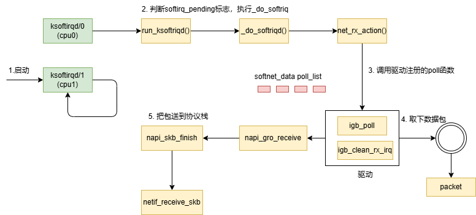

# 内核接收网络包

> 本文配合目录下的 6 张时序/流程示意图，梳理 Linux 内核收包完整路径。核心结论：**收包主要在软中断中批量完成，硬中断只负责"叫醒"**。

## 1. linux网络收包总览


收包路径分为五个阶段：

| 阶段 | 位置 | 关键动作 |
|------|------|----------|
| 网卡接收 | 硬件 | DMA 把数据写入内存中的 ring buffer |
| 驱动处理 | 驱动层 | 硬中断触发，驱动置位 NAPI 后退出 |
| 软中断收包 | 内核 | `net_rx_action()` 调用驱动的 `poll()` 批量取包 |
| 协议栈分发 | 内核 | `netif_receive_skb()` 按协议类型分发给 IP/ARP |
| 交付 socket | 内核 | TCP/UDP 按四元组查表，投递到 socket 接收队列 |

数据包在内核中始终以 `struct sk_buff`（skb）为载体，从网卡到 socket 不经过用户空间拷贝（DMA 直达内存）。

## 2. 内核收包路径


典型收包调用链：

```
网卡 → DMA ring buffer → 硬中断 → net_rx_action（软中断）
  → poll() → napi_gro_receive() → __netif_receive_skb_core()
  → 协议分发 → ip_rcv / arp_rcv → 本机接收或转发
```

硬中断处理函数只做三件事：屏蔽该网卡中断、置位 NAPI、唤醒 `NET_RX_SOFTIRQ` 软中断，然后立刻返回。真正的收包工作全部放到软中断上下文执行，这样能保证硬中断占用 CPU 的时间极短。

## 3. 网卡驱动初始化


驱动 `probe` 阶段完成收包前的准备工作：

1. 分配 **struct net_device** 并注册（`register_netdev`）。
2. 分配 **rx ring buffer**（描述符环），网卡通过 DMA 直接写入，驱动用 `dma_alloc_coherent` 建立映射。
3. 注册 `struct napi_struct`（`netif_napi_add`），绑定驱动自己的 `poll` 收包函数。
4. 注册中断处理函数（如 `igb_msix_ring`），通过 `request_irq` 绑定 IRQ。
5. 注册 `net_device_ops`，包含 `ndo_open`、`ndo_start_xmit` 等回调。

## 4. 启动网卡


`ip link set eth0 up` 触发 `ndo_open()`：

1. 分配并初始化 rx 描述符，把接收缓冲区的 DMA 地址写入描述符。
2. 使能 NAPI（`napi_enable`），软中断才会调度该网卡的 poll。
3. 写网卡寄存器使能接收队列、开中断。
4. 调用 `netif_carrier_on` 通知协议栈链路可用，注册 `netif_receive_skb` 分发所需信息。

注意顺序：**先填好接收缓冲、再开中断**。如果先开中断，网卡立刻收到数据写不进 buffer 会出错。

## 5. tcpdump工作


tcpdump 通过 **AF_PACKET 原始套接字**旁路抓包，`packet_type` 机制实现：

- 内核维护一个 `ptype_all`（所有包）和 `ptype_base`（按协议）链表，AF_PACKET socket 会把自己挂到 `ptype_all` 上。
- `__netif_receive_skb_core()` 在分发前先遍历 `ptype_all`，把 skb 复制（`skb_clone`）一份给 tcpdump。
- 这就是为什么 tcpdump 能抓到**所有**协议栈收发的包，包括被防火墙丢弃的包。抓包接口使用 `PACKET_MR_PROMISC` 时还会让网卡进入混杂模式。

## 6. 软中断处理



`net_rx_action()` 是收包软中断的核心函数，执行逻辑：

1. 从 per-CPU 的 `softnet_data->poll_list` 取出被唤醒的 NAPI 实例。
2. 循环调用每个实例的 `poll()`，驱动在 poll 中从 ring buffer 批量取包。
3. 每轮有 **budget 额度**（默认 300）和时间限制，防止软中断长期霸占 CPU。
4. 包在 poll 内经 `napi_gro_receive()`（GRO 合并小包）后交给 `netif_receive_skb()` 进入协议栈。
5. 若预算耗尽但仍有包未处理，重新置位 NAPI，软中断会在下一轮继续。

**NAPI 的核心思想**：用轮询代替每包一次中断，高流量下极大降低 CPU 开销，是网卡驱动性能的关键。

## 总结

收包路径的性能关键点：DMA 零拷贝、NAPI 批量轮询、GRO 合并小包、budget 防饿死。排查丢包时按此路径分段检查：ring buffer 是否溢出（`ethtool -S` 看 rx_dropped）、NAPI 是否频繁退出、软中断 CPU 占用是否过高。
