# 内核发送网络包

> 本文配合目录下的 12 张示意图，梳理 Linux 内核发送网络包完整路径：从用户空间 socket 写入，经传输层、网络层、邻居子系统、流量控制（Qdisc），最后由驱动写入网卡。

## 1. 内核发送网络包

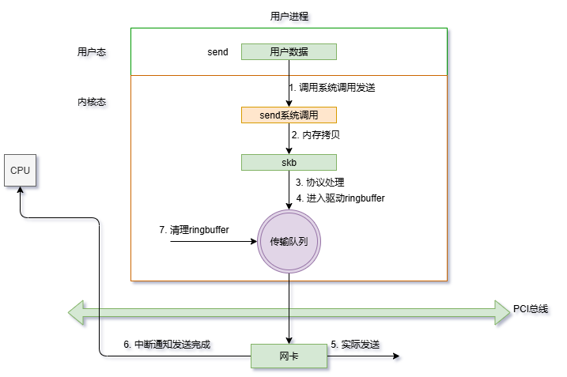

发送总览路径：

```
用户进程 → send() → socket 层 → 传输层(TCP/UDP) → 网络层(路由+OUTPUT链)
  → 邻居子系统(ARP/NDP) → dev_queue_xmit → Qdisc(tc egress)
  → ndo_start_xmit → DMA ring buffer → 网卡硬件
```

发送与接收最大的区别：发送在**进程上下文**启动，可能被拥塞控制、Qdisc 队列满等原因阻塞（异步或同步等待）。

## 2. 网络发送过程

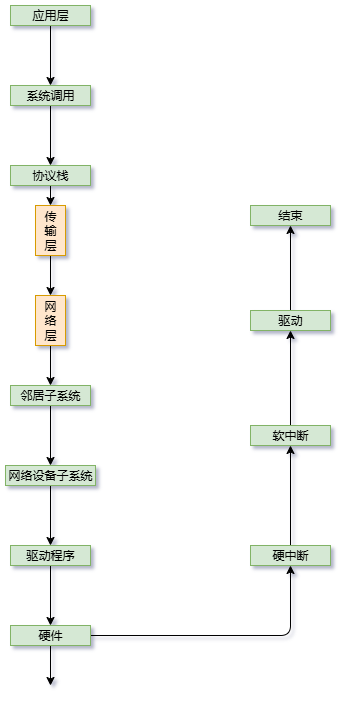

核心原则是**减少拷贝**：用户数据先拷贝到内核 skb（`send` 阶段唯一一次拷贝），后续各层只修改 skb 的头部指针，不搬数据。skb 通过预留的头部空间（`skb_reserve`）逐层"回头"填各层头部：TCP 头、IP 头、以太网头都填在同一块内存上。

## 3. 发送队列

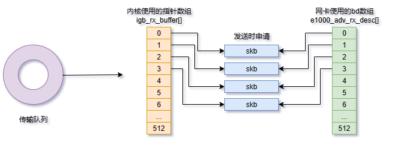

- **TCP 发送队列**（`sk_write_queue`）：已发送未确认的数据段，等待 ACK 后释放，是 TCP 重传的基础。
- **socket 写队列**：用户已写入但尚未发送的 skb。
- **Qdisc 队列**：设备层的排队规则，位于协议栈与驱动之间。

队列是连接"用户写入速度"与"网络发送速度"的缓冲，队列满时触发背压（backpressure）：TCP 会停止发送窗口增长，UDP 则直接丢包或返回 ENOBUFS。

## 4. send系统调用

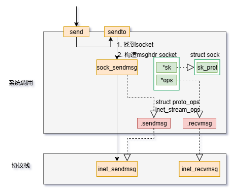

`send()` 系统调用路径：

1. `__sys_sendto()` 通过 fd 找到 `struct socket`。
2. `sock_sendmsg()` → `sock->ops->sendmsg()`，TCP 走 `tcp_sendmsg()`。
3. `tcp_sendmsg()` 把用户缓冲区的数据拷入 skb（`skb_copy_to_page_nocache`），满 MSS 后交给 `tcp_write_xmit()`。
4. `tcp_write_xmit()` 按发送窗口和拥塞窗口决定发多少，调用 `ip_queue_xmit()` 进入网络层。

注意 `send()` 返回并不代表数据已到网卡，只代表数据已进入内核发送队列。

## 5. 传输层拷贝

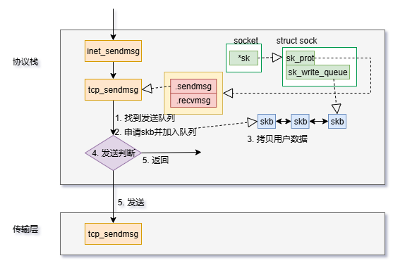

传输层拷贝发生在 `sendmsg` 阶段：

- 内核为 skb 分配数据页（`alloc_skb_with_frags`），把用户数据**从用户空间拷入内核内存页**。
- 大数据量用 **MSG_ZEROCOPY** 时，用户内存页通过 pin 直接映射进 skb，避免拷贝，内核需要时再发通知回收。
- 拷贝完成后 `skb->len` 增加，传输层（尤其 TCP）按窗口和 MSS 组织发送。

## 6. 传输层发送

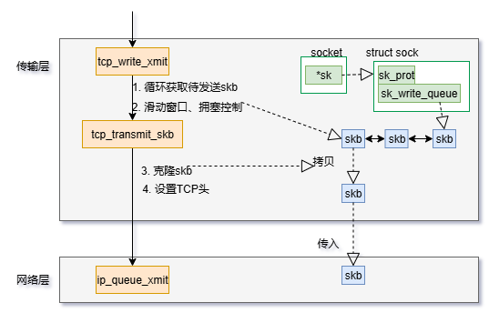

TCP 发送入口 `tcp_write_xmit()`：

1. 检查拥塞窗口 `cwnd` 与发送窗口 `snd_wnd`，能发多少发多少。
2. 为每个 skb 计算并填充 TCP 头：序号（seq）、确认号（ack）、标志位、校验和。
3. 开启 **TSO/GSO**（TCP 分段卸载）时，大包在驱动/网卡处分段，减轻 CPU 负担。
4. 通过 `ip_queue_xmit()` 交给 IP 层，同时注册重传定时器。

## 7. 网络层发送

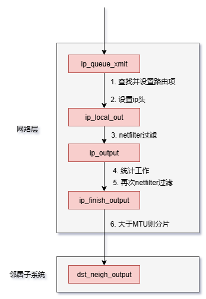

`ip_queue_xmit()` 到 `ip_output()`：

1. 查路由（`ip_route_output_flow`）确定出口设备和下一跳。
2. 经过 Netfilter **OUTPUT 链**（`NF_INET_LOCAL_OUT` 钩子），执行 SNAT、防火墙、mangle 等规则。
3. `ip_finish_output()` 处理分片（超过 MTU 且不允许分片则返回 EMSGSIZE）。
4. 进入 `ip_finish_output2()`，调用邻居子系统解析二层信息。

## 8. 邻居子系统

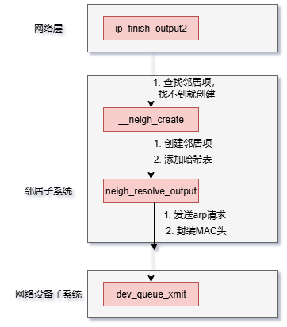

邻居子系统负责"把三层下一跳解析成二层 MAC"：

- `ip_finish_output2()` → `neigh_output()` → `neigh_resolve_output()`。
- 邻居表（`struct neighbour`）有状态机：`NUD_NONE → NUD_INCOMPLETE（发ARP请求）→ NUD_REACHABLE → NUD_STALE`。
- 缓存命中（REACHABLE）直接填以太网头；未命中则发出 **ARP 请求**，skb 挂到邻居的队列等待应答，解析成功后补发。
- IPv6 使用 NDP（Neighbor Discovery Protocol）完成同样的工作。

## 9. 网络设备子系统

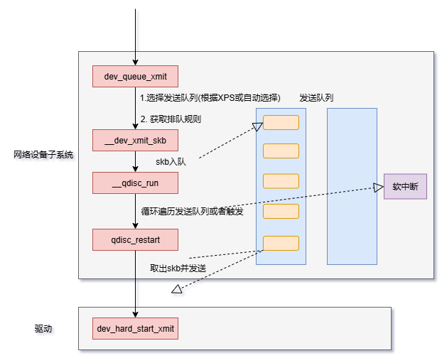

邻居解析完成后调用 `dev_queue_xmit()`：

1. 检查设备是否 UP、是否回环，判断是直接发送还是排队。
2. 调用 `__dev_xmit_skb()` 进入设备的 **Qdisc**。
3. 对于回环/虚拟设备（如 veth）可能直接调用 `ndo_start_xmit` 送入对端。

`struct net_device_ops` 中的 `ndo_start_xmit` 是协议栈调用驱动的唯一出口。

## 10. 软中断调度

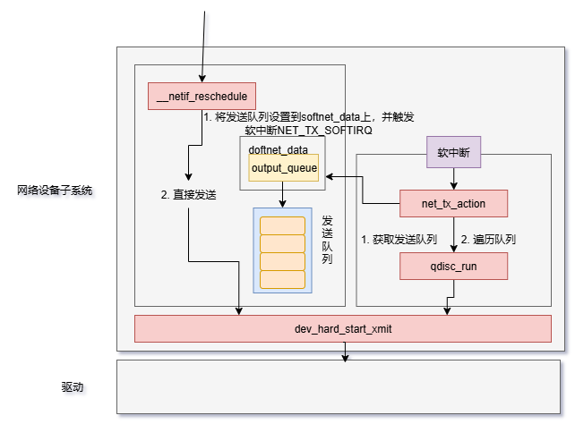

发送完成的中断在软中断中处理：

- 网卡发送完成后触发硬中断，唤醒 `NET_TX_SOFTIRQ` 软中断。
- 软中断处理 `net_tx_action()`，调用驱动的发送完成处理函数。
- 驱动回收已发送的 skb 与 DMA 映射（`dev_kfree_skb_any`），释放内存，更新统计。

## 11. igb网卡驱动发送

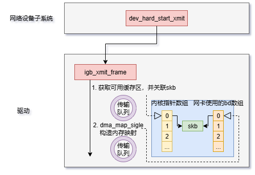

igb（Intel 千兆）驱动发送流程：

1. Qdisc 调度出 skb → `igb_xmit_frame()`。
2. 检查发送队列是否有空描述符，没有则返回 `NETDEV_TX_BUSY`。
3. 用 `skb_dma_map` 建立 DMA 映射，把数据地址写入 **tx ring buffer** 描述符。
4. 写网卡寄存器（`E1000_TDT`）通知硬件"有新数据可发"。
5. 若开启 TSO，网卡硬件负责 TCP 分段，CPU 只提交一个大数据段。

## 12. ringbuffer内存回收

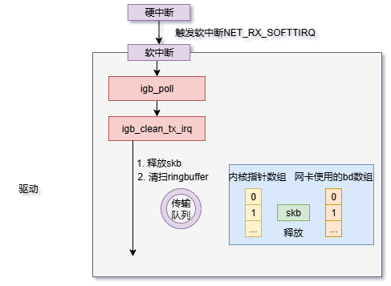

发送完成的回收机制：

- 网卡通过中断告知"描述符 N 已发送完成"。
- 驱动记录已回收位置（`next_to_clean`），把 skb 释放、DMA 映射解除。
- ring buffer 的可用描述符数 = 已回收位置 - 已提交位置，**回收不及时会导致发送队列满**（`NETDEV_TX_BUSY`），影响吞吐。
- 常见问题：中断合并（interrupt coalescing）延迟回收、驱动 bug 导致描述符泄漏，都会表现为"缓存下不去"。

## 总结

发送路径的性能要点：单次拷贝（send 阶段）、TSO/GSO 硬件分段卸载、Qdisc 队列管理、DMA ring buffer 及时回收。排查发送丢包：`ip -s link` 看 tx_errors、`tc -s qdisc` 看队列 drop、`ethtool -S` 看硬件统计。
