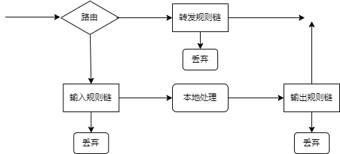
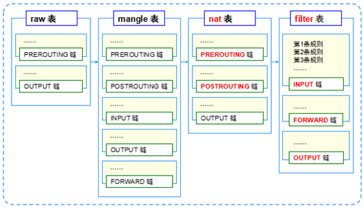
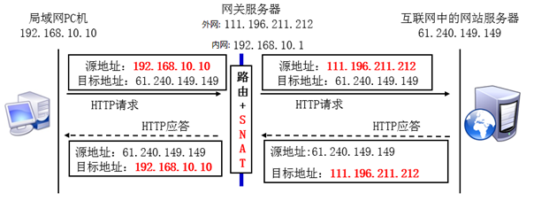

# Netfilter数据包传输
Netfilter(iptables)使用了三个内置的过滤器链：INPUT、OUTPUT、FORWARD。   
   

Netfilter防火墙有三个独立的表：filter、nat、mangle。   
filter表是实现基本的防火墙的默认表。   
nat表用来提供NAT和相关的功能。   
mangle在数据包被防火墙修改时使用。   

规则表的先后顺序:raw→mangle→nat→filter   

规则链的先后顺序:   
入站顺序:PREROUTING→INPUT   
出站顺序:OUTPUT→POSTROUTING   
转发顺序:PREROUTING→FORWARD→POSTROUTING   
   

# iptables 基本语法

iptables的命令从前往后执行，因此当一条允许特定数据包的指令后若跟着一条拒绝同样数据包的命令，将会导致数据最终被防火墙丢弃。   
iptables < option > < chain > < matching criteria > < target >   
iptables命令的基础语法以iptables命令本身开始，然后是一个或多个选项，一个规则链，一个匹配标准集以及一个目标或处置。   

```SHELL
参数 作用

-P 设置默认策略:iptables -P INPUT (DROP|ACCEPT)

-F 清空规则链

-L 查看规则链

-A 在规则链的末尾加入新规则

-I num 在规则链的头部加入新规则

-D num 删除某一条规则

-s 匹配来源地址IP/MASK，加叹号"!"表示除这个IP外。

-d 匹配目标地址

-i 网卡名称 匹配从这块网卡流入的数据

-o 网卡名称 匹配从这块网卡流出的数据

-p 匹配协议,如tcp,udp,icmp

--dport num 匹配目标端口号

--sport num 匹配来源端口号
```

## filter表
filter表包含了实际的防火墙过滤规则，内建的规则链包括   
INPUT   
OUTPUT   
FORWARD   

## nat表
nat表包含了源地址和目的地址转换以及端口转换的规则，内建的规则链包括   
PREROUTING--DNAT/REDIRECT   
OUTPUT--DNAT/REDIRECT   
POSTROUTING--SNAT/MASQUERADE   

## mangle表
mangle表包含了设置特殊数据包路由标志的规则，这些规则将在filter表中进行检查，内建的规则链包括   
PREROUTING--被路由的数据包   
INPUT--到达防火墙并通过PREROUTING规则链的数据包   
FORWARD--修改通过防火墙路由的数据包   
POSTROUTING--在数据包通过OUTPUT规则链之后但在离开防火墙之前修改的数据包   
OUTPUT--本地生成的数据包   

# NAT
局域网内封包的传送   
1. 先经过 NAT table 的 PREROUTING 链   
2. 经由路由判断确定这个封包是要进入本机与否，若不进入本机，则下一步   
3. 再经过 Filter table 的 FORWARD 链   
4. 通过 NAT table 的 POSTROUTING 链，最后传送出去   

NAT 主机的重点就在于上面流程的第 1,4 步骤，也就是 NAT table 的两条重要的链：PREROUTING 与POSTROUTING。 那这两条链重要功能在于修改IP，而这两条链修改的IP又是不一样的，POSTROUTING在修改来源IP，PREROUTING则在修改目标IP 。由于修改的 IP 不一样，所以就称为来源NAT (Source NAT, SNAT) 及目标 NAT (Destination NAT, DNAT)。   

## SNAT
SNAT即源地址转换，能够让多个内网用户通过一个外网地址上网，解决了IP资源匮乏的问题。一个无线路由器也就使用此技术。
   

由上图可知，需要将192.168.10.10转换为111.196.211.212，iptables命令如下：   
iptables -t nat -A POSTROUTING -s 192.168.10.10 -o eth1 -j SNAT --to-source 111.196.221.212   
外网IP地址不稳定的情况即可使用MASQUERADE(动态伪装),能够自动的寻找外网地址并改为当前正确的外网IP地址   
iptables -t nat -A POSTROUTING -s 192.168.10.0/24 -j MASQUERADE   

## DNAT
DNAT即目地地址转换，则能够让外网用户访问局域网内不同的服务器。（相当于SNAT的反向代理）   
   

由上图可知，目标地址192.168.10.6在路由前就转换成61.240.149.149，需在网关上运行iptables命令如下：   
iptables -t nat -A PREROUTING -d 192.168.100.159 -p tcp -m tcp -dport 80 -j DNAT --to-destination 192.168.70.136:80   
eth1网口传入，且想要使用 port 80 的服务时，将该封包重新传导到 192.168.1.210:80 的 IP 及 port 上面,可以同时修改 IP 与 port。此为地址映射与端口转换。   

还可以使用REDIRECT单独进行端口转换   
例：将 80 端口的封包转递到 8080端口   
iptables -t nat -A PREROUTING -p tcp --dport 80 -j REDIRECT --to-ports 8080   
使用 8080 这个 port 来启动 WWW ，但是别人都以80来联机   
