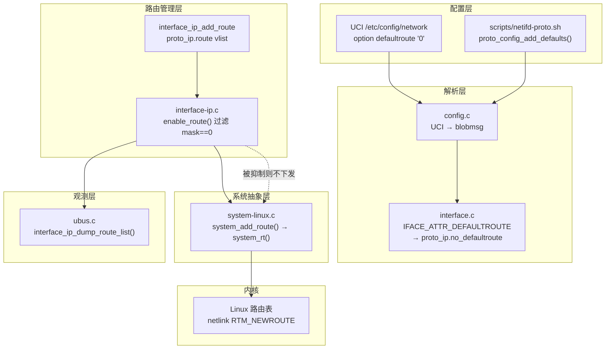
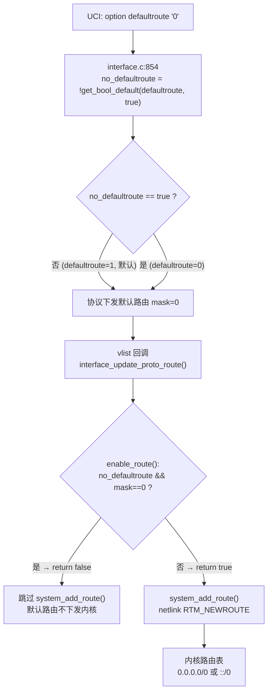
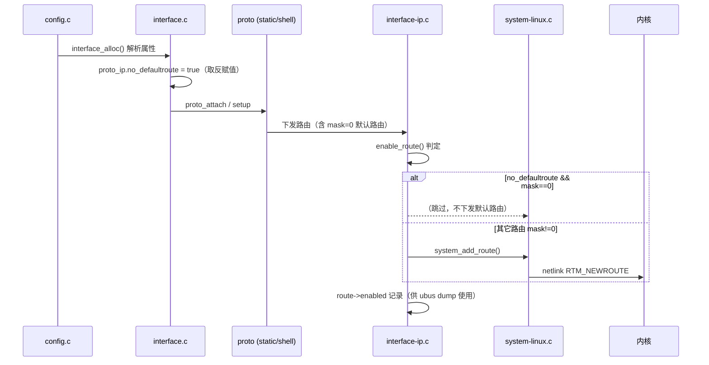
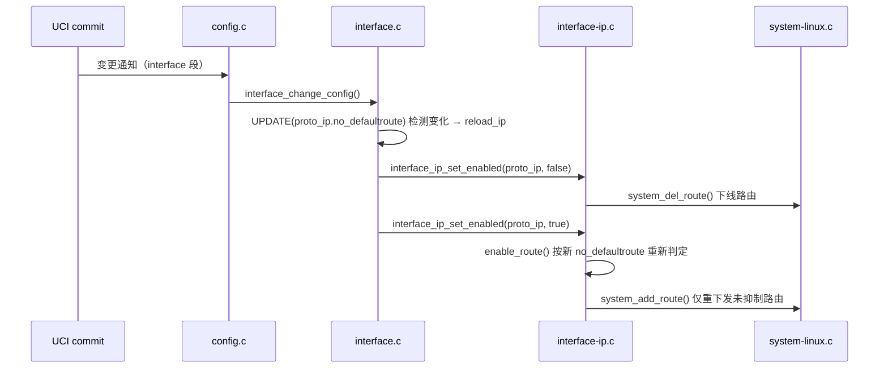
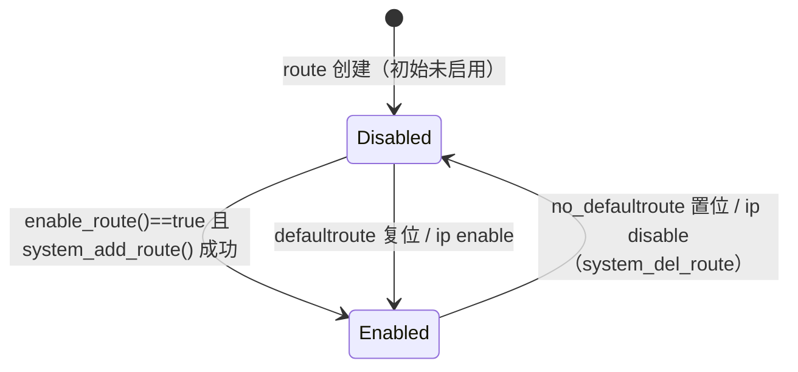
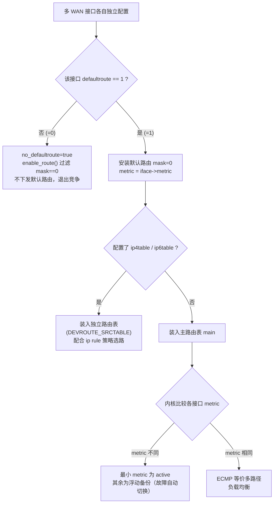

# netifd `defaultroute` 参数深度解析

> 本文档基于 netifd 源码逐行核对编写（read-only 分析，不修改任何源码）。
> 源码根目录：`netifd/`，所有 `文件:行号` 引用均以该目录下实际代码为准。
> 配套阅读：《1.netifd.md》（netifd 总体架构）。

---

## 一、参数概述

### 1.1 defaultroute 是什么

`defaultroute` 是 netifd 中每个网络接口（interface）的 UCI 布尔配置项，用于控制**该接口是否参与默认路由（默认网关）的安装**。

默认路由指前缀长度为 0 的路由，即 IPv4 的 `0.0.0.0/0` 或 IPv6 的 `::/0`，表现为「所有目的地址都交给这个网关」。

### 1.2 UCI 语义与默认值

| 配置写法 | 语义 | 结果 |
|---------|------|------|
| `option defaultroute '1'` | 安装默认路由（默认值） | 接口的默认网关会下发到内核 |
| `option defaultroute '0'` | 抑制默认路由 | 接口的默认网关**不会下发**到内核 |
| 不写该选项 | 等效 `1` | 同 `defaultroute '1'` |

关键点：**该参数默认值为 `true`**，只有当显式配置 `defaultroute=0` 时才会抑制默认路由。参数类型是布尔型（`BLOBMSG_TYPE_BOOL`），其解析入口定义在 `interface.c:72`：

```c
[IFACE_ATTR_DEFAULTROUTE] = { .name = "defaultroute", .type = BLOBMSG_TYPE_BOOL },
```

### 1.3 一个容易绕晕的设计

netifd 内部结构体字段名是**取反命名**：`no_defaultroute`（见 `interface.h:78`）。代码里「是否抑制默认路由」用 `no_defaultroute` 表示，而 UCI 配置项是正向的 `defaultroute`。二者通过一次取反完成转换：

- `defaultroute=1`（默认）→ `no_defaultroute = false` → 正常下发默认路由
- `defaultroute=0` → `no_defaultroute = true` → 抑制默认路由

这条转换链是全文的主线，后面所有环节都围绕 `no_defaultroute` 展开。

---

## 二、配置入口与解析链路

### 2.1 链路总览

`defaultroute` 从 UCI 到内核的完整链路如下：

1. **Shell 声明层**：`scripts/netifd-proto.sh` 把 `defaultroute` 声明为协议通用选项。
2. **blobmsg 属性表**：`interface.c:72` 登记属性名与类型。
3. **UCI 解析**：`interface.c:854-855` 将布尔值取反存入结构体。
4. **结构体承载**：`interface.h:78` 的 `bool no_defaultroute` 字段。
5. **路由下发判定**：`interface-ip.c:771-778` 的 `enable_route()` 消费该字段。

### 2.2 Shell 声明层（scripts/netifd-proto.sh）

脚本层把 `defaultroute` 与 `peerdns`、`metric` 一起列为「协议默认三件套」：

```sh
# scripts/netifd-proto.sh:2
PROTO_DEFAULT_OPTIONS="defaultroute peerdns metric"
```

```sh
# scripts/netifd-proto.sh:23-27
proto_config_add_defaults() {
	proto_config_add_boolean "defaultroute"
	proto_config_add_boolean "peerdns"
	proto_config_add_int "metric"
}
```

动态协议（DHCP、PPPoE、4G/5G 拨号等 shell 协议）在启动脚本里通过 `proto_add_dynamic_defaults()` 把这三个运行时参数补进 JSON：

```sh
# scripts/netifd-proto.sh:29-33
proto_add_dynamic_defaults() {
	[ -n "$defaultroute" ] && json_add_boolean defaultroute "$defaultroute"
	[ -n "$peerdns" ] && json_add_boolean peerdns "$peerdns"
	[ -n "$metric" ] && json_add_int metric "$metric"
}
```

这说明 `defaultroute` 是**所有协议通用**的参数（属于接口层，不属于某个协议特有参数），static/dhcp/pppoe/wwan 等全部适用。

### 2.3 blobmsg 属性表（interface.c:72）

UCI 配置经 `config.c` 转成 blobmsg 后，`interface.c` 用策略表 `iface_attrs` 逐一解析。`defaultroute` 的登记项是：

```c
// interface.c:72
[IFACE_ATTR_DEFAULTROUTE] = { .name = "defaultroute", .type = BLOBMSG_TYPE_BOOL },
```

类型是 `BLOBMSG_TYPE_BOOL`，所以 UCI 里写 `1/0`、`true/false`、`on/off` 均可被 `blobmsg_get_bool_default` 正确解析。

### 2.4 UCI 解析与取反赋值（interface.c:854-855）

这是整条链路最关键的一步，发生在 `interface_alloc()` 内（`interface.c:854-855`）：

```c
// interface.c:854-857
	iface->proto_ip.no_defaultroute =
		!blobmsg_get_bool_default(tb[IFACE_ATTR_DEFAULTROUTE], true);
	iface->proto_ip.no_dns =
		!blobmsg_get_bool_default(tb[IFACE_ATTR_PEERDNS], true);
```

逐行注释：

| 行号 | 代码 | 含义 |
|------|------|------|
| 854 | `iface->proto_ip.no_defaultroute =` | 只写入 `proto_ip`（协议侧），**不写 `config_ip`** |
| 855 | `!blobmsg_get_bool_default(..., true)` | 读 `defaultroute` 布尔值，缺省为 `true`，再取反 |

默认值 `true` 在这里体现：即使 UCI 里没有 `defaultroute` 项，`get_bool_default(..., true)` 也返回 1，取反后 `no_defaultroute = false`，默认路由照常下发。

**注意：赋值目标是 `proto_ip`。** 结构体 `struct interface_ip_settings`（interface.h:75-89）里有两个实例：

```c
// interface.h:75-89（节选）
struct interface_ip_settings {
	struct interface *iface;
	bool enabled;
	bool no_defaultroute;   // ← 第 78 行
	bool no_dns;
	bool no_delegation;
	...
};
```

接口上 `proto_ip` 与 `config_ip` 各持一份该结构体。`config_ip` 是 UCI `config route` 段落的归处，它的 `no_defaultroute` 从未被赋值（calloc 清零），恒为 `false`。这条分界线在第 7 节会详细展开。

### 2.5 图1 组件图



---

## 三、生效机制详解

### 3.1 核心判定函数 enable_route()（interface-ip.c:771-778）

`defaultroute=0` 的生效点只有一个：`enable_route()`。函数极短但语义明确：

```c
// interface-ip.c:771-778
static bool
enable_route(struct interface_ip_settings *ip, struct device_route *route)
{
	if (ip->no_defaultroute && !route->mask)
		return false;

	return ip->enabled;
}
```

逐行注释：

| 行号 | 代码 | 含义 |
|------|------|------|
| 771-772 | `static bool enable_route(...)` | 输入：IP 设置集（携带 `no_defaultroute`）、一条待判定路由 |
| 774 | `if (ip->no_defaultroute && !route->mask)` | 抑制条件：接口开了 `defaultroute=0` **且** 路由前缀长度为 0 |
| 775 | `return false;` | 命中抑制，路由不启用，直接拒绝下发 |
| 777 | `return ip->enabled;` | 未命中抑制，路由是否启用取决于 IP 设置集是否 enabled |

两个关键结论从这里得出：

1. **判定只看 `route->mask`，不看地址族。** `mask==0` 同时覆盖 IPv4 `0.0.0.0/0` 和 IPv6 `::/0`，IPv6 与 IPv4 走完全相同的抑制路径。
2. **抑制 = 不下发，而不是先下发再删除。** `enable_route()` 返回 false 后，调用方根本不会调用 `system_add_route()`，内核路由表里从未出现过这条默认路由。这一点与「下发后删除」在故障表现和竞态上完全不同。

### 3.2 图2 生效流程图



### 3.3 两个调用点

`enable_route()` 只有两处调用，分别对应「路由加入/更新」和「整体启停」两条路径。

**调用点一：__interface_update_route()（interface-ip.c:818-858）**

这是 vlist 回调 `interface_update_proto_route`（interface-ip.c:860-869）的实际实现，路由被协议加入 `proto_ip.route` 或 `config_ip.route` vlist 树时触发：

```c
// interface-ip.c:848-857（位于 __interface_update_route() 内）
	if (node_new) {
		bool _enabled = enable_route(ip, route_new);      // ← 第 849 行，调用点一

		if (!(route_new->flags & DEVADDR_EXTERNAL) && !keep && _enabled)
			if (system_add_route(dev, route_new))          // ← 第 852 行，仅 _enabled 为真才下发
				route_new->failed = true;

		route_new->iface = iface;
		route_new->enabled = _enabled;                     // ← 第 856 行，enabled 记录判定结果
	}
```

逐行注释：

| 行号 | 代码 | 含义 |
|------|------|------|
| 849 | `bool _enabled = enable_route(ip, route_new);` | 判定结果暂存；被抑制时这里是 false |
| 851 | `if (!(flags & DEVADDR_EXTERNAL) && !keep && _enabled)` | 外部路由跳过，仅内容变化的更新，且 `_enabled` 为真才进下发分支 |
| 852 | `if (system_add_route(dev, route_new))` | 真正写内核；被抑制的路由根本走不到这一行 |
| 856 | `route_new->enabled = _enabled;` | 无论是否下发，都把判定结果记录到 `route->enabled`，供 ubus dump 使用 |

**调用点二：interface_ip_set_route_enabled()（interface-ip.c:1617-1641）**

接口整体 enable/disable 时，逐条路由走这个函数：

```c
// interface-ip.c:1617-1641
static void
interface_ip_set_route_enabled(struct interface_ip_settings *ip,
			       struct device_route *route, bool enabled)
{
	struct device *dev = ip->iface->l3_dev.dev;

	if (route->flags & DEVADDR_EXTERNAL)
		return;

	if (!enable_route(ip, route))          // ← 第 1626 行，调用点二
		enabled = false;

	if (route->enabled == enabled)
		return;

	if (enabled) {
		interface_set_route_info(ip->iface, route);

		if (system_add_route(dev, route))
			route->failed = true;
	} else
		system_del_route(dev, route);

	route->enabled = enabled;
}
```

逐行注释：

| 行号 | 代码 | 含义 |
|------|------|------|
| 1623-1624 | `if (route->flags & DEVADDR_EXTERNAL) return;` | 外部协议（如内核 RA）产生的路由不归 netifd 管，直接跳过 |
| 1626 | `if (!enable_route(ip, route)) enabled = false;` | 命中抑制时，把外部传入的 `enabled` 强制改成 false |
| 1629-1630 | `if (route->enabled == enabled) return;` | 状态无变化则无事可做（幂等） |
| 1632-1636 | `enabled` 分支 | 先 `interface_set_route_info` 补全 metric/table，再 `system_add_route` 下发 |
| 1637-1638 | `else` 分支 | `system_del_route` 删除旧路由 |

注意第 1626 行的设计：即使调用方明确要求 enable，`enable_route()` 也可以否决，把请求降级为「保持禁用」。

### 3.4 内核下发：system_add_route → system_rt

当 `enable_route()` 放行后，路由走 `system_add_route()` 进入系统抽象层：

```c
// system-linux.c:3068-3076
int system_add_route(struct device *dev, struct device_route *route)
{
	return system_rt(dev, route, RTM_NEWROUTE);
}

int system_del_route(struct device *dev, struct device_route *route)
{
	return system_rt(dev, route, RTM_DELROUTE);
}
```

`system_rt()` 是 netlink 封装的核心（system-linux.c:2961 起）。默认路由与普通路由的区别在 netlink 属性组装上可见：

```c
// system-linux.c:3026-3048（节选）
	nlmsg_append(msg, &rtm, sizeof(rtm), 0);

	if (route->mask)
		nla_put(msg, RTA_DST, alen, &route->addr);       // 仅 mask>0 时携带目标前缀

	if (route->sourcemask) {
		...
	}

	if (route->metric > 0)
		nla_put_u32(msg, RTA_PRIORITY, route->metric);   // 仅 metric>0 时携带优先级

	if (have_gw)
		nla_put(msg, RTA_GATEWAY, alen, &route->nexthop); // 携带网关

	if (dev)
		nla_put_u32(msg, RTA_OIF, dev->ifindex);          // 携带出接口

	if (table >= 256)
		nla_put_u32(msg, RTA_TABLE, table);
```

关键点（system-linux.c:3028-3029 与 3038-3039）：

| 行号 | 代码 | 含义 |
|------|------|------|
| 3028-3029 | `if (route->mask) nla_put(RTA_DST, ...)` | 前缀长度 0 时**不携带 RTA_DST**，netlink 中 dst_len=0 即为默认路由 |
| 3038-3039 | `if (route->metric > 0) nla_put_u32(RTA_PRIORITY, ...)` | **metric 为 0 时根本不发 RTA_PRIORITY**，这直接影响内核的多路由竞争（第 8 节详述） |
| 3041-3042 | `if (have_gw) nla_put(RTA_GATEWAY, ...)` | 网关不为 0 时携带 |

同时，`rtm.rtm_dst_len = route->mask`（system-linux.c:2980）决定了内核解析出的目的前缀长度，默认路由即 `rtm_dst_len == 0`。这两处（`rtm_dst_len=0` 且无 `RTA_DST`）共同构成内核视角的 `0.0.0.0/0`。

### 3.5 图3 上线时序图



---

## 四、配置热重载行为

### 4.1 变更检测（interface.c:1305-1354）

当 UCI 配置变更触发 `interface_change_config()` 时，netifd 逐字段对比新旧配置，用 `UPDATE` 宏检测变化并置位对应重载标志：

```c
// interface.c:1305-1309
#define UPDATE(field, __var) ({						\
		bool __changed = (if_old->field != if_new->field);	\
		if_old->field = if_new->field;				\
		__var |= __changed;					\
	})
```

`defaultroute` 的变化会置位 `reload_ip`：

```c
// interface.c:1353-1356
	UPDATE(metric, reload_ip);
	UPDATE(proto_ip.no_defaultroute, reload_ip);
	UPDATE(ip4table, reload_ip);
	UPDATE(ip6table, reload_ip);
```

即：**仅修改 `defaultroute` 不会触发接口整段 reload（不下电重启接口），而是走轻量级的 IP 重载路径 `reload_ip`**。

### 4.2 disable→enable 翻转重放（interface.c:1369-1377）

`reload_ip` 的执行体是把 IP 设置整体先禁用再按原状态启用，从而让所有路由按新参数重新过一遍 `enable_route()`：

```c
// interface.c:1369-1377
	if (reload_ip) {
		bool config_ip_enabled = if_old->config_ip.enabled;
		bool proto_ip_enabled = if_old->proto_ip.enabled;

		interface_ip_set_enabled(&if_old->config_ip, false);
		interface_ip_set_enabled(&if_old->proto_ip, false);
		interface_ip_set_enabled(&if_old->proto_ip, proto_ip_enabled);
		interface_ip_set_enabled(&if_old->config_ip, config_ip_enabled);
	}
```

执行顺序：

| 步骤 | 调用 | 效果 |
|------|------|------|
| 1 | `config_ip` set_enabled(false) | 先撤 config_ip 的路由/地址 |
| 2 | `proto_ip` set_enabled(false) | 再撤 proto_ip 的路由/地址（含旧默认路由） |
| 3 | `proto_ip` set_enabled(原状态) | 按**新** `no_defaultroute` 逐条重判 `enable_route()`，重新下发 |
| 4 | `config_ip` set_enabled(原状态) | 补回 config_ip 的路由 |

`interface_ip_set_enabled(false)` 内部遍历所有路由调用 `interface_ip_set_route_enabled(..., false)`（接口-ip.c:1626-1640），删除已下发路由；反向 enable 时再次经过 `enable_route()` 过滤。所以：

- 从 `defaultroute=1` 改成 `0`：旧默认路由被 `system_del_route` 删除，新判定直接不再下发。
- 从 `defaultroute=0` 改成 `1`：`no_defaultroute` 复位为 false，原来被抑制的默认路由这次通过判定，被补发到内核。

### 4.3 图4 热重载时序图



---

## 五、ubus 查询表现与观测方法

### 5.1 ubus 侧的路由过滤（ubus.c:616）

netifd 通过 ubus 的 `network.interface.*` 对象对外提供路由列表 dump。`interface_ip_dump_route_list()` 里对「被抑制的默认路由」做了专门过滤：

```c
// ubus.c:602-617（节选）
static void
interface_ip_dump_route_list(struct interface_ip_settings *ip, bool enabled)
{
	...
	vlist_for_each_element(&ip->route, route, node) {
		if (route->enabled != enabled)
			continue;

		if ((ip->no_defaultroute == enabled) && !route->mask)
			continue;                          // ← 第 616 行

		...
	}
}
```

逐行注释：

| 行号 | 代码 | 含义 |
|------|------|------|
| 613 | `if (route->enabled != enabled) continue;` | 只 dump 处于指定 enabled 状态的路由 |
| 616 | `if ((ip->no_defaultroute == enabled) && !route->mask) continue;` | 双重过滤：`no_defaultroute==true` 时，enabled=false 列表里跳过 mask==0；`no_defaultroute==false` 时，enabled=true 列表里跳过 mask==0 |

第 616 行的逻辑值得细看。`enabled` 参数决定 dump「启用路由」还是「未启用路由」：

- `enabled=true` 且 `no_defaultroute=true`：接口在抑制模式下，默认路由从未被启用，**不会出现在启用列表**。
- `enabled=false` 且 `no_defaultroute=false`：正常模式下，默认路由是启用的，**不会出现在未启用列表**。

简言之，抑制的默认路由在 ubus 两侧列表中都不出现，dump 表现与内核一致。

### 5.2 观测方法

**方法一：查内核路由表（最直接）**

```bash
ip route                      # IPv4 默认路由是否存在
ip -6 route                   # IPv6 默认路由是否存在
ip route show table all       # 全表（含 ip4table 指定的非 main 表）
```

`defaultroute=0` 的接口，即使 UCI 里配置了 `gateway`，`ip route` 里也看不到它产生的 `default via <gw>` 条目。

**方法二：查 ubus 接口状态**

```bash
ubus call network.interface.wan status
ubus call network.interface.wan status | jsonfilter -e '@["route"]'
```

route 数组里默认路由项（`target: "0.0.0.0", mask: 0`）不会出现。

**方法三：对照观测（推荐用于排障）**

```bash
# 关掉抑制后对照
uci set network.wan.defaultroute=1
uci commit network
/etc/init.d/network reload
ip route
```

通过开关对比，可以确认抑制行为确实生效在「不下发」层面，而非「下发后删除」。

### 5.3 图5 状态图

`route->enabled` 状态机如下，`defaultroute` 的翻转改变的是 Disabled → Enabled 的通过条件：



---

## 六、关联细节

### 6.1 metric：优先级与 RTA_PRIORITY

`metric` 与 `defaultroute` 是搭档：`defaultroute` 决定「参不参与默认路由竞争」，`metric` 决定「参与时排第几」。

- **解析**：`interface.c:868-869`，`iface->metric = blobmsg_get_u32(cur)`。
- **静态网关继承**：`proto.c:303`，`route->metric = iface->metric`，静态协议的 `gateway` 直接继承接口 metric。
- **config 路由继承**：`interface-ip.c:333-334`（`interface_set_route_info`）：

```c
// interface-ip.c:333-334
	if (!(route->flags & DEVROUTE_METRIC))
		route->metric = iface->metric;
```

   仅在路由自身没显式带 metric（无 `DEVROUTE_METRIC` 标志）时，才套用接口 metric。显式配置的 `config route` 段落在 `interface-ip.c:453-455` 会置位 `DEVROUTE_METRIC`：

```c
// interface-ip.c:453-456
	if ((cur = tb[ROUTE_METRIC]) != NULL) {
		route->metric = blobmsg_get_u32(cur);
		route->flags |= DEVROUTE_METRIC;
	}
```

- **内核携带**：`system-linux.c:3038-3039`，`metric > 0` 才发 `RTA_PRIORITY`。

### 6.2 peerdns / no_dns：兄弟参数

`defaultroute`、`peerdns` 是同一个 UCI 属性表里的邻居（interface.c:72-74），且解析逻辑同构（都是取反）：

```c
// interface.c:72-74
	[IFACE_ATTR_DEFAULTROUTE] = { .name = "defaultroute", .type = BLOBMSG_TYPE_BOOL },
	[IFACE_ATTR_PEERDNS] = { .name = "peerdns", .type = BLOBMSG_TYPE_BOOL },
	[IFACE_ATTR_METRIC] = { .name = "metric", .type = BLOBMSG_TYPE_INT32 },
```

`peerdns=0` → `no_dns=true`（interface.c:856-857）→ 抑制协议下发的 DNS 服务器，与 `defaultroute=0` 抑制默认路由是完全对称的设计。热重载时二者待遇不同：`no_dns` 直接赋值并替换 DNS 列表（interface.c:1350-1351），`no_defaultroute` 走 `reload_ip` 翻转。

### 6.3 defaultroute_target：网关可达性保护

`interface_ip_add_target_route()`（interface-ip.c:259-323）是「解析到某目的地址时应从哪个接口出去」的辅助函数。当目标是默认路由目标（全零地址，第 275-276 行判定）时直接返回选中接口；否则生成一条**主机路由**（mask=32/128）加进该接口的 `host_routes`：

```c
// interface-ip.c:308-320（节选）
	route = calloc(1, sizeof(*route));
	...
	route->flags = v6 ? DEVADDR_INET6 : DEVADDR_INET4;
	route->mask = v6 ? 128 : 32;                        // ← 第 313 行，主机路由全掩码
	memcpy(&route->addr, addr, addrsize);
	memcpy(&route->nexthop, &r_next->nexthop, sizeof(route->nexthop));
	...
	vlist_add(&iface->host_routes, &route->node, route); // ← 第 320 行，挂 host_routes 树
```

**重要推论（网关主机路由不受 defaultroute 抑制）**：主机路由 mask=128/32 ≠ 0，`enable_route()` 的过滤条件 `!route->mask` 对它们恒为 false，永不命中。`interface_update_host_route()`（interface-ip.c:871-880）虽然把 `&iface->proto_ip` 传给 `__interface_update_route`，但 mask 不为 0 保证了 `enable_route()` 直接放行：

```c
// interface-ip.c:871-880
static void
interface_update_host_route(struct vlist_tree *tree,
			     struct vlist_node *node_new,
			     struct vlist_node *node_old)
{
	struct interface *iface;

	iface = container_of(tree, struct interface, host_routes);
	__interface_update_route(&iface->proto_ip, node_new, node_old);
}
```

因此在 `defaultroute=0` 下，**网关本身的可达性（到网关 IP 的主机路由）依然保留**，只是「把所有流量交给它」的默认路由不下发。这是设计上的有意为之，防止「连网关都不可达」的彻底断网。

### 6.4 IPv6 ::/0 与 IPv4 0.0.0.0/0

两者在 netifd 内部走同一条判定路径：

- `parse_gateway_option()` 处理 IPv4 `gateway`（proto.c:285）与 IPv6 `ip6gw`（同函数 v6=true 分支），都构造 `mask = 0` 的路由（proto.c:301）。
- `enable_route()` 只看 `!route->mask`，不区分地址族（interface-ip.c:774）。
- ubus 过滤同样只看 mask（ubus.c:616）。
- 内核侧 `rtm.rtm_family` 区分 AF_INET/AF_INET6（system-linux.c:2979），`rtm_dst_len=0` 时分别对应 `0.0.0.0/0` 与 `::/0`。

结论：`defaultroute=0` 会同时抑制 IPv4 与 IPv6 两条默认路由。

---

## 七、静态协议 vs 动态协议差异

### 7.1 核心分界：proto_ip.route vs config_ip.route

`defaultroute=0` 只抑制 `proto_ip` 里的默认路由，`config_ip` 里的路由完全不受影响。二者的归属由 `interface_ip_add_route()` 决定（interface-ip.c:401-425）：

```c
// interface-ip.c:414-425
	if (!iface) {
		if ((cur = tb[ROUTE_INTERFACE]) == NULL)
			return;

		iface = vlist_find(&interfaces, blobmsg_data(cur), iface, node);
		if (!iface)
			return;

		ip = &iface->config_ip;      // ← 第 422 行，iface 为空（UCI config route）→ config_ip
	} else {
		ip = &iface->proto_ip;       // ← 第 424 行，协议下发 → proto_ip
	}
```

| 来源 | iface 参数 | 归属 | 受 defaultroute=0 影响 |
|------|-----------|------|----------------------|
| 协议（静态/动态 shell）下发 | 非空 | `proto_ip` | **是** |
| UCI `config route` 段落 | NULL | `config_ip` | **否** |

### 7.2 静态协议（proto static）

`proto-static.c` 定义 `static` 协议处理器：

```c
// proto-static.c:33-41
static bool
static_proto_setup(struct static_proto_state *state)
{
	struct interface *iface = state->proto.iface;
	struct device *dev = iface->main_dev.dev;

	interface_set_l3_dev(iface, dev);
	return proto_apply_static_ip_settings(state->proto.iface, state->config) == 0;
}
```

```c
// proto-static.c:101-107
static struct proto_handler static_proto = {
	.name = "static",
	.flags = PROTO_FLAG_IMMEDIATE |
		 PROTO_FLAG_FORCE_LINK_DEFAULT,
	.config_params = &proto_ip_attr,     // ← 第 105 行，静态协议解析 IP 层参数
	.attach = static_attach,
};
```

`proto_apply_static_ip_settings()`（proto.c:410-478）把 UCI 的 `gateway`/`ip6gw` 交给 `parse_gateway_option()`：

```c
// proto.c:462-470
	if ((cur = tb[OPT_GATEWAY])) {
		if (n_v4 && !parse_gateway_option(iface, cur, false))
			goto out;
	}

	if ((cur = tb[OPT_IP6GW])) {
		if (n_v6 && !parse_gateway_option(iface, cur, true))
			goto out;
	}
```

而 `parse_gateway_option()` 构造的默认路由（mask=0）最终进入 **`proto_ip.route`**：

```c
// proto.c:301-311
	route->mask = 0;
	route->flags = (v6 ? DEVADDR_INET6 : DEVADDR_INET4);
	route->metric = iface->metric;

	unsigned int table = (v6) ? iface->ip6table : iface->ip4table;
	if (table) {
		route->table = table;
		route->flags |= DEVROUTE_SRCTABLE;
	}

	vlist_add(&iface->proto_ip.route, &route->node, route);  // ← 第 311 行
```

**结论：静态协议的 `gateway` 默认路由落在 `proto_ip.route`，因此 `defaultroute=0` 对它生效。**

### 7.3 动态 shell 协议（dhcp / pppoe / wwan 等）

shell 协议（proto-shell.c）执行协议脚本返回的 JSON 里的 `route` 数组，逐条调用 `interface_ip_add_route(iface, ...)`：

```c
// proto-shell.c:399-414
static void
proto_shell_parse_route_list(struct interface *iface, struct blob_attr *attr,
			     bool v6)
{
	...
	blobmsg_for_each_attr(cur, attr, rem) {
		...
		interface_ip_add_route(iface, cur, v6);   // ← 第 412 行，iface 非空 → proto_ip
	}
}
```

传入非空 `iface`，因此这些路由同样落进 `proto_ip.route`，**`defaultroute=0` 同样生效**。DHCP 客户端从服务器学到的默认网关会被抑制。

### 7.4 UCI config route（不受影响）

`/etc/config/network` 里的独立路由段：

```uci
config route
    option interface 'wan'
    option target '10.0.0.0'
    option netmask '255.255.0.0'
    option gateway '192.168.1.1'
```

由 `config.c` 解析，调用 `interface_ip_add_route(NULL, ...)`：

```c
// config.c:217-227
static void
config_parse_route(struct uci_section *s, bool v6)
{
	void *route;

	blob_buf_init(&b, 0);
	route = blobmsg_open_array(&b, "route");
	uci_to_blob(&b, s, &route_attr_list);
	blobmsg_close_array(&b, route);
	interface_ip_add_route(NULL, blob_data(b.head), v6);   // ← 第 226 行，NULL → config_ip
}
```

`iface==NULL` 走 `config_ip` 分支（interface-ip.c:422）。**`config_ip.no_defaultroute` 从未被赋值（calloc 清零恒为 false），且 `enable_route()` 收到的 `ip` 是 config_ip 时抑制条件天然不成立。** 因此即使某接口配了 `defaultroute=0`，UCI `config route` 里带 `0.0.0.0/0` 目标的条目照常下发。

### 7.5 影响矩阵

| 路由来源 | 归属树 | defaultroute=0 是否抑制 |
|---------|--------|------------------------|
| static 协议 `gateway`/`ip6gw` | proto_ip.route（proto.c:311） | 是 |
| 动态 shell 协议返回的 route | proto_ip.route（interface-ip.c:424） | 是 |
| UCI `config route`（含 `target 0.0.0.0`） | config_ip.route（interface-ip.c:422） | 否 |

---

## 八、多 WAN 场景下的 defaultroute 决策策略

### 8.1 三层决策模型

多 WAN（多运营商出口）场景下，「谁当默认出口」由三个层面共同决定，各管一段：

| 层 | 决策者 | 职责 | 依据 |
|----|--------|------|------|
| 第 1 层（参与门槛） | netifd `enable_route()` | 决定哪些接口的默认路由进入内核 | `defaultroute`（interface-ip.c:774） |
| 第 2 层（优先级） | netifd `system_rt()` | 决定各默认路由的优先级数值 | `metric` → `RTA_PRIORITY`（system-linux.c:3038-3039） |
| 第 3 层（选路结果） | Linux 内核 | 决定哪条默认路由 active，其余浮动或 ECMP | 路由表查找算法 |

第 3 层是内核行为，netifd 只负责把「竞争选手」和「竞争权重」摆进路由表，最终 active 还是 ECMP 由内核判定。

### 8.2 决策矩阵

| 场景 | 各接口 defaultroute | 各接口 metric | 内核结果 |
|------|--------------------|--------------|---------|
| 单 WAN | 1 | 任意 | 唯一默认路由，直接使用 |
| 主备双 WAN | 均 1 | 主小备大 | 最小 metric 为 active，大 metric 的路由保留但不生效，主链路断则自动切换 |
| ECMP 负载均衡 | 均 1 | **相同** | 内核做等价多路径（equal cost multipath），流量按哈希分发 |
| 策略路由 | 部分 1 | 任意 | 配 `ip4table` 的接口把默认路由装进独立路由表，配合 `ip rule` 按源/目的分流；main 表里只留一个 default |
| 不参与出口 | 0 | 任意 | 默认路由不下发，接口彻底退出默认路由竞争（但其网关主机路由仍保留） |

### 8.3 策略路由的落地细节

当接口配置了 `ip4table`（interface.c:81 属性登记），静态网关路由会打上 `DEVROUTE_SRCTABLE` 并装入独立表（proto.c:305-309）；`interface_set_route_info` 对 config 路由同样处理（interface-ip.c:336-340）：

```c
// interface-ip.c:336-340
	if (!(route->flags & DEVROUTE_TABLE)) {
		route->table = (v6) ? iface->ip6table : iface->ip4table;
		if (route->table)
			route->flags |= DEVROUTE_SRCTABLE;
	}
```

内核侧表号经 `RTA_TABLE` 下发（system-linux.c:3047-3048），`rtm.rtm_table` 由 `DEVROUTE_TABLE | DEVROUTE_SRCTABLE` 决定（system-linux.c:2975-2976）：

```c
// system-linux.c:2975-2976
	unsigned int table = (route->flags & (DEVROUTE_TABLE | DEVROUTE_SRCTABLE))
			? route->table : RT_TABLE_MAIN;
```

配合 `/etc/config/network` 的 `config rule`（iprule 段）实现源地址策略路由。`__find_ip_route_target()` 在选路时跳过带 `DEVROUTE_TABLE` 的路由（interface-ip.c:234），保证独立表不干扰 main 表查询。

### 8.4 两个关键坑

**坑一：metric 默认 0，会意外触发 ECMP。**

接口 metric 缺省为 0（`blobmsg_get_u32` 未配置时为 0，interface.c:868-869）。`system_rt()` 只在 `metric > 0` 时才发 `RTA_PRIORITY`（system-linux.c:3038-3039）。也就是说，两个 WAN 都没配 metric 时，内核收到两条不带优先级信息的默认路由，等价于同 metric，直接进入 **ECMP 负载均衡**，而不是「一主一备」。

```bash
# 想让 WAN1 优先、WAN2 兜底，必须显式配 metric
uci set network.wan1.metric=10
uci set network.wan2.metric=20
uci commit network
/etc/init.d/network reload
```

**坑二：「主备」是内核语义，不是 netifd 逻辑。**

netifd 只是把不同 metric 的默认路由都摆进 main 表。内核路由查找永远选最小 metric 那条，大 metric 的路由**保留在表中但不参与转发**（故障后内核自动回退）。这个「自动切换」是内核行为，netifd 没有主动探测/切换逻辑。观测时用 `ip route` 会同时看到两条 default，只有 metric 小者实际生效：

```bash
default via 192.168.1.1 dev eth0 metric 10    # active
default via 192.168.2.1 dev eth1 metric 20    # 浮动备份，不转发
```

### 8.5 图6 多 WAN 决策流程图



---

## 九、小结与易混淆点清单

### 9.1 一句话总结

`defaultroute` 是接口级布尔参数（默认 true），`defaultroute=0` 时 netifd 在 `enable_route()`（interface-ip.c:771-778）处**拦截**协议下发的 mask=0 默认路由，使其从不进入内核；默认路由在 ubus dump 中同步隐藏；热重载通过 `reload_ip` 的 disable/enable 翻转重放生效。

### 9.2 易混淆点清单

| # | 混淆点 | 真相 |
|---|--------|------|
| 1 | **取反命名** | UCI 是正向 `defaultroute`，结构体是取反 `no_defaultroute`（interface.h:78），在 interface.c:854-855 转换；读源码时看到 `no_defaultroute` 别当成另一个参数 |
| 2 | **抑制 = 不下发而非删除** | `enable_route()` 返回 false 后 `system_add_route()` 根本不被调用（interface-ip.c:849-853），内核从未出现过该路由；不存在「下发后删除」的中间状态 |
| 3 | **config_ip 与 proto_ip 边界** | 只有 `proto_ip` 受 `defaultroute` 影响；UCI `config route` 进 `config_ip`（interface-ip.c:422），其 `no_defaultroute` 恒为 false，不受抑制 |
| 4 | **metric=0 陷阱** | metric 缺省 0 → 不携带 `RTA_PRIORITY`（system-linux.c:3038-3039）→ 多 WAN 未配 metric 会意外 ECMP；主备必须显式配置不同 metric |
| 5 | **IPv4/IPv6 同路径** | 抑制判定只看 `!route->mask`（interface-ip.c:774），`0.0.0.0/0` 与 `::/0` 都被抑制，无需分别配置 |
| 6 | **网关主机路由不抑制** | `interface_ip_add_target_route` 生成 mask=32/128 的主机路由（interface-ip.c:313），不满足抑制条件，`defaultroute=0` 时网关仍可达 |
| 7 | **主备是内核语义** | netifd 只负责下发与优先级，active/浮动切换是内核路由查找的结果（第 8.4 节坑二） |
| 8 | **热重载不重启接口** | 仅改 `defaultroute` 触发 `reload_ip`（interface.c:1354），走 IP 翻转重放而非整段接口 reload |

### 9.3 排查速查

| 现象 | 可能原因 | 排查点 |
|------|---------|--------|
| 接口有 `gateway` 但 `ip route` 无 default | `defaultroute=0` 生效 | `uci get network.<iface>.defaultroute`；`ubus call network.interface.<iface> status` 中 route 列表缺失默认项 |
| 改了 `defaultroute` 不生效 | 未 reload 或改错段 | `/etc/init.d/network reload`；确认修改在 interface 段而非 route 段 |
| 多 WAN 意外负载均衡 | 均未配 metric | 检查各接口 `metric`，至少一个非 0 且互不相同 |
| default 在，但网关不可达 | `defaultroute=1` 但网关侧链路问题 | 主机路由正常（interface-ip.c:313），重点查链路与对端 |

---

*本文档所有行号引用均基于 netifd 源码实测核对。源码版本以仓库当前 master 为准，升级 netifd 后如行号漂移，请以实际文件为准。*
