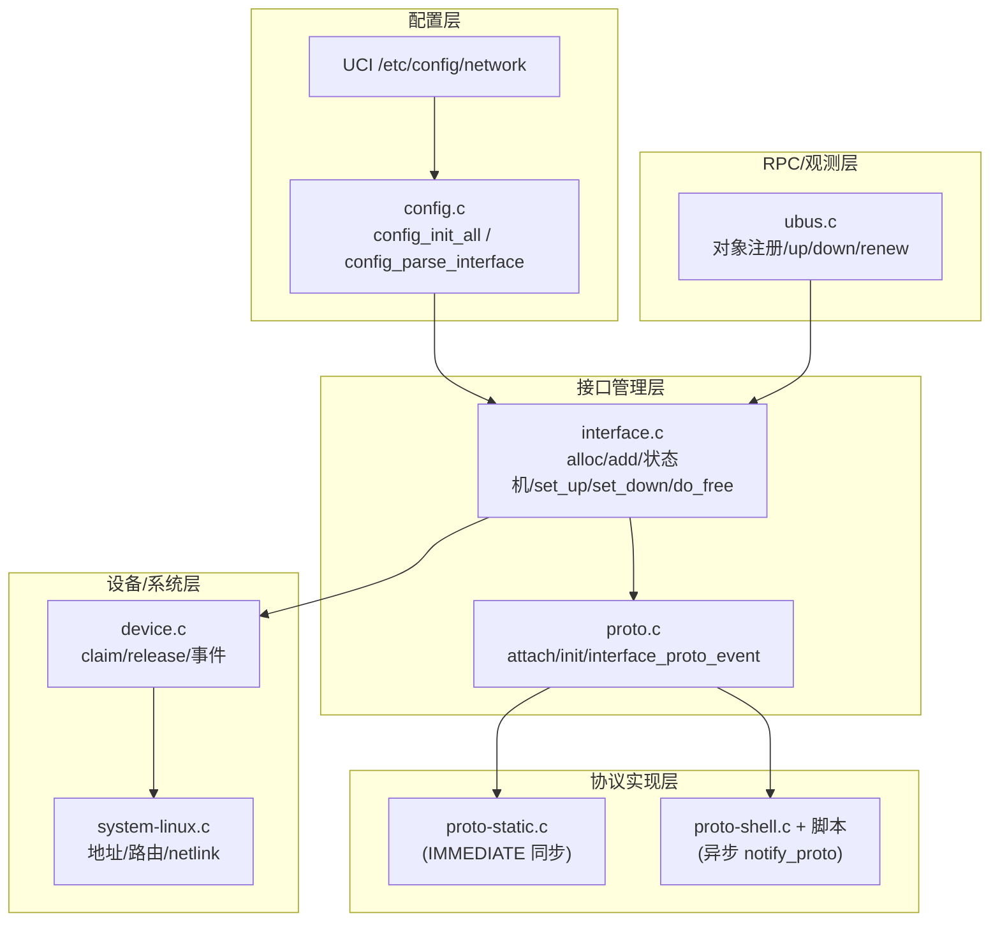
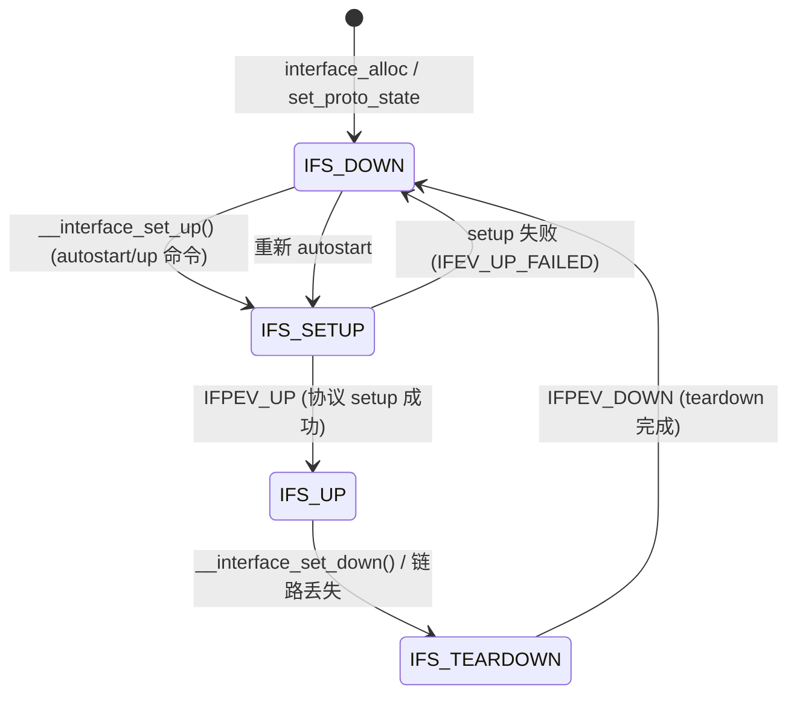
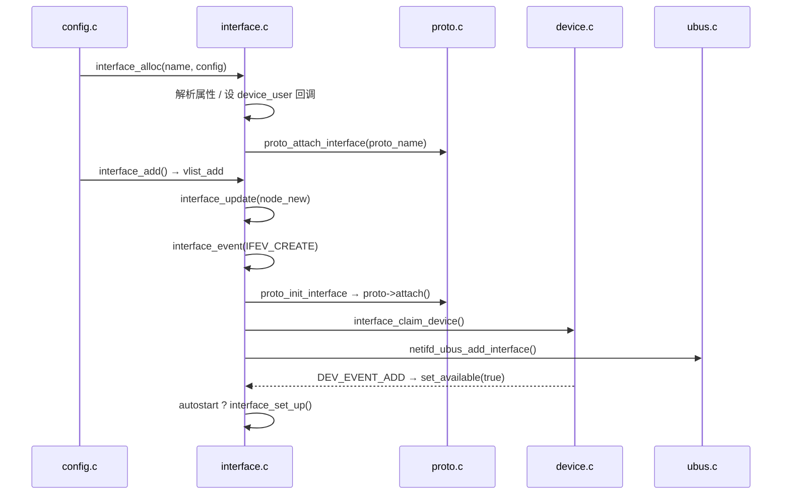
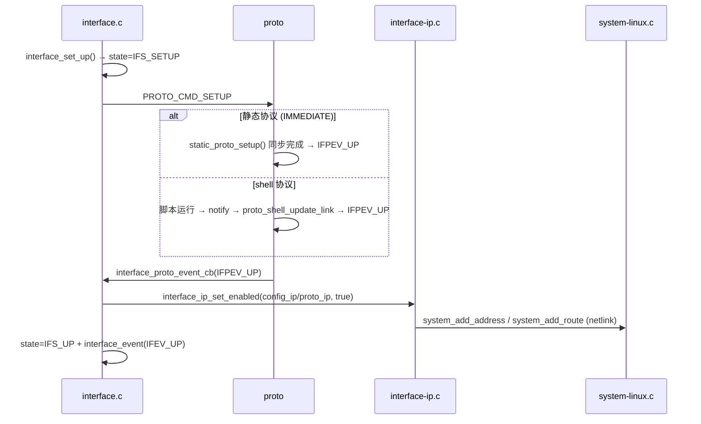
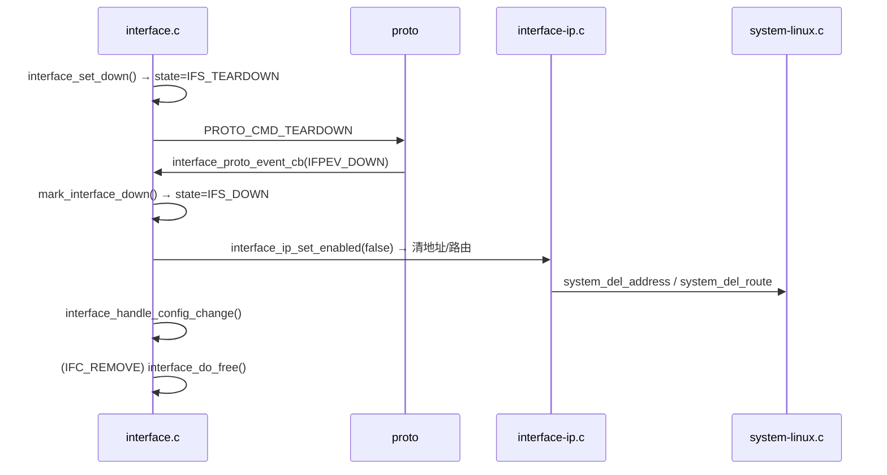
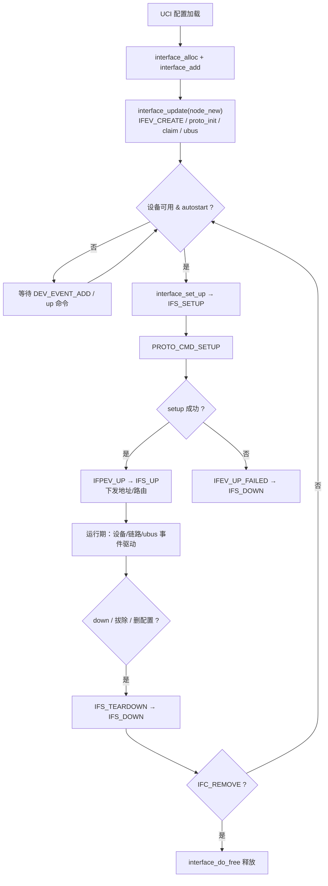

# netifd 接口生命周期深度解析：创建 / 运行 / 结束

> 本文档基于 netifd 源码逐行核对编写（read-only 分析，不修改任何源码）。
> 源码根目录：`netifd/`，所有 `文件:行号` 引用均以该目录下实际代码为准。
> 配套阅读：《1.netifd.md》（netifd 总体架构）、《4.param_defaultroute.md》（路由参数解析）。

---

## 一、概述

### 1.1 interface 在 netifd 中的角色

netifd（Network Interface Daemon）是 OpenWrt 的网络接口守护进程。它把 UCI 配置文件
（`/etc/config/network`）里的一段 `config interface` 翻译成内核里真实存在的网络接口，
并负责其地址、路由、DNS 的下发与回收。这个翻译过程的核心对象就是 **interface**（接口实例），
定义于 `interface.h:104-178` 的 `struct interface`。

interface 本身不直接操作内核，它是一张「调度表」，把四类子系统粘合在一起：

| 子系统 | 代表文件 | 职责 |
|--------|---------|------|
| 配置层 | `config.c` | 读 UCI，转成 blobmsg，创建/更新/删除接口 |
| 接口管理层 | `interface.c` + `proto.c` | 接口状态机、协议绑定、生命周期管理 |
| 协议实现层 | `proto-static.c` / `proto-shell.c` | 具体协议（static 同步 / dhcp、pppoe 等 shell 异步） |
| 设备系统层 | `device.c` + `system-linux.c` | 物理/虚拟设备事件、netlink 下发地址路由 |
| RPC 观测层 | `ubus.c` | 把接口对象暴露给外部（`ubus call network.interface.wan ...`） |

interface 的生命周期可以概括为三句话：

1. **创建**：UCI 解析后分配 `struct interface`，注册到全局 vlist 树，等待设备就绪。
2. **运行**：协议被触发 setup，成功后进入 `IFS_UP`，期间所有设备/链路事件驱动状态微调。
3. **结束**：主动 down、设备拔出、或配置被删除，最终回到 `IFS_DOWN` 或释放内存。

### 1.2 双状态机：interface_state 与 interface_config_state

一个接口实例同时受两台状态机管理，这是理解 netifd 的关键。

**主状态机 `interface_state`（interface.h:35-40），描述接口当前的「电信号」状态：**

```c
// interface.h:35-40
enum interface_state {
	IFS_SETUP,      // 正在执行协议 setup，等待结果
	IFS_UP,         // 接口已就绪，地址/路由已下发
	IFS_TEARDOWN,   // 正在执行协议 teardown，等待结果
	IFS_DOWN,       // 接口完全关闭，无任何资源占用
};
```

**配置状态机 `interface_config_state`（interface.h:42-46），描述接口在 UCI 配置层面「欠了什么账」：**

```c
// interface.h:42-46
enum interface_config_state {
	IFC_NORMAL,     // 无待办，配置与实例一致
	IFC_RELOAD,     // 配置变化，待整体重建协议状态
	IFC_REMOVE      // 配置被删除，待释放实例
};
```

两台状态机的配合模式：**config_state 记录「该做什么」，state 记录「做到哪一步」**。
接口每到达 `IFS_DOWN`，就会去结算 config_state 欠的账（见第 6、7 节 `interface_handle_config_change`）。

另外还有一张事件枚举 `interface_event`（interface.h:23-33），是接口向外界（依赖它的
`interface_user` 用户）广播的通知：

```c
// interface.h:23-33
enum interface_event {
	IFEV_DOWN,       // 接口下线
	IFEV_UP,         // 接口上线
	IFEV_UP_FAILED,  // setup 失败
	IFEV_UPDATE,     // 配置更新（运行时 IP 变化）
	IFEV_FREE,       // 即将释放
	IFEV_RELOAD,     // 即将整体重建
	IFEV_LINK_UP,    // 强制链路型协议检测到链路恢复
	IFEV_CREATE,     // 新建接口（此时协议尚未挂载）
};
```

事件是驱动整个生命周期模型的引擎：netifd 不是轮询，而是靠 `uloop` 事件循环 +
设备事件回调 + 协议 ubus 回调三路信号推进状态机（详见第 5 节）。

### 1.3 struct interface 关键字段

`struct interface`（interface.h:104-178）字段很多，这里按生命周期视角分五组：

| 分组 | 字段 | 行号 | 含义 |
|------|------|------|------|
| 身份 | `name` / `device` / `zone` / `parent_ifname` | 109-111, 136 | 接口名、绑定的设备名、防火墙域、别名父接口名 |
| 状态 | `state` / `config_state` / `available` / `autostart` / `enabled` / `link_state` / `dynamic` | 117-131 | 主状态、配置状态、设备是否在位、是否自动拉起、是否使能、链路状态、是否动态创建 |
| 依赖 | `users` / `parent_iface` / `main_dev` / `ext_dev` / `l3_dev` | 133-144 | 用户列表、别名父接口句柄、主设备、扩展设备、三层通信设备 |
| 协议 | `proto_handler` / `proto` / `proto_ip` / `config_ip` | 149-153 | 协议处理器、协议状态、协议下发的 IP 设置、UCI 静态 IP 设置 |
| 资源 | `config` / `data` / `errors` / `remove_timer` / `ubus` | 146, 171-177 | 原始配置 blob、协议附加数据、错误列表、删除延时定时器、ubus 对象 |

其中 `main_dev`（interface.h:140）是接口绑定的主设备，`l3_dev`（interface.h:144）是三层流量
真正流经的设备，两者通常相同，但 shell 协议可能用虚拟设备（如 tunnel）做 l3_dev。

### 1.4 图1 组件图



### 1.5 图2 主状态机图



注意图 2 中有两条「自动修复」的捷径：

- `IFS_SETUP → IFS_DOWN` 走的是 `mark_interface_down`（interface.c:288）里的
  `IFEV_UP_FAILED` 分支（interface.c:302-303），失败后如果 `autostart` 还开着，
  `interface_check_state` 会在下一轮事件里把它重新拉起来（interface.c:385-386）。
- `IFS_UP → IFS_TEARDOWN` 除了主动 down，还包括 `interface_check_state` 检测到
  `enabled=false` 或链路丢失时自动触发的 teardown（interface.c:373-379）。

---

## 二、进程启动与配置加载

### 2.1 main() 初始化顺序

netifd 的入口在 `main.c:279`。所有初始化是严格有序的，顺序本身就有依赖关系：

```c
// main.c:279-349（节选）
int main(int argc, char **argv)
{
	...
	netifd_setup_signals();                    // 324 行：安装信号处理器
	if (netifd_ubus_init(socket) < 0) { ... } // 325 行：连接 ubus 总线
	proto_shell_init();                        // 330 行：注册 shell 协议族（脚本路径、任务表）
	extdev_init();                             // 331 行：扩展设备（external device）初始化
	wireless_init();                           // 332 行：无线子系统初始化
	if (system_init()) { ... }                 // 334 行：系统层初始化（netlink socket、proc 路径）
	config_init_all();                         // 339 行：加载 UCI 配置，创建全部接口
	uloop_run();                               // 341 行：进入事件循环（此后不再返回）
	...
}
```

关键点：

| 行号 | 调用 | 为什么先做 |
|------|------|-----------|
| 324 | `netifd_setup_signals()` | 必须最先安装信号处理器，避免初始化中途被 SIGTERM 打断留下半成品 |
| 325 | `netifd_ubus_init()` | ubus 连接失败直接退出，后续的脚本回调（proto_shell）都依赖 ubus 通知 |
| 330 | `proto_shell_init()` | 先注册协议族，后面 `config_parse_interface` 里才能按名字找到协议处理器 |
| 334 | `system_init()` | 打开 netlink 套接字、确定 `/proc` 挂载路径，设备/路由下发依赖它 |
| 339 | `config_init_all()` | 一切就绪后才读配置，创建接口 |
| 341 | `uloop_run()` | 配置加载完，进入事件驱动主循环，永驻 |

### 2.2 config_init_all() 的加载顺序

配置加载的骨架在 `config.c:743-790`。它不只是「读配置」，而是一个分阶段、分类型的装配过程：

```c
// config.c:744-789（节选）
int
config_init_all(void)
{
	...
	uci_network = config_init_package("network");   // 749 行：加载 /etc/config/network
	uci_wireless = config_init_package("wireless"); // 757 行：加载 /etc/config/wireless
	config_init_board();                            // 765 行：读 board.json（板级硬件信息）
	vlist_update(&interfaces);                      // 767 行：打开接口 vlist 的「变更收集期」
	config_init = true;                             // 768 行：进入配置初始化阶段

	device_reset_config();                          // 770 行：清空设备层旧配置标记
	config_init_devices(true);                      // 771 行：第一遍，创建设备定义（bridge 等复合设备）
	config_init_vlans();                            // 772 行：创建 VLAN 设备
	config_init_devices(false);                     // 773 行：第二遍，处理其余设备
	config_init_interfaces();                       // 774 行：创建接口（interface_alloc + interface_add）
	config_init_ip();                               // 775 行：解析 config route / route6 / neighbor
	config_init_rules();                            // 776 行：解析 iprule（策略路由规则）
	config_init_globals();                          // 777 行：解析 globals（主路由表号、源路由等）
	config_init_wireless();                         // 778 行：处理无线配置

	config_init = false;                            // 780 行：退出配置初始化阶段
	device_reset_old();                             // 782 行：清理设备层「上一次遗留」状态
	device_init_pending();                          // 783 行：创建设备层积压的待建设备
	vlist_flush(&interfaces);                       // 784 行：结算接口 vlist 变更 → interface_update 回调
	interface_refresh_assignments(false);           // 785 行：刷新 IPv6 前缀委派
	interface_start_pending();                      // 786 行：拉起所有 autostart 接口
	wireless_start_pending(0);                      // 787 行：拉起无线
	...
}
```

**两个容易被忽略的关键点：**

1. **接口的「创建」发生在 `vlist_flush(&interfaces)`（784 行），而不是 `config_init_interfaces()`（774 行）。**
   `config_init_interfaces` 只是 `interface_alloc` + `interface_add`（即 `vlist_add`），把节点挂进
   vlist 的变更列表；真正的 `interface_update` 回调（interface.c:1394）在 `vlist_flush` 时统一触发。
   这是 libubox vlist 的经典用法：先批量收集变更，再一次结算，避免逐个增量处理。
2. **`config_init` 标志（768 行置位、780 行复位）**：它让 `interface_check_state` 里的
   autostart 判断（interface.c:385 `!config_init`）在初始化期间静默，防止在配置还没加载完时
   就提前拉起接口。

### 2.3 interface_start_pending()

配置全部加载完后，第 786 行调用 `interface_start_pending()`（interface.c:1177-1185）：
遍历全局接口树，把每个 `autostart=true` 的接口送去 `interface_set_up`：

```c
// interface.c:1177-1185
void
interface_start_pending(void)
{
	struct interface *iface;

	vlist_for_each_element(&interfaces, iface, node) {
		if (iface->autostart)
			interface_set_up(iface);
	}
}
```

`interface_set_up` 并不保证立即成功：如果设备还没就绪（`available=false`），它会记一个
`NO_DEVICE` 错误（interface.c:1147-1148）然后返回；等设备事件 `DEV_EVENT_ADD` 到来时再补拉
（见第 3 节）。**autostart 是「意图」，不是「承诺」，这是理解接口启动时机的基础。**

### 2.4 为什么设备必须先于接口加载

对比 771-773 行（设备）与 774 行（接口），顺序是刻意设计的，原因有三：

1. **接口创建时就要绑定设备。** `interface_claim_device`（interface.c:640）里用
   `device_get(iface->device, true)`（interface.c:654）按名查找设备；设备树必须已就绪，
   才能拿到 `struct device` 并注册 `device_user` 回调。
2. **事件依赖。** 接口挂上 `main_dev` 后，靠设备层的 `DEV_EVENT_ADD` 事件得知设备可用
   （interface.c:435-436）。若设备还没创建，接口连事件都收不到，`available` 永远为 false，
   autostart 永远无法触发。
3. **桥/VLAN 的复合关系。** `config_init_devices(true)` 先建 bridge、VLAN 这类「组合设备」
   （config.c:771），`config_init_vlans`（772）再挂 VLAN 成员，最后接口（774）才能引用它们。
   如果顺序颠倒，接口引用的设备名会在 `device_get` 里查不到。

---

## 三、接口创建

### 3.1 入口：config_parse_interface

每个 UCI `interface` 段走到 `config_parse_interface`（config.c:159-215）。它做四件事：

1. 检查 `disabled '1'`，禁用段直接跳过（config.c:167-169）。
2. 如果是 bridge 类型，先解析并创建设备（config.c:179-184）。
3. 把 UCI 段转成 blobmsg，然后 `interface_alloc`（config.c:188）。
4. 按 alias 与否分别走 `interface_add_alias` 或 `interface_add`（config.c:202-208）。

```c
// config.c:186-208（节选）
	uci_to_blob(&b, s, &interface_attr_list);       // 186：接口通用属性 → blobmsg

	iface = interface_alloc(s->e.name, b.head, false);  // 188：分配接口实例
	if (!iface)
		return;

	if (iface->proto_handler && iface->proto_handler->config_params)
		uci_to_blob(&b, s, iface->proto_handler->config_params); // 192-193：协议专属参数也转 blobmsg

	...
	if (alias) {
		if (!interface_add_alias(iface, config))      // 203：别名挂载
			goto error_free_config;
	} else {
		if (!interface_add(iface, config))            // 206：普通接口挂载
			goto error_free_config;
	}
```

### 3.2 interface_alloc：实例的诞生

`interface_alloc`（interface.c:813-943）是接口对象「出生」的地方，按顺序完成分配、初始化、属性解析：

```c
// interface.c:814-853（节选）
struct interface *
interface_alloc(const char *name, struct blob_attr *config, bool dynamic)
{
	...
	iface = calloc_a(sizeof(*iface), &iface_name, strlen(name) + 1); // 823：一次分配结构体+名字
	iface->name = strcpy(iface_name, name);                          // 824
	INIT_LIST_HEAD(&iface->errors);                                  // 825
	INIT_LIST_HEAD(&iface->users);                                   // 826：用户链表（依赖者）
	...
	interface_ip_init(iface);                                        // 829：初始化 proto_ip/config_ip 的 vlist 树
	avl_init(&iface->data, avl_strcmp, false, NULL);                 // 830
	iface->config_ip.enabled = false;                                // 831

	iface->main_dev.cb = interface_main_dev_cb;                      // 833：主设备事件回调
	iface->l3_dev.cb = interface_l3_dev_cb;                          // 834：三层设备事件回调
	iface->ext_dev.cb = interface_ext_dev_cb;                        // 835：扩展设备事件回调

	blobmsg_parse(iface_attrs, IFACE_ATTR_MAX, tb,                   // 837：解析 UCI 属性表
		      blob_data(config), blob_len(config));
	...
	proto_attach_interface(iface, proto_name);                       // 847：按名绑定协议处理器
	...
	iface->autostart = blobmsg_get_bool_default(tb[IFACE_ATTR_AUTO], true); // 851
	...
	iface->dynamic = dynamic;                                        // 853：是否为动态接口
```

逐行注释：

| 行号 | 代码 | 含义 |
|------|------|------|
| 823 | `calloc_a(sizeof(*iface), ...)` | 一次连续分配结构体与名字缓冲区，零初始化保证所有指针/标志安全 |
| 829 | `interface_ip_init(iface)` | 初始化 `proto_ip`、`config_ip` 两套 IP 设置的 vlist 树，以及 host_routes 等 |
| 833-835 | 三个 `device_user.cb` | 注册设备事件回调，之后设备层的 up/down/link 事件都会进到 interface.c |
| 837 | `blobmsg_parse(...)` | 把 blobmsg 配置按 `iface_attrs` 策略表拆进 `tb[]` |
| 847 | `proto_attach_interface(iface, proto_name)` | 按 `proto` 属性找协议处理器；找不到则挂 `no_proto` 并记 `INVALID_PROTO` 错误 |

**注意此时接口还没有协议状态（`proto` 还是 NULL）**，`proto` 要等到 vlist 回调里
`proto_init_interface` 才挂上（见 3.4）。这正对应 `IFEV_CREATE` 注释里写的
「this is before proto handlers has been attached」（interface.h:31）。

### 3.3 interface_add：挂入全局树

`interface_add`（interface.c:991）转调 `__interface_add`（interface.c:945-988）：

```c
// interface.c:945-988（节选）
static bool __interface_add(struct interface *iface, struct blob_attr *config, bool alias)
{
	...
	if (alias) {
		if ((cur = tb[IFACE_ATTR_INTERFACE]))           // 955：alias 必须有 parent interface
			iface->parent_ifname = blobmsg_data(cur);
		if (!iface->parent_ifname)
			return false;
	} else {
		cur = tb[IFACE_ATTR_DEVICE];                    // 961：普通接口取 device/ifname
		if (!cur)
			cur = tb[IFACE_ATTR_IFNAME];
		if (cur)
			iface->device = blobmsg_data(cur);
	}
	...
	iface->config = config;                             // 975：持有配置 blob（内存归接口所有）
	vlist_add(&interfaces, &iface->node, iface->name);  // 976：挂入全局接口 vlist
	...
}
```

`vlist_add` 只是把节点放进 vlist 的 pending 列表，真正的 `interface_update` 回调在
`vlist_flush`（config.c:784）时触发。

### 3.4 vlist 回调：interface_update 的 node_new 分支

`interface_update`（interface.c:1393-1413）是接口树的统一结算回调，三个分支对应三种命运：

```c
// interface.c:1394-1413
static void
interface_update(struct vlist_tree *tree, struct vlist_node *node_new,
		 struct vlist_node *node_old)
{
	struct interface *if_old = container_of(node_old, struct interface, node);
	struct interface *if_new = container_of(node_new, struct interface, node);

	if (node_old && node_new) {                       // 更新：新旧同 key
		D(INTERFACE, "Update interface '%s'\n", if_new->name);
		interface_change_config(if_old, if_new);      // 1402：逐字段 diff，决定 reload/轻量重载
	} else if (node_old) {                             // 删除：只有旧节点
		D(INTERFACE, "Remove interface '%s'\n", if_old->name);
		set_config_state(if_old, IFC_REMOVE);         // 1405：打「待删除」标记
	} else if (node_new) {                             // 创建：只有新节点
		D(INTERFACE, "Create interface '%s'\n", if_new->name);
		interface_event(if_new, IFEV_CREATE);         // 1408：广播创建事件
		proto_init_interface(if_new, if_new->config); // 1409：挂协议状态（proto->attach）
		interface_claim_device(if_new);               // 1410：绑定主设备
		netifd_ubus_add_interface(if_new);            // 1411：注册 ubus 对象
	}
}
```

node_new 分支的四步正是「创建」的全部动作：

| 行号 | 调用 | 作用 |
|------|------|------|
| 1408 | `interface_event(if_new, IFEV_CREATE)` | 广播新接口诞生（此时依赖方还不知道它的协议） |
| 1409 | `proto_init_interface(if_new, if_new->config)` | 调 `proto->attach()`（proto.c:617-633），产出 `struct interface_proto_state`，经 `interface_set_proto_state`（interface.c:798）挂上并**把 state 复位为 IFS_DOWN**（interface.c:804） |
| 1410 | `interface_claim_device(if_new)` | 按 `iface->device` 找设备、设 `main_dev`（interface.c:640-665）；alias 接口则挂 `parent_iface` 用户（interface.c:648-651） |
| 1411 | `netifd_ubus_add_interface(if_new)` | 注册 ubus 对象，外部从此可 `ubus call network.interface.<name> ...` |

`proto_init_interface`（proto.c:617-633）内部值得展开：它调用 `proto->attach()` 让协议层
分配自己的状态（static 协议在 `static_attach`，proto-static.c:76-99；shell 协议在
`shell_attach`），然后把 `state->proto_event = interface_proto_event_cb` 回填
（interface.c:809）。**这条 `proto_event` 回调链是整个生命周期的中枢**：协议层一切结果都通过
它回到 interface.c。

### 3.5 interface_claim_device：绑定设备与别名

`interface_claim_device`（interface.c:640-665）处理三类「设备来源」：

```c
// interface.c:640-665（节选）
static void
interface_claim_device(struct interface *iface)
{
	...
	if (iface->parent_iface.iface)
		interface_remove_user(&iface->parent_iface);   // 645-646：先解除旧父接口绑定

	if (iface->parent_ifname) {                        // 648：别名接口
		parent = vlist_find(&interfaces, iface->parent_ifname, parent, node);
		iface->parent_iface.cb = interface_alias_cb;   // 650：注册别名回调
		interface_add_user(&iface->parent_iface, parent); // 651：挂到父接口的用户链上
	} else if (iface->device &&
		!(iface->proto_handler->flags & PROTO_FLAG_NODEV)) { // 652-653：普通设备接口
		dev = device_get(iface->device, true);         // 654：按名取设备（不存在则标记待建）
		interface_set_device_config(iface, dev);       // 655：设备上可能带接口配置
	} else {
		dev = iface->ext_dev.dev;                      // 657：无设备协议（如某些虚拟接口）用 ext_dev
	}

	if (dev)
		interface_set_main_dev(iface, dev);            // 660-661：设主设备并 device_add_user

	if (iface->proto_handler->flags & PROTO_FLAG_INIT_AVAILABLE)
		interface_set_available(iface, true);          // 663-664：no-device 协议直接标记可用
}
```

`interface_set_main_dev`（interface.c:1030-1051）是设备绑定的落点：调 `device_add_user` 挂上
事件回调，然后 `interface_set_l3_dev`（interface.c:1050）让三层设备跟随主设备。从这一刻起，
设备层的 up/down/link 事件就开始流进 `interface_main_dev_cb`（interface.c:429）。

### 3.6 设备就绪：DEV_EVENT_ADD → set_available(true)

设备对象真正创建完成后，设备层向接口广播 `DEV_EVENT_ADD`，进入 `interface_main_dev_cb`
（interface.c:429-460）：

```c
// interface.c:434-442（节选）
	switch (ev) {
	case DEV_EVENT_ADD:
		interface_set_available(iface, true);         // 435-436：设备在位
		break;
	case DEV_EVENT_REMOVE:
		interface_set_available(iface, false);        // 438-439：设备拔出
		if (dep->dev && dep->dev->external)
			interface_set_main_dev(iface, NULL);      // 440-441：外部设备直接解绑
		break;
	...
```

`interface_set_available`（interface.c:481-495）是「设备就绪」与「自动启动」之间的桥：

```c
// interface.c:482-495
void
interface_set_available(struct interface *iface, bool new_state)
{
	if (iface->available == new_state)
		return;

	D(INTERFACE, "Interface '%s', available=%d\n", iface->name, new_state);
	iface->available = new_state;

	if (new_state) {
		if (iface->autostart && !config_init)          // 490-492：设备就位且配置期已过
			interface_set_up(iface);                   // → 立即尝试拉起
	} else
		__interface_set_down(iface, true);             // 493-494：设备消失 → 强制下线
}
```

**创建阶段到此闭环**：`interface_alloc`（出生）→ `interface_add`（入树）→
`interface_update` node_new（挂协议/绑设备/注册 ubus）→ 设备就绪 `DEV_EVENT_ADD`
（set_available(true)）→ autostart 生效 `interface_set_up`（进入运行期）。整个链条如下：

### 3.7 图3 创建时序图



---

## 四、接口运行

### 4.1 interface_set_up：拉起的入口

`interface_set_up`（interface.c:1122-1152）是外部命令（ubus `up`、`interface_start_pending`、
`DEV_EVENT_ADD` 后的 autostart）共同到达的入口：

```c
// interface.c:1123-1152（节选）
void
interface_set_up(struct interface *iface)
{
	int ret;
	const char *error = NULL;

	iface->autostart = true;                         // 1128：up 命令也把 autostart 置位
	wireless_check_network_enabled();                // 1129

	if (iface->state != IFS_DOWN)
		return;                                      // 1131-1132：非 DOWN 状态直接忽略（幂等）

	interface_clear_errors(iface);
	if (iface->available) {                          // 1135：设备必须在位
		if (iface->main_dev.dev) {
			ret = device_claim(&iface->main_dev);    // 1137：先 claim 设备（独占）
			if (!ret)
				interface_check_state(iface);        // 1139：claim 成功 → 走状态机
			else
				error = "DEVICE_CLAIM_FAILED";
		} else {
			ret = __interface_set_up(iface);         // 1143：无主设备（no-device 协议）直接 setup
			if (ret)
				error = "SETUP_FAILED";
		}
	} else
		error = "NO_DEVICE";                          // 1148：设备不在位

	if (error)
		interface_add_error(iface, "interface", error, NULL, 0); // 1150-1151
}
```

注意它并不会直接置状态，而是走 `interface_check_state`（1139），由状态机自己决定是否进入
`IFS_SETUP`。这条「入口函数只设条件、状态机做决策」的惯例贯穿整个运行期。

### 4.2 __interface_set_up：进入 IFS_SETUP

```c
// interface.c:350-363
static int
__interface_set_up(struct interface *iface)
{
	int ret;

	netifd_log_message(L_NOTICE, "Interface '%s' is setting up now\n", iface->name);

	iface->state = IFS_SETUP;                                    // 357：主状态 → SETUP
	ret = interface_proto_event(iface->proto, PROTO_CMD_SETUP, false); // 358：下发 setup 命令
	if (ret)
		mark_interface_down(iface);                              // 359-360：同步失败立刻回落

	return ret;
}
```

`PROTO_CMD_SETUP` 沿 `interface_proto_event`（proto.c:655-683）进入协议层。这里出现
**静态协议与 shell 协议的第一次分叉**。

### 4.3 interface_proto_event：同步 vs 异步

```c
// proto.c:656-683
int
interface_proto_event(struct interface_proto_state *proto,
		      enum interface_proto_cmd cmd, bool force)
{
	enum interface_proto_event ev;
	int ret;

	ret = proto->cb(proto, cmd, force);                          // 662：执行协议命令
	if (ret || !(proto->handler->flags & PROTO_FLAG_IMMEDIATE))   // 663：失败或非 IMMEDIATE
		goto out;                                                //     → 等异步通知

	switch(cmd) {                                                 // 666-678：IMMEDIATE 协议映射结果
	case PROTO_CMD_SETUP:
		ev = IFPEV_UP;
		break;
	case PROTO_CMD_TEARDOWN:
		ev = IFPEV_DOWN;
		break;
	case PROTO_CMD_RENEW:
		ev = IFPEV_RENEW;
		break;
	default:
		return -EINVAL;
	}
	proto->proto_event(proto, ev);                                // 679：同步回填事件
out:
	return ret;
}
```

**静态协议（同步路径）**：`static_proto` 声明了 `PROTO_FLAG_IMMEDIATE`（proto-static.c:103），
它的 `static_handler`（proto-static.c:43-64）在 `PROTO_CMD_SETUP` 时同步执行
`static_proto_setup`（proto-static.c:33-41），把静态地址/路由直接装进 `proto_ip` vlist，
返回 0。于是 663 行的 `!(flags & IMMEDIATE)` 为假，走 679 行同步发出 `IFPEV_UP`。
**整个 setup 在一帧内完成，没有异步等待。**

**shell 协议（异步路径）**：dhcp、pppoe、4G/5G 拨号等协议不带 `PROTO_FLAG_IMMEDIATE`，
`proto->cb()` 只是**启动协议脚本**（`proto_shell_run_command` 之类的任务），立即返回。
真正的结果通过脚本回调 `ubus call network.interface.<iface> notify` 异步送回
（`proto_shell_notify`，proto-shell.c:781-812），action=0 进入 `proto_shell_update_link`
（proto-shell.c:503-593）：

```c
// proto-shell.c:536-593（节选）
	if (iface->state != IFS_UP || !iface->l3_dev.dev)
		keep = false;                                        // 536-537：首次上线不保留旧 IP

	if (!keep) {
		dev = iface->main_dev.dev;                           // 540
		...
		interface_set_l3_dev(iface, dev);                    // 553：设置三层设备
		if (device_claim(&iface->l3_dev) < 0) ...            // 554
		device_set_present(dev, true);                       // 557
	}

	interface_update_start(iface, keep);                     // 560：开始更新 IP（可保留旧数据）
	proto_apply_ip_settings(iface, data, addr_ext);          // 562：应用协议返回的地址
	if ((cur = tb[NOTIFY_ROUTES]) != NULL)
		proto_shell_parse_route_list(state->proto.iface, cur, false); // 564-565：IPv4 路由
	if ((cur = tb[NOTIFY_ROUTES6]) != NULL)
		proto_shell_parse_route_list(state->proto.iface, cur, true);  // 567-568：IPv6 路由
	...
	interface_update_complete(state->proto.iface);           // 585：结算 vlist 变更（下发/回收地址路由）

	if ((state->sm != S_SETUP_ABORT) && (state->sm != S_TEARDOWN)) {
		state->proto.proto_event(&state->proto, IFPEV_UP);   // 588：异步回填 IFPEV_UP
		state->sm = S_IDLE;                                  // 589
	}
	...
```

两条路径殊途同归：**最终都调用 `state->proto.proto_event(..., IFPEV_UP)`，即
`interface_proto_event_cb`（interface.c:809 绑定的回调）**。区别只在于是同步调用（static）
还是脚本通知驱动（shell）。

### 4.4 interface_proto_event_cb：IFPEV_UP 的落地

`interface_proto_event_cb`（interface.c:746-796）收到 `IFPEV_UP` 后完成「上线」动作：

```c
// interface.c:751-769（节选）
	switch (ev) {
	case IFPEV_UP:
		if (iface->state != IFS_SETUP) {                   // 753：不在 SETUP 态？
			if (iface->state == IFS_UP && iface->updated)
				interface_event(iface, IFEV_UPDATE);       // 755：运行期热更新 → 广播 UPDATE
			return;
		}

		if (!iface->l3_dev.dev)
			interface_set_l3_dev(iface, iface->main_dev.dev); // 759-760：兜底设三层设备

		interface_ip_set_enabled(&iface->config_ip, true); // 762：启用 UCI 静态地址/路由
		interface_ip_set_enabled(&iface->proto_ip, true);  // 763：启用协议下发地址/路由
		system_flush_routes();                             // 764：刷新内核路由缓存
		iface->state = IFS_UP;                             // 765：主状态 → UP
		iface->start_time = system_get_rtime();            // 766：记录上线时间
		interface_event(iface, IFEV_UP);                   // 767：广播上线事件（别名/依赖方）
		netifd_log_message(L_NOTICE, "Interface '%s' is now up\n", iface->name); // 768
		break;
```

`interface_ip_set_enabled`（interface-ip.c）内部会把 `proto_ip` / `config_ip` 两个 vlist 里的
地址与路由逐条经 `system_add_address` / `system_add_route` 通过 netlink 下进内核。
`system_flush_routes`（system-linux.c:3078）在这一刻清掉内核路由缓存，让新路由立即生效
（详见第 8 节）。

### 4.5 图4 上线时序图



---

## 五、运行期事件驱动

接口进入 `IFS_UP` 后并非静止，所有运行期变化都通过「事件 → 回调 → `interface_check_state`」
的收敛模型推进。本节介绍状态机核心及全部事件入口。

### 5.1 interface_check_state：状态机核心

`interface_check_state`（interface.c:365-391）是唯一的「状态决策点」，所有条件变化最终都汇到这里：

```c
// interface.c:366-391
static void
interface_check_state(struct interface *iface)
{
	bool link_state = iface->link_state || interface_force_link(iface);   // 368：链路有效？

	switch (iface->state) {
	case IFS_UP:
	case IFS_SETUP:
		if (!iface->enabled || !link_state) {               // 373：被禁用或链路丢
			iface->state = IFS_TEARDOWN;                   // 374：转 teardown
			if (iface->dynamic)
				__set_config_state(iface, IFC_REMOVE);     // 375-376：动态接口顺带标记删除

			interface_proto_event(iface->proto, PROTO_CMD_TEARDOWN, false); // 378
		}
		break;
	case IFS_DOWN:
		if (!iface->available)
			return;                                          // 382：设备不在位，无操作

		if (iface->autostart && iface->enabled && link_state && !config_init)
			__interface_set_up(iface);                      // 385-386：条件齐 → 重新拉起
		break;
	default:
		break;
	}
}
```

两个分支分别回答两个问题：

- **正在运行（UP/SETUP）**：`enabled` 被关或链路丢失 → 立即 teardown。
- **已关闭（DOWN）**：设备在位 + autostart + enabled + 链路好 + 不在配置初始化期 → 重新拉起。

这个函数被 `interface_set_enabled`（401）、`interface_set_link_state`（412）、
`interface_set_up`（1139）等反复调用，是「状态汇流」的枢纽。

### 5.2 interface_set_enabled：enabled 翻转

```c
// interface.c:394-402
static void
interface_set_enabled(struct interface *iface, bool new_state)
{
	if (iface->enabled == new_state)
		return;

	netifd_log_message(L_NOTICE, "Interface '%s' is %s\n", iface->name, new_state ? "enabled" : "disabled");
	iface->enabled = new_state;
	interface_check_state(iface);                         // 401：立即结算
}
```

`enabled` 由设备层的 `DEV_EVENT_UP` / `DEV_EVENT_DOWN` 驱动（interface.c:443-448），
语义是「物理设备是否在运行」。对应 ubus 命令 `network.interface.<name> enable/disable`。

### 5.3 interface_set_link_state：链路状态翻转

```c
// interface.c:405-419
static void
interface_set_link_state(struct interface *iface, bool new_state)
{
	if (iface->link_state == new_state)
		return;

	netifd_log_message(L_NOTICE, "Interface '%s' has link connectivity %s\n",
			iface->name, new_state ? "" : "loss");
	iface->link_state = new_state;
	interface_check_state(iface);                         // 412：立即结算

	if (new_state && interface_force_link(iface) &&
	    iface->state == IFS_UP && !iface->link_up_event) {
		interface_event(iface, IFEV_LINK_UP);             // 416：强制链路型协议补发 LINK_UP
		iface->link_up_event = true;
	}
}
```

链路状态由 `DEV_EVENT_LINK_UP` / `DEV_EVENT_LINK_DOWN` / `DEV_EVENT_AUTH_UP` 驱动
（interface.c:449-452）。`interface_force_link` 对应 UCI `force_link '1'`，强制链路型协议
（如静态）在链路恢复时补发 `IFEV_LINK_UP`，让依赖方能感知。

### 5.4 interface_main_dev_cb：设备事件的总入口

```c
// interface.c:429-460
static void
interface_main_dev_cb(struct device_user *dep, enum device_event ev)
{
	struct interface *iface;

	iface = container_of(dep, struct interface, main_dev);
	switch (ev) {
	case DEV_EVENT_ADD:                                    // 435
		interface_set_available(iface, true);             // 436：设备在位
		break;
	case DEV_EVENT_REMOVE:                                 // 438
		interface_set_available(iface, false);            // 439：设备消失（强制下线，见第 6 节）
		...
		break;
	case DEV_EVENT_UP:                                     // 443
		interface_set_enabled(iface, true);               // 444：设备运行 → enabled
		break;
	case DEV_EVENT_DOWN:                                   // 446
		interface_set_enabled(iface, false);              // 447：设备停止 → 禁用
		break;
	case DEV_EVENT_AUTH_UP:                                // 449
	case DEV_EVENT_LINK_UP:                                // 450
	case DEV_EVENT_LINK_DOWN:                              // 451
		interface_set_link_state(iface, device_link_active(dep->dev)); // 452
		break;
	case DEV_EVENT_TOPO_CHANGE:                            // 454
		interface_proto_event(iface->proto, PROTO_CMD_RENEW, false);  // 455：拓扑变化 → renew
		return;
	default:
		break;
	}
}
```

**事件收敛关系**：设备事件分三类进入接口层，最终都汇到 `interface_check_state`：

| 设备事件 | 接口层动作 | 影响的状态条件 |
|---------|-----------|---------------|
| `DEV_EVENT_ADD` / `REMOVE` | `interface_set_available` | `available` |
| `DEV_EVENT_UP` / `DOWN` | `interface_set_enabled` | `enabled` |
| `DEV_EVENT_LINK_UP` / `LINK_DOWN` / `AUTH_UP` | `interface_set_link_state` | `link_state` |
| `DEV_EVENT_TOPO_CHANGE` | `PROTO_CMD_RENEW` | 协议重协商（不经过状态机） |

### 5.5 interface_l3_dev_cb：三层设备的兜底监控

```c
// interface.c:463-479
static void
interface_l3_dev_cb(struct device_user *dep, enum device_event ev)
{
	struct interface *iface;

	iface = container_of(dep, struct interface, l3_dev);
	if (iface->l3_dev.dev == iface->main_dev.dev)
		return;                                        // 468-469：与主设备相同则冗余，跳过

	switch (ev) {
	case DEV_EVENT_LINK_DOWN:
		if (iface->proto_handler->flags & PROTO_FLAG_TEARDOWN_ON_L3_LINK_DOWN)
			interface_proto_event(iface->proto, PROTO_CMD_TEARDOWN, false); // 473-474
		break;
	default:
		break;
	}
}
```

当 `l3_dev` 与 `main_dev` 不同（shell 协议动态换设备、tunnel 等）时，三层设备链路丢失
且协议声明 `PROTO_FLAG_TEARDOWN_ON_L3_LINK_DOWN`，接口才被 teardown。绝大多数场景下
l3_dev 就是 main_dev，此回调直接短路返回。

---

## 六、接口结束

接口结束有三条路径，最终都汇到 `IFPEV_DOWN → mark_interface_down → IFS_DOWN`，
其中一部分继续走到 `interface_do_free` 释放内存。

### 6.1 路径 (a)：主动 down

ubus 命令 `network.interface.<name> down` 调用 `interface_set_down`（interface.c:1154-1165）：

```c
// interface.c:1155-1165
void
interface_set_down(struct interface *iface)
{
	if (!iface) {
		vlist_for_each_element(&interfaces, iface, node)
			__interface_set_down(iface, false);          // 1159：空参数 = 全部下线
	} else {
		iface->autostart = false;                        // 1161：关闭自动拉起
		wireless_check_network_enabled();
		__interface_set_down(iface, false);              // 1163：非 force 下线
	}
}
```

核心动作在 `__interface_set_down`（interface.c:321-348）：

```c
// interface.c:322-348
static void
__interface_set_down(struct interface *iface, bool force)
{
	enum interface_state state = iface->state;
	switch (state) {
	case IFS_UP:
	case IFS_SETUP:
		iface->state = IFS_TEARDOWN;                     // 328：主状态 → TEARDOWN
		if (iface->dynamic)
			__set_config_state(iface, IFC_REMOVE);       // 329-330：动态接口 → 打删除标记

		if (state == IFS_UP)
			interface_event(iface, IFEV_DOWN);           // 332-333：广播下线事件

		interface_proto_event(iface->proto, PROTO_CMD_TEARDOWN, force); // 335：协议 teardown
		if (force)
			interface_flush_state(iface);                // 336-337：force 立即清状态
		break;

	case IFS_DOWN:
		if (iface->main_dev.dev)
			device_release(&iface->main_dev);            // 340-342：DOWN 态下强制释放主设备
		break;
	case IFS_TEARDOWN:
	default:
		break;
	}
}
```

**force 与正常下线的核心区别（第 2 条已验证发现）**：

| 模式 | 行为 | 触发场景 |
|------|------|---------|
| `force=false` | 只发 `PROTO_CMD_TEARDOWN`，等协议回 `IFPEV_DOWN` 再收尾 | ubus down、`DEV_EVENT_DOWN` 禁用 |
| `force=true` | 发 teardown 的**同时**立即 `interface_flush_state`（interface.c:280-285：释放 l3_dev + 清空协议数据），不等协议回音 | 设备拔出（`set_available(false)`）、配置删除 |

### 6.2 路径 (b)：设备移除 → 强制下线

设备拔出触发 `DEV_EVENT_REMOVE` → `interface_set_available(iface, false)`
（interface.c:438-439），而 `set_available` 的 false 分支（interface.c:493-494）就是
**第 3 条已验证发现**：

```c
// interface.c:493-494
	} else
		__interface_set_down(iface, true);        // force=true：设备都没了，不能再等协议回音
```

设备都不在了，等 shell 脚本回报 IFPEV_DOWN 毫无意义，所以直接 force 清空。

### 6.3 路径 (c)：配置被删除 → IFC_REMOVE

UCI 里删掉 `config interface` 段后重载，`vlist_flush` 触发 `interface_update` 的
node_old 分支（interface.c:1403-1405，**第 5 节中的已验证点**）：

```c
// interface.c:1403-1405
	} else if (node_old) {
		D(INTERFACE, "Remove interface '%s'\n", if_old->name);
		set_config_state(if_old, IFC_REMOVE);     // 打上「待删除」标记
	}
```

`set_config_state`（interface.c:1213-1221）的策略是：

```c
// interface.c:1214-1221
static void
set_config_state(struct interface *iface, enum interface_config_state s)
{
	__set_config_state(iface, s);
	if (iface->state == IFS_DOWN)
		interface_handle_config_change(iface);     // 1217-1218：已经 DOWN → 立即结算
	else
		__interface_set_down(iface, false);        // 1219-1220：还在运行 → 先下线再结算
}
```

即：如果接口正在运行，先正常 teardown（等协议回 `IFPEV_DOWN`），回音后 `mark_interface_down`
走完收尾，再由 `interface_handle_config_change` 结算 `IFC_REMOVE` 并释放。

### 6.4 收尾：IFPEV_DOWN → mark_interface_down

协议 teardown 完成后回 `IFPEV_DOWN`，进入 `interface_proto_event_cb` 的 down 分支
（interface.c:770-782）：

```c
// interface.c:770-782
	case IFPEV_DOWN:
		if (iface->state == IFS_DOWN)
			return;                                  // 771-772：已 down，幂等返回

		netifd_log_message(L_NOTICE, "Interface '%s' is now down\n", iface->name);
		mark_interface_down(iface);                  // 775：统一收尾
		interface_write_resolv_conf(iface->jail);    // 776：重写 resolv.conf
		if (iface->main_dev.dev)
			device_release(&iface->main_dev);        // 777-778：释放主设备
		if (iface->l3_dev.dev)
			device_remove_user(&iface->l3_dev);      // 779-780：摘除 l3 设备
		interface_handle_config_change(iface);       // 781：结算 config_state 欠账
		return;
```

`mark_interface_down`（interface.c:287-313）是真正的统一收尾函数：

```c
// interface.c:288-313
static void
mark_interface_down(struct interface *iface)
{
	enum interface_state state = iface->state;

	if (state == IFS_DOWN)
		return;                                      // 292-293：幂等

	iface->link_up_event = false;
	iface->state = IFS_DOWN;                         // 296：主状态 → DOWN
	switch (state) {
	case IFS_UP:
	case IFS_TEARDOWN:
		interface_event(iface, IFEV_DOWN);           // 298-300：广播下线
		break;
	case IFS_SETUP:
		interface_event(iface, IFEV_UP_FAILED);      // 302-303：setup 失败 → 广播失败（第 6 条已验证发现）
		break;
	default:
		break;
	}
	interface_ip_set_enabled(&iface->config_ip, false);  // 308：撤销 UCI 静态 IP
	interface_ip_set_enabled(&iface->proto_ip, false);   // 309：撤销协议 IP
	interface_ip_flush(&iface->proto_ip);                // 310：清空协议 IP 数据
	interface_flush_state(iface);                        // 311：释放 l3_dev + 协议数据
	system_flush_routes();                               // 312：刷新内核路由缓存（第 7 条已验证发现）
}
```

注意 302-303：**主状态在 `IFS_SETUP` 时被拖下线，广播的是 `IFEV_UP_FAILED` 而非 `IFEV_DOWN`**，
这是第 6 条已验证发现，也是状态机图上 `IFS_SETUP → IFS_DOWN` 那根箭头。

### 6.5 结算与释放：interface_handle_config_change → interface_do_free

`interface_handle_config_change`（interface.c:726-744）在接口到达 `IFS_DOWN` 后被调用，
结算 `config_state` 里欠的账：

```c
// interface.c:727-744
static void
interface_handle_config_change(struct interface *iface)
{
	enum interface_config_state state = iface->config_state;

	iface->config_state = IFC_NORMAL;                // 731：先清零
	switch(state) {
	case IFC_NORMAL:
		break;
	case IFC_RELOAD:
		interface_do_reload(iface);                  // 735-736：重载
		break;
	case IFC_REMOVE:
		interface_do_free(iface);                    // 738-739：释放
		return;
	}
	if (iface->autostart)
		interface_set_up(iface);                     // 742-743：正常下线后自动重启
}
```

`interface_do_free`（interface.c:699-715）是接口的「葬礼」：

```c
// interface.c:700-715
static void
interface_do_free(struct interface *iface)
{
	interface_event(iface, IFEV_FREE);               // 702：广播释放（别名在此摘用户）
	interface_cleanup(iface);                        // 703：清理用户/设备/协议状态
	free(iface->config);                             // 704：释放配置 blob
	netifd_ubus_remove_interface(iface);             // 705：摘除 ubus 对象
	avl_delete(&interfaces.avl, &iface->node.avl);   // 706：从全局接口树摘除
	if (iface->jail)          free(iface->jail);     // 707-708
	if (iface->jail_device)   free(iface->jail_device); // 709-710
	if (iface->host_device)   free(iface->host_device);  // 711-712
	free(iface);                                     // 714：释放结构体本身
}
```

### 6.6 图5 结束时序图



---

## 七、重载 vs 删除 vs 动态移除对比

接口结束章节出现了三种「不复原就继续跑」的情形，这里集中对比。

### 7.1 重载：interface_do_reload（不重建结构体）

`IFC_RELOAD` 的结算动作（interface.c:717-724）：

```c
// interface.c:718-724
static void
interface_do_reload(struct interface *iface)
{
	interface_event(iface, IFEV_RELOAD);             // 720：广播重载
	interface_cleanup_state(iface);                  // 721：清协议状态/设备绑定
	proto_init_interface(iface, iface->config);      // 722：重新 attach 协议
	interface_claim_device(iface);                   // 723：重新绑定设备
}
```

**重载保留 `struct interface` 本体**（`name`、`config`、`config_ip` 等都被继承），
只重建协议状态与设备绑定。适用于配置热变更但接口还在的场景（如换 `proto`、换 `device`）。

### 7.2 删除：interface_do_free（完整释放）

`IFC_REMOVE` 的结算动作见 6.5 节。**从 AVL 树摘除、ubus 对象注销、内存全部 free**，
接口彻底不复存在。

### 7.3 动态接口的自动移除

动态接口（`iface->dynamic=true`，由 ubus `network.interface` 动态 add 创建，而非 UCI）在
被 teardown 时自动带删除标记，见 `__interface_set_down`（interface.c:329-330）和
`interface_check_state`（interface.c:375-376）：

```c
// interface.c:329-330（__interface_set_down 内）
		if (iface->dynamic)
			__set_config_state(iface, IFC_REMOVE);
```

即：**动态接口没有「只想下线」这种状态，只要 teardown 就一定走向 `interface_do_free`**，
`IFC_RELOAD` 只对 UCI 配置变更有意义。

### 7.4 对比表

| 维度 | 重载 `IFC_RELOAD` | 删除 `IFC_REMOVE`（配置删除） | 动态移除（dynamic 接口） |
|------|-------------------|------------------------------|--------------------------|
| 触发 | 配置热变更（interface.c:1361-1366） | UCI 段删除 → node_old 分支（interface.c:1403-1405） | `__interface_set_down` 时 dynamic 标记（interface.c:329-330） |
| 结算函数 | `interface_do_reload`（718） | `interface_do_free`（700） | `interface_do_free`（700） |
| struct interface | **保留**，复用 name/config/config_ip | **完整释放** | **完整释放** |
| 协议状态 | `proto_init_interface` 重建（722） | `interface_cleanup` 内清理（696） | 同删除 |
| 设备绑定 | `interface_claim_device` 重绑（723） | 释放 | 释放 |
| ubus 对象 | 保留（同对象重注册） | `netifd_ubus_remove_interface`（705） | 同删除 |
| config_state 复位 | `interface_handle_config_change` 741 行 | 无（直接 return） | 无 |

**一句话**：重载是「脱胎换骨」，删除是「入土为安」，动态移除是删除的特例（连「下线的选项」都没有）。

---

## 八、小结与易混淆点清单

### 8.1 一句话总结

netifd 中一个接口实例的生命周期是：`config_parse_interface`（config.c:159）按 UCI 创建
`struct interface`，经 vlist 结算触发 `interface_update` 的 node_new 分支（挂协议、绑设备、
注册 ubus），设备 `DEV_EVENT_ADD` 后 autostart 生效；`interface_set_up` 走状态机进入
`IFS_SETUP`，协议 setup 成功（静态同步 / shell 异步）回 `IFPEV_UP` 进入 `IFS_UP`，期间所有
设备/链路/ubus 事件经 `interface_check_state` 收敛；下线时 `__interface_set_down` 置
`IFS_TEARDOWN`，协议回 `IFPEV_DOWN` 后 `mark_interface_down` 归位 `IFS_DOWN`，再由
`interface_handle_config_change` 按 `config_state` 决定重载（`interface_do_reload`）或释放
（`interface_do_free`）。

### 8.2 完整生命周期流程图



### 8.3 易混淆点清单

| # | 混淆点 | 真相 |
|---|--------|------|
| 1 | **两台状态机记混** | `interface_state`（4 态，interface.h:35-40）是主状态；`interface_config_state`（3 态，interface.h:42-46）是「欠账」。`IFS_DOWN` 是结算点，`IFC_RELOAD/IFC_REMOVE` 在到达 DOWN 后才兑现（interface.c:1217-1218） |
| 2 | **force 与正常 teardown 的区别** | `force=true` 立即 `interface_flush_state`（interface.c:336-337），不等协议回 `IFPEV_DOWN`；`force=false` 只发 `PROTO_CMD_TEARDOWN` 等回音。设备拔出（interface.c:494）与删配置必须 force，ubus down 不需要 |
| 3 | **动态接口「只删不降」** | `iface->dynamic` 一被 teardown 就自动打 `IFC_REMOVE`（interface.c:329-330、375-376），动态接口没有「下线保留」的中间态 |
| 4 | **创建是 vlist 批量结算的** | `interface_alloc` + `interface_add` 只入 pending 列表，`interface_update` node_new 分支（interface.c:1406-1412）在 `vlist_flush`（config.c:784）时才统一执行 |
| 5 | **IFEV_UP_FAILED 只在 SETUP 态发出** | `mark_interface_down` 的 switch（interface.c:297-307）：原状态是 `IFS_SETUP` 广播 `IFEV_UP_FAILED`（302-303），其它状态广播 `IFEV_DOWN`；别名/依赖方据此区分「没起来」和「掉线」 |
| 6 | **别名耦合** | `interface_alias_cb`（interface.c:598-622）：父接口 `IFEV_UP` → 别名 set_main_dev + set_available(true)（608-609）；`IFEV_DOWN/UP_FAILED` → 清除（612-614）；`IFEV_FREE` → 摘除用户（617）。别名通过 `parent_iface` 这个 `interface_user`（interface.h:136-137）挂在父接口用户链上，**父接口死了别名必死** |
| 7 | **system_flush_routes 的角色** | system-linux.c:3078 起，向 `/proc/sys/net/{ipv4,ipv6}/route/flush` 写 `"-1"`（system-linux.c:3090），清内核路由缓存。两个调用点：`mark_interface_down`（interface.c:312，下线收尾）和 `IFPEV_UP` 上线（interface.c:764），保证地址路由变化立即生效 |
| 8 | **IFPEV_UP 的双重语义** | `interface_proto_event_cb` 收到 UP 时若不在 `IFS_SETUP`（interface.c:753）：接口已在 UP 且有更新则广播 `IFEV_UPDATE`（755），否则直接忽略；只有 SETUP 态才真正执行上线动作（762-767） |
| 9 | **config_state 是异步记账** | `interface_change_config`（interface.c:1275）只做 diff 并 `set_config_state`，真正执行在 `interface_handle_config_change`（727）；`IFC_RELOAD` 走 `interface_do_reload` 不重建结构体，`IFC_REMOVE` 走 `interface_do_free` 全释放 |
| 10 | **autostart 是意图不是承诺** | 设备不在位时 `interface_set_up` 记 `NO_DEVICE` 错误返回（interface.c:1147-1148），等 `DEV_EVENT_ADD` 再补拉（interface.c:490-492）；`config_init` 标志（config.c:768/780）还会在配置期屏蔽 autostart（interface.c:385） |

### 8.4 排查速查

| 现象 | 可能原因 | 排查点 |
|------|---------|--------|
| 接口一直 SETUP 起不来 | 协议脚本没回 notify / 脚本崩 | 查 `ubus call network.interface.<name> status` 的 `pending`；手动跑协议脚本 |
| 设备在但接口不起 | `autostart=0` 或 `DEV_EVENT_ADD` 没到 | `ubus call network.interface.<name> status` 看 `available`；`logread` 找 `NO_DEVICE`/`DEVICE_CLAIM_FAILED` |
| 删配置后接口还在 | 删除未 reload，或 `config_state` 未结算 | `/etc/init.d/network reload`；确认 node_old 分支走了 `IFC_REMOVE`（interface.c:1405） |
| 拔设备后接口僵死 | force 路径没走 `interface_flush_state` | 确认 `DEV_EVENT_REMOVE` → `set_available(false)` → force=true（interface.c:493-494） |
| 路由不刷新 | `system_flush_routes` 没被调到 | 正常路径在 interface.c:312 与 764 各有一次；检查 `/proc/sys/net/ipv4/route/flush` 是否可写 |

---

*本文档所有行号引用均基于 netifd 源码实测核对。源码版本以仓库当前 master 为准，升级 netifd 后如行号漂移，请以实际文件为准。*
