# netifd 完整程序流程图

## 文档说明

本文件基于 netifd 源码深度分析，结合《netifd新手入门分析报告.md》和《netifd深度技术分析报告.md》的内容，提供 netifd 守护进程的完整程序流程图、关键函数调用关系、状态转换图和核心模块交互图。

**源码版本**: netifd (OpenWrt)
**分析日期**: 2026年3月10日
**文件路径**: `/home/gwm/code/studyspace/1.知识体系/7.openwrt/3.网络业务/2.关键组件服务/1.网络管理/netifd/`

## 1. 整体架构图

netifd 采用分层模块化架构，核心模块包括接口管理、设备管理、协议处理、无线管理、配置管理和系统抽象层。

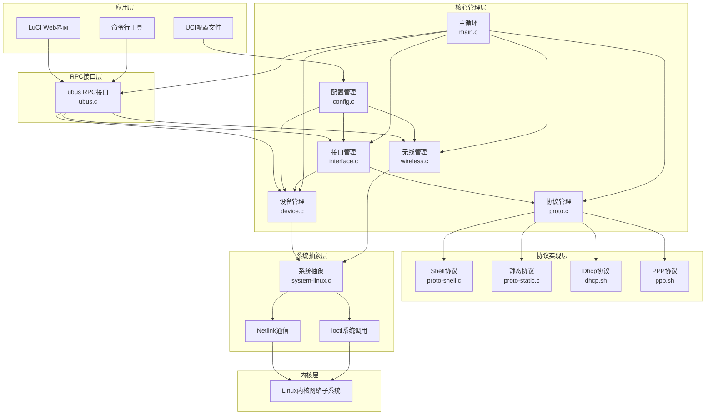

**架构说明**:
1. **应用层**: LuCI、命令行工具通过 ubus RPC 接口与 netifd 交互
2. **RPC接口层**: ubus.c 提供 network.interface、network.device、network.wireless 等对象的方法
3. **核心管理层**: 各模块通过回调机制解耦，interface.c 是核心协调者
4. **协议实现层**: 支持多种协议，shell 协议通过外部脚本实现
5. **系统抽象层**: system-linux.c 封装 Linux 特有的 netlink/ioctl 操作
6. **内核层**: 通过 netlink 与 Linux 内核交互，配置网络设备、IP 地址、路由等

**关键交互**:
- **接口启动**: ubus → interface.c → proto.c → proto-shell.c → 外部脚本 → 内核
- **设备事件**: 内核 → system-linux.c → device.c → interface.c → ubus 通知
- **配置重载**: UCI → config.c → interface.c/device.c → 内核

## 2. 初始化流程图

netifd 守护进程的初始化流程包括构造函数初始化、主函数初始化和事件循环启动。

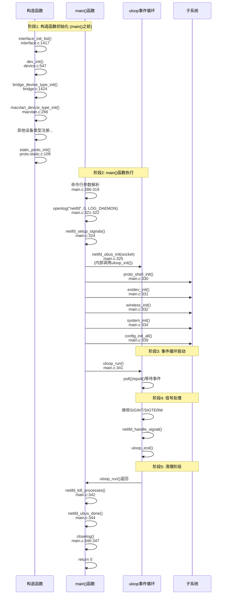

**关键初始化函数**:

| 函数 | 文件 | 行号 | 作用 |
|------|------|------|------|
| `interface_init_list()` | interface.c | 1417 | 初始化 interfaces vlist 树 |
| `dev_init()` | device.c | 547 | 初始化 devices AVL 树 |
| `proto_shell_init()` | proto-shell.c | 943 | 扫描 proto 目录，注册脚本协议 |
| `wireless_init()` | wireless.c | 804 | 初始化无线设备和驱动树 |
| `system_init()` | system-linux.c | 330 | 创建 netlink socket |
| `config_init_all()` | config.c | 744 | 加载并解析所有配置 |
| `netifd_ubus_init()` | ubus.c | 1363 | 初始化 ubus 连接和对象 |

**初始化顺序**:
1. **构造函数** (attribute((constructor))): 设备类型注册、接口/设备树初始化
2. **主函数前期**: 信号处理、uloop 初始化、ubus 连接
3. **子系统初始化**: 协议、无线、外部设备、系统层
4. **配置加载**: UCI 配置解析，创建接口和设备对象
5. **事件循环**: uloop_run() 启动，等待事件

**关键数据结构初始化**:
- `struct vlist_tree interfaces` (interface.c:30) - 接口树
- `static struct avl_tree devices` (device.c:30) - 设备树  
- `struct vlist_tree wireless_devices` (wireless.c) - 无线设备树
- `static struct avl_tree handlers` (proto.c:29) - 协议处理器树

## 3. 接口管理流程图

接口管理是 netifd 的核心，负责逻辑网络接口的生命周期管理和状态机转换。

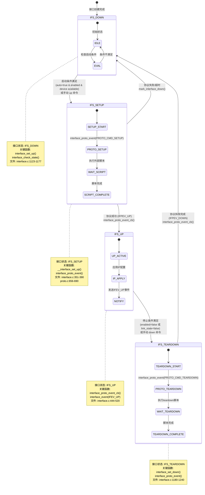

**接口创建流程**:

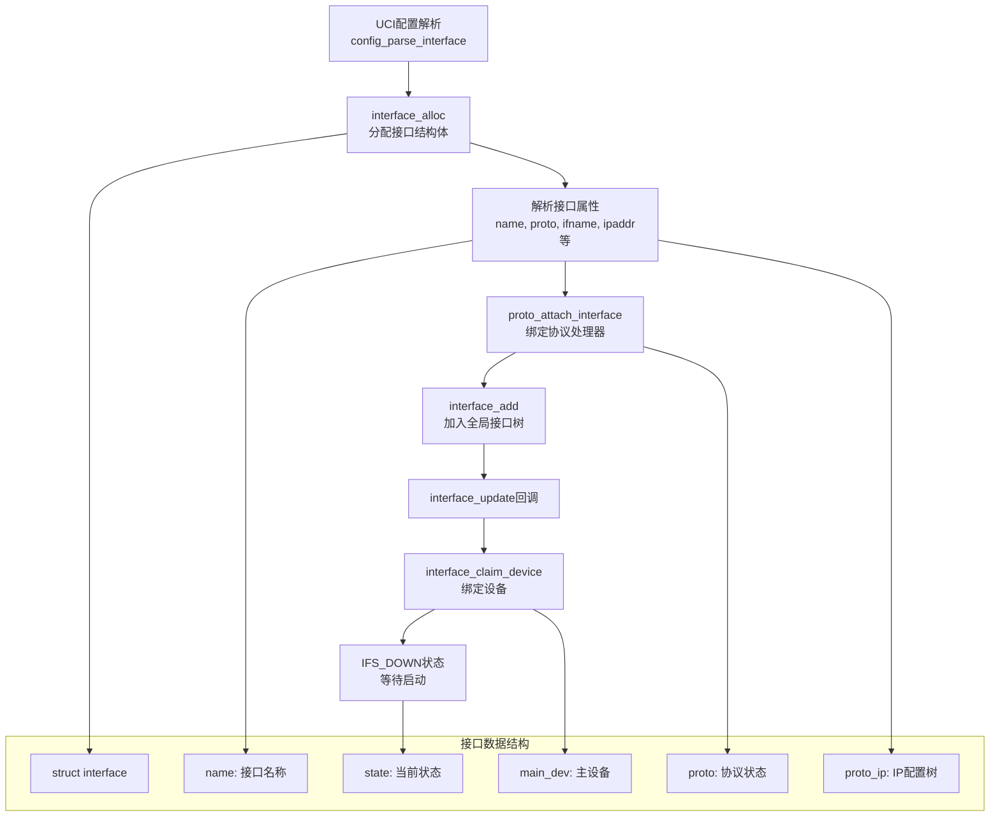

**关键接口函数**:

| 函数 | 文件 | 行号 | 作用 |
|------|------|------|------|
| `interface_alloc()` | interface.c | 814 | 分配接口结构体，解析接口属性 |
| `interface_add()` | interface.c | 991 | 将接口加入全局接口树 |
| `interface_set_up()` | interface.c | 1123 | 接口启动入口函数 |
| `__interface_set_up()` | interface.c | 351 | 核心启动逻辑，设置IFS_SETUP状态 |
| `interface_set_down()` | interface.c | 1180 | 接口停止入口函数 |
| `interface_proto_event_cb()` | interface.c | 444 | 处理协议事件回调 |
| `interface_check_state()` | interface.c | 1450 | 根据条件检查状态转换 |

**接口事件枚举** (`enum interface_event`):
- `IFEV_DOWN`: 接口已关闭
- `IFEV_UP`: 接口已启动  
- `IFEV_UP_FAILED`: 接口启动失败
- `IFEV_UPDATE`: 配置更新
- `IFEV_FREE`: 接口即将被释放
- `IFEV_RELOAD`: 配置重载
- `IFEV_LINK_UP`: 链路层连接建立
- `IFEV_CREATE`: 接口创建

**接口与设备交互**:
- `interface_main_dev_cb()`: 主设备事件回调
- `interface_set_main_dev()`: 更换主设备
- `interface_set_l3_dev()`: 设置三层设备
- `interface_claim_device()`: 根据配置获取设备

**接口与协议交互**:
- `interface_proto_event()`: 向协议发送命令
- `proto_attach_interface()`: 绑定协议处理器
- `interface_set_proto_state()`: 更新协议状态指针

## 4. 协议处理流程图

协议处理系统负责管理各种网络协议（static、dhcp、ppp等），通过协议处理器与外部脚本交互。

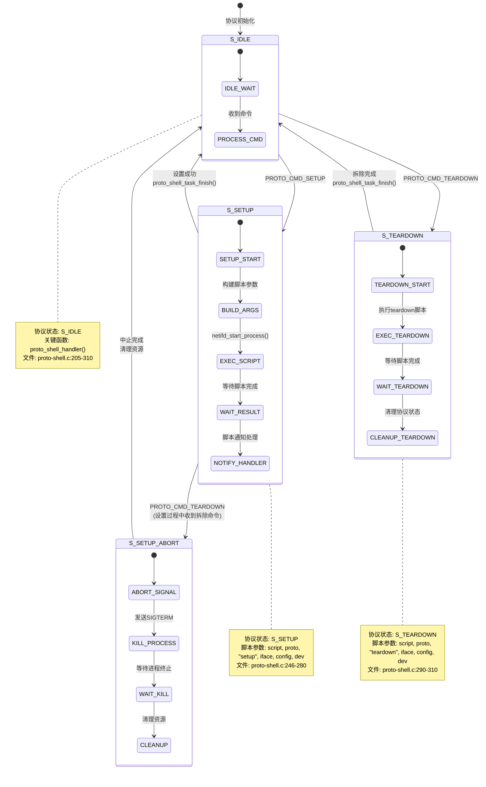

**协议脚本调用参数**:
```c
argv[0] = handler->script_name;  // 脚本路径
argv[1] = handler->proto.name;   // 协议名称  
argv[2] = action;                // "setup"/"teardown"/"renew"
argv[3] = proto->iface->name;    // 接口名称
argv[4] = config;                // JSON格式配置
argv[5] = proto->iface->main_dev.dev->ifname; // 设备名（可选）
```

**协议通知处理** (`proto_shell_notify`):

| 动作值 | 处理函数 | 作用 |
|--------|----------|------|
| 0 | `proto_shell_update_link()` | 更新链路状态和IP配置 |
| 1 | `proto_shell_run_command()` | 运行额外命令 |
| 2 | `proto_shell_kill_command()` | 终止命令 |
| 3 | `proto_shell_notify_error()` | 报告错误 |
| 4 | `proto_shell_block_restart()` | 阻止接口自动重启 |
| 5 | `proto_shell_set_available()` | 设置接口可用性 |
| 6 | `proto_shell_add_host_dependency()` | 添加主机依赖 |
| 7 | `proto_shell_setup_failed()` | 报告设置失败 |

**协议处理器注册流程**:
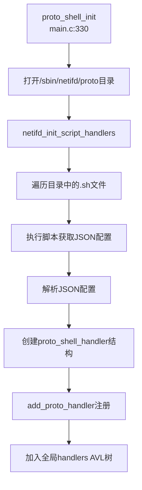

**协议与接口交互**:
- `proto_event` 回调: 在 `interface_proto_state` 中定义，由接口层调用
- `proto_shell_update_link()`: 更新链接状态，调用 `proto_apply_ip_settings()` 应用IP设置
- `proto_shell_task_finish()`: 处理任务完成后的状态转换

**协议依赖处理**:
```c
struct proto_shell_dependency {
    struct list_head list;
    struct proto_shell_state *proto;
    struct interface_user dep;
    union if_addr host;  // IPv4或IPv6地址
    bool v6;             // 是否为IPv6
    bool any;            // 是否匹配任意主机
    char interface[];    // 接口名称
};
```

**关键协议函数**:

| 函数 | 文件 | 行号 | 作用 |
|------|------|------|------|
| `proto_shell_init()` | proto-shell.c | 943 | 初始化shell协议处理器 |
| `proto_shell_handler()` | proto-shell.c | 205 | 处理协议命令的核心函数 |
| `proto_shell_notify()` | proto-shell.c | 405 | 处理脚本通知 |
| `proto_shell_update_link()` | proto-shell.c | 455 | 更新链路状态和应用IP配置 |
| `proto_apply_ip_settings()` | proto.c | 490 | 应用IP设置到接口 |
| `interface_proto_event()` | proto.c | 656 | 向协议发送命令 |

## 5. 设备管理流程图

设备管理系统负责物理和虚拟网络设备的管理，包括设备创建、状态监控、热插拔处理和与接口的绑定。

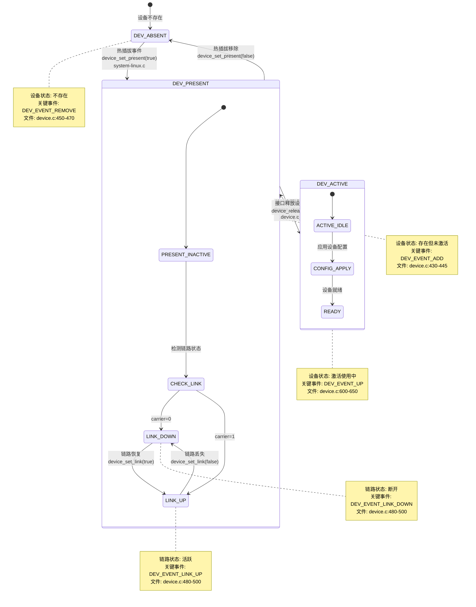

**设备创建流程**:

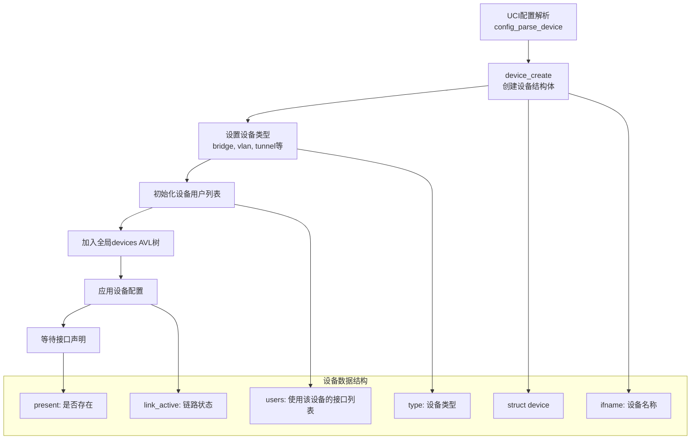

**设备事件系统**:

| 事件 | 触发条件 | 处理函数 |
|------|----------|----------|
| `DEV_EVENT_ADD` | 设备出现 | `device_set_present(true)` |
| `DEV_EVENT_REMOVE` | 设备移除 | `device_set_present(false)` |
| `DEV_EVENT_UP` | 设备激活 | `device_claim()` |
| `DEV_EVENT_DOWN` | 设备停用 | `device_release()` |
| `DEV_EVENT_LINK_UP` | 链路建立 | `device_set_link(true)` |
| `DEV_EVENT_LINK_DOWN` | 链路断开 | `device_set_link(false)` |
| `DEV_EVENT_UPDATE_IFINDEX` | 接口索引更新 | `device_set_ifindex()` |

**热插拔处理流程**:

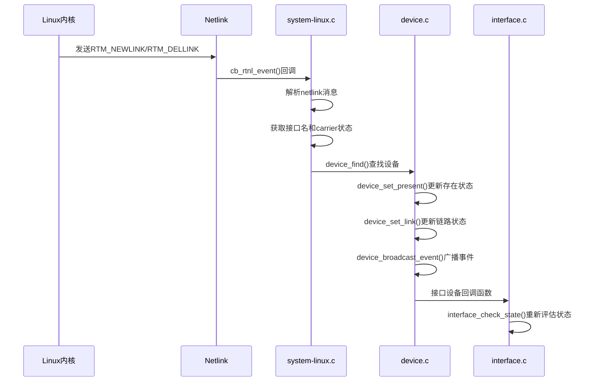

**设备类型系统**:
- `bridge_device_type`: 网桥设备
- `vlandev_device_type`: VLAN设备  
- `macvlan_device_type`: MACVLAN设备
- `tunnel_device_type`: 隧道设备
- `bonding_device_type`: 绑定设备
- `veth_device_type`: veth对设备
- `simple_device_type`: 简单设备（默认）

**关键设备函数**:

| 函数 | 文件 | 行号 | 作用 |
|------|------|------|------|
| `device_create()` | device.c | 320 | 创建设备结构体 |
| `device_claim()` | device.c | 600 | 声明设备使用权 |
| `device_release()` | device.c | 620 | 释放设备使用权 |
| `device_set_present()` | device.c | 430 | 更新设备存在状态 |
| `device_set_link()` | device.c | 480 | 更新设备链路状态 |
| `device_broadcast_event()` | device.c | 530 | 广播设备事件给所有用户 |

**设备与接口绑定**:
- `interface_set_main_dev()`: 设置接口的主设备
- `interface_main_dev_cb()`: 主设备事件回调
- `device_add_user()`: 添加设备用户（接口）
- `device_remove_user()`: 移除设备用户

## 6. 无线驱动流程图

无线管理系统负责无线设备和虚拟接口的管理，支持多种无线驱动和配置。

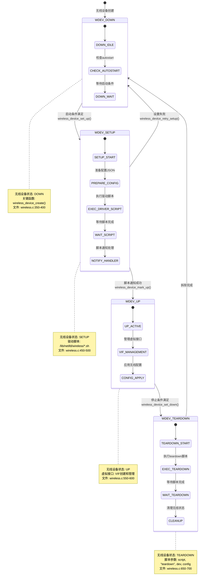

**无线驱动注册流程**:

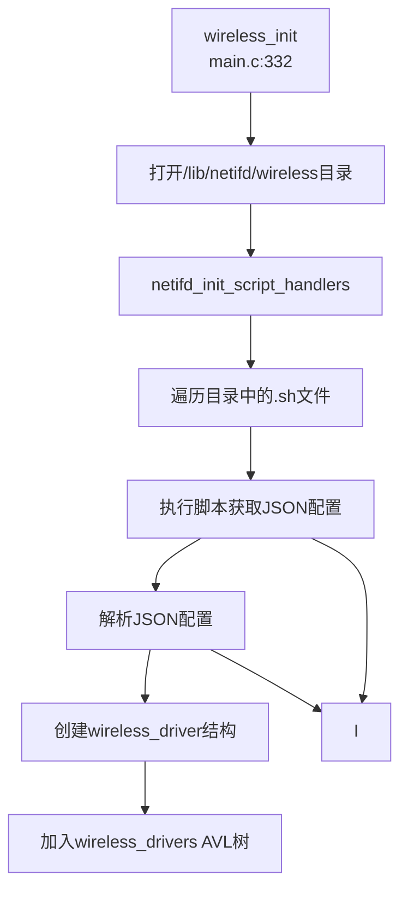

**虚拟接口 (VIF) 创建流程**:

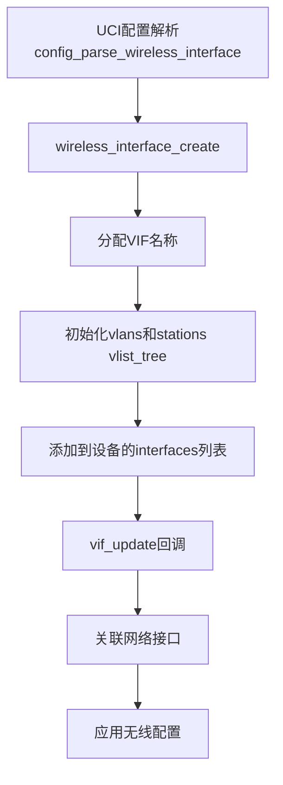

**无线配置参数**:

| 参数类型 | 说明 | 示例 |
|----------|------|------|
| device | 设备参数 | channel, txpower, htmode |
| iface | 接口参数 | ssid, encryption, key |
| vlan | VLAN参数 | vlan_id, network |
| station | 站点参数 | bssid, wds |

**无线事件处理**:
- `wireless_device_hotplug_event()`: 处理热插拔事件
- `wireless_device_notify()`: 处理驱动脚本通知
- `wireless_interface_handle_link()`: VIF与网络接口链接

**无线ubus方法** (`network.wireless`):
- `up`: 启动无线设备
- `down`: 关闭无线设备
- `reconf`: 重新配置设备
- `status`: 获取设备状态
- `notify`: 驱动脚本通知
- `get_validate`: 获取验证信息

**关键无线函数**:

| 函数 | 文件 | 行号 | 作用 |
|------|------|------|------|
| `wireless_init()` | wireless.c | 804 | 初始化无线子系统 |
| `wireless_device_create()` | wireless.c | 350 | 创建无线设备 |
| `wireless_interface_create()` | wireless.c | 450 | 创建虚拟接口 |
| `wireless_device_set_up()` | wireless.c | 550 | 启动无线设备 |
| `wireless_device_notify()` | wireless.c | 650 | 处理脚本通知 |
| `wireless_interface_handle_link()` | wireless.c | 750 | VIF与网络接口链接 |

## 7. 配置管理流程图

配置管理系统负责UCI配置文件的解析、转换和应用，支持配置重载和动态更新。

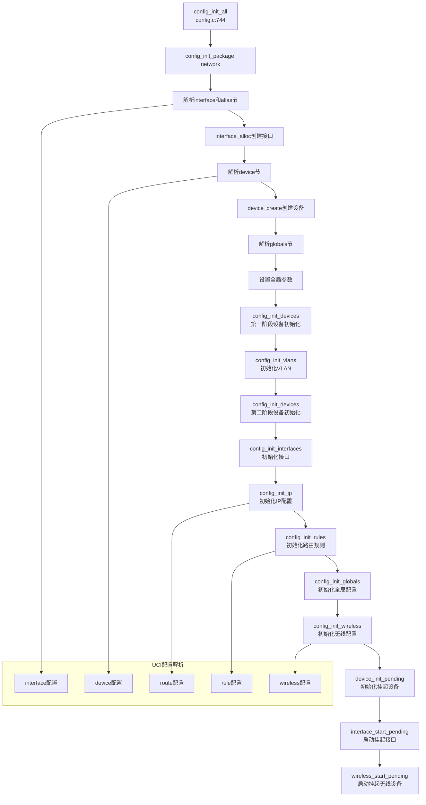

**配置重载流程**:

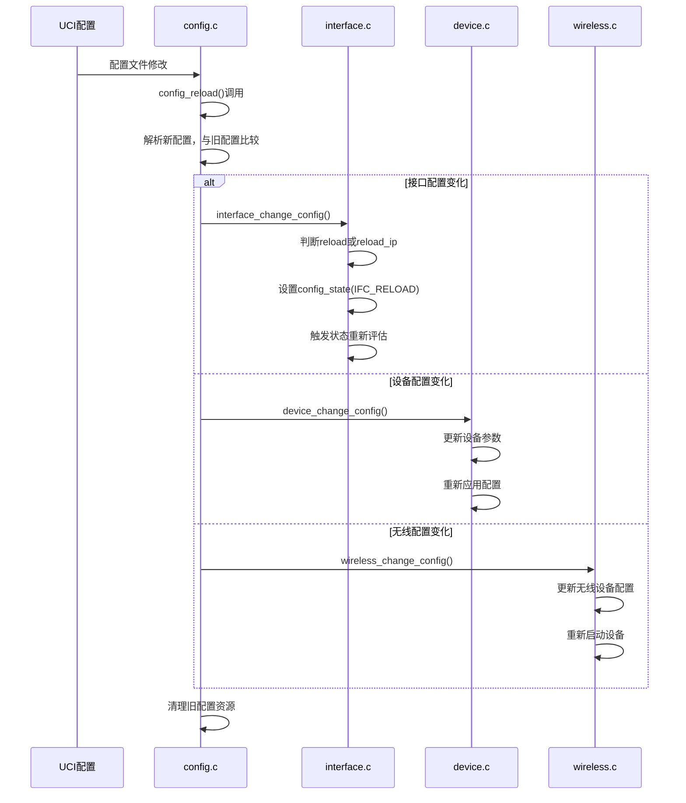

**UCI到blob转换**:

```c
// 接口属性参数列表 (config.c)
static const struct blobmsg_policy interface_attrs[] = {
    [IFACE_ATTR_PROTO] = { "proto", BLOBMSG_TYPE_STRING },
    [IFACE_ATTR_IFNAME] = { "ifname", BLOBMSG_TYPE_STRING },
    [IFACE_ATTR_IPADDR] = { "ipaddr", BLOBMSG_TYPE_ARRAY },
    [IFACE_ATTR_NETMASK] = { "netmask", BLOBMSG_TYPE_STRING },
    [IFACE_ATTR_GATEWAY] = { "gateway", BLOBMSG_TYPE_STRING },
    // ... 更多属性
};

// 转换调用
blob_buf_init(&b, 0);
uci_to_blob(&b, s, &interface_attr_list);
```

**配置状态管理**:
- `IFC_NORMAL`: 正常状态
- `IFC_RELOAD`: 需要重载
- `IFC_REMOVE`: 需要移除

**关键配置函数**:

| 函数 | 文件 | 行号 | 作用 |
|------|------|------|------|
| `config_init_all()` | config.c | 744 | 配置解析总入口 |
| `config_parse_interface()` | config.c | 350 | 解析接口配置 |
| `config_parse_device()` | config.c | 400 | 解析设备配置 |
| `config_init_wireless()` | config.c | 600 | 解析无线配置 |
| `interface_change_config()` | interface.c | 800 | 处理接口配置变更 |
| `device_change_config()` | device.c | 700 | 处理设备配置变更 |

**配置缓存机制**:
- 使用 `struct uci_package *` 缓存已解析的配置
- 通过 `uci_load()` 加载配置包
- 配置变化时通过 `uci_reload()` 重新加载

## 8. 事件处理流程图

netifd 基于 libubox 的 uloop 事件循环，实现单线程事件驱动架构。

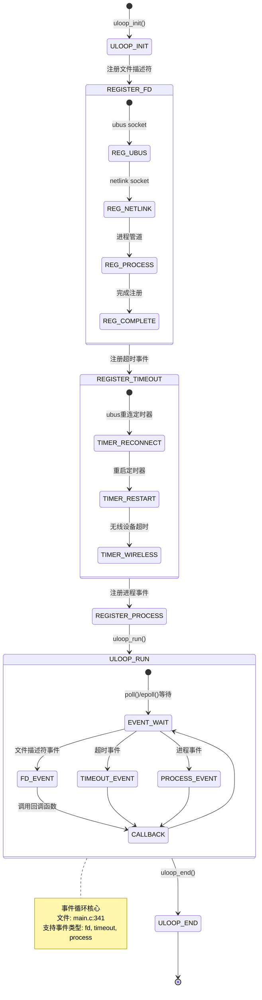

**事件类型和回调**:

| 事件类型 | 数据结构 | 回调成员 | 示例 |
|----------|----------|----------|------|
| 文件描述符 | `struct uloop_fd` | `.cb` | netlink socket 可读 |
| 超时事件 | `struct uloop_timeout` | `.cb` | ubus 重连定时器 |
| 进程事件 | `struct uloop_process` | `.cb` | 子进程退出 |

**信号处理流程**:

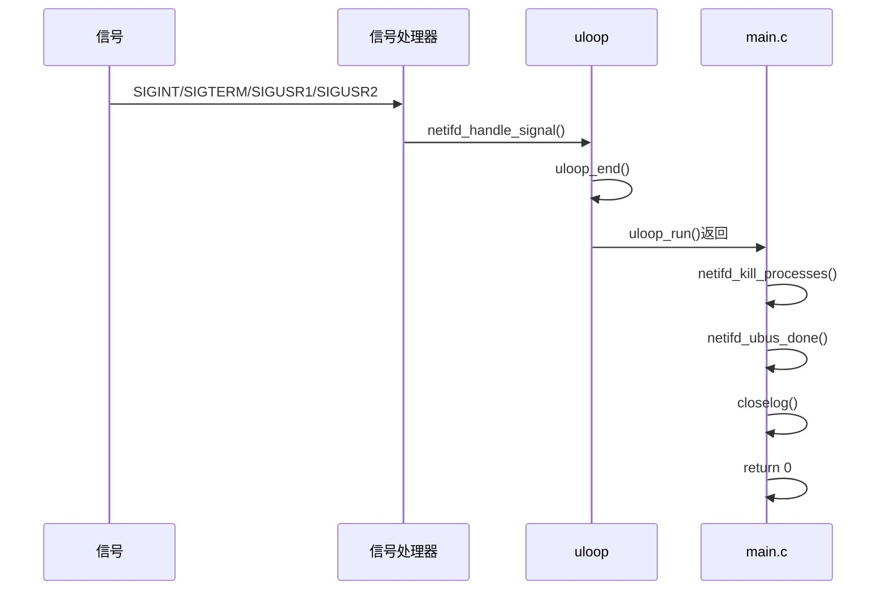

**信号处理设置** (`main.c:247-268`):
```c
static void netifd_setup_signals(void)
{
    struct sigaction s;
    memset(&s, 0, sizeof(s));
    s.sa_handler = netifd_handle_signal;
    s.sa_flags = 0;
    sigaction(SIGINT, &s, NULL);
    sigaction(SIGTERM, &s, NULL);
    sigaction(SIGUSR1, &s, NULL);
    sigaction(SIGUSR2, &s, NULL);
    
    s.sa_handler = SIG_IGN;
    sigaction(SIGPIPE, &s, NULL);  // 忽略SIGPIPE
}
```

**进程管理事件**:

```mermaid
flowchart TD
    A[netifd_start_process<br/>main.c:138] --> B[fork()创建子进程]
    B --> C[子进程: execvp()执行脚本]
    B --> D[父进程: uloop_process_add()]
    D --> E[注册进程退出回调]
    E --> F[添加到全局process_list]
    F --> G[创建管道捕获输出]
    G --> H[ustream_fd_init读取管道]
    
    C --> I[脚本执行完成]
    I --> J[uloop检测进程退出]
    J --> K[netifd_process_cb回调]
    K --> L[清理进程资源]
    L --> M[从process_list移除]
```

**关键事件函数**:

| 函数 | 文件 | 行号 | 作用 |
|------|------|------|------|
| `uloop_init()` | ubus.c | 1365 | 初始化uloop事件循环 |
| `uloop_run()` | main.c | 341 | 启动事件循环 |
| `uloop_end()` | main.c | 247 | 终止事件循环 |
| `netifd_handle_signal()` | main.c | 247 | 信号处理函数 |
| `netifd_start_process()` | main.c | 138 | 创建子进程 |
| `netifd_process_cb()` | main.c | 100 | 进程退出回调 |

**事件驱动优势**:
1. **单线程简化并发**: 所有事件在同一线程处理，无需锁
2. **非阻塞I/O**: 通过uloop管理所有I/O操作
3. **统一事件模型**: fd、timeout、process事件统一处理
4. **高效事件分发**: 基于epoll/poll高效等待多个事件

## 9. 关键函数调用关系总结

### 9.1 接口启动完整调用链

```
main() (main.c:279)
  → netifd_ubus_init() (ubus.c:1363)
     → uloop_init() (ubus.c:1365)
  
  (ubus请求到达)
  → netifd_handle_up() (ubus.c:1100)
     → interface_set_up() (interface.c:1123)
        → interface_clear_errors() (interface.c:1128)
        → device_claim() (device.c:600) [如果已有设备]
        → __interface_set_up() (interface.c:351)
           → iface->state = IFS_SETUP
           → interface_proto_event() (proto.c:656)
              → proto->cb() [proto_shell_handler] (proto-shell.c:205)
                 → netifd_start_process() (main.c:138)
                    → fork() + execvp() 执行外部脚本
  
  (脚本执行完成)
  → netifd_process_cb() (main.c:100)
     → proto_shell_script_cb() (proto-shell.c:720)
        → proto_shell_task_finish() (proto-shell.c:740)
           → proto->proto_event() (interface.c:444)
              → interface_proto_event_cb() (interface.c:444)
                 → interface_set_l3_dev() (interface.c:520)
                 → interface_ip_set_enabled() (interface-ip.c:320)
                 → iface->state = IFS_UP
                 → interface_event() (interface.c:600)
                    → interface_queue_event() (interface-event.c:150)
                    → netifd_ubus_interface_notify() (ubus.c:1200)
```

### 9.2 设备热插拔调用链

```
(内核发送netlink消息)
→ cb_rtnl_event() (system-linux.c:450)
   → device_find() (device.c:350)
   → device_set_present() (device.c:430)
      → device_broadcast_event() (device.c:530)
         → 遍历dev->users列表
         → 调用每个用户的回调函数
  
  (接口设备回调)
  → interface_main_dev_cb() (interface.c:650)
     → interface_check_state() (interface.c:1450)
        → 根据新状态重新评估接口状态
        → 可能触发interface_set_up()或interface_set_down()
```

### 9.3 配置重载调用链

```
(UCI配置修改)
→ config_reload() (config.c:900)
   → 解析新配置，与旧配置比较
   → interface_change_config() (interface.c:800)
      → 判断变更类型 (reload/reload_ip)
      → set_config_state(IFC_RELOAD)
      → interface_check_state() (interface.c:1450)
         → 触发接口状态重新评估
```

### 9.4 无线设备启动调用链

```
wireless_device_set_up() (wireless.c:550)
  → __wireless_device_set_up() (wireless.c:580)
     → wireless_device_run_handler() (wireless.c:620)
        → prepare_config() (wireless.c:650) 生成配置JSON
        → netifd_start_process() (main.c:138) 执行驱动脚本
  
  (脚本通知)
  → wireless_device_notify() (wireless.c:750)
     → wireless_device_mark_up() (wireless.c:780)
        → wdev->state = IFS_UP
        → 启动关联的虚拟接口
```

## 10. 关键文件和行号引用表

| 模块 | 关键文件 | 关键行号 | 关键函数/数据结构 |
|------|----------|----------|-------------------|
| **主程序** | `main.c` | 279-350 | `main()` 函数，初始化流程 |
| | | 138-200 | `netifd_start_process()` 进程创建 |
| | | 247-268 | `netifd_setup_signals()` 信号处理 |
| **接口管理** | `interface.c` | 814-900 | `interface_alloc()` 接口创建 |
| | | 991-1050 | `interface_add()` 接口注册 |
| | | 1123-1177 | `interface_set_up()` 接口启动 |
| | | 351-390 | `__interface_set_up()` 核心启动逻辑 |
| | | 444-520 | `interface_proto_event_cb()` 协议回调 |
| | `interface.h` | 50-150 | `struct interface` 接口数据结构 |
| | | 180-220 | `enum interface_state` 接口状态 |
| **设备管理** | `device.c` | 320-380 | `device_create()` 设备创建 |
| | | 600-650 | `device_claim()` 设备声明 |
| | | 430-445 | `device_set_present()` 设备存在状态 |
| | | 480-500 | `device_set_link()` 设备链路状态 |
| | `device.h` | 80-160 | `struct device` 设备数据结构 |
| | | 200-250 | `enum device_event` 设备事件 |
| **协议处理** | `proto.c` | 656-690 | `interface_proto_event()` 协议命令 |
| | | 490-550 | `proto_apply_ip_settings()` IP配置应用 |
| | `proto-shell.c` | 205-310 | `proto_shell_handler()` shell协议处理 |
| | | 405-500 | `proto_shell_notify()` 脚本通知处理 |
| | | 455-490 | `proto_shell_update_link()` 链路更新 |
| | `proto.h` | 60-120 | `struct proto_handler` 协议处理器 |
| | | 150-180 | `enum interface_proto_cmd` 协议命令 |
| **无线管理** | `wireless.c` | 804-816 | `wireless_init()` 无线初始化 |
| | | 350-400 | `wireless_device_create()` 无线设备创建 |
| | | 450-500 | `wireless_interface_create()` 虚拟接口创建 |
| | | 550-600 | `wireless_device_set_up()` 无线设备启动 |
| | `wireless.h` | 80-160 | `struct wireless_device` 无线设备结构 |
| **配置管理** | `config.c` | 744-789 | `config_init_all()` 配置初始化 |
| | | 350-400 | `config_parse_interface()` 接口配置解析 |
| | | 400-450 | `config_parse_device()` 设备配置解析 |
| | | 600-650 | `config_init_wireless()` 无线配置解析 |
| **系统抽象** | `system-linux.c` | 330-354 | `system_init()` 系统初始化 |
| | | 450-500 | `cb_rtnl_event()` netlink事件回调 |
| **RPC接口** | `ubus.c` | 1363-1382 | `netifd_ubus_init()` ubus初始化 |
| | | 1100-1150 | `netifd_handle_up()` up命令处理 |
| | | 1200-1250 | `netifd_ubus_interface_notify()` 接口通知 |

## 11. 总结

netifd 是 OpenWrt 网络系统的核心组件，采用**事件驱动**和**状态机**架构，具有以下特点：

### 11.1 架构特点
1. **分层模块化**: 清晰的接口、设备、协议、无线、配置分层
2. **事件驱动**: 基于 libubox uloop 的单线程事件循环
3. **状态机设计**: 接口、协议、设备都有明确的状态机和转换逻辑
4. **回调机制**: 模块间通过回调函数解耦，降低耦合度
5. **统一配置管理**: 通过 UCI 配置系统管理所有网络配置

### 11.2 核心机制
1. **接口状态机**: IFS_DOWN ↔ IFS_SETUP ↔ IFS_UP ↔ IFS_TEARDOWN
2. **协议处理框架**: 支持 shell 脚本协议和内置协议
3. **设备管理系统**: 统一管理物理/虚拟设备，支持热插拔
4. **无线驱动集成**: 支持多种无线驱动和虚拟接口
5. **配置重载机制**: 支持运行时配置更新，无需重启服务

### 11.3 扩展性设计
1. **协议扩展**: 通过添加 `/lib/netifd/proto/*.sh` 脚本支持新协议
2. **设备类型扩展**: 通过注册新的 `device_type` 支持新设备类型
3. **无线驱动扩展**: 通过添加 `/lib/netifd/wireless/*.sh` 脚本支持新无线驱动
4. **RPC接口扩展**: 通过添加 ubus 方法支持新的管理功能

### 11.4 性能考虑
1. **单线程模型**: 避免锁竞争，简化并发编程
2. **非阻塞I/O**: 所有 I/O 操作通过 uloop 非阻塞处理
3. **事件合并**: 相同接口的事件合并处理，避免重复操作
4. **延迟启动**: 无线设备等待网络接口就绪后启动

### 11.5 可靠性设计
1. **错误恢复**: 协议失败时自动重试，多次失败后进入 DOWN 状态
2. **资源清理**: 进程退出时自动清理所有子进程和资源
3. **状态同步**: 定期检查内核状态，确保与内部状态一致
4. **配置验证**: UCI 配置解析时进行参数验证

通过本文档提供的流程图和函数调用关系，开发者可以全面理解 netifd 的工作原理，为开发、调试和定制提供坚实基础。

---
*文档生成时间: 2026年3月10日*  
*基于 netifd 源码深度分析，结合现有分析报告整合而成*