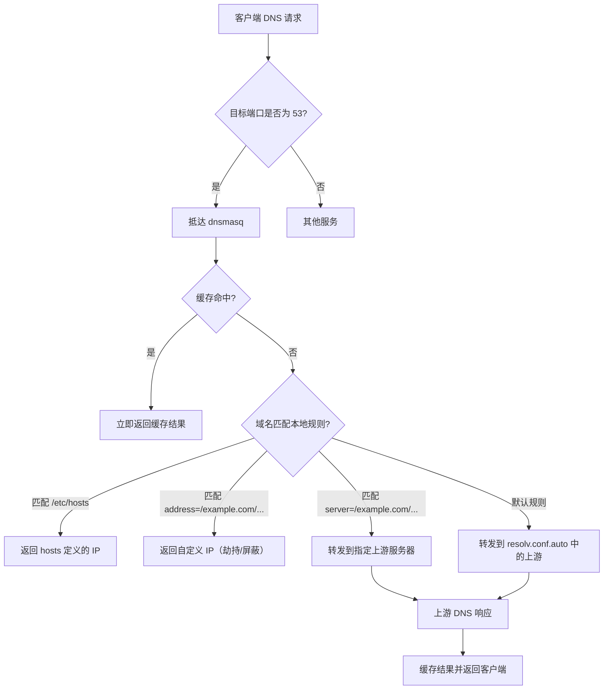

# OpenWrt DNS 解析框架

## 概述

OpenWrt 的 DNS 解析系统是一个多组件协作的框架，旨在为本地网络提供高效、灵活且可配置的域名解析服务。该系统以 **dnsmasq** 为核心，结合 **netifd**、**odhcpd** 等守护进程，实现了 DNS 缓存、转发、过滤、安全增强以及 IPv6 支持等关键功能。

默认情况下，OpenWrt 作为家庭网关或路由器，其 DNS 解析服务主要面向 LAN 客户端，同时也为路由器本机提供解析能力。整个框架的设计遵循“配置与运行分离”的原则，通过 UCI（Unified Configuration Interface）进行集中配置，并由各组件动态生成运行时配置。

## 核心组件

### 1. dnsmasq

**dnsmasq** 是 OpenWrt 默认的轻量级 DNS 转发器和 DHCP 服务器。它负责：

- **DNS 缓存**：缓存最近的查询结果，减少重复查询的延迟。
- **DNS 转发**：将未命中缓存的查询转发到上游 DNS 服务器。
- **本地域名解析**：提供 `/etc/hosts` 和自定义域名到 IP 的映射。
- **域名过滤与劫持防护**：通过 `bogus‑nxdomain` 等选项屏蔽虚假响应。
- **DHCP 服务集成**：为 DHCP 客户端推送 DNS 服务器地址（通常为路由器自身的 LAN IP）。

dnsmasq 的配置文件位于 `/etc/config/dhcp`，运行时生成的详细配置位于 `/var/etc/dnsmasq.conf`。

### 2. netifd

**netifd**（Network Interface Daemon）是 OpenWrt 的网络接口管理守护进程。它在 DNS 解析框架中的作用包括：

- **上游 DNS 服务器发现**：在 WAN 接口通过 DHCP、PPPoE 或静态配置获取运营商提供的 DNS 服务器地址。
- **生成 `/tmp/resolv.conf.auto`**：将获取到的上游 DNS 服务器列表写入该文件，供 dnsmasq 读取（通过 `option resolvfile`）。
- **热插拔处理**：当网络接口状态变化时，触发 dnsmasq 重新加载配置，确保上游 DNS 列表及时更新。

### 3. odhcpd

**odhcpd** 是 OpenWrt 的 IPv6 DHCP 和路由器通告（RA）服务。在 IPv6 环境中，它负责：

- **DHCPv6 服务器**：为客户端分配 IPv6 地址及其他配置选项。
- **DNS 服务器推送**：通过 DHCPv6 选项（Option 23）或 RA 的 RDNSS 选项，向客户端通告 IPv6 DNS 服务器地址（通常是路由器的 link‑local 地址）。
- **生成 IPv6 相关的 resolv.conf 条目**：将 IPv6 DNS 服务器信息写入 `/tmp/resolv.conf.auto`，确保 dnsmasq 能够同时使用 IPv4 和 IPv6 上游。

### 4. resolv.conf 管理

OpenWrt 使用一个动态生成的 **`/tmp/resolv.conf`** 作为系统实际的 DNS 解析配置文件。它由多个来源合并而成：

- `/tmp/resolv.conf.auto`：由 netifd 和 odhcpd 生成，包含从 WAN 接口获取的上游 DNS 服务器。
- `/tmp/resolv.conf.d/*`：其他组件（如 VPN 客户端、自定义 DNS 服务）可以在此目录下放置片段文件。
- dnsmasq 自身也可能向 `/tmp/resolv.conf` 中添加指向自己的条目（127.0.0.1），确保本机进程的 DNS 查询也经过缓存和转发。

最终，`/tmp/resolv.conf` 被符号链接到 `/etc/resolv.conf`，供所有本地进程使用。

### 5. 可选增强组件

- **unbound**：全功能递归 DNS 解析器，可替代 dnsmasq 的转发模式，提供 DNSSEC 验证、更精细的缓存控制等。
- **stubby**：DNS‑over‑TLS（DoT）转发器，将 DNS 查询通过 TLS 加密隧道发送到上游（如 Cloudflare、Google 等）。
- **dnscrypt‑proxy**：支持 DNSCrypt 协议的代理，提供加密和防污染能力。
- **pdnsd**：支持持久缓存和 TCP 查询的 DNS 转发器，常用于绕过 DNS 污染。

## 配置文件详解

### 主配置：`/etc/config/dhcp`

该文件是 dnsmasq 和 DHCP 服务的 UCI 配置入口。典型配置如下：

```uci
config dnsmasq
    option domainneeded '1'          # 忽略不带域名的请求
    option boguspriv '1'             # 屏蔽私有 IP 地址的 DNS 响应
    option localise_queries '1'      # 本地化查询（针对多宿主环境）
    option rebind_protection '1'     # 防止 DNS 重绑定攻击
    option rebind_localhost '1'      # 允许 localhost 重绑定
    option local '/lan/'             # 本地域名后缀
    option domain 'lan'              # 域名
    option expandhosts '1'           # 扩展 hosts 文件中的短名称
    option nonegcache '0'            # 是否禁用否定缓存（0=启用）
    option authoritative '1'         # 权威 DHCP 模式
    option readethers '1'            # 读取 /etc/ethers 进行静态绑定
    option leasefile '/tmp/dhcp.leases'  # 租约文件路径
    option resolvfile '/tmp/resolv.conf.auto'  # 上游 DNS 来源

config dhcp 'lan'
    option interface 'lan'
    option start '100'               # DHCP 地址池起始
    option limit '150'               # 地址数量
    option leasetime '12h'           # 租期
    option dhcpv6 'server'           # 启用 IPv6 DHCP 服务
    option ra 'server'               # 启用路由器通告
```

### 运行时配置：`/var/etc/dnsmasq.conf`

此文件由 `/etc/init.d/dnsmasq` 在启动时根据 UCI 配置和多个来源（如 `/etc/dnsmasq.conf`、`/etc/dnsmasq.d/` 下的自定义文件）合并生成。它包含所有实际生效的 dnsmasq 选项，是调试时的关键参考。

### 上游 DNS 列表：`/tmp/resolv.conf.auto`

该文件由 netifd 生成，格式与标准 `resolv.conf` 相同，例如：

```conf
# Interface wan
nameserver 114.114.114.114
nameserver 8.8.8.8
# Interface wan6
nameserver 2001:4860:4860::8888
```

dnsmasq 通过 `resolv‑file` 选项读取该文件，将其中的服务器作为默认上游。

## DNS 解析详细流程

下图展示了 OpenWrt 中一次 DNS 查询的完整处理路径：



### 步骤说明

1. **客户端发起查询**：LAN 中的设备将 DNS 查询发送到路由器的 IP 地址（通常为 192.168.1.1），目的端口为 53。
2. **dnsmasq 接收**：dnsmasq 监听在路由器的所有 LAN 接口的 53 端口，接收查询。
3. **缓存查询**：dnsmasq 首先检查本地缓存（内存中），若存在未过期的记录，则直接返回，流程结束。
4. **本地规则匹配**：若缓存未命中，dnsmasq 按以下优先级匹配本地规则：
   - `/etc/hosts` 文件中定义的静态映射。
   - `address=` 指令定义的域名到 IP 的映射（用于广告屏蔽或内网服务）。
   - `server=` 指令指定的域名专属上游（用于域名分流，如将 `google.com` 转发到 8.8.8.8）。
5. **转发到上游**：若没有匹配任何本地规则，则使用默认上游列表（来自 `/tmp/resolv.conf.auto`）进行转发。dnsmasq 会按列表顺序尝试，直到获得有效响应。
6. **响应与缓存**：上游返回响应后，dnsmasq 将结果缓存（根据 TTL），并返回给客户端。
7. **本机进程查询**：路由器本机进程的 DNS 查询会通过 `127.0.0.1:53` 到达 dnsmasq，流程相同。

### IPv6 解析流程

IPv6 的 DNS 解析流程与 IPv4 类似，但存在以下区别：

- 客户端可能通过 DHCPv6 或 RA 的 RDNSS 选项获取 IPv6 DNS 服务器地址（通常是路由器的 link‑local 地址 `fe80::1`）。
- dnsmasq 同时监听 IPv6 的 `[::]:53`，接收 IPv6 查询。
- 上游 DNS 列表可能包含 IPv6 地址（如 `2001:4860:4860::8888`），dnsmasq 会自动通过 IPv6 协议转发查询。

## 高级功能

### 1. 域名分流（国内/国外分离）

通过 dnsmasq 的 `server` 指令，可以为特定域名或域名后缀指定不同的上游 DNS 服务器，实现流量分流。

示例配置（保存在 `/etc/dnsmasq.d/gfw.conf`）：

```conf
# 国外域名走 8.8.8.8
server=/google.com/8.8.8.8
server=/youtube.com/8.8.8.8
server=/twitter.com/8.8.8.8

# 国内域名走 114.114.114.114
server=/cn/114.114.114.114
server=/baidu.com/114.114.114.114
```

### 2. DNS‑over‑TLS（DoT）支持

通过 **stubby** 或 **dnscrypt‑proxy** 可以实现加密的 DNS 查询，防止监听和篡改。

配置步骤：

1. 安装 `stubby` 包：`opkg update && opkg install stubby`
2. 编辑 `/etc/stubby/stubby.yml`，配置上游 DoT 服务器（如 Cloudflare、Google）。
3. 修改 dnsmasq 配置，将上游指向 `127.0.0.1#5353`（stubby 监听端口）。
4. 重启服务。

### 3. ipset 联动

dnsmasq‑full 版本支持 `ipset` 选项，可以将特定域名的解析结果自动加入一个 ipset 集合，供防火墙规则使用，实现透明代理或流量标记。

示例：

```conf
# 将 youtube.com 的解析结果加入名为 gfwlist 的 ipset
ipset=/youtube.com/gfwlist
```

对应的防火墙规则可以匹配该 ipset，将流量重定向到代理服务器。

### 4. 广告屏蔽

利用 `address` 指令将广告域名指向无效 IP，实现去广告效果。

```conf
# 屏蔽常见广告域名
address=/ad.doubleclick.net/0.0.0.0
address=/ads.google.com/0.0.0.0
address=/static.ads-twitter.com/0.0.0.0
```

也可以使用社区维护的广告域名列表，将其包含到配置中。

### 5. DNSSEC 验证

通过 **unbound** 或 dnsmasq‑full（版本 ≥ 2.80）可以启用 DNSSEC 验证，确保 DNS 响应的真实性和完整性。

在 dnsmasq 中启用：

```uci
config dnsmasq
    option dnssec '1'
    option dnssec_check_unsigned '1'
```

## 调试与排错

### 常用命令

- **查看 dnsmasq 运行状态**：`service dnsmasq status`
- **重启 dnsmasq**：`/etc/init.d/dnsmasq restart`
- **实时查看日志**：`logread -f | grep dnsmasq`
- **测试 dnsmasq 配置**：`dnsmasq --test`
- **查看 DNS 缓存**：`kill -SIGUSR1 $(pidof dnsmasq)`，然后查看日志（dnsmasq 会将缓存 dump 到日志中）。
- **手动查询测试**：
  ```bash
  # 使用 dig 查询，指定路由器 IP
  dig @192.168.1.1 example.com
  # 使用 nslookup
  nslookup example.com 192.168.1.1
  ```

### 关键文件检查

1. **检查上游 DNS 列表**：`cat /tmp/resolv.conf.auto`
2. **检查运行时配置**：`cat /var/etc/dnsmasq.conf | head -50`
3. **检查本机 resolv.conf**：`cat /etc/resolv.conf`
4. **查看 DHCP 租约**：`cat /tmp/dhcp.leases`

### 常见错误排查

- **DNS 解析缓慢**：可能是上游 DNS 服务器响应慢，或缓存未命中。尝试更换上游 DNS（如 `114.114.114.114`、`223.5.5.5`）。
- **部分域名无法解析**：检查是否有 `server=` 规则冲突，或域名被 `address=` 屏蔽。查看 dnsmasq 日志中对该域名的处理记录。
- **IPv6 DNS 不工作**：确认 odhcpd 已启用，且客户端正确接收 RDNSS 选项。检查 `logread | grep odhcpd`。
- **本机进程无法解析**：确认 `/etc/resolv.conf` 指向 `127.0.0.1`。若指向其他服务器，可能是 VPN 客户端或特殊配置覆盖了。

## 常见问题与解决方案

### Q1：如何自定义 DNS 服务器而不使用运营商提供的？

在 **网络 → 接口 → WAN** 的配置中，将“使用自定义的 DNS 服务器”勾选，并填写所需的 DNS 地址（如 `223.5.5.5`、`8.8.8.8`）。也可以在 `/etc/config/network` 中直接修改：

```uci
config interface 'wan'
    option proto 'dhcp'
    list dns '223.5.5.5'
    list dns '8.8.8.8'
```

### Q2：如何让 dnsmasq 监听在所有接口（包括 WAN）？

默认 dnsmasq 只监听 LAN 接口。若要监听 WAN（通常不推荐，存在安全风险），可在 `/etc/config/dhcp` 中增加：

```uci
config dnsmasq
    option interface 'lan'
    option interface 'wan'
```

### Q3：如何启用 DNS 查询日志以便调试？

在 dnsmasq 配置中添加 `option logqueries '1'`，然后重启服务。查询日志将输出到系统日志，可通过 `logread -f | grep dnsmasq` 查看。

### Q4：如何配置 DNS 缓存大小？

dnsmasq 默认缓存大小为 150 条记录。可通过 `option cachesize '1000'` 调整。注意增大缓存会占用更多内存。

### Q5：如何实现 DNS 负载均衡？

dnsmasq 支持多个上游服务器，并自动进行故障转移和负载均衡。只需在 `resolv.conf.auto` 或 `server` 指令中列出多个服务器即可。dnsmasq 会按顺序尝试，并将查询均匀分配到可用的服务器。

### Q6：如何与 VPN（如 OpenVPN）的 DNS 配合？

VPN 客户端通常会在 `/tmp/resolv.conf.d/` 中生成配置片段，覆盖默认的上游 DNS。确保 dnsmasq 的 `resolv‑file` 指向 `/tmp/resolv.conf.auto`，而不是 `/etc/resolv.conf`，以避免循环。

## 深入知识点

### 1. DNS 缓存污染与防护

- **缓存污染**：攻击者向 dnsmasq 注入虚假的 DNS 响应，导致后续查询返回错误 IP。OpenWrt 默认启用 `boguspriv` 和 `bogusnxdomain` 选项，可以过滤来自私有 IP 地址的响应和明显的虚假 NXDOMAIN。
- **DNSSEC**：通过启用 DNSSEC 验证（需 dnsmasq‑full 版本 ≥2.80），可以确保响应的真实性和完整性。配置 `option dnssec '1'` 并指定信任锚文件。
- **使用 TCP 查询**：部分上游 DNS 支持 TCP 53 端口，dnsmasq 可通过 `option dnssec_try_tcp '1'` 尝试 TCP 查询，绕过基于 UDP 的污染。

### 2. dnsmasq‑full 与 dnsmasq 的区别

OpenWrt 默认安装的 `dnsmasq` 是精简版，缺少以下高级功能：
- **ipset 支持**：`ipset=` 指令。
- **DNSSEC 验证**：完整的 DNSSEC 验证链。
- **TCP 查询**：`dnssec‑try‑tcp`。
- **更多 DHCP 选项**：如 `tag:if` 等。

如果需要这些功能，应安装 `dnsmasq‑full`：
```bash
opkg update
opkg remove dnsmasq
opkg install dnsmasq-full
```

### 3. 性能调优参数

- **cachesize**：缓存条目数，默认 150。增大可提升缓存命中率，但会增加内存占用。
- **dns‑forward‑max**：同时向上游发起的查询数，默认 150。若上游响应慢，可适当调低。
- **dns‑rr‑ttl**：为所有资源记录设置一个最小 TTL（秒），可强制缓存更长时间，减少重复查询。
- **no‑negcache**：禁用否定缓存（NXDOMAIN 缓存），可减少因临时错误导致的解析失败。

示例配置：
```uci
config dnsmasq
    option cachesize '1000'
    option dns_forward_max '50'
    option dns_rr_ttl '300'
    option no_negcache '0'
```

### 4. 防火墙重定向（强制 DNS 流量）

为防止客户端绕过路由器 DNS（如手动设置 8.8.8.8），可以使用防火墙规则将 LAN 内所有目的端口为 53 的流量重定向到 dnsmasq。

```bash
# IPv4 规则
iptables -t nat -A PREROUTING -i br-lan -p udp --dport 53 -j REDIRECT --to-ports 53
iptables -t nat -A PREROUTING -i br-lan -p tcp --dport 53 -j REDIRECT --to-ports 53

# IPv6 规则（需 ip6tables）
ip6tables -t nat -A PREROUTING -i br-lan -p udp --dport 53 -j REDIRECT --to-ports 53
ip6tables -t nat -A PREROUTING -i br-lan -p tcp --dport 53 -j REDIRECT --to-ports 53
```

可将上述规则添加到 `/etc/firewall.user` 中，使其持久化。

### 5. 使用 tcpdump 抓取 DNS 数据包

调试复杂的 DNS 问题时，可以使用 `tcpdump` 捕获进出 dnsmasq 的数据包：

```bash
# 捕获所有 DNS 查询（端口 53）
tcpdump -i any port 53 -vvv

# 捕获来自特定客户端（如 192.168.1.100）的 DNS 流量
tcpdump -i br-lan host 192.168.1.100 and port 53 -vvv

# 保存到文件以便后续分析
tcpdump -i any port 53 -w /tmp/dns.pcap
```

### 6. 通过 ubus 监控 dnsmasq 状态

OpenWrt 的 `ubus` 系统总线提供了查询 dnsmasq 状态的接口：

```bash
# 列出所有可用的 ubus 对象
ubus list | grep dnsmasq

# 查看 dnsmasq 的统计信息（如果支持）
ubus call dnsmasq status
```

### 7. 动态 DNS（DDNS）与 dnsmasq 的集成

许多 DDNS 客户端（如 `ddns‑scripts`）在更新 IP 后，会调用 dnsmasq 的 `SIGHUP` 信号，使其重新加载 hosts 文件。这允许内网客户端通过域名访问动态 IP 的主机。

配置示例：在 `/etc/config/ddns` 中设置 `option update_signal 'HUP'`。

## 总结

OpenWrt 的 DNS 解析框架是一个高度模块化、可扩展的系统，通过 dnsmasq、netifd、odhcpd 等组件的紧密协作，提供了稳定、高效的域名解析服务。用户可以通过 UCI 配置轻松实现域名分流、广告屏蔽、加密查询等高级功能，满足从家庭网络到企业边缘路由器的多样化需求。

理解该框架的组成和工作流程，有助于在网络出现 DNS 相关问题时快速定位原因，并进行针对性优化，提升整个网络的使用体验。

---

*最后更新：2026‑03‑12*  
*文档版本：1.0*