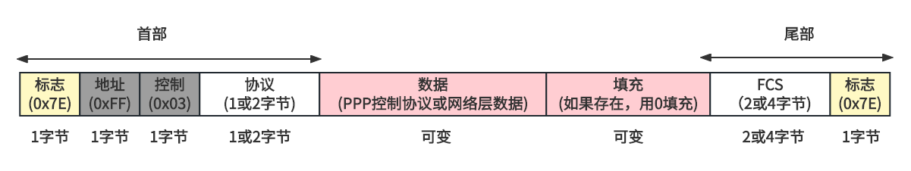
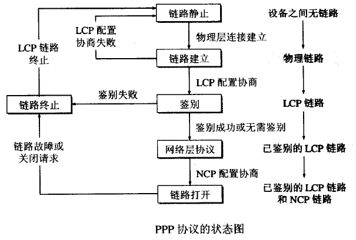

# PPP简介
点对点协议简称PPP协议，工作在数据链路层。设计目的主要是用来通过拨号或专线方式建立点对点连接发送数据，使其成为各种主机、 网桥和路由器之间简单连接的一种共通的解决方案。   

# PPP组成
1. 一种将封装了多种协议的数据报传输到串行链路的方法   
2. 链路控制协议(Link Control Protocol, LCP)，LCP协议是PPP协议的一部分。它用于建立、配置、测试数据链路的连接   
3. 一套网络控制协议(Network Control Protocol, NCP)，NCPs是一系列协议，用于建立和配置不同的网络层协议   

# PPP帧
   
总体格式是首部+数据部分+尾部   
首部从左至右依次是帧定界符，表示帧开始   
地址字段，因为点对点协议仅作用于两个实体，发送方无需知道对方的地址，所以没有实际作用   
控制字段，也没有实际作用   
协议类型，指定信息部分的类型   
尾部从左至右依次是帧检验序列，用于校验帧在传输过程中是否出现差错   
帧定界符，表示帧的结束   

# PPP链路建立
   
PPP协议一般用于用户拨号接入ISP，工作流程如下   

1. LCP配置协商   
用户点击“连接”，建立了物理层连接后，双方就要进行链路层上某些配置的协商，比如链路上的最大帧长、采用什么鉴别协议等。

2. 用户验证   
这个阶段，ISP为了防止用户恶意使用网络资源，会对用户的账号密码进行校验，使用PAP（Password Authentication Protocol）或者CHAP（Challenge-Handshake Authentication Protocol）协议，其中PAP协议的安全性较低

3. NCP配置协商   
当用户通过用户验证，双方就要用进行网络层上某些配置的协商，比如网络层采取什么协议，用户的IP地址是什么

## LCP
链路控制协议LCP(Link Control Protocol)：LCP协议是用来建立、测试、监控、终止链路的连接。在PPP工作的建立阶段和终止阶段，必须通过交换LCP分组控制链路的建立和终止。在PPP工作的打开阶段，不仅可以发送网络层的报文，也可以发送LCP的回声请求和回声应答分组，测试链路是否正常连接。   

## 鉴别认证
### PAP
口令鉴别协议(Password Authentication Protocol, PAP)：这是一种非常简单的鉴别协议。它在PPP的协议字段的值为:0xC023。发送方需要提供鉴别身份(通常是用户名)和口令(俗称的密码)，接收方会检测身份和口令的合法性，决定是否接受连接。   

### CHAP
查询握手鉴别协议(Challenge Handshake Authentication Protocol, CHAP)：CHAP使用一个三步握手的鉴别方式，它不需要传输口令。口令一开始发送方和接收方都是已知的。它在PPP的协议字段的值为:0xC223。   
1. 接收方会给发送方一个包含查询值的查询分组。   
2. 发送方根据该查询分组结合口令生成一个结果，并把该结果作为响应分组发送给接收方。   
3. 接收方也用同样的方式生成一个结果，如果和发送方的结果一致，就允许访问；否则访问被拒绝。   

## NCP
网络控制协议(Network Control Protocol, NCP)：这实际是一个协议组合，有多个NCP协议。因为PPP协议支持多种网络层协议，比如IP协议，Xerox协议等，每一种网络层协议在发送数据报之前，都需要对应的网络控制协议为其配置相关信息。比如IP数据报在链路层传输前，就需要IPCP协议配置好用来承载IP数据报的链路。   

# PPPoE
[协议应用PPPoE](./../../协议应用/pppoe/pppoe.md)   