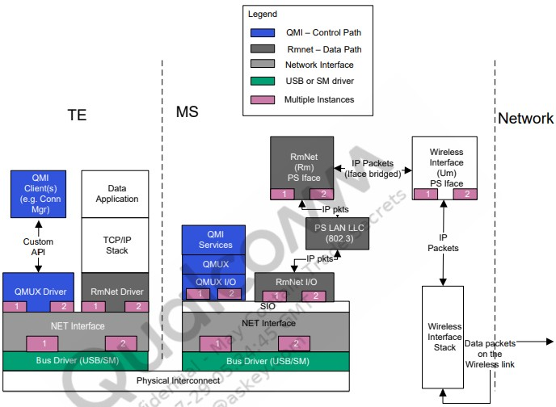

# 1. RmNet for modem IPAs
QTI-MSM™中的RmNet特性 设备模拟所连接的终端设备（TE）的网络接口。MSM的RmNet功能在连接到TE时充当网络适配器，并向连接的TE提供分组数据连接。术语TE包括所有形状因素，包括以下装置：
PC、笔记本或应用程序处理器。网络（RmNet）设备与其他逻辑设备（例如，调制解调器、诊断、NMEA）共存。
RmNet依赖于TE和移动站（MS）之间的任何控制信令的控制接口。

例如，按需启动数据会话、发送任何通知等。目前，RmNet仅支持高通MSM接口（QMI）作为TE和MS之间信令的控制信道。QMI定义了TE和MS上应用程序或驱动程序之间通信的框架和消息。

支持的功能如下：
IPv4数据连接
自动连接模式
多RmNet
原始IP模式（并非所有产品都支持）
QoS（并非所有产品都支持）
支持互连–USB和共享内存
IPv6数据连接

## 1.1. RmNet 结构

在数据路径中，RmNet不使用PPP，因此消除了TE和MS之间链路上与PPP相关的高级数据链路控制（HDLC）成帧或解帧开销
默认情况下，RmNet使用802.3帧。RmNet还支持传输原始IP数据包（请参阅原始IP一节）。当使用原始IP模式时，不使用LAN LLC和ARP模块
DHCP v4服务器和PS ARP模块仅用于IPv4。如果TE在TE上使用DHCP进行IP地址配置，则使用DHCP v4 server（请参阅RmNet地址分配后的TE IP一节）
ICMPv6模块仅用于IPv6、邻居发现、DAD和无状态地址自动配置
单个RmNet接口（实例）一次仅支持IPv4或IPv6中的一种。要同时拥有IPv4和IPv6数据会话，每个会话必须通过单独的RmNet接口

## 1.2. RmNet帧格式
本节讨论通过RmNet互连（USB，共享内存）传输的数据包支持的帧格式。

### 1.2.1. 数据链路层
数据链路层格式如下图所示。在此格式中，IP数据包在802.3帧内发送。这是默认的数据格式。

### 1.2.2. 原始IP
在这种格式中，交换原始IP数据包时不需要任何802.3报头。TE上的QMUX驱动程序向MS发送QMI_ CTL请求以使用原始IP数据格式。在建立任何数据会话之前，必须在通电初始化期间执行此操作。TE应仅在MS发送指示使用原始IP模式的响应之后才采用原始IP数据格式；否则，默认为802.3模式   

### 1.2.3. QoS流报头
仅当使用QMI QoS功能时，才应使用QoS流标头数据格式。QMI QoS功能通过无线网络向TE上的应用程序提供对QoS的访问。在这种数据格式中，QoS流报头添加在数据包的前面   

客户端使用QMI_ CTL消息通知MS此数据格式，如下图所示。在建立任何数据会话之前，必须在通电初始化期间执行此操作。TE应仅在从MS接收到成功响应后才采用此数据格式   

## 1.3. RmNet数据会话管理
本节讨论了涉及RmNet数据会话设置和结束的各种场景，如下所示：
1. 数据会话建立–描述TE请求MS建立数据会话时涉及的步骤
2. TE IP配置–描述为TE分配IP地址和其他IP配置的过程；以下是两种可能的方法
    使用标准协议
        DHCP – TE使用DHCP过程获取IP配置（对于IPv4）
        使用ICMPv6的无状态地址自动配置（适用于IPv6）
    使用QMI – TE使用QMI消息获取IP配置（仅适用于IPv4）

3. 数据会话拆除—描述TE请求MS拆除数据会话时涉及的步骤
4. 自动连接模式–描述自动连接操作模式，在这种模式下，数据会话自动建立或拆除，无需TE的明确请求
5. IP地址更改–描述通知并向TE传达新IP配置的过程

数据会话建立或结束过程中涉及的组件包括：
1. TE OS堆栈–运行在TE上的本机OS数据堆栈
2. QMI WDS客户端–QMI无线数据服务客户端发送和接收WDS消息；负责使用特定于主机操作系统的API向TE OS堆栈通知数据连接和IP配置
3. QMUX驱动程序–QMUX为QMI客户端和服务提供传输。客户端通过运行在TE上的QMUX驱动程序公开的API发送和接收QMI消息。
4. MS–QMI服务所在的移动站
5. 网络–无线网络

### 1.3.1. RmNet数据会话设置
RmNet数据会话的前提条件和后条件如下：
    前提条件–QMI WDS客户端已成功从MS获取客户端ID。
    后条件–MS已从网络获得IP配置。   

以下步骤对应于上图：

1. TE上的客户端发送启动RmNet数据会话的请求。
2. QMUX驱动程序在将请求发送给MS之前将QMUX头添加到请求中。
3. 在接收到该请求时，MS启动启动数据会话OTA的过程。
4. 一旦OTA数据会话启动，MS向发起请求的客户端发送指示成功的响应。在呼叫发起失败时，MS发送失败响应，并且以下步骤不会发生。
5. QMUX驱动程序删除QMUX头并将响应消息传递给适当的客户端。
6. MS还发送广播指示以通知数据会话现在已连接。
7. TE上的QMUX驱动程序将其转发给QMI WDS客户端。

### 1.3.2. RmNet地址分配后的TE IP
#### Ipv4地址使用DHCP
使用DHCPv4的前提条件和后条件如下：
    前提条件–必须在此之前设置数据会话。
    后置条件–TE IP配置完成并传输数据包。   

以下步骤对应于上图：
1. WDS客户端通知运行在TE上的OS数据链路已建立。
2. 步骤2至5：在TE和MSM之间进行DHCP协商，以向TE分配IP地址和其他IP配置。分配给TE的IP地址与网络分配给MS的IP地址相同。

#### 使用IPv6地址的无状态地址自动配置
IPv6地址无状态地址自动配置的前提条件和后条件如下：
    前提条件–必须在此之前设置数据会话。
    后置条件–TE IP配置完成并传输数据包。   

以下步骤对应于上图：
1. WDS客户端通知运行在TE上的OS数据链路已建立。
2. 步骤2至4.TE必须进行DAD和无状态地址自动配置以配置地址。

#### 使用QMI(仅限Ipv4)
使用QMI的前提条件和后条件如下：
    前提条件–必须在此之前设置数据会话。
    后置条件–TE IP配置完成并传输数据包。
.jpg)

以下步骤对应于上图：
1. 步骤1至2，WDS客户端向MS发送请求，以查询要在TE上设置的IP配置。
2. 在步骤3至4中，MS用IP地址和其他配置进行响应。分配给TE的IP地址与网络分配的IP地址相同。
3. 步骤5，客户端然后使用特定于主机的API在TE上配置该IP地址和其他配置参数。

#### RmNet保护定时器
当与无线网络建立数据会话时，启动保护定时器。TE需要在该定时器到期之前查询其IP配置（如使用DHCP作为IPv4地址到使用QMI（仅IPv4）的部分所示）。如果在TE从设备查询IP配置之前计时器过期，则数据会话被中断。这样做是为了节省无线网络资源。保护定时器值设置为2分钟。

### 1.3.3. RmNet数据会话结束
拆除RmNet数据会话的前提条件和后条件如下：
    前提条件–数据会话设置较早。
    后置条件–数据会话被中断，TE失去IP连接

数据会话结束发生如下：
1. 客户端发送停止RmNet数据会话的请求。
2. QMUX驱动程序将QMUX报头添加到消息中，并将请求发送给MS。
3. MS发起呼叫分离OTA。
4. MS发送以客户端为目的地的成功响应。
5. QMUX驱动程序删除QMUX头并将响应传递给适当的客户端。
6. MS还发送广播指示以通知数据会话被断开。
7. TE上的QMUX驱动程序将其转发给WDS客户端。
8. WDS客户端通知TE上运行的OS数据链路已终止。

### 1.3.4. RmNet自动连接会话建立和结束
前面的部分说明了手动启动和终止数据会话的机制。为了支持常开操作，RmNet具有自动连接模式，启用该模式后，当设备连接到TE时，会自动启动数据会话，当设备与TE断开连接时，会将其自动断开。自动连接仅适用于RmNet上的即插即用互连，如USB

要设置自动连接数据会话，请执行以下操作：
1.  MS获知USB已连接。例如通过DTR高。
2.  MS启动数据会话OTA。
3.  MS发送广播QMI无线分发服务（WDS）指示以通知数据会话已连接。
4.  TE上的QMUX驱动程序将其转发给WDS客户端。
5.  然后，WDS客户端通知TE上运行的OS数据链路已建立。
6.  TE的IP配置使用DHCP或QMI执行，如下文TE IP部分所示RmNet地址分配。

要设置自动连接数据会话结束，请执行以下操作
1.  MS获知USB断开。例如通过DTR低。
2.  MS中断数据会话OTA。
3.  MS发送广播QMI WDS指示以通知数据会话断开。
4.  TE上的QMUX驱动程序将其转发给WDS客户端。
5.  然后，WDS客户端通知TE上运行的OS数据连接已终止。

在自动连接模式操作期间，数据会话因USB断开以外的原因断开。例如，信号丢失等。RmNet设备尝试使用退避机制重新建立数据会话。RmNet以1秒的定时器启动。每次数据会话建立尝试失败（设备的较低层或网络拒绝），它会将定时器后退两倍，然后MS在定时器过期时再次尝试。定时器回退最多持续两分钟，之后RmNet每两分钟重试一次。在此过程中，如果任何尝试成功，定时器将重置回一秒的原始值。

### 1.3.5. TE上的IP地址更改
更改IPv4或IPv6地址的前提条件和后条件如下：
    前提条件–数据会话已启动，TE上的IP地址已配置
    后置条件–通知TE IP地址更改，并再次执行TE IP地址配置

要更改IP地址，请执行以下操作：
1. 发生切换，导致MS IP地址改变。
2. MS发送广播WDS指示以通知数据会话已连接，但需要重新配置。
3. TE上的QMUX驱动程序将其转发给QMI WDS客户端。
4. WDS客户端通知TE上运行的OS必须重新配置数据链路IP配置。

## 1.4. 与不同设备和接口的互连
目前，通过USB和共享内存互连支持RmNet。支持一个或多个网络设备（RmNet逻辑设备）。
每个逻辑设备必须有单独的数据和控制通道。信道独立性意味着每个信道必须像通信信道之间没有物理耦合一样工作，包括（但不限于）单独的Tx和Rx路径队列、独立的流控制机制和独立的数据传输调度。互连必须提供交换的数据包的帧，即，描绘传输协议的包边界。
为了支持多个逻辑设备，底层互连必须提供一种机制，用于在单个物理连接上多路复用多个逻辑器件。

## 1.5. 多RmNet
Multi-RmNet是指支持多个逻辑设备，即网络接口。Multi-RmNet功能支持多个IP数据会话（每个会话是IPv4或IPv6）。最多同时使用三个RmNet实例。

每个RmNet逻辑设备在TE上显示为独立的网络适配器，能够获得自己的IP地址并独立传输数据。下图显示了两个RmNet实例的情况。每个实例在单独的端口上运行，并且独立于其他实例：

## 1.6. RmNet配置参数
下表列出了支持的RmNet配置参数。这些仅适用于USB上的RmNet。
1. 配置参数：USB_CURRENT_DEVICE (FS-USB) – NV item 2782、HS_USB_CURRENT_COMPOSITION (HS_USB) - NV item 4526
   描述：确定RmNet是否是USB组合的一部分；必须设置为包含RmNet的合成值
   默认值：0（RmNet不存在）

2. 配置参数：RMNET_AUTOCONNECT – NV item 3534
   描述：确定是否启用RmNet自动连接；仅适用于USB上的RmNet；它由两部分组成。索引和启用或禁用设置；该索引表示RmNet实例（目前仅支持一个实例，即索引0）；第二个组件设置为1或0，以启用或禁用该特定索引上的自动连接
   默认值：｛0，0｝（自动连接已禁用）

## 1.7. 非IP数据传输
非IP数据传输（NIDD）是NB引入的一项新功能。
请参阅以下规范中的非IP数据传输支持（NIDD）：
用于演进型通用地面无线接入网（E-UTRAN）接入的通用分组无线业务（GPRS）增强功能（3GPP TS 23.401版本14.4.0）

### 检查平台或构建是否支持它
非IP根据FR38978（CR2010416和CR2046848）实施。它由MPSS.JO3.0.2的后期CS交付。在此之后的任何构建都应包括这些CRs。
对于任何其他平台或构建，检查这些CRs是否适用。

### 支持的调用流
支持：仅支持AP嵌入式和系留RmNet调用。
不支持：调制解调器嵌入呼叫，DUN。

