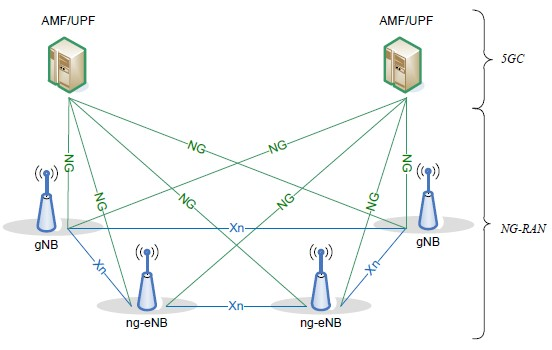
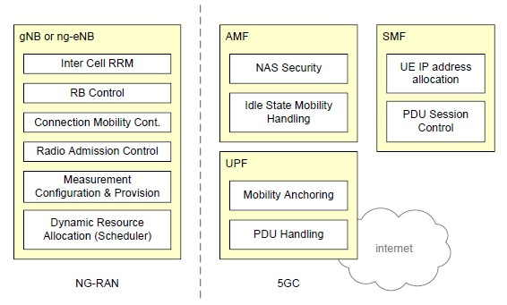
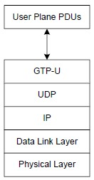
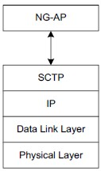

# 1. 全面架构
## 1.1. 架构
架构如下图：   
   

gNB 向UE提供NR用户平面和控制平面终端。   
ng-eNB 向UE提供E-UTRA用户平面和控制平面终端。   

gNB和ng-eNB之间为Xn接口。   
gNB、ng-eNB通过NG接口连接到5GC，其中连接到AMF的是NG-C接口，连接到UPF的是NG-U接口。   

## 1.2. 功能
功能分化如下图：   
   

### 1.2.1. gNB和ng-eNB功能
1. 无线资源管理：无线承载控制、无线接入控制、连接流动性管理、在上行和下行上向UE动态分配资源   
2. IP和以太网报头压缩，上行数据解压缩，数据加密和完整性保护   
3. 当无法根据UE提供的信息确定到AMF的路由时，在UE附件处选择AMF   
4. 将用户平面数据路由到UPF   
5. 将控制平面信息路由到AMF   
6. 连接建立和释放   
7. 调度和传输寻呼消息   
8. 调度和传输系统广播信息   
9. 用于移动和调度的测量和测量报告配置   
10. 上行链路中的传输级分组标记   
11. 会话管理   
12. 支持网络切片   
13. Qos流管理和映射到数据无线承载   
14. 支持在RRC_INACTIVE状态的UE   
15. NAS消息的分发功能   
16. 无线接入网共享   
17. 双连接   
18. NR和E-UTRA之间的紧密互联   
19. 维护用户平面CIoT 5GS优化的安全和无线电配置

### 1.2.2. AMF功能(接入和移动性管理功能)
1. NAS 信令终端   
2. NAS 信令安全   
3. AS 安全控制   
4. 用于3GPP接入网络之间移动性的CN节点间信令   
5. 空闲模式UE可达性，包括控制和执行寻呼重传   
6. 注册区域管理   
7. 支持系统内和系统间的移动性   
8. 接入认证   
9. 接入授权，包括漫游权限检查   
10. 流动性管理控制，包括订阅和策略   
11. 支持网络切片   
12. SMF选择   
13. CIoT 5GS优化选择   

### 1.2.3. UPF功能(用户平面功能)
1. 连接到数据网络的外部PDU会话点   
2. 分组路由和转发   
3. 分组检查和用户平面是策略规则实施的一部分   
4. 流量使用上报   
5. 上行链路分类器，用于支持将业务流路由到数据网络   
6. 支持多宿主PDU会话的分支点   
7. 用户平面的QoS处理，例如包过滤、选通、UL/DL速率强制   
8. 上行流量验证   
9. 下行分组缓冲和下行数据通知触发   

### 1.2.4. SMF功能(会话管理功能)
1. 会话管理   
2. UE IP分配和管理   
3. UP功能的选择和控制   
4. 配置UPF处的流量控制，以将流量路由到正确的目的地   
5. 控制策略执行和QoS的一部分   
6. 下行链路数据通知   

## 1.3. 网络接口
### 1.3.1. NG 接口
#### 1.3.1.1. NG 用户平面 NG-U
   
NG-RAN和UPF之间传输用户平面PDU数据   

#### 1.3.1.2. NG 控制平面 NG-C
   
SCTP用于信令消息的可靠传输   
分发信令PDU数据   
NG-C提供如下功能：   
1. NG接口管理   
2. UE内容管理   
3. UE移动性管理   
4. NAS消息传输   
5. 寻呼   
6. PDU会话管理   
7. 配置传输   
8. 警告消息传输   

### 1.3.2. Xn 接口
#### 1.3.2.1. Xn 用户平面
   
Xn-U接口定义于两个NG-RAN节点之间。   
提供如下功能：   
1. 数据转发   
2. 流控制   

#### 1.3.2.2. Xn 控制平面
   
Xn-C定义于两个NG-RAN节点之间。   
提供如下功能：   
1. Xn 接口管理   
2. UE流动性管理，包括内容转发和RAN寻呼   
3. 双连接   

## 1.4. 无线协议架构
### 1.4.1. 用户平面
   

### 1.4.2. 控制平面
   

## 1.5. 多无线双连接 **
NR-RAN支持多无线双连接MR-DC操作，处于RRC_CONNECTED状态的UE被配置为利用两个不同调度器提供的无线资源，两个不同NR-RAN节点通过非理想回程连接，一个提供NR连接，另一个提供E-UTRA或NR接入。   

## 1.6. 无线接入网共享 **
NG-RAN 支持无线接入网共享。   
如果NR访问是共享的，则在共享小区中广播的系统信息指示PLMN、PNI NPN和SNPN的每个子集的TAC和小区标识。NR访问仅为每个PLMN、SNPN或PNI-NPN的每个小区提供一个TAC和一个小区标识。   

## 1.7. 综合接入和回程 IAB *
注:IAB包括两部分。首先是接入，智能手机等本地设备能够与最近的小型基站通信；其次是回程，小型基站能够与网络其他部分通信。   
回程：在电信系统中，回程是连接主干网和边缘网的一部分。例如，在移动电话系统中，塔台连接到本地电话，形成一个大型的本地网络。这些塔与一个中央路由系统通信，该系统能够与系统中的所有塔进行通信。本地塔网络是一个边缘系统，中央系统是主干，它们之间的通信方式是回程。   

### 1.7.1. 架构
综合接入和回程支持NG-RAN中的无线中继。中继节点指IAB节点，支持通过NR的接入和回程。网络侧上的NR回程终端节点是IAB-donor，它是一个具有支持IAB附加功能的gNB。回程可以通过一个或多个跃点进行。   

IAB-node上的gNB DU功能也称为IAB-DU。   
除了gNB DU功能外，IAB-node还支持称为IAB-MT的UE功能的子集，其包括例如物理层、第2层、RRC和NAS功能，以连接到另一IAB-node或IAB-donor的gNB DU，连接到IAB-donor上的gNB CU，以及连接到核心网络。   

IAB-node 能够通过SA模式或EN-DC接入网络。在EN-DC，IAB-node通过E-UTRA连接到MeNB，而IAB-donor在X2-C终点作为SgNB。   

   

...

## 1.8. 非公共网 NPN
1. 独立组网的NPN网络，Standalone NPN，该网络不依赖于PLMN网络由SNPN运营商运营。   

2. 非独立组网的NPN网络，Public network integrated NPN，该网络依赖于PLMN网络由传统运营商运营。   

# 2. 物理层 **
...

# 3. 层2
## 3.1. 概述
NR的层2包含媒体接入控制MAC、无线链路控制RLC、分组数据汇聚协议PDCP、服务数据适配层SDAP。   
物理层为MAC层提供传输信道。   
MAC层为RLC层提供逻辑信道。   
RLC层为PDCP层提供RLC信道。   
PDCP层为SDAP层提供无线承载。   
SDAP层为5GC 提供QoS流。   

下行链路层2结构如下图：   
   

上行链路层2结构如下图：   
   

无线承载分为两部分：   
1. 用户平面数据的数据无线承载DRB   
2. 控制平面数据的信令无线承载SRB   

对于IAB，NR中层2包括MAC、RLC、BAP(回程适配协议)、PDCP和可选的SDAP。   

IAB-donor 用户面下行层2如下图：   
   

IAB-node 下行层2如下图：   
   

IAB-node 上行层2如下图：   
   

## 3.2. MAC层
### 3.2.1. 服务和功能
MAC层包含以下服务和功能：   
1. 逻辑信道和传输信道之间的映射。   
2. 将属于一个或不同逻辑信道的MAC SDU复用/解复用到传输信道上的传输块（TB）中或从传输信道上的物理层传输到传输块（TB）。   
3. 上报信息调度。   
4. 通过HARQ进行纠错。   
5. 通过动态调度实现UE的优先级处理。   
6. 通过逻辑信道优先级排序在一个UE的逻辑信道之间进行优先级处理。   
7. 一个UE重叠资源之间的优先级处理。   

### 3.2.2. 逻辑信道
逻辑信道分为两类：控制信道和传输信道。   

#### 3.2.2.1. 控制信道
1. BCCH，广播控制信道，广播系统控制信息的下行信道。   
2. PCCH，寻呼控制信道，携带寻呼消息的下行信道。   
3. CCCH，公共控制信道，UE和网络之间传输控制信息的信道，这个信道于UE与网络没有RRC连接时使用。   
4. DCCH，专用控制信道，UE和网络之间传输专用控制信息的点对点双向信道，这个信道于UE与网络有RRC连接时使用。   

#### 3.2.2.2. 传输信道
1. DTCH，专用流量信道，点对点信道，UE专用，传输用户信息，DTCH存在于上行和下行链路中。   

### 3.2.3. 映射到传输信道
#### 3.2.3.1. 下行链路
1. BCCH映射到BCH   
2. BCCH映射到DL-SCH   
3. PCCH映射到PCH   
4. CCCH映射到DL-SCH   
5. DCCH映射到DL-SCH   
6. DTCH映射到DL-SCH   

#### 3.2.3.2. 上行链路
1. CCCH映射到UL-SCH   
2. DCCH映射到UL-SCH   
3. DTCH映射到UL-SCH   

### 3.2.4. HARQ
HARQ功能确保了第1层对等实体之间的传递。当物理层未配置为用于下行链路/上行链路空间复用时，单个HARQ过程支持一个TB，并且当物理层配置为用于下行链路/上行链路空间复用时，单个HARQ过程支持一个或多个TB。   

## 3.3. RLC层
### 3.3.1. 传输模式
RLC支持以下三种传输模式：   
1. TM Transparent Mode 透明模式   
2. UM Unacknowledged Mode 未确认模式   
3. AM Acknowledged Mode 已确认模式   

RLC配置是针对逻辑信道的，不依赖于数字和/或传输持续时间，ARQ可以对逻辑信道配置的任何数字和/或传输持续时间进行操作。   

### 3.3.2. 服务和功能
1. 上层PDU的传输   
2. 序列编号独立于PDCP中的序列编号（UM和AM）   
3. 通过ARQ进行纠错（仅限AM）   
4. RLC SDU的分段（AM和UM）和重新分段（仅AM）   
5. SDU（AM和UM）的重新组装   
6. 重复检测（仅AM）   
7. RLC SDU丢弃（AM和UM）   
8. RLC重建   
9. 协议错误检测（仅限AM）   

### 3.3.3. ARQ 自动重传请求
1. ARQ基于RLC状态报告重新传输RLC SDU或RLC SDU段   
2. 当RLC需要时，使用RLC状态报告轮询   
3. RLC接收器还可以在检测到缺失的RLC SDU或RLC SDU段后触发RLC状态报告   

## 3.4. PDCP层
### 3.4.1. 服务和功能
1. 数据传输(用户面和控制面)   
2. PDCP SNs的维护   
3. 用ROCH协议进行头压缩和解压缩   
4. 用EHC协议进行头压缩和解压缩   
5. 上行链路的PDCP SDUs的压缩和解压缩，仅默认基于UDC   
6. 加密和解密   
7. 完整性保护和完整性验证   
8. 基于定时器的SDU丢弃   
9. 对于承载分片，路由   
10. 复制   
11. 重新订购和有序交付   
12. 无序交货   
13. 重复丢弃   

由于PDCP不允许在DL和UL中循环计数，因此应由网络来防止这种情况发生。   

## 3.5. SDAP层
SDAP的服务和功能如下：   
1. Qos流和数据无线承载之间的映射   
2. 在上行和下行分组中标记Qos流ID(QFI)   

## 3.6. 层2数据流
1. SDU   
SDU，Service Data Unit，服务数据单元，表示由上一层传递到本层还未被处理的数据。   

2. PDU   
PDU，Protocol Data Unit，协议数据单元，表示将本层SDU经过特定格式处理后将传递到下一层的数据。   

   

## 3.7. 载波聚合CA **

## 3.8. 双连接 **

## 3.9. 补充上行链路 **

## 3.10. 带宽适配 **

## 3.11. 回程适配协议子层
### 3.11.1. 服务和功能
1. 传输数据   
2. 分组路由到下一个跃点   
3. 确定上层数据包的BAP目的地和BAP路径   
4. 确定路由到下一跳的分组的出口BH RLC信道   
5. 区分要传送到上层的流量和要传送到出口链路的流量   
6. 流量控制反馈和轮询信令   
7. BH RLF检测指示、BH RLF恢复指示和BH RLF指示   

### 3.11.2. 从高层到层2的流量映射 **

## 3.12. 多发送/接收点操作 **

# 4. RRC层
## 4.1. 服务和功能
通过Uu接口的RRC层的服务和功能如下：   
1. 广播与AS和NAS相关的系统消息   
2. 由5GC或NG-RAN建立的寻呼   
3. 在UE和NG-RAN之间建立、维护和释放RRC连接，包括 载体聚合的添加、修改和释放 和 NR中或E-UTRA和NR之间双重连接的添加、修改和释放   
4. 安全功能包括密钥管理   
5. 建立、配置、维护和释放信令无线承载及数据无线承载   
6. 移动性功能包括 切换和上下文转移 UE小区选择和重选以及小区选择和重选的控制 Inter-RAT移动   
7. QoS功能   
8. UE测量报告及其控制   
9. 无线链路故障的检测和恢复   
10. NAS和UE之间的NAS消息传输   
11. Uu接口上RRC子层的侧链特定服务和功能包括   
	通过系统信息或专用信令配置侧链资源分配   
	UE侧链信息报告   
	与侧链相关的测量配置和报告   
	报告SL流量模式的UE辅助信息   

## 4.2. 协议状态
### 4.2.1. RRC_IDLE
1. PLMN选择   
2. 广播系统消息   
3. 小区移动重选   
4. 5GC建立的移动终端设备寻呼   
5. NAS配置的用于CN寻呼的DRX   

### 4.2.2. RRC_INACTIVE
1. PLMN选择   
2. 广播系统消息   
3. 小区移动重选   
4. NG-RAN建立的寻呼   
5. 基于RAN的通知区域（RNA）由NG-RAN管理   
6. NG-RAN配置的用于RAN寻呼的DRX   
7. UE建立的5GC-NG-RAN连接   
8. UE不活动AS内容存储在NG-RAN和UE中   
9. NG-RAN知道UE所属的RNA   
10. 通过为SDT配置的无线承载向UE传输单播数据和/或信令，或从UE传输单播数据和/或信令   

### 4.2.3. RRC_CONNECTED
1. UE建立的5GC NG-RAN连接   
2. UE活动AS内容保存在NG-RAN和UE中   
3. NG-RAN知道UE所属的小区   
4. 发送到UE或从UE接收单播消息   
5. 包括测量的网络移动性管理   

## 4.3. 系统信息处理
### 4.3.1. 概览
系统信息包括MIB和SIB   

#### 4.3.1.1. MIB
MIB包含接收进一步系统信息所需的小区禁止状态信息和基本物理层信息，例如CORESET#0配置。MIB在BCH上定期广播。   

#### 4.3.1.2. SIB
1. SIB1定义其他系统信息块的调度，并包含初始访问所需的信息。SIB1也称为剩余最小SI（RMSI），在DL-SCH上定期广播或在DL-SCH上以专用方式发送给RRC\U连接中的UE。   
2. SIB2包含小区重新选择信息，主要与服务小区相关。   
3. SIB3包含与小区重新选择相关的服务频率和频率内相邻小区的信息。   
4. SIB4包含与小区重新选择相关的其他NR频率和频率间相邻小区的信息。   
5. SIB5包含与小区重新选择相关的E-UTRA频率和E-UTRA相邻小区的信息。   
6. SIB6包含ETWS主通知。   
7. SIB7包含ETWS次要通知。   
8. SIB8包含CMAS警告通知。   
9. SIB9包含与GPS时间和协调世界时（UTC）相关的信息。   
10. SIB10包含SIB1中列出的NPN的人类可读网络名称（HRNN）。   
11. SIB11包含与空闲/非活动测量相关的信息。   
12. SIB12包含与NR侧链通信相关的信息。   
13. SIB13包含与V2X侧链通信的SystemInformationBlockType21相关的信息。   
14. SIB14包含与V2X侧链通信的SystemInformationBlockType26相关的信息。   
15. SIB15包含与灾难漫游相关的信息。   
16. SIB17包含与RRC_IDLE/RRC_INACTIVE中UE的TRS配置相关的信息。   
17. SIB18包含与SIB1中列出的SNPN关联的网络选择组ID（GIN）相关的信息。   
18. SIB19包含服务小区和/或相邻小区的NTN特定参数。   
19. SIB20包含MCCH配置。   
20. SIB21包含与MBS广播接收的服务连续性相关的信息。   
21. SIBpos包含定位辅助数据。   

系统信息资源调配如下图：   
   

### 4.3.2. 调度
MIB映射在BCCH而在BCH上进行，SIM映射在BCCH而在DL-SCH上动态进行。   

### 4.3.3. SI Modification **

### 4.3.4. 接入控制
NG-RAN支持过载和访问控制功能，如RACH后退、RRC连接拒绝、RRC连接释放和基于UE的访问限制机制。   

### 4.3.5. UE能力检索框架

...

