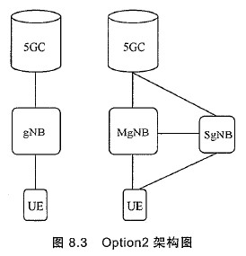
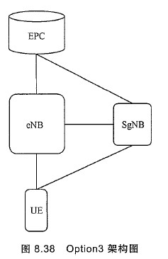
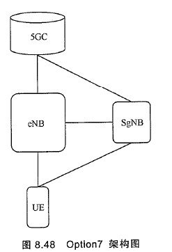
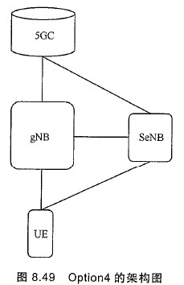
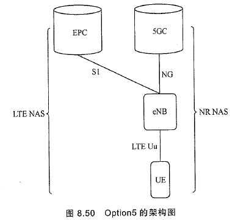

# 1. 5G概述
## 1.1. 5G性能指标
1. 用户体验速率：0.1~1Gbit/s
2. 连接数密度：100万个连接/平方千米
3. 端到端时延：毫秒级
4. 流量密度：数十太比特每秒/平方千米
5. 移动性：500km/h以上
6. 峰值速率：数十吉比特每秒

# 2. 5G系统架构
   
5G系统架构分为两部分，包括5G核心网(5GC)和5G接入网(NG-RAN)。   

## 2.1. 5GC
5GC包括AMF、UPF、SMF三个主要逻辑节点。   
控制平面分为AMF和SMF两个逻辑节点。AMF负责移动性管理，SMF负责会话管理功能。   
用户平面的UPF代替了LTE网络中的SGW和PGW。   

## 2.2. NG-RAN
NG-RAN由gNB和ng-eNB两种节点共同组成。   
gNB是提供到UE的NR控制平面与用户平面的协议终止点。   
ng-eNB是提供到UE的E-UTRA控制平面与用户平面的协议终止点。   
gNB之间、ng-eNB之间以及gNB和ng-eNB通过Xn接口进行连接。   
5G接入网与核心网之间通过NG接口进行连接，gNB、ng-eNB和AMF之间是NG-C接口，和UPF之间是NG-U接口。   

## 2.3. NG 接口
NG接口可以实现AMF/UPF和NG-RAN节点的多对多连接。   

## 2.4. 5G 网络架构及接口基本原则
1. 信令和数据传输在逻辑上独立的
2. NG-RAN和5GC核心网在功能上分离
3. NG-RAN与5GC的寻址方案以及传输功能的寻址方案不能绑定
4. RRC连接的移动性管理完全由NG-RAN进行控制
5. NG-RAN接口上的功能定义应尽量简化，尽可能减少选项
6. 多个逻辑节点可以在同一个物理网元上实现
7. NG-RAN接口时开放的逻辑接口，应满足不用厂家设备之间的互联互通

## 2.5. 5G 网络架构功能划分
    

## 2.6. 无线接口
无线接口协议栈主要分为三层两面，三层包括物理层(L1)、数据链路层(L2)、网络层(L3)，两面是指控制平面和用户平面。   

### 2.6.1. 物理层
物理层位于无线接口最底层，提供物理介质中彼特里卢传输所需要的所有功能。   
物理层为MAC层和高层提供信息传输的服务，其中物理层提供的服务通过传输信道来描述。   

#### 2.6.1.1. 下行传输信道类型
1. 广播信道 BCH Broadcast Channel   
2. 下行共享信道 DL-SCH Downlink Shared Channel   
3. 寻呼信道 PCH Paging Channel   

#### 2.6.1.2. 上行传输信道
1. 上行共享信道 UL-SCH Uplink Shard Channel   
2. 随机接入信道 RACH Randoom Access Channel   

#### 2.6.1.3. 传输信道到物理信道映射
1. 物理广播信道 PBCH   
2. 物理下行链路控制信道 PDCCH   
3. 物理下行链路共享信道 PDSCH   
4. 物理随机接入信道 PRACH   
5. 物理上行链路控制信道 PUCCH   
6. 物理上行链路共享信道 PUSCH   

   

物理层数据传输过程如下图：   
   

### 2.6.2. 数据链路层
数据链路层包括媒体接入控制MAC、无线链路控制RLC、分组数据汇聚协议PDCP、服务数据调整协议SDAP四个子层。   
数据链路层下行架构如下图：   
   
数据链路层上行架构如下图：   
   
层与层之间的连接点称为服务接入点SAP。物理层为MAC子层提供传输信道级的服务，MAC子层为RLC子层提供逻辑信道级的服务，PDCP子层为SDAP层提供无线承载级的服务，SDAP为上层提供5GC QoS流级的服务。   
无线承载分为两类：用户面的DRB和控制面的信令无线承载SRB。   

### 2.6.3. RRC层
RRC 协议模块功能如下：   
1. 发送系统信息广播消息(NAS层相关和AS层相关)
2. 发送由核心网5GC和接入网NG-RAN发起的寻呼消息
3. UE和NG-RAN之间的RRC连接的建立、维护和释放
4. 安全功能密钥管理
5. 无线承载管理
6. 移动性管理
7. QoS管理
8. UE测量报告和控制
9. 无线链路失败的检测和恢复
10. MAS消息的传输   

RRC协议状态为3个：RRC空闲状态、RRC非激活状态、RRC连接状态。   
   

## 2.7. 物理层系统设计架构
物理层以传输信道形式为MAC层提供服务。负责物理层HARQ处理、调制编码、多天线处理、信号到物理时频资源映射等一系列功能。   

### 2.7.1. OFDM加MIMO技术作为物理量层设计基础
在OFDM技术上，5G下行与LTE相同采用OFDMA，5G上行采用SC-FDMA和OFDMA。   

### 2.7.2. 采用更灵活的基础系统架构设计
1. 灵活的帧结构设计   
2. 灵活的双工设计   

### 2.7.3. 一体化的大规模天线设计
大规模天线设计时5G NR 设计的重要基石。   
波束赋形技术，尤其时混合波束赋形技术可以有效提升大规模天线的覆盖距离和传输速率，称为NR大规模天线设计的核心。   

### 2.7.4. 采用多项新技术
...

## 2.8. 物理层关键技术
...

# 3. 5G NR 基础参数及接入设计
## 3.1. 帧结构
NR 采用10ms的帧长度，一个帧中包含10个子帧。5个子帧组成一个半帧，编号0~4的子帧和编号5~9的子帧分别处于不同的半帧。   
NR的基本帧结构以时隙为基本颗粒度。正常CP情况下，每个时隙包含14个符号，扩展CP情况下每个时隙含有12个符号。   

NR帧结构配置不再沿用LTE阶段采用的固定帧结构方式，而是采用半静态无线资源控制RRC配置和动态下行控制信息DCI配置结合的方式进行灵活配置。   

...

## 3.2. 接入设计
### 3.2.1. 小区搜索过程
#### 3.2.1.1. 主同步信号搜索
终端首先搜索主同步信号，完成OFDM符号边界同步、粗频率同步及并获得小区标识2。   

#### 3.2.1.2. 检测辅同步信号
在搜索到主同步信号之后，终端进一步检测辅同步信号，，获得小区标识1，并基于小区标识1和小区标识2计算得到物理小区标识。   

#### 3.2.1.3. 检测物理广播信道
在成功检测主同步信号和辅同步信号之后，终端开始接收物理广播信道。   
物理广播信道承载主系统消息MIB。   
通过接收MIB消息，终端获得系统帧号以及半帧指示，从而完成无线帧定时以及半帧定时。   

### 3.2.2. 下行同步信道及信号
NR的下行同步信道及信号由多种同步广播块集合组成。同步广播块集合里又包含一个或者多个同步广播块，每个同步广播块内包含PSS、SSS、PBCH的发送。   

### 3.2.3. 随机接入
随机接入过程用于获得上行同步，完成随机接入过程之后，终端就可以与基站进行上行通信。NR支持基于竞争的随机接入和基于非竞争的随机接入。   

随机接入信道PRACH    

# 4. 5G NR 信道编码 略
## 4.1. Polar 码
Polar码是基于信道极化理论构造的。   

## 4.2. LDPC 码
低密度校验码 LDPC   

# 5. 5G NR 大规模天线设计 略

# 6. 5G NR 控制信道设计
## 6.1. 下行控制信道设计
下行控制信道PDCCH承载基站发送给UE的下行控制信息DCI。这些控制信息包括：承载上下行数据传输相关的控制信息，如数据传输的资源分配信息、时隙内上下行资源的格式信息，以及上行数据信道和信号的功率控制信息等；动态时隙配置的信息；资源抢占信息等。UE在检测到控制信息之后，会根据控股之信息进行数据的发送或接收，或是执行相应的操作。   

### 6.1.1. 基本概念
#### 6.1.1.1. 控制信道单元 CCE
CCE是构成PDCCH的基本单位，占用频域上6个REG。   

#### 6.1.1.2. 搜索空间
搜索空间是某个聚合等级下候选PDCCH的集合。   

#### 6.1.1.3. 资源单元组REG 和 资源单元组束REG Bundle
REG是时域占用一个OFDM符号，频域占用一个资源块的物理资源单元。   
REG Bundle为时域/或频域连续的多个REG。   

#### 6.1.1.4. 控制资源集合CORESET
控制资源集合在频域上包括多个物理资源块，在时域上包括1~3个OFDM符号，且可位于时隙内的任意位置。   

### 6.1.2. 下行控制信道传输
   
下行控制信道传输流程：每个DCI载荷之后附着一个根据这个DCI载荷生成的CRC，并且在这个CRC上加扰RNTI，其中不同目的DCI使用不同的RNTI。对附着了加扰RNTI的CRC之后的信息比特进行信道编码，对编码后的比特序列进行速率匹配，使得速率匹配输出的比特序列与PDCCH占用的资源相匹配。速率匹配后的比特序列，经过与扰码序列的加扰，进行QPSK调制，并最后映射到RE上。

### 6.1.3. 下行控制信道检测
PDCCH可支持多种下行控制信息格式和聚合等级大小，而这些信息对于UE而言无法提前获得，因此UE需对PDCCH进行盲检测。   

## 6.2. 上行控制信道设计
上行控制信息UCI是承载在上行控制信道或上行数据信道，由UE向基站发送的控制信息。   
分类如下：   
1. 上行数据的调度请求SR，用于向基站请求上行数据的的调度，通过UE的主动申请，能够避免基站的无效上行数据调度。   
2. 下行数据的应答信息HARQ-ACK，用于向基站反馈接收到的下行数据是否已经正确接收的状态，包含确定应答和否定应答。   
3. 信道状态信息CSI，包括信道治疗指示CQI、育碧那么矩阵指示PMI、秩指示RI等。   

# 7. 5G 高层设计及接入网架构
从标准角度看，5G系统包括了NR，也包括了演进版本的LTE(eLTE)。基于eLTE的基站和基于NR的基站可以通过称为NG的网络接口连接到5G的核心网5GC。而在4G网络的基础上，基于NR的基站也可以通过S1-U接口连接到4G的核心网EPC。   

3GPP系统互操作如下：   
   

## 7.1. 系统架构和工作原理
双连接：LTE和NR之间的双连接称为MRDC(Multiple RAT DC)，指的是LTE和NR通过DC的方式在PDCP协议层汇聚在一起和一个终端同时工作的双连接架构。   

### 7.1.1. Option2：独立工作NR架构
   
Option2的架构如图所示，类似LTE系统，在NR系统内也支持NR载波之间的载波聚合，也支持不同gNB之间的双连接架构，MgNB代表主节点，SgNB代表辅节点。   
Option2最大的特点就是不需要任何LTE系统的协助，终端就能够在Option2架构中实现所有的5G业务。当然如果NR网络在比较拥塞或者出现覆盖漏洞的时候，终端在NR-RAN和E-UTRAN之间通过核心网，即5GC和EPC，进行来回切换还是可以的而且是唏嘘的。   

### 7.1.2. Option3：连接到EPC的非独立工作架构
   
Option3的架构图如图所示，此处的eNB一般情况下称为主基站MeNB，因为eNB总是作为主基站配置给终端，而en-gNB因为只能作为辅基站配置给终端，被称为SgNB。主基站被称为MN(Master Node)，辅基站被称为SN(Slave Node)。   

### 7.1.3. Option7：连接到5GC的非独立工作架构
   
如图所示，Option可以看成是连接到5GC的eNB(称为ng-eNB)和gNB构成的双连接架构。

### Option4：基于Option2的双连接架构
   
Option4可以看成是Option7的镜像架构，即主节点是gNB，而辅节点是ng-eNB。在没有配置ng-eNB的时候，实际上这就是一个Option2的独立架构。   

### Option5：连接到5GC的eLTE
   

# 8. 术语
eMBB 增强移动宽带   
mMTC 低功率大连接   
URLLC 低时延高可靠通信   
SDU 服务数据单元   
PDU 协议数据单元   