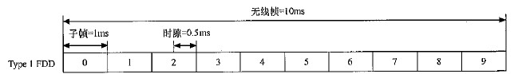
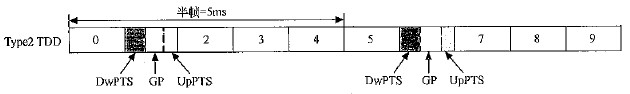

# 概述
物理层处于LTE接入网协议的最下层，以传输信道为接口为上层提供数据传输的服务。   
   
1. 物理层采用的基本技术
2. 物理层信号和信道的设计方案
3. 传输信道向物理信道的映射
4. 信道编码方法
5. 基本的物理层过程

# 多址方式
LTE的空中接口采用以OFDM技术为基础的多址方式，采用15kHz的子载波宽度，通过不同的子载波数目(72~1200)实现了可变的系统带宽(1.4~20MHz)。   
## 下行多址方式
LTE采用OFDMA作为下行多址方式。   
   
OFDM是一种多载波调制的传输技术，将数据流经过串并变换，形成多路子数据流(N路)，使用它们分别去调制N路子载波后并行传输。子数据流的速率是原来的1/N，即符号周期是原来的N倍，通过设计使得该符号周期远大于信道的时延扩展，从而实现了将一个宽带频率选择性信道划分成N个窄带平坦衰落信道，使得OFDM信号具有很强的抗无线信道多径衰落和抗脉冲干扰的能力。   

## 上行多址方式
LTE采用单载波SC-FDMA作为上行多址方式。具体实现又称为DFT-SOFDM，同样采用15kHz的子载波带宽，以及不同子载波数目实现可变的系统带宽。   
   
采用原因：单载波信号峰均比的特性对上行发送的功率效率有着重要的影响。   
OFDM是将信号直接映射到频域的子载波上形成多载波信号，而SC-FDMA是信号又时域输入，通过DFT的操作转换到频域后在进行子载波的调制。   

# 无线帧结构
在空中接口上，LTE系统中定义了无线帧来进行信号的传输，1个无线帧的长度为10ms。LTE支持两种帧结构，Type1用于FDD，Type2用于TDD。   

## Type1 FDD 帧结构
10ms的无线帧分为10个长度为1ms的子帧，每个子帧有两个长度为0.5的时隙组成。   
   

## Type2 TDD
10ms的无线帧分为两个长度为5ms的半帧每个半帧由5个长度为1ms的子帧组成，其中包括4个普通子帧和1个特殊子帧，普通子帧由两个0.5ms的实习组成，特殊子帧由三个特殊时隙(UpPTS,GP,DwPTS)组成。   
   

### 特殊时隙
   
GP(Guard Period)是TDD上下行转换的保护间隔。   
DwPTS用于下行信号的发送。   
UpPTS用于上行信号的发送。   

### 上下行时间比例配置
支持7种不同的上下行时间比例分配。   
   

# 时隙结构与基本物理资源
## 物理资源块PRB
物理资源块PRB作为空中接口物理资源分配的单位。   
1个PRB在频域上包含12个连续的子载波，在时域上包含7个连续的OFDN符号。即频域宽度为180kHz，时间长度为0.5ms的物理资源。   

资源块数目如下：   
   

## 虚拟资源块VBS
为了方便物理信道向空中接口时频域物理资源的映射，定义了虚拟资源块，其大小与物理资源块相同，数目也相同。   
虚拟资源块和物理资源块有其对应的资源块序号，物理资源块序号按照频域的物理位置进行顺序编号。虚拟资源块序号由系统分配，其通过与物理资源块序号之间的映射关系进一步确定实际物理资源的位置。   
   
有两种类型的虚拟资源块，集中式LVRB，分布式DVRB。LVRB直接映射到PRB上，即虚拟资源序号与物理资源序号相同。DVRB则是虚拟资源块序号与物理资源块序号具有一定的映射关系。   

LTE下行支持LVRB和DVRB，上行只支持LVRB。   

LTE物理层采用块交织器实现DVRB到PRB之间的序号映射。   

## 资源元素组REG
PRB用于共享信道的映射，REG用于下行物理控制信道向资源的映射。   

# MIMO 方案
在收到信道编码后的数据之后，LTE物理层的基带处理过程包括加扰、调制、层映射、预编码以及针对各个物理层天线端口的资源映射和OFDM信号生成过程。   
   
加扰操作指使用信道编码后的数据进行逐比特的加扰，实现数据间干扰的随机化。   
调制指对比特数据进行复数调制，包括QPSK、16QAM、64QAM。   
完成调制后，基带将进行MIMO相关的处理。物理层通过层映射和预编码的操作进行了具体的实现。   

## 层映射
层映射实现Codeword向layer的映射。

## 预编码
预编码(precoding)实现layer到物理天线端口的映射。   
物理层使用不同的预编码方案实现不同的MIMO模式：单天线发送、空间复用、发送分集。   

### 单天线发送
1个layer将直接映射到1个物理天线端口上。   

### 空间复用
LTE采用基于码本codebook的预编码向量选择的机制。   

### 发送分集
LTE物理层分别采用SFBC和SFBC+FSTD的方案支持2和4个发送天线的场景。   

# 参考信号
## 下行参考信号 RS
下行参考信号 Reference Signal RS，包括如下：   
1. 小区专用的参考信号(Cell-specific RS, CRS)   
2. MBSFN参考信号   
3. 终端专用的参考信号(UE-specific RS,又称Dedicated RS(DRS))   

## 上行参考信号 
上行参考信号 ，包括如下：   
1. 解调参考信号(Demodulation RS,DMRS)   
2. Sounding参考信号(Sounding RS,SRS)   

# 物理层信道与信号
LTE接入网协议结构   
   

逻辑信道描述了信息的类型，定义了“传输的是什么信息”。   
传输信道描述的是信息的传输方式，定义了“信息是如何传输的”。   
物理信道则由物理层用于具体信号的传输。   
在协议测测你歌词中，MAC层实现逻辑信道向传输信道的映射，而物理层实现了传输信道向物理信道的映射，以传输信道为接口向上层提供数据传输的服务。   

## 物理层 物理信道
### 下行
   

#### 下行同步信号
下行同步信号PSS/SSS，用于支持物理层的小区搜索，实现用户终端对小区的识别和下行同步。   
同步信号包括主同步信号PSS和辅同步信号SSS。   
PSS/SSS信号使用与物理层小区ID相关，可用于终端对小区的识别。LTE物理层支持504个小区ID，分为168个组，每个组3个小区ID。   
主同步信号和辅同步信号在同一根天线上发送。   

#### PBCH 物理广播信道   
物理广播信道用于广播小区基本的物理层配置信息。   
LTE系统广播信息(逻辑信道BCCH)分为MIB(Master Infomation Block)和SIB，MIB为系统基本的配置信息，在PBCH固定的物理资源上传输。SIB在DL-SCH上调度传输。   

#### PDSCH 物理下行共享信道   
物理下行共享信道用于下行数据的调度传输，是LTE物理层主要的下行数据承载信道，可以承载来自上层的不同的传输内容，包括寻呼信息、广播信息、控制信息和业务数据信息。   

#### PMCH 物理多播信道   
物理多播信道用于传输下行广播/多播业务信息。   

#### PDCCH 物理下行控制信道   
物理下行控制信道是传输下行物理层控制信令的主要承载信道，承载的物理层控制控制信息包括上下行数据传输的调度信息和上行功率控制命令信息。   

#### PCFICH 物理控制格式指示信道   
物理控制格式指示信道指示物理控制信道的格式。   

#### PHICH 物理HARQ指示信道   
物理HARQ指示信道携带对上行数据传输的HARQ ACK/NACK反馈信息。   

### 上行
   

#### PRACH 物理随机接入信道   
物理随机接入信道用于终端发送随机接入信号，发起随机接入的过程。   

#### PUSCH 物理上行共享信道   
物理上行共享信道用于上行数据的调度传输，是LTE物理层主要的上行数据承载信道，可以承载来自上层的不同的传输内容，包括控制信息、用户业务信息和广播业务信息。   

#### PUCCH 物理上行控制信道   
上行物理控制信道传输上行物理层控制信息可能承载的控制信息包括“上行调度请求”、“对下行数据的ACK/NACK信息”和“信道状态信息CSI反馈”。   

# 传输信道的编码、复用与交织
物理层以传输信道的方式向上层提供数据传输的服务，同时物理层传输自身使用的控制信息以支持物理层的操作。   

对于来自上层的各个传输信道的数据和物理层自身的控制信息，物理层将按照规定的格式进行一系列信道相关的处理，通常的过程包括码字CRC计算、码块分割和码块CRC计算、码块信道编码、码块交织和sulv匹配、码块连接以及向物理层信道映射的过程。   
   

## CRC计算
LTE物理层提供了4种CRC计算方法，分别用于不同信息的处理过程，其中包括2种长度为24bit的CRC计算方法，1种长度为16bit的CRC计算方法和1种长度为8bit的CRC计算方法。   
长度24bit的CRC用于下行共享信道DL-SCH、寻呼信道PCH、多播信道MCH和上行共享信道UL-SCH等传输信道信息的处理。   
长度16bit的CRC用于广播信道BCH和下行控制信息DCI的处理过程。   
长度8bit的CRC用于上行控制信息UCI在上行物理共享信道PUSCH种传输时可能需要的CRC操作。   

## 码块分割
传输信道中的1个传输块对应于物理层的1个码字，码字时物理层进行信道编码等相关操作的单位。   
如果添加CRC比特后的码字数据交流的长度大于6144，那么需要对码字进行分割，将一个码字分割为若干个码块，对每个码块再添加相应的CRC比特，然后以码块为单位进行信道编码，以满足信道最大长度的限制。  
   

## 信道编码
LTE物理层支持的信道编码方法包括块编码、截尾的卷积编码和Turbo编码。   

## 速率匹配
在速率匹配的过程中，对上述信道编码后形成的比特流进行选取，形成不同的编码速率，以匹配于最终实际使用的物理资源。   

# 物理层过程
## 小区搜索与下行同步
通过小区搜索的过程，终端与服务小区实现下行信号时间和频率的同步，并且确定小区的物理层ID。   
物理层小区搜索的过程主要涉及两个同步信号，即主、辅同步信号PSS/SSS。过程中包括了下行时间和频率的同步、小区物理ID的检测和OFDM信号CP长度的检测。之后终端就可以开始读取服务小区的广播信道PBCH中的信息并进行进一步的操作。在这期间，再通过同步信号的检测与服务小区获得同步以后，终端可以利用下行导频信号CRS进行更精确的时间与频率同步以及同步的维持。   
   

## 上行传输时间的调整与同步
通过上行传输时间的调整，终端与服务小区实现上行信号时间的同步，使得不同用户的上行信号同步到达基站。   

## 功率控制
上行信号，终端的功率控制采用闭环功率控制的机制，控制终端在上行单载波符号上的发送功率。   
下行信号，基站采用开环功率分配的机制，控制基站在下行各个子载波上的发送功率。   

### 上行功率控制
上行功率控制以各个终端为单位，控制终端到达基站的接收功率，使得不同距离的用户都能以适当的功率到达基站，避免“远近效应”。   
参数：过载指示、高干扰指示   

## 随机接入过程
物理层异步随机接入用于终端接入网络的过程，包括与网络获得上行同步以及接入网络过程中的控制信令交互。   
   

## 下行共享信道传输
LTE物理层下行共享信道的传输包括“调度信息PDCCH”和“数据信息PDSCH”两部分。   

## 上行共享信道传输
上行共享信道的传输包括“上行调度信息PDCCH”和“数据信息PUSCH”两个部分。   
