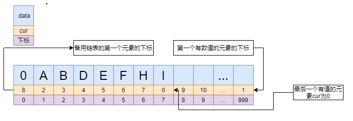
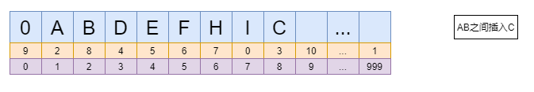
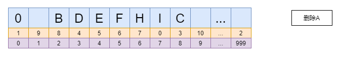
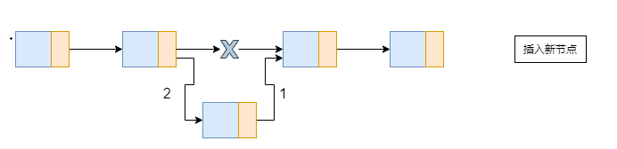
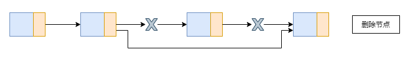
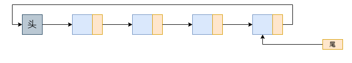
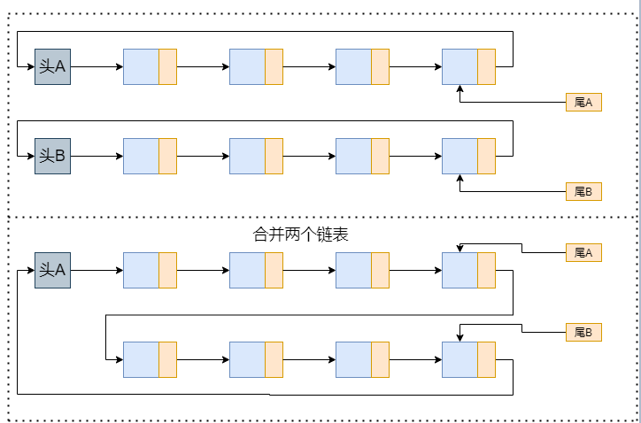
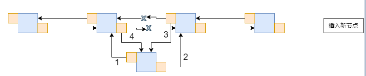
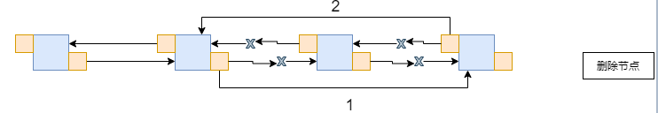

# 线性表
零个或多个数据元素的有限序列

## 顺序存储结构
用一段地址连续的存储单元依次存储线性表的数据元素
>实现：一维数组实现顺序存储结构

## 链式存储结构
* 1.静态链表
>使用数组实现静态链表   
数组的元素由data和cur两个数据域组成，data存放数据，cur存放下一个元素的下标   
未被使用的数组元素称为备用链表，数组第一个元素的cur存放备用链表的第一个节点的下标，数组最后一个元素的cur存放第一个有数值的元素的下标，最后一个有值的元素cur为0

>插入一个元素   

>删除一个元素   

* 2.单链表
>每一个节点由数据域和指针域组成

>插入一个元素   

>删除一个元素   

* 3.循环链表

>合并链表  

* 4.双向链表

>插入一个元素   

>删除一个元素   

