# geomate 学习与二次开发指南（图解版）

> 对象：Q23 / T830 OpenWrt 固件中的 **geomate**（游戏服务器地理限制）。
> 目的：用可视化方式建立运行时心智模型、读懂全部代码、安全做二次开发。
>
> 📌 本文大量使用 **Mermaid 图**，请用支持 Mermaid 的查看器打开（GitHub / GitLab / VSCode + Markdown Preview Mermaid 插件 / Typora）。
>
> **导读**：
> - 只想"用这个功能" → 看 **§0.1 使用者视角**
> - 要"读代码 / 做二次开发" → 看 **§0.2 开发者视角 → §1 四环模型 → §7 流程 → §8 精读 → §10 调试 → §11 改造**
> - 只想查 nft 规则和文件 → 直接跳 **§5 与 §6**

---

# 第 0 部分 · 两种视角速览

## 0.1 使用者视角（第一次用，从头到尾）

**一句话**：你在地图上画圈告诉路由器"只准连这些地区"，然后正常玩游戏；路由器自己把服务器 IP 记下来、查到位置，之后圈内放行、圈外拦截。

| 步骤 | 做什么 |
|---|---|
| 0 · 前提 | 路由器要能上网（查 IP 位置、下载地图）；最好知道游戏设备内网 IP 和游戏端口（如 CoD 是 UDP `3074`，Fortnite 是 `9000-9100`） |
| 1 · 打开页面 | 后台 → **Services（服务）→ Geomate**。第一次地图是空的，正常 |
| 2 · 画圈建过滤器 | 点地图画圈图标 → 在允许的区域画圆 → 起名（如 `Call of Duty`）→ 填协议/设备 IP/端口 → 没有现成列表就「新建空列表」；同区域可画多个圈但**名字要一模一样** |
| 3 · 保存生效 | **Save → Save & Apply**，服务重启、规则重建。**第一次先把 Strict Mode 关掉**（或直接用 Monitor 模式） |
| 4 · 边玩边学 | 玩几局；IP 被自动记录，每隔约 30 分钟查一次位置，地图上的点**慢慢出现**——不要期待一进去就有 |
| 5 · 自动过滤 | 圈内 → 放行；圈外 → 拦截；还没定位到的新连接看 Strict Mode（关=先放行，开=直接拦） |
| 6 · 观察调优 | 匹配不到人就加白名单 / 把圈画大；点够全了再开 Strict；想只观察就切 Monitor |
| 7 · 日常维护 | 可设 IP 自动过期、手动清理；列表在 `/etc/geomate.d/`，**刷固件默认不保留** |

**新手最易踩的 3 个坑**：① 地图一开始空（要玩几局+等定位）；② 一上来开 Strict（会连不上）；③ 忘了加白名单（启动/匹配失败）。

## 0.2 开发者视角（第一次上手这套代码，从头到尾）

| 步骤 | 做什么 |
|---|---|
| 0 · 认清形态 | 不是 git 是 **SVN**；geomate **无编译代码**（纯 shell + nft + 前端）；散在**三处落点**（见 §3） |
| 1 · 建模型 | 先记住**四个环**（§1），再读代码——否则会在 1000 行里迷路 |
| 2 · 按序精读 | `config` → `init.d` → `geomate.sh` → `geolocate.sh`/`trigger` → 前端；**先跳过升级器**（§8） |
| 3 · 编出来 | 容器内 `openwrt/`：`./customize_build_package.sh geomate` 与 `... luci-app-geomate` |
| 4 · 跑起来 | 装进 OpenWrt 真机/VM（依赖 `uci`/`nft`/`procd`，**不能在普通 Linux 跑**）；`debug_level=2`；跑 `status`/`health_check`/`nft list table inet geomate`/`logread` |
| 5 · 复现全流程 | 改配置 → restart 看 set 变化；`/etc/geolocate.sh specific ...` 看 geo_data 写入；真实流量看 `_dynamic` 收录（§10） |
| 6 · 定改动层 | 三条路：改规则/加区域（低）· 换地理源（低）· 换 UI 到 goahead+react-web（高）（§11） |
| 7 · 动手改 | 只改 `broadlink/package/geomate/`；新增/删 `files/` 文件要同步改 Makefile install 段；地理判定**三处同步** |
| 8 · ⚠ 先堵坑 | `VERSION="dev"` 会让服务启动时联网覆盖本机文件，**集成前必须改掉**（§12.1） |
| 9 · 回归验证 | 重建 → 重装 → 再走一遍第 5 步 |
| 10 · 提交 | `svn status` / `svn diff` |

**开发者最易卡**：① 改错地方（改了 `build_dir` 或 `.ipk`）；② 忘改 Makefile、新文件没进包；③ 没料到 `VERSION=dev` 自动覆盖；④ 以为能在普通 Linux 跑；⑤ 只改一处判定逻辑。

---

# 第 1 部分 · 核心心智模型：四环

## 1. 为什么是"四个环"

因为它们正好对应**一个服务器 IP 的一生**：

> 被**看见**（收集）→ 被**打上位置标签**（定位）→ 被**裁决放行/拦截**（过滤）→ 被**画到地图上**（展示）。

四环的**运行节奏完全不同**，这是理解整套系统的关键：

| 环 | 在哪发生 | 何时发生 | 要联网吗 |
|---|---|---|---|
| ① 收集 | 内核（nftables） | **持续不断**，每个包 | 否 |
| ② 定位 | 路由器脚本 | **定时**（30 分钟 / 1 天） | **是** |
| ③ 过滤 | 内核（nftables） | **重建规则时**一次性算好 | 否 |
| ④ 展示 | 网页（浏览器 + rpcd） | 用户**打开页面时**查询 | 否（读本地文件） |

> ⚠ 由此得出最重要的一条：**过滤不是每个包都算经纬度**——距离只在"重建"时算一次，之后每个包只是**查集合**。

## 1.1 环① 收集：内核自己在记笔记

**一句话**：游戏流量经过防火墙时，防火墙顺便把"目的 IP"丢进一个记录本。

- 每个过滤器建一个 nft 集合 `geomate_<名字>_dynamic`（`flags dynamic,timeout; timeout 1h`，**1 小时没出现自动过期**）。
- 在 `prerouting` 链挂一条规则：
  ```
  ip saddr <游戏设备IP> <协议> [sport …] [dport …]  update @geomate_<名字>_dynamic { ip daddr }
  ```
  人话：**"凡是这台设备、走这个端口的流量，把目的 IP 塞进记录本。"**
- 这就是"学习"的本质：**不需要事先知道服务器 IP**，防火墙自己在流量里看。也解释了为何第一次用地图是空的。
- 孪生集合 `_ui_dynamic`（超时仅 10 秒）专门给网页显示"此刻在连谁"。

对应：`geomate.sh` 的 `create_dynamic_set()`（约 384 行）。

> 易误解：这个"临时集合"**不是文件**，是内核内存对象，重启即失；要长期保留靠环②。

## 1.2 环② 学习/定位：变成"永久笔记 + 位置标签"

分两个动作，都在定时器上：

**动作 A —— 落盘（每 30 分钟）**
- `process_dynamic_set()`（约 466 行）：读 nft `_dynamic` 集合的 IP → 过滤私网/保留地址（`is_valid_public_ip`）→ 与已有 `ip_list` 文件对比，**新增的追加进去**，原子写回 flash。
- 若开了 `ip_expiry_days`，会给每个 IP 记时间戳。

**动作 B —— 查经纬度（`geomate_trigger.sh` 调度）**
- `check_new_ips`：对比 `ip_list` 与上次快照，找出**新 IP** → `new_ips.txt`（格式 `游戏名|IP`）。
- 按模式触发 `geolocate.sh`：
  - **frequent**：距上次 30–60 分钟处理一批新 IP → `geolocate.sh specific <游戏> <ip...>`；
  - **daily**：每 24 小时全量重查 → `geolocate.sh daily`。
- `geolocate.sh`：每 90 个一批 `POST` 到 `ip-api.com/batch`（限速 15 次/分），返回的经纬度**逐行追加**到 `<游戏>_geo_data.json`。
- 结束时 `restart` 服务，触发环③重算。

## 1.3 环③ 过滤：把"圈"变成内核放行/拦截名单

- 启动时、以及环②新增 IP 后重启时，`setup_nftables_and_filters()` → `setup_geo_filter()` → `process_geo_data()`（约 686 行）：
  1. 读 `geo_data.json`（每个 IP 的经纬度）；
  2. **一个 awk 进程**遍历全部 IP，算它到各个"圈"的距离（haversine）；
  3. 落在**任意圈内** → 写入 `_allowed`；**所有圈外** → 写入 `_blocked`（每 1000 个一批）。
- 之后两条固定的 `forward` 规则引用集合（查集合很快）：
  ```
  ip daddr @geomate_<名字>_allowed counter accept
  ip daddr @geomate_<名字>_blocked counter drop
  ```
- 地图上画的圈 = `allowed_region = circle:纬度:经度:半径(米)`。

> **画圈 = 定义"允许名单的生成规则"**；换圈 → 重算名单。`strict_mode=1` 时再补一条默认 `drop`，没被明确允许的一律拦截。

## 1.4 环④ 展示：让人看见

- `view.js`（LuCI 主页面）+ `map.html`（iframe 内 Leaflet 地图）。
- 数据来自 rpcd `luci.geomate`：
  - `geolocate_ip()`：**读本地 `geo_data.json`**（离线，不联网）；
  - `get_ui_dynamic_ips()`：读 nft `_ui_dynamic` / `_blocked`，得到"此刻在连谁"。
- 结果缓存 `/tmp/geomate_ip_cache.json`；画圈经 `postMessage` 回传保存为配置。
- ⚠ 环④和环③**各有一份"点在不在圈内"的逻辑**（Lua / awk）——这是"三处同步"坑的来源。

## 1.5 一个服务器 IP 的完整一生

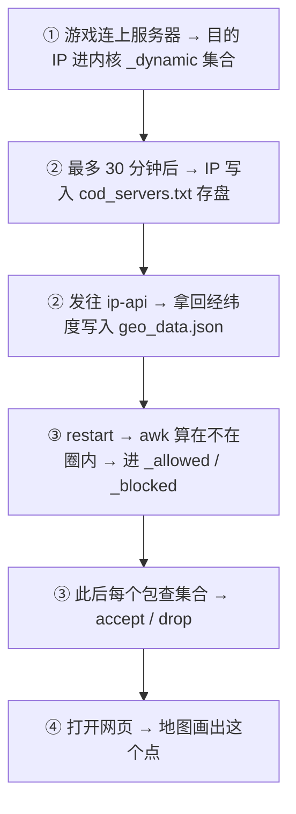

## 1.6 读代码对号入座

| 环 | 主要函数 / 文件 |
|---|---|
| ① 收集 | `create_dynamic_set()`（geomate.sh ~384） |
| ② 落盘/定位 | `process_dynamic_set()`(~466) · `update_dynamic_ips()`(~576) · `geomate_trigger.sh` · `geolocate.sh` |
| ③ 过滤 | `setup_nftables_and_filters()`(~201) · `setup_geo_filter()`(~249) · `process_geo_data()`(~686) · `is_within_circle()`(~861) |
| ④ 展示 | `luci.geomate`（`geolocate_ip`~30 / `get_ui_dynamic_ips`~151 / `get_all_connections`~234）· `view.js` · `map.html` |
| 主循环（串起②③） | `run()`（geomate.sh ~972） |

## 1.7 三个最容易误解的点

1. **以为"过滤"实时算经纬度** → 错，只在重建时算一次，过滤时只查集合。
2. **以为"收集"要联网或要文件** → 错，纯内核，重启即失。
3. **以为只有一处"判断在不在圈内"** → 错，有两处（awk / Lua），改规则必须同步。

---

# 第 2 部分 · 全景图

## 2.1 编译期：源码 → 固件包

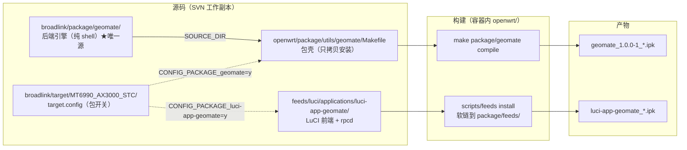

## 2.2 运行期：四环联动（端到端数据流）

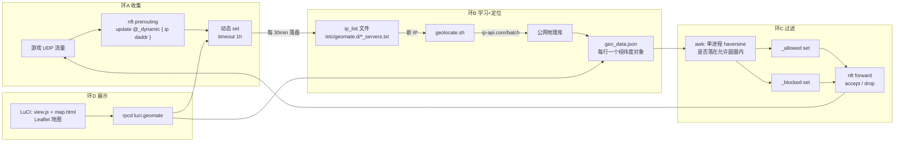

> 没有守护进程 C 代码：服务本体就是 `/etc/geomate.sh run` 里的一个 shell 循环。

---

# 第 3 部分 · 结构

## 3.1 组件地图

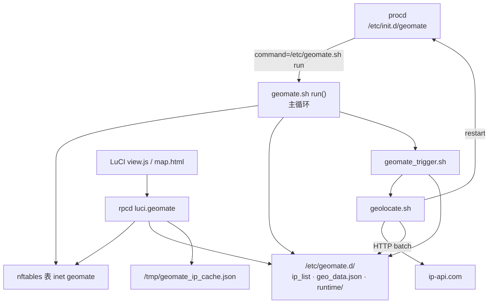

| 角色 | 路径 | 职责 |
|---|---|---|
| **后端引擎** | `broadlink/package/geomate/` | nft 规则、IP 收集/落盘、地理判定、主循环（**改实现只改这里**） |
| OpenWrt 包壳 | `openwrt/package/utils/geomate/Makefile` | 无代码，`SOURCE_DIR` 指向上面，逐文件安装 |
| LuCI 前端 | `feeds/luci/applications/luci-app-geomate/` | 视图 + rpcd 后端 + menu/acl |
| 包开关 | `broadlink/target/MT6990_AX3000_STC/target.config` | `CONFIG_PACKAGE_{jq,geomate,luci-app-geomate}=y` |

**后端文件**：`init.d/geomate`(~1500) · `geomate.sh`(~1045,核心) · `geolocate.sh`(~310) · `geomate_trigger.sh`(~270) · `config/geomate`(30) · `geomate.d/*.txt`(预置列表,**不进包**)
**前端文件**：`luci.geomate`(679,Lua rpcd) · `view.js`(1062) · `geofilters.js`(373) · `map.html`(~700)

---

# 第 4 部分 · 数据模型

## 4.1 UCI `/etc/config/geomate`

```
geomate
├── global 'global'
│     enabled            = 1              ← 1=启用（不是 disabled 反义）
│     debug_level        = 0/1/2
│     strict_mode        = 0/1            ← 1=只放行已知，其余 drop
│     operational_mode   = dynamic | static | monitor
│     geolocation_mode   = frequent | daily
├── settings 'settings'
│     interface          = br-lan
└── geo_filter  × N
      name               = 'Call of Duty'          → set 名把空格替成 _
      enabled            = 1
      protocol           = udp
      src_ip             = 192.168.1.208
      src_port           = 3074            （单值 / 空格多值 / 范围 9000-9100）
      dest_port          = 9000-9100
      ip_list            = /etc/geomate.d/cod_servers.txt
      ip_expiry_days     = 0               （>0 按“多久没见到”过期）
      list allowed_ip    = 185.34.107.128
      list allowed_region= circle:53.826597:-0.922852:636905   ← 类型:纬度:经度:半径(米)
      blocked_ips        = ...
```

## 4.2 nftables 对象结构

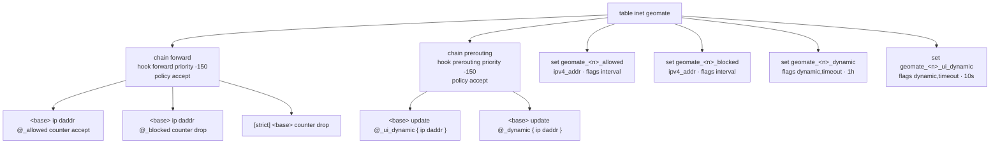

> `<base>` = `[ip saddr <src_ip>] [<proto>] [sport …] [dport …]`（由 `src_ip/src_port/dest_port/protocol` 拼出）。
> 命名：`geomate_<name>_{allowed,blocked,dynamic,ui_dynamic}`，`<name>` 空格 → `_`。

## 4.3 文件与格式（逻辑层）

| 文件 | 内容格式 | 生成者 |
|---|---|---|
| `ip_list`（`*_servers.txt`） | 每行 `IP` 或 `IP,<unix_ts>` | 预置 / `process_dynamic_set` 落盘 |
| `geo_data.json` | 每行一个 ip-api JSON（`query`,`lat`,`lon`,`status`…） | `geolocate.sh` |
| `runtime/last_geolocate_run[.interval/.daily]` | 时间戳/间隔（秒） | `geomate_trigger.sh` |
| `runtime/new_ips.txt` | `name\|ip` | `geomate_trigger.sh` |
| `runtime/<name>_last_processed` | 上次处理过的 IP 快照 | `geomate_trigger.sh` |
| `runtime/geolocation_status.json` | 状态汇总（供 UI/CLI） | `write_geolocation_status` |
| `/tmp/geomate_ip_cache.json` | UI 查询缓存（删掉即刷新） | `luci.geomate` |

---

# 第 5 部分 · nftables 速成 + 规则全清单

## 5.1 nftables 速成（够用版）

```
表 table  →  链 chain  →  规则 rule  →  动作(action)
                └─ 引用 → 集合 set → 元素 element
```

- **表（table）**：命名空间。`inet geomate` = 同时管 IPv4/IPv6、名叫 geomate 的表。geomate **自建表**，不混进系统默认的 `inet fw4`。
- **链（chain）**：一串有序规则，**挂在 hook 上**（内核走到该环节就执行）：
  - `forward`：包要**转发**出去（路由器帮设备转发游戏流量）→ 用于**过滤**；
  - `prerouting`：包刚进来、还没决定往哪走 → 用于**收集**。
- **priority**：同 hook 多链的执行顺序，数字小的先跑（可为负）。geomate 用 `-150` → **在 fw4 之前**执行。
- **policy**：规则都不匹配时的兜底动作，这里是 `accept`（默认放行）。
- **规则（rule）**：`匹配条件 + 动作`。动作：`accept` / `drop` / `counter` / `update @集合 { 字段 }`（**把字段写进集合**，是自动学习的关键）。
- **集合（set）**：一张 IP 名单，规则用 `@名字` 引用。
  - `flags interval`：能装单个 IP 也能装网段；
  - `flags dynamic,timeout` + `timeout`：**内核自动增删**，超时自动踢。
- **元素（element）**：集合里的具体成员（某个 IP）。

> 一句话：**prerouting 的 `update` 让内核自动把服务器 IP 记进集合；forward 的 `accept/drop` 引用集合实现过滤。**

## 5.2 表与链（全局，每次启动先删再建）

| 对象 | 命令（源码原样） |
|---|---|
| 表 | `add table inet geomate`（启动先 `delete table inet geomate`） |
| 链 | `add chain inet geomate forward { type filter hook forward priority -150 ; policy accept ; }` |
| 链 | `add chain inet geomate prerouting { type filter hook prerouting priority -150 ; policy accept ; }` |

## 5.3 集合（每个启用的 geo_filter 各一套，共 4 种）

| 集合 | 命令 | 谁写入 | 超时 |
|---|---|---|---|
| `geomate_<n>_allowed` | `add set inet geomate "<n>_allowed" { type ipv4_addr; flags interval; }` | 脚本（地理判定）+ 手动 `allowed_ip` | 无 |
| `geomate_<n>_blocked` | `add set inet geomate "<n>_blocked" { type ipv4_addr; flags interval; }` | 脚本 + 手动 `blocked_ips` | 无 |
| `geomate_<n>_dynamic` | `add set inet geomate "<n>_dynamic" { type ipv4_addr; flags dynamic,timeout; timeout 1h; }` | **内核自动**（prerouting update） | 1h |
| `geomate_<n>_ui_dynamic` | `add set inet geomate "<n>_ui_dynamic" { type ipv4_addr; flags dynamic,timeout; timeout 10s; }` | **内核自动** | 10s |

> `static` 模式**不建** `_dynamic`（只建 `_ui_dynamic`）。

## 5.4 规则 —— forward 链（过滤）

`[base]` = `[ip saddr <src_ip>] [<协议>] [sport <端口>] [dport <端口>]`。

| # | 规则 | 何时创建 |
|---|---|---|
| 1 | `[base] ip daddr @geomate_<n>_allowed counter accept` | 每个 filter |
| 2 | `[base] ip daddr @geomate_<n>_blocked counter drop` | 每个 filter（**monitor 不加**） |
| 3 | `[base] counter drop` | `strict_mode=1` 且非 monitor |
| 4 | `counter accept`（兜底，无 base） | 非 monitor 且 `strict_mode=0` |

## 5.5 规则 —— prerouting 链（收集）

| # | 规则 | 何时创建 |
|---|---|---|
| 5 | `[base] update @geomate_<n>_ui_dynamic { ip daddr }` | 每个 filter（总是） |
| 6 | `[base] update @geomate_<n>_dynamic { ip daddr }` | 非 static 模式 |

## 5.6 元素操作与其他

| 操作 | 命令 | 用于 |
|---|---|---|
| 加元素 | `add element inet geomate "<n>_allowed" { ip1, ip2, … }` | 地理判定结果 / 手动白名单 |
| 加元素 | `add element inet geomate "<n>_blocked" { ip1, ip2, … }` | 地理判定结果 / 手动黑名单 |
| 读元素 | `nft list set inet geomate "<n>_dynamic"` | 环②落盘提取 IP |
| 删除整表 | `delete table inet geomate` | 启动重建前 / 服务停止时 |
| 查整表 | `nft list table inet geomate` | 自检 / 状态查询 |

> 灌元素**每 1000 个一批**（避免命令行过长）。

## 5.7 完整例子（Call of Duty，src_ip=192.168.1.208，UDP 3074）

```nft
table inet geomate {
  chain forward {
    type filter hook forward priority -150; policy accept;
    ip saddr 192.168.1.208 udp sport 3074 ip daddr @geomate_Call_of_Duty_allowed counter accept
    ip saddr 192.168.1.208 udp sport 3074 ip daddr @geomate_Call_of_Duty_blocked counter drop
  }
  chain prerouting {
    type filter hook prerouting priority -150; policy accept;
    ip saddr 192.168.1.208 udp sport 3074 update @geomate_Call_of_Duty_ui_dynamic { ip daddr }
    ip saddr 192.168.1.208 udp sport 3074 update @geomate_Call_of_Duty_dynamic { ip daddr }
  }
  set geomate_Call_of_Duty_allowed { type ipv4_addr; flags interval; }
  set geomate_Call_of_Duty_blocked { type ipv4_addr; flags interval; }
  set geomate_Call_of_Duty_dynamic { type ipv4_addr; flags dynamic,timeout; timeout 1h; }
  set geomate_Call_of_Duty_ui_dynamic { type ipv4_addr; flags dynamic,timeout; timeout 10s; }
}
```

## 5.8 怎么自己看

```bash
nft list table inet geomate                                 # 整张表（链+规则+集合）
nft list sets inet geomate                                  # 只看集合
nft list set inet geomate geomate_Call_of_Duty_dynamic      # 看某集合里的 IP
nft list ruleset                                            # 系统全部表（含 fw4）
```

---

# 第 6 部分 · 运行全过程涉及的文件（全清单）

## 6.1 包安装的静态文件（一装就在）

| 路径 | 作用 |
|---|---|
| `/etc/init.d/geomate` | procd 服务入口 + 状态/健康检查 + **升级器** |
| `/etc/geomate.sh` | **核心引擎** |
| `/etc/geomate_trigger.sh` | 触发调度 |
| `/etc/geolocate.sh` | 调 ip-api 查经纬度 |
| `/etc/config/geomate` | UCI 配置（**conffile，sysupgrade 保留**） |
| `/usr/libexec/rpcd/luci.geomate` | 网页后端（rpcd/Lua） |
| `/www/luci-static/resources/view/geomate/{view.js,geofilters.js,map.html}` | 网页前端 |
| `/usr/share/luci/menu.d/luci-app-geomate.json` | 菜单注册 |
| `/usr/share/rpcd/acl.d/luci-app-geomate.json` | 权限 |

> ⚠ 源码树里的 `files/etc/geomate.d/*.txt`（cod/fortnite/bf6 列表）**不进包**，别以为装完就有。

## 6.2 持久数据（`/etc/geomate.d/`，**默认不随 sysupgrade 保留**）

| 路径 | 谁写 | 内容 |
|---|---|---|
| `<名称>_servers.txt`（= UCI `ip_list`） | 环②落盘 | 每行 `IP` 或 `IP,<时间戳>` |
| `<名称>_geo_data.json` | `geolocate.sh` | 每行一个 IP 的经纬度 JSON |
| `runtime/last_geolocate_run` | trigger | 上次定位时间戳 |
| `runtime/last_geolocate_run.interval` | trigger | 下次间隔（1800–3600s 自适应） |
| `runtime/last_geolocate_run.daily` | trigger | 上次全量定位时间戳 |
| `runtime/new_ips.txt` | trigger | 待定位新 IP，`名称\|IP` |
| `runtime/<名称>_last_processed` | trigger | 上次处理过的 IP 快照 |
| `runtime/<名称>_temp_new_ips.txt` | trigger | 临时中间文件 |
| `runtime/temp_ips_to_process.txt` | trigger | 临时中间文件 |
| `runtime/geolocation_status.json` | 环② | 状态汇总（UI/CLI） |
| `backend_reg.md5` / `frontend_reg.md5` | 升级器 | 完整性登记（与功能无关） |

## 6.3 临时/易失（重启即清）

| 路径 | 谁写 | 用途 |
|---|---|---|
| `/var/run/geomate.pid` | 引擎 | 进程 PID |
| `/tmp/geomate_loading` | 引擎 | "正在加载"标志（UI 显示） |
| `/tmp/geomate_nft_errors.log` | nft 包装器 | nft 命令失败日志 |
| `/tmp/geomate_ip_cache.json` | 网页后端 | 查询缓存（删除即刷新） |
| `/tmp/geomate/geolocation.lock` | `geolocate.sh` | 防并发锁 |
| `/tmp/geomate_<集合>_temp.txt` / `_new.txt` / `_update.txt` | 环②落盘 | 处理动态集合的中间文件 |
| `<ip_list>.tmp`、`<geo_data>.tmp` / `.lock` | 环②/定位 | 原子写盘、防并发 |

## 6.4 升级器相关（外围，**建议集成时禁用**）

| 路径 | 用途 |
|---|---|
| `/var/run/geomate-update` | 下载/解包工作目录 |
| `/tmp/geomate-gh`、`/tmp/geomate_cache`、`/tmp/geomate_old_modified_files` | 升级过程临时文件 |
| `/etc/geomate.d/{backend,frontend}_reg.md5` | 版本/完整性登记 |

## 6.5 四环 ↔ nft 对象 ↔ 文件 对照

| 阶段 | 涉及的 nft 对象 | 涉及的文件 |
|---|---|---|
| ① 收集 | 集合 `_dynamic` / `_ui_dynamic`；prerouting `update` 规则 | 无（纯内核） |
| ② 落盘 | 读 `_dynamic` 集合 | 写 `<名称>_servers.txt`；中间文件在 `/tmp` |
| ② 定位 | 无 | `new_ips.txt`、`<名称>_last_processed`、`<名称>_geo_data.json`、runtime 时间戳；**联网** |
| ③ 过滤 | `_allowed` / `_blocked` 集合；forward `accept`/`drop` 规则 | 读 `<名称>_geo_data.json` |
| ④ 展示 | 读 `_ui_dynamic` / `_blocked` 集合 | 读 `<名称>_geo_data.json` + `/tmp/geomate_ip_cache.json` |

## 6.6 与系统防火墙（fw4）的关系

- 系统默认防火墙是表 `inet fw4`；geomate 是**独立的表** `inet geomate`，用 `priority -150` **先于 fw4** 处理。
- 两者共用内核表空间但**互不覆盖**；`nft list ruleset` 可同时看到所有表。
- 只要优先级/hook 不冲突即可共存。

---

# 第 7 部分 · 执行流程（时序与决策）

## 7.1 启动时序图

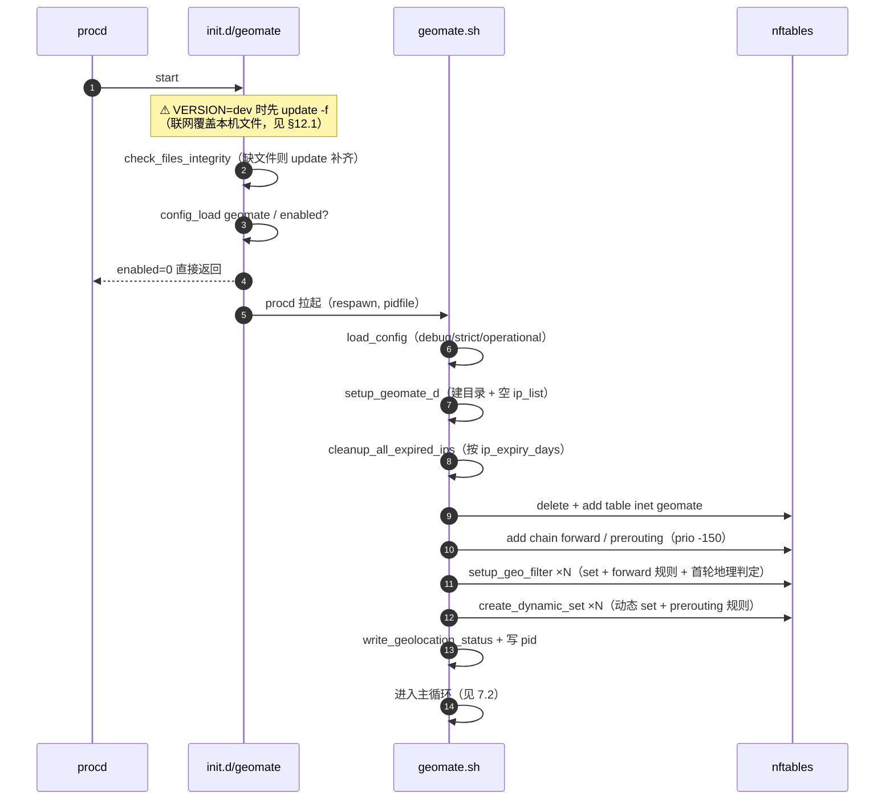

## 7.2 主循环与运行模式

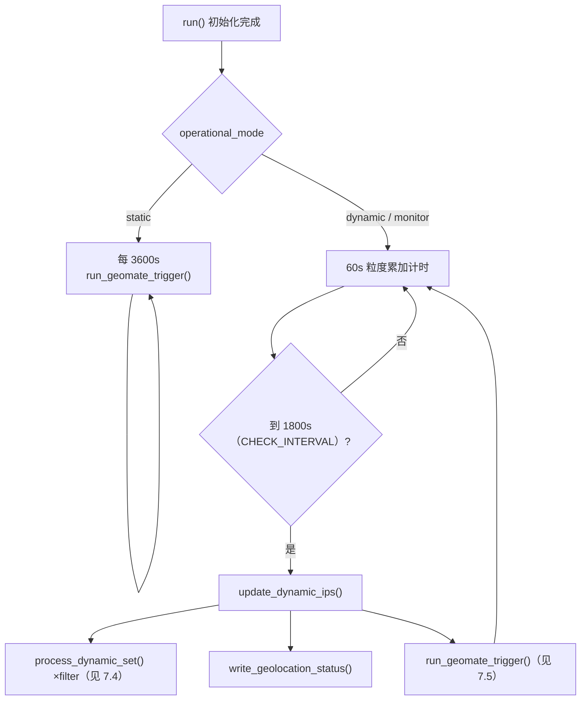

**模式行为矩阵**：

| operational_mode | `_dynamic` 收录 | `_ui_dynamic` | forward drop 规则 | strict 默认 drop |
|---|:---:|:---:|:---:|:---:|
| `dynamic` | ✅ | ✅ | ✅ | 仅 `strict_mode=1` |
| `static` | ❌ | ✅ | ✅ | 仅 `strict_mode=1` |
| `monitor` | ✅ | ✅ | ❌ 只追踪不阻断 | ❌ |

## 7.3 学习环 A —— 自动收集

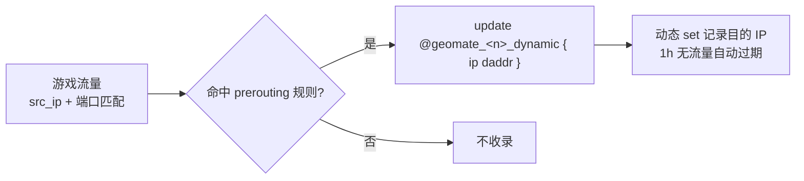

## 7.4 学习环 B —— 落盘决策树（`process_dynamic_set` ~466）

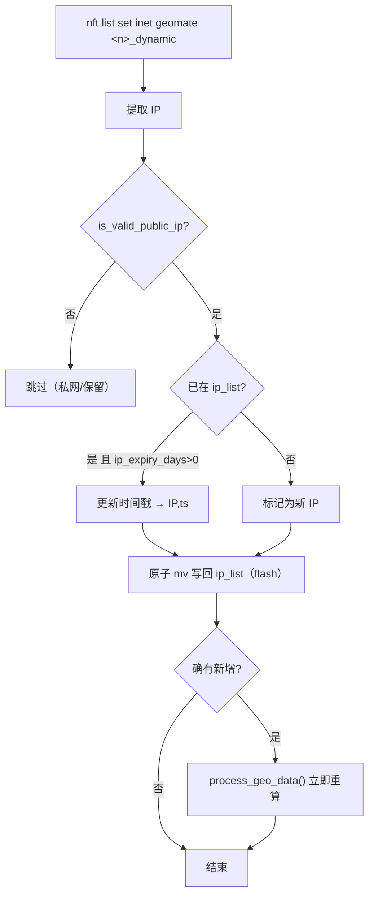

## 7.5 地理定位环时序图

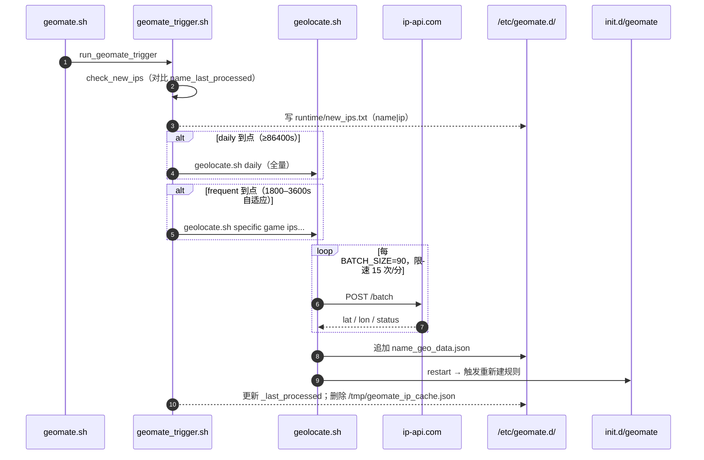

> `geolocate.sh` 三种入口：无参=全部 filter · `daily` · `specific <name> <ips...>`。

## 7.6 过滤环 C —— 地理判定与下发（`process_geo_data` ~686）

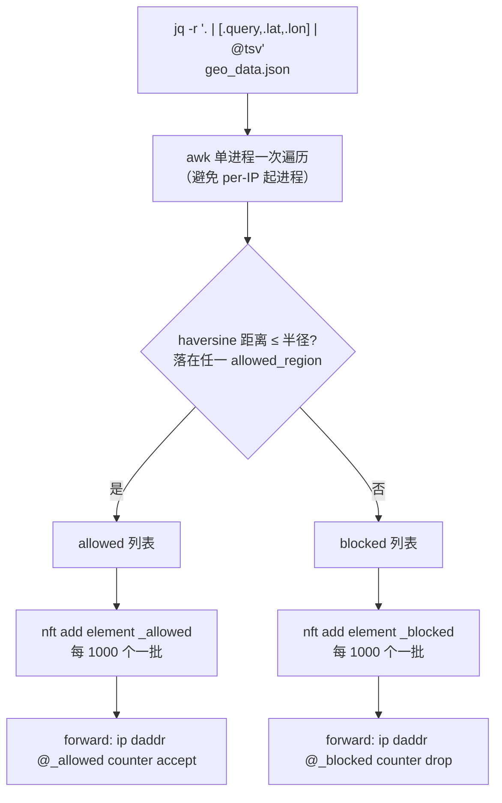

## 7.7 展示环 D —— LuCI 结构

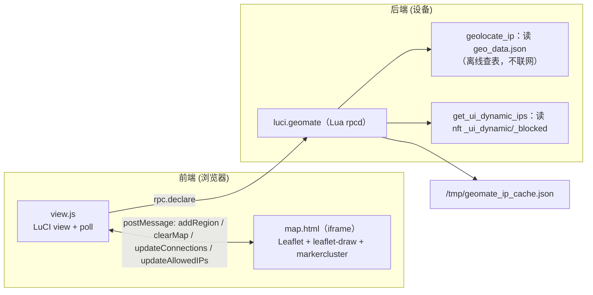

rpcd 方法：`getGeomateConnections` · `getAllowedIPs` · `getStatus` · `getHealthCheck` · `getGeolocationStatus`。

---

# 第 8 部分 · 学习路线与精读顺序

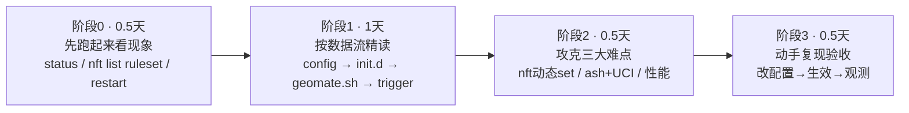

**阶段 1 精读顺序**（括号为"读它学什么"）：

1. `config/geomate` — 数据模型。
2. `init.d/geomate`：`start_service`(187) → `stop_service`(250) → `service_triggers`(260) → `status_service`(268) → `health_check`(489)
   （**跳过** `update`(1221)/`check_version`(1151)/`install_geomate_files`(1487)，属升级器，与功能无关）。
3. `geomate.sh` 按执行序：
   `load_config`(39) → `setup_geomate_d`(166) → `setup_nftables_and_filters`(201) → `setup_geo_filter`(249)
   → `create_dynamic_set`(384) → `process_dynamic_set`(466) → `process_geo_data`(686) → `is_within_*`(833/861) → `run`(972)。
4. `geolocate.sh` → `geomate_trigger.sh`（搞清"谁在何时触发"）。
5. 可选：`luci.geomate` → `view.js`/`geofilters.js`/`map.html`。

---

# 第 9 部分 · 三大技术难点

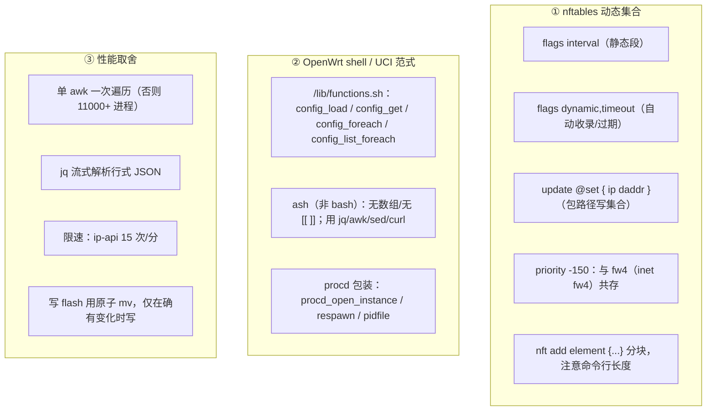

---

# 第 10 部分 · 调试、命令与构建

## 10.1 调试决策树

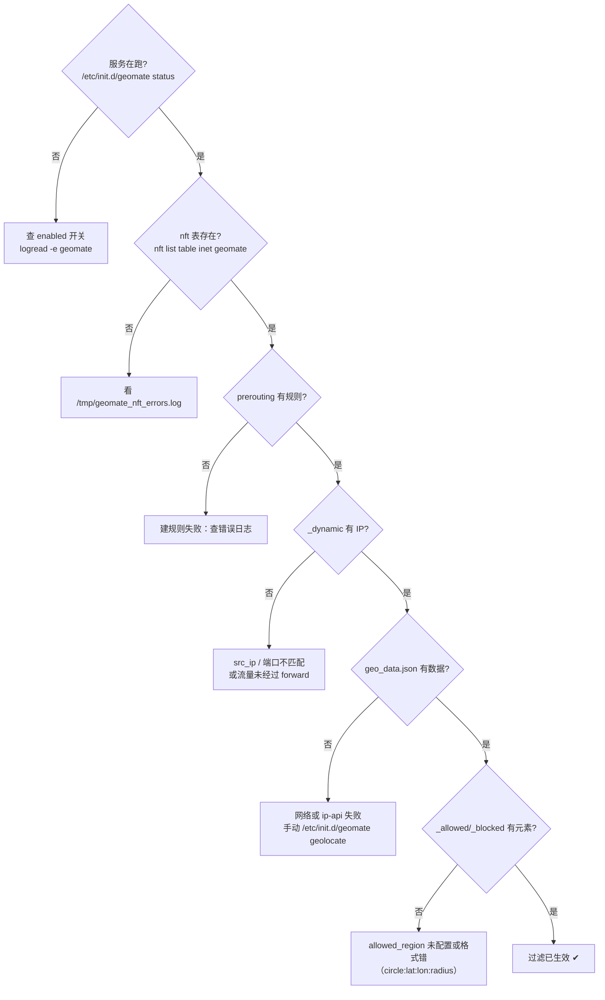

## 10.2 命令速查

```bash
/etc/init.d/geomate status | health_check | geolocate | cleanup_ips | restart
nft list table inet geomate
nft list sets inet geomate
nft list set inet geomate geomate_Call_of_Duty_dynamic
logread -e geomate
cat /tmp/geomate_nft_errors.log
cat /etc/geomate.d/runtime/geolocation_status.json
/etc/geolocate.sh specific "Call of Duty" 1.2.3.4 5.6.7.8   # 手动单点定位
rm -f /tmp/geomate_ip_cache.json                              # 刷新 UI 缓存
# 打开调试日志：uci set geomate.global.debug_level=2 && uci commit geomate
```

## 10.3 构建（容器内、`openwrt/` 目录）

```bash
./customize_build_package.sh geomate
./customize_build_package.sh luci-app-geomate
# 产物: openwrt/bin/packages/aarch64_cortex-a55_neon-vfpv4/{base,luci}/*geomate*.ipk
```

---

# 第 11 部分 · 改造路线（推荐先 A 后 B）

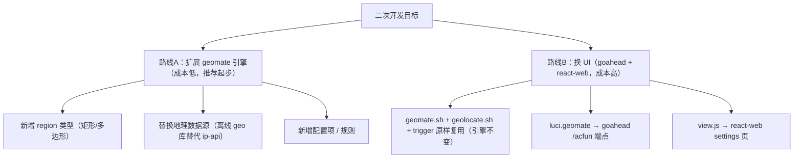

| 维度 | 路线 A 扩展引擎 | 路线 B 换 UI |
|---|---|---|
| 复用 | 全部复用，仅加规则/数据源 | 复用 shell 引擎，重写接口+前端 |
| 主要工作 | `geomate.sh` + `config` + 前端表单 | goahead `sub_*.c` + `cmd.c` + react-web |
| 风险 | 低（注意三处判定同步，见 §12.4） | 中高（注册/ACL/菜单冲突） |
| 参考 | — | 同工作区 X75 的 zerotier 集成范式 |

**新增 region 类型需三处同步**（否则 UI 与实际过滤不一致）：

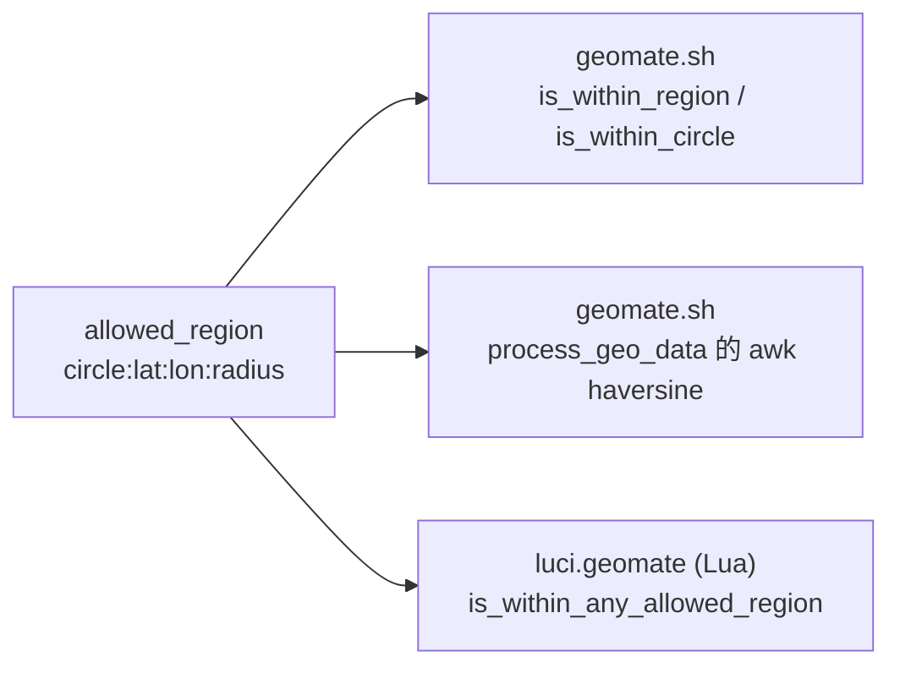

---

# 第 12 部分 · 关键坑（按严重度）


| # | 等级 | 问题 | 应对 |
|---|:---:|---|---|
| 12.1 | 🔴 | **`VERSION="dev"` 时 `start_service()` 自动 `update -f`，从 GitHub 覆盖本机文件**（靠 `dir_fixups.txt`/`file_fixups.txt` 映射路径） | Q23 集成必须把 `VERSION` 改成固定版本号或删掉自动更新分支；**不要靠设备上的 `update` 升级** |
| 12.2 | 🟠 | 包壳 Makefile **逐文件显式安装**，且**不安装** `files/etc/geomate.d/*.txt`，而默认 config 引用 `/etc/geomate.d/cod_servers.txt` | 新增/删 `files/etc/` 文件必须同步改 install 段；上机前确认服务器列表存在 |
| 12.3 | 🟠 | `openwrt/build_dir/.../geomate-1.0.0/` 与 `.ipk` 是构建产物 | 只改 `broadlink/package/geomate/`，用 `customize_build_package.sh` 重建 |
| 12.4 | 🟡 | 地理判定逻辑分散：shell(`geomate.sh`) + awk + Lua(`luci.geomate`) | 任何 region 规则变更三处同步 |
| 12.5 | 🟡 | 前端依赖公网：CDN（Leaflet 等）+ OSM 瓦片 + `ip-api.com`；仓库根离线铺垫 `map.py`/`wget_map.sh`→`tiles/` 尚未接线（`tiles/` 为空，`map.html` 仍指 OSM） | 需要离线时把 `map.html` 指向本地瓦片 |
| 12.6 | 🟡 | `/etc/geomate.d/` **不随 sysupgrade 保留**；`/etc/config/geomate` 是 conffile 会保留 | `echo /etc/geomate.d/ >> /etc/sysupgrade.conf` |
| 12.7 | 🟡 | `inet geomate` 与 fw4 共享内核表空间 | 注意链优先级（`-150`）冲突 |
| 12.8 | ⚪ | 依赖 `+curl +jq +nftables`，需 OpenWrt 23.05+/fw4；vendored 树内**未见 LICENSE** | 二次分发前确认上游授权 |

---

# 第 13 部分 · 练手任务（递增）

1. 改一个 `allowed_region` 的半径，`restart` 后 `nft list set` 观察 `_allowed/_blocked` 变化。
2. 新增一种 region 类型，打通"shell + awk + Lua"三处判定。
3. 把 `map.html` 底图从 OSM 切到本地瓦片（离线化，配合仓库根 `map.py`/`wget_map.sh` 产出的 `tiles/`）。
4. 在 `geofilters.js` 加"导出/导入 ip_list"按钮。
5. 用 goahead 暴露一个只读端点 `/acfun/geomate_status`，完成路线 B 的最小验证。

---

# 附录 · 函数索引

**geomate.sh**：`nft_exec`26 · `load_config`39 · `log_and_print`47 · `is_valid_public_ip`58 · `cleanup_expired_ips_for_filter`84 · `cleanup_all_expired_ips`146 · `cleanup_filter_ips`153 · `setup_geomate_d`166 · `create_empty_ip_list`189 · `setup_nftables_and_filters`201 · `append_allowed_region`244 · `setup_geo_filter`249 · `is_within_any_region`368 · `create_dynamic_set`384 · `process_dynamic_set`466 · `update_dynamic_ips`576 · `write_geolocation_status`586 · `append_allowed_ip`681 · `process_geo_data`686 · `is_within_region`833 · `is_within_circle`861 · `verify_nftables_rules`900 · `run_geomate_trigger`961 · `trigger_geolocation`966 · `run`972 · `cleanup_nftables`1039

**init.d/geomate**：`start_service`187 · `stop_service`250 · `reload_service`255 · `service_triggers`260 · `geolocate`264 · `status_service`268 · `show_geolocation_status`378 · `health_check`489 · `cleanup_ips`632 · `check_files_integrity`746 · `update`1221 · `install_geomate_files`1487

**luci.geomate**：`load_cache`/`save_cache` · `geolocate_ip`30 · `parse_ports`61 · `port_matches`87 · `is_within_any_allowed_region`95 · `get_allowed_ips_set`135 · `get_ui_dynamic_ips`151 · `is_ip_allowed`220 · `get_all_connections`234 · `get_allowed_ips` · `get_service_status`

> 上游背景与配置项详见 `broadlink/package/geomate/README.md`。
