# 1. 协议概述
## 1.1. 交互模型
OMA DM 2.0 Protocol 协议实现在一个个DM会话中。   
DM会话总是由DM客户端发起建立。当然，DM服务器能够通过向DM客户端发送DM Notification消息以此触发让DM 客户端发起建立DM 会话。   
当一个DM会话成功建立之后，DM 服务器发送DM Commands消息到DM客户端，然后可以收到DM 客户端的响应消息。   
当DM 客户端触发了某种事件或警报之后，就会向DM 服务器通知此事。   
只能由DM 服务器向DM 客户端发送DM Commands消息，不能由DM 客户端向DM 服务器发送DM Commands消息。   
当DM 服务器向DM 客户端发送结束会话的消息之后，DM 服务器结束该次会话。   

OMA DM 2.0支持DM 包。   
DM 包发送者应等待接收者的响应后再发送另一个DM 包，因为程序处理DM包消耗的时间不可预料，所以该协议规定不同DM 包发送之间没有超时处理。   
DM 包只用HTTP兼容协议进行传输。   

## 1.2. 安全性考虑
管理设备涉及到机密数据的敏感操作，因此建议在机密且经过身份验证的上下文中进行操作，OMA DM 并没有为安全管理操作提供完整的安全功能，除非能够操作设备底层。    

## 1.3. HTTP传输数据
DM 服务器发送DM Commands消息到DM 客户端，从数据存储库接受数据或向数据存储库发送数据，都是使用HTTP协议。   
一些特定格式的数据（例如MIME）使用HTTP协议传输，不排除其他格式数据。

## 1.4. 基于web的用户交互
OMA DM 2.0支持基于web的用户交互，其允许DM 服务器使用web 页面和用户交互。因此web浏览组件和web服务组件包含在内，但是这两个组件的具体定义实现不在该协议范围内，DM 会话和UI 会话是相互分开隔离的。web浏览组件可以作为DM客户端的一部分，或者作为一个单独独立的应用程序。   

# 2. 数据包流向
DM服务器和DM客户端必须支持以下数据包流向：   
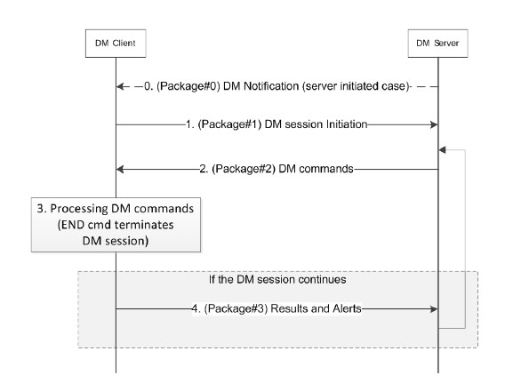
0. DM 服务器向DM 客户端发送DM Notification消息请求DM 客户端发起建立一次DM 会话。如果是DM 客户端自发发起建立DM 会话，此DM Notification是非必须的。
1. DM 客户端发起建立DM 会话，此包包含了DM 客户端支持的管理项目的信息，这些信息用于DM 服务器进行管理操作。
2. DM 服务器向DM 客户端发送管理命令。
3. DM 客户端根据接收到的管理命令进行相关处理，其中可能会与其他模块进行交互。
4. 如果DM 服务器发送的管理命令没有结束命令，那么DM 会话将持续进行，DM 客户端向DM 服务器发送执行命令的结果或警报。

步骤1到4才是该协议定义的会话范围，步骤0和HTTP传输建立以及DM 客户端执行命令操作并不是会话范围。

## 2.1. Package#0
许多设备不能持续性监听来自管理服务器的连接，而其他设备因为安全问题不希望打开一个端口。然而大多数设备能够接收不请自来的消息，被称为Notifications。一些手持设备，举例来说能够接收SMS消息，其他设备能够接收其他简单的数据消息。DM 服务器能够使用这种Notification消息去请求DM 客户端发起建立一个DM 会话。   
DM Notifications 消息包含了一些必须的参数，称为Headers，以及一些可选参数。   
DM 服务器必须支持Package#0，如果DM 客户端至少支持附录E中描述的一种传输机制，那么DM 客户端必须支持Package#0。

### 2.1.1. 包头
包含以下包头信息：
1. Version（VER）
这不是DM 协议版本号，而是DM Notification版本号。

2. Options Count（OC）
DM Notification中的可选项数

### 2.1.2. 包的可选项
|No|Name|Format|DM Client Support|DM Server Support|
|---|---|---|---|---|
|1|SERVER-ID|String|Mandatory|Mandatory|
|2|PREFERRED-CON-TYPE|Opaque|Mandatory|Mandatory|
|3|NOTIFICATION-ID|Uint|Optional|Mandatory|
|4|SHA256-DIGEST|Opaque|Optional|Mandatory|
|5|TIMESTAMP|Opaque|Optional|Mandatory|
|6|REQ-MOS|Null|Mandatory|Mandatory|

#### 2.1.2.1. 数据类型
1. Uint   
一个非负整数，使用选项长度决定的字节以网络字节顺序表示。选项值范围由2乘以选项长度（以位为单位）的幂计算。例如，如果选项长度为2，则选项值范围为0-65535（十进制）
2. String   
使用UTF-8[RFC3629]以净Unicode格式[RFC5198]编码的Unicode字符串。请注意，ASCII字符串（不使用特殊控制字符）始终是有效的UTF-8 Net Unicode字符串
3. Opaque   
一个不透明的字节序列。当需要Uint或String以外的其他类型时，可以使用此类型。如何处理此类型取决于使用此类型的选项。
4. Null   
没有数值

#### 2.1.2.2. 可选项
1. SERVER-ID   
SERVER-ID是DM 服务器的服务的标识，跟DM Account MO的标识一致。
2. PREFERRED-CON-TYPE   
PREFERRED-CON-TYPE是DM 客户端和DM 服务器之间数据连接方式。

	|Value|Semantics|Description|
	|---|---|---|
	|0x00|ANY_AVAILABLE|表示首选连接是当前可用的任何连接|
	|0x01|CELLULAR|表示首选连接是蜂窝连接，例如GSM/CDMA/UMTS/LTE|
	|0x02|WLAN|表示首选连接是WLAN,e.g. IEEE 802.11 a/b/g/n/ac|
	|0x03|WIRELINE|表示首选的连接是有线连接|
3. NOTIFICATION-ID   
NOTIFICATION-ID是一个无符号16位整数，用于分辨重复的Notification消息。   
这个选项必须两个字节长度。
4. SHA256-DIGEST   
SHA256-DIGEST选项指定DM通知的摘要。此选项的长度必须为32字节。DM服务器必须按如下方式设置此选项：   
步骤1：DM服务器使用此选项准备DM通知。此选项的值最初必须设置为全零（零摘要），并且必须正确设置所有其他选项。   
步骤2：DM服务器根据[RFC6234]计算SHA256摘要。哈希函数的输入必须是DM Server secret和DM Notification的串联（即Digest=hash（Server secret | Notification message | auth data）。请注意，在这一步中，DM通知包含所有摘要的零（零摘要）。   
步骤3：DM服务器用计算的摘要替换零摘要。   
如果DM Account MO被用作该选项的证书，那在DM Account MO必须提供<x>/Credentials/Noti/AuthSecret节点和<x>/Credentials/Noti/AuthData节点。   
以下情况DM 客户端必须忽略DM Notification消息：   
   1.DM 服务器在DM Account MO中没有提供AuthNoti sub-tree
   2.摘要是错误的
1. TIMESTAMP   
TIMESTAMP指定DM服务器发送DM通知的时间。这一次信息可用于防止回复攻击。此选项的值必须是POSIX格式的时间
2. REQ-MOS   
REQ-MOS选项必须存在，但是无值

## 2.2. Package#1
DM 服务器和DM 客户端都必须支持Package#1   
该包必须使用HTTP POST实现，并且OMADM-DevID HTTP header必须包含DevInfo MO的DevInfo/DevID节点   

如果在Package#0中使用了REQ-MOS，就要发送支持的MO列表到DM 服务器。每一个支持的MO都必须包含以下信息：   
1. DDF文件的链接
2. MO的MOID值
3. 包含MIID列表的MOID

如果DM服务器在启动阶段设置了MOID，那么就必须给DM 服务器提供MOID。如果DM 服务器有MO 实例的准许，那么MOID的MIID就必须提供给DM 服务器。   

警报必须包含:   
1. 如果一个DM会话已经由DM Notification消息的响应消息启动，那么DM Client必须生成一个“urn:oma:at:dm:2.0:ServerInitiatedMgmt”警报，并且警报必须有来自DM Notification的NOTIFICATION-ID。   
2. 如果一个DM会话是由DM 客户端自发发起建立的，DM Client必须生成一个“urn:oma:at:dm:2.0:ClientInitiatedMgmt”警报。   
3. 如果一个DM 会话是由成功启动引导触发的话，DM Client必须生成一个“urn:oma:at:dm:2.0:BootstrapComplete”警报。   

## 2.3. Package#2
DM 服务器向DM 客户端发送DM Command消息，DM Command消息可能是复数的甚至是重复的。复数的DM Command消息构成一个有序列表，DM 客户端依照顺序处理这些消息。   
DM 服务器和客户端必须支持该Package。该Package必须使用HTTP实现请求和响应。   

## 2.4. Package#3
如果Package#2包含结束会话的命令，那这个package就不准发送。   
DM 服务器和客户端必须支持该Package。该Package必须使用HTTP实现POST请求，并且OMADM-DevID HTTP header得有DevInfo MO的DevInfo/DevID节点。   

向DM 服务器发送DM Command的执行结果的状态码。向DM 服务器发送警报。

# 3. DM Commands
|Command|Description|DM Server support|DM Client support|
|---|---|---|---|
|HGET|DM服务器使用此命令请求DM客户端使用HTTP GET从数据存储库检索数据，并将接收到的数据添加或替换到DM树中|MUST|MUST|
|HPUT|DM服务器使用此命令请求DM客户端使用HTTP PUT将数据发送到数据存储库|MUST|MUST|
|HPOST|DM服务器使用此命令请求DM客户端使用HTTP POST将数据发送到数据存储库|MUST|MUST|
|DELETE|DM服务器使用此命令删除DM树中的数据|MUST|MUST|
|EXEC|DM服务器使用此命令执行DM树中的可执行节点|MUST|MUST|
|GET|DM服务器使用此命令从DM树中检索数据。DM客户端在当前DM会话中发送数据|MUST|SHOULD|
|SHOW|DM服务器使用此命令在Web浏览器组件和Web服务器组件之间启动UI会话|MUST|SHOULD|
|CONT|DM服务器使用此命令让DM客户端使用指定的DM服务器URI继续DM会话|MUST|MUST|
|END|DM服务器使用此命令终止DM会话|MUST|MUST|
|DEFAULT|如果设备中缺少特定MOID的配置，请将DM客户端配置为使用特定地址来捕获配置|MUST|SHOULD|
|SUB|DM服务器使用此命令请求DM客户端报告（订阅）由提供的ClientURI标识的DM树部分中的更改|SHOULD|SHOULD|
|UNSUB|DM服务器使用此命令向DM客户端请求撤销之前的订阅，以通知由提供的ClientURI标识的DM树部分中的更改|SHOULD|SHOULD|

## 3.1. HGET
DM客户端将对提供的ServerURI执行HTTP GET请求以检索MO数据，然后将接收到的数据添加或替换到DM树中。ServerURI指的是数据存储库中的一个位置。如果指定了ClientURI，DM客户端将尝试将检索到的数据存储在ClientURI位置，替换所有现有数据（如果有）。

如果未指定ClientURI，则DM客户端将选择存储数据的位置，并且必须返回该位置以及状态代码。如果检索到的数据存储在DM树中的多个位置，则必须返回多个clienturi。

DM服务器可以使用此命令在设备中创建MO实例。创建MO实例时，必须由DM客户端分配MIID。

下面显示了该DM命令的消息流和详细说明。请注意，下面的消息流被简化，没有显示DM客户端和DM服务器之间的交互。   
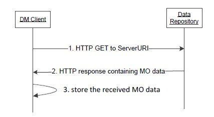

## 3.2. HPUT
DM客户端将对提供的ServerURI（标识数据存储库中的位置）执行HTTP PUT请求，发送请求的数据，其位置由所有ClientURI标识。

下面显示了该DM命令的消息流和详细说明。请注意，下面的消息流被简化，没有显示DM客户端和DM服务器之间的交互。   
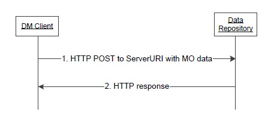

## 3.3. HPOST
DM客户端将对提供的ServerURI（标识数据存储库中的位置）执行HTTP POST请求，发送请求的数据，其位置由所有ClientURI标识。

## 3.4. DELETE
DM客户端将删除DM树中ClientURI标识的节点。如果ClientURI标识的节点是具有子节点的内部节点，则所有子节点也将被删除。

## 3.5. EXEC
DM客户端将在ClientURI标识的节点上执行EXEC操作。如果指定了ServerURI，则必须使用异步报告机制，并且必须在新的DM会话中将通用警报发送到ServerURI

## 3.6. GET
DM客户端将向DM服务器发送由ClientURI标识的请求数据

## 3.7. SHOW
SHOW命令可用于DM服务器通过基于web的用户交互与用户通信。这种用户交互是通过Web浏览器组件和Web服务器组件之间的UI会话完成的，该会话与DM会话分离。DM服务器和DM客户端不知道UI会话的上下文，UI会话的结果通过Web服务器组件和DM服务器之间的内部接口传输。DM服务器可以根据用户交互的结果决定下一步的管理操作。Web服务器组件和DM服务器之间的内部接口超出了范围，留给实现。

ServerURI可能包含标识每个UI会话的必要信息（即URI查询字符串），当DM服务器从Web服务器组件检索用户交互的结果时，可以使用该信息。

收到SHOW命令后，DM客户端应启动Web浏览器组件以加载ServerURI并向用户显示网页。成功启动Web浏览器组件后，DM客户端必须处理下一个DM命令，而不是等待UI会话结束：事实上，DM客户端无法知道UI会话何时完成，因为用户交互可能由多个网页组成。如果DM客户端未能启动Web浏览器组件，则DM客户端必须处理下一个DM命令。   
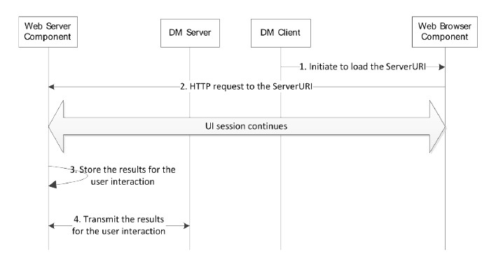

## 3.8. CONT
DM服务器使用此命令通知DM客户端根据指定的ServerURI继续当前DM会话。收到CONT命令后，DM客户端必须将任何响应包（即Package#3）发送到指定的ServerURI，并且必须在同一DM会话中对所有后续响应包继续使用此ServerURI

## 3.9. END
DM服务器必须发送此命令才能终止当前DM会话。收到此命令后，DM客户端必须处理DM包中包含的所有命令，但不得将任何状态和结果返回给DM服务器

## 3.10. DEFAULT
DM客户端存储ServerURI，并在需要配置特定MOID时使用它，例如，当设备上本地运行的应用程序请求有关特定MOID的信息时，该信息在DM树中不可用。在这种情况下，DM客户端必须对存储的ServerURI执行为HGET DM命令指定的操作，不向DM服务器返回状态。

当DM客户端接收到已配置MOID的默认命令时，必须将旧的ServerURI替换为新的ServerURI：这意味着DM客户端只能为每个受支持的MOID存储一个ServerURI。

## 3.11. SUB
DM服务器将订阅ClientURI标识的树的任何部分中发生的任何更改。当发生更改时，DM客户端将对提供的ServerURI执行HTTP PUT请求，并发送由ClientURI标识的子树。数据可以根据第7节进行格式化，但不排除其他格式：如果DM Server不支持该格式，DM Server必须返回“415 Unsupported Media Type”响应代码，并且必须包含指示支持的MIME的OMADM Accept HTTP头（见第5.5节），然后DM客户端应使用指示的MIME之一重试请求（如果支持）。

## 3.12. UNSUB
DM服务器将取消订阅ClientURI标识的前一个子命令：ClientURI必须与前一个子命令中使用的相同，否则DM客户端必须返回“404 Not Found”响应代码。

如果DM客户端支持SUB命令，那么它必须支持UNSUB命令。

# 4. 通用警报
DM 服务器和客户端都必须支持通用警报机制   
通用警报只能由DM 客户端发往DM 服务器   
无论DM服务器是否正确处理接收到的警报，都不会向DM 客户端响应   
一个警报中包含的信息如下：   
|Property|Description|
|---|---|
|AlertType|警报类型|
|SourceURI|跟该警报相关的MO的节点位置|
|TargetURI|附加的警报相关的地址|
|Mark|重要等级 "fatal", "critical", "minor", "warning", "informational", "harmless" and "indeterminate".|
|DataType|数据类型|
|Data|警报的数据|

## 4.1. DM Commands的异步上报
DM 服务器和客户端都必须支持同步和异步上报机制   
除EXEC命令外，所有DM命令都必须使用同步报告。对于EXEC命令，DM客户端通过通用警报机制同步（即响应包中的最终状态代码）或异步返回EXEC命令的状态。如果EXEC命令中存在ServerURI，则DM客户端必须使用异步报告；否则，由DM客户端根据管理操作的性质决定EXEC命令使用哪种报告机制。   
如果使用异步报告，DM客户端必须在响应Package#3中返回状态代码“202 Accepted”响应代码。

## 4.2. 握手
根据[RFC2616]，DM客户端应使用Accept HTTP头，以便在HTTP请求中通知DM服务器有关用于格式化HTTP响应内容的受支持MIME。如果DM服务器不支持DM客户端请求的任何MIME，则必须在HTTP响应中返回“406 Not Acceptable”响应代码；如果DM客户端在HTTP请求中使用的格式不受DM服务器支持，则必须在HTTP响应中返回“415 Unsupported Media Type”响应代码。   
如果DM服务器支持本规范规定的MIME以外的其他MIME，则必须使用OMADM Accept HTTP头，以便在HTTP响应中通知DM客户端有关支持的MIME，以用于格式化以下HTTP请求（HTTP PUT和POST）的内容：例如，DM服务器可以包含带有Package#2的HTTP请求，以便通知DM客户端支持的MIME，这些MIME可用于格式化HPUT或HPOST DM命令请求的数据。OMADM Accept HTTP头格式与HTTP Accept头[RFC2616]相同。如果DM客户端不支持DM Server请求的任何MIME，则必须在Package#3中为该DM命令返回“406 Not Acceptable”响应代码

## 4.3. HTTP错误处理
如果DM 客户端接收到4xx错误，客户端中止操作，并不进行重连操作   
如果DM 客户端接收到5xx错误，客户端中止操作，并不进行重连操作   

# 5. 设备管理对象

## 5.1. ClientURI
OMA DM 2.0支持ClientURI寻址，可用于识别设备中的每个节点。寻址表示为与[RFC3986]兼容的URI格式。DM服务器必须支持ClientURI寻址方案和所有描述的组件。DM客户端必须支持ClientURI寻址方案，但应支持查询组件、x-name组件和通配符。DM服务器必须生成本节中指定的ClientURI，才能操作DM树   

## 5.2. ClientURI 寻址方案
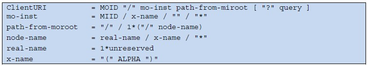

### 5.2.1. MOID and mo-inst
1. MIID：ClientURI指向其节点的MO实例的MIID。对于DM树中的同一MOID，MIID在MO实例中是唯一的：MOID和MIID对在DM树中唯一标识了一个MO实例
2. x-name：它由三个字符表示，例如“（x）”或“（y）”，x-name组件中的ALPHA组件在一个ClientURI中的所有x-name组件中被唯一分配。相应的nv字段用于解析实际的MO实例
3. empty string（即“”）：当指定的MOID只有一个MO实例时，可以使用该字符串
4. wildcard（“*”）：具有指定MOID的所有MO实例都被寻址

### 5.2.2. path-from-moroot
1. real-name：实际的节点名称
2. x-name：它由三个字符表示，例如“（x）”或“（y）”，x-name组件中的ALPHA组件在一个ClientURI中的所有x-name组件中被唯一分配。必须提供相应的nv字段来解析实际节点
3. wildcard（“*”）：指定位置的所有节点都被寻址

### 5.2.3. query
查询组件包含ClientURI的附加信息：它由第一个问号表示，并以ClientURI的结尾终止。查询组件按“field=value”的顺序组织，并用符号“&”分隔。

## 5.3. 解析ClientURI
以下图为例：   
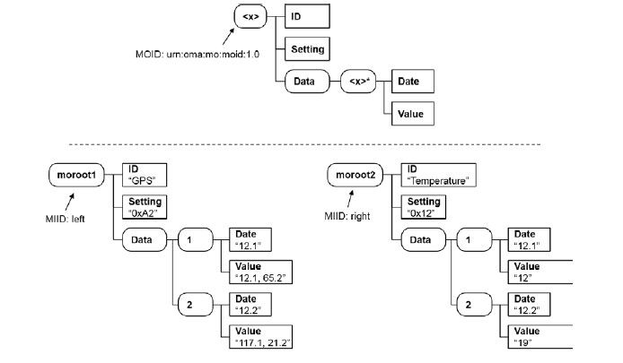
1. "urn:oma:mo:moid:1.0/left/" identifies the moroot1 node
2. "urn:oma:mo:moid:1.0//" cannot be resolved since there are two MO instances
3. "urn:oma:mo:moid:1.0/(x)/?nv=(x)/ID:Temperature" identifies the moroot2/ID node
4. "urn:oma:mo:moid:1.0/(x)/Data/1/Value?nv=(x)/ID:GPS" identifies the moroot1/Data/1/Value node
5. "urn:oma:mo:moid:1.0/right/Data/(x)/Value?nv=(x)/Date:12.1" identifies the moroot2/Data/1/Value node
6. "urn:oma:mo:moid:1.0/(x)/Data/(y)/Value?nv=(x)/ID:GPS&nv=(y)/Date:12.2" identifies the moroot1/Data/2/Value node
7. "urn:oma:mo:moid:1.0/*/Setting" identifies two nodes; the moroot1/Setting and moroot2/Setting node
8. "urn:oma:mo:moid:1.0/(x)/Data/*/Value?nv=(x)/ID:GPS" identifies two nodes; the moroot1/Data/1/Value and moroot1/Data/2/Value node
9. "urn:oma:mo:moid:1.0/(x)/Data/*/Value?nv=(x)/ID:GPS&nv=(x)/Setting:0xB2" cannot be resolved since there is no MO instances satisfying the two nv fields
10. "urn:oma:mo:moid:1.0/*/Data/*/Value" identifies four nodes; the moroot1/Data/1/Value, moroot1/Data/2/Value, moroot2/Data/1/Value, and moroot2/Data/2/Value node

究其本质来说，寻址可以简化为以下公式
MOID/ + [MIID/] + path + [? query]
其中path：(x)代表复数实例，*通配符

## 5.4. ServerURI
DM 服务器和客户端都必须支持ServerURI   

## 5.5. 管理对象定义
管理对象是实现特定功能的一组节点；管理对象的类型由MOID定义。   
DM服务器和DM客户端必须支持本节中提供的MO定义。   
DM服务器和DM客户端可以支持使用本节中提供的定义指定的任何MO（专有或其他地方标准化）。   
OMA DM 2.0不要求将DM客户端中的MOs组织为分层树结构，因为节点是基于MO实例寻址的。   

### 5.5.1. Nodes 节点
节点是可以通过OMA DM协议进行管理操作的实体，有两种类型的节点；叶节点和内部节点。   
叶节点有一个分配给该节点的值，该值可以小到整数，也可以大到复杂到背景图片或固件。OMA DM协议对节点值不可知，节点值的含义由MO描述指定。叶节点不能有子节点。内部节点可以有子节点，也不能有节点值。   

|Definition|Description|
|---|---|
|Name|节点名字|
|Status|节点状态--"Required"、"Optional"|
|Occurrence|实例数--One、ZeroOrOne、ZeroOrMore、OneOrMore、ZeroOrN、OneOrN|
|Format|格式--"node", "null", "b64", "bin", "bool", "chr", "int", "xml", "date", "time", "float"|
|Min. Access Type|操作类型--Add、Delete、Exec、Get、Replace|
|Description|节点描述|

#### 5.5.1.1. 节点访问控制
|Logical Operation|DM 2.0 Command|DM 1.3 DDF Min. Access Type|
|---|---|---|
|Read|GET/HPUT/HPOST|GET|
|Write|HGET/DELETE|ADD/REPLACE/DELETE|
|Execute|EXEC|EXEC|
|Delegate|HGET(*)||

#### 5.5.1.2. 永久节点和动态节点
MO 可以是永久节点或动态节点   
DM服务器无法在运行时创建、删除或修改永久节点：DM服务器删除永久节点的任何尝试都必须返回状态“405 Command Not Allowed”。对于所有修改永久节点名称的尝试，也将返回相同的状态代码   
动态节点可以在运行时由DM服务器创建和删除。HGET命令用于创建新的动态节点：DELETE命令用于删除动态节点及其所有属性。如果删除了包含子节点的内部节点，则还必须删除所有子节点   
永久节点可以是动态节点或永久节点的子节点。在这种情况下，永久子节点将在创建其父节点的同时创建。

#### 5.5.1.3. 有名节点和无名节点
未命名的节点在MO中充当占位符，并在运行时创建节点时用信息实例化。在MO定义中，未命名节点的名称以“<”开头，以“>”结尾。例如，常见的未命名节点是“<x>”，而可以给出信息性名称，例如“<MOID>”，这有助于理解节点名称来自MOID。建议在创建节点期间提供有关名称所采用规则的说明。

命名节点具有固定名称。节点名称在MO中不需要唯一，但在属于同一父节点的子节点中必须唯一。

#### 5.5.1.4. MO的图像显示
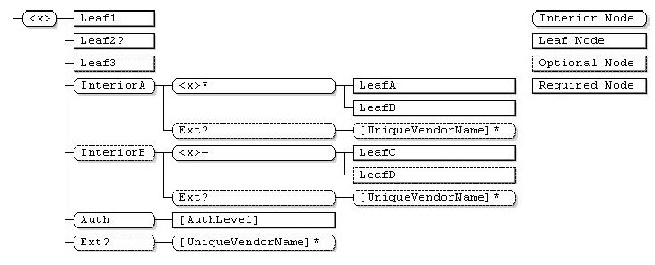   
|Marker|Meaning|
|---|---|
|+|Occurrence of OneOrMore|
|*|Occurrence of ZeroOrMore|
|?|Occurrence of ZeroOrOne|
|+N|Occurrence of OneOrN|
|*N|Occurrence of ZeroOrN|

### 5.5.2. 设备描述框架
DDF Device Description Framework
在理想情况下，所有设备都会向管理系统显示相同的结构和行为。但是，由于不同的供应商在市场上相互竞争各种设备，这种情况似乎不太可能发生。但管理系统仍然需要了解每一个设备，即使它们看起来有不同的内部结构和行为。

为了解决这个问题，引入了设备描述框架（DDF）的概念。简而言之，该框架规定了设备供应商描述其设备的方式，以便管理系统能够理解如何管理设备。

下图说明了如何使用设备描述框架的概念视图，但并不排除使用DDF的其他方法：   
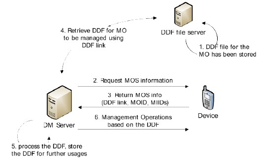

#### 5.5.2.1. 使用DM 1.x DDF
OMA DM 2.0 仍然使用DM 1.3 的DDF，但是有些元素被忽略废弃   
|Elements in DM 1.3 DDF|Descriptions|OMA DM 2.0 Support|
|---|---|---|
|MgmtTree|一个或多个描述的管理对象的容器|Mandatory|
|VerDTD|描述OMA DM的DDF主要版本和次要版本标识符|Mandatory|
|Man|设备制造商|Optional|
|Mod|设备型号|Optional|
|Node|节点|Mandatory|
|NodeName|节点名字|Mandatory|
|Path|节点之前的路径|Optional|
|Value|节点值|Optional|
|RTProperties|节点运行时的属性|Ignored|
|ACL|ACL属性|Ignored|
|Format|格式属性|Ignored|
|Name|名字属性|Ignored|
|Size|大小属性|Ignored|
|Title|标题属性|Ignored|
|TStamp|时间戳属性|Ignored|
|Type|类型属性|Ignored|
|VerNo|版本号属性|Ignored|
|B64, bin, bool, chr, int, node, null, xml, date, time, float|节点值的格式|Mandatory|
|MIME|节点值的MIME属性|Optional|
|DDFName|DDF的标识符|Mandatory|
|DFProperties|DDF中运行时未显示的节点|Mandatory|
|AccessType|节点允许的操作命令|Mandatory|
|DefaultValue|节点的默认值|Optional|
|Description|节点的描述介绍|Optional|
|DFFormat|节点的数据格式|Mandatory|
|Occurrence|节点的实例|Optional|
|Scope|是静态节点还是动态节点|Optional|
|DFTitle|节点名字|Optional|
|DFType|对叶节点来说，节点值是MIME的类型；对于内部节点来说，为空或为管理对象的标识符|Optional|
|CaseSense|节点名是否区分大小写|Optional|

# 6. 包格式说明
## 6.1. Package#0
### 6.1.1. 二进制格式
DM 服务器和客户端都必须支持该格式   
DM Notification 包头由固定两个字节组成，其后是可选部分。改包必须是以大端字节序组成即网络字节序   

#### 6.1.1.1. 包头


|Header Fields|Bit Length|Descriptions|
|---|---|---|
|VER|4|DM Notification 包的版本|
|OC|5|DM Notification 包中的可选项数量|
|RESERVED|7|标题保留字段|

#### 6.1.1.2. 包的可选项
在DM通知包中，DM服务器必须按选项号的递增顺序指定选项。每个选项由选项增量、选项长度和选项值指定，如下图所示。   

、
1. Option Delta
   该项指明了该可选项与上一个可选项的标识数的区别，使用4bit
2. Option Length
   该项指明了该可选项值的长度
3. Option Value
   该项保存该可选项的值

### 6.1.2. 其他
可能支持其他格式数据，但不在本协议规定范围内   
DM 服务器和DM 客户端都必须支持JSON格式数据   

## 6.2. Package#1
Package#1格式如下：
```
{
    "$schema": "http://json-schema.org/draft-04/schema#", 
    "title": "OMA DM Package#1 JSON Schema", 
    "type": "object", 
    "properties": {
        "MOS": {
            "type": "array", 
            "items": {
                "type": "object", 
                "properties": {
                    "DDF": {
                        "type": "string"
                    }, 
                    "MOID": {
                        "type": "string"
                    }, 
                    "MIID": {
                        "type": "array", 
                        "items": {
                            "type": "string"
                        }
                    }
                }, 
                "required": [
                    "MIID"
                ]
            }
        }, 
        "Alert": {
            "$ref": "#alert_json_schema"
        }
    }
}
```
Package#1 实例
```
POST /dmclient/dm20 HTTP/1.1
Content-Type: application/vnd.oma.dm.initiation+json
Accept: application/vnd.oma.dm.request+json
OMADM-DevID: IMEI:493005100592800
Host: www.devicemgmt.org
{
    "MOS": [
        {
            "DDF": "http://www.vendor.com/DDF/devinfo1.0.ddf", 
            "MOID": "urn:oma:mo:oma-dm-devinfo:1.0", 
            "MIID": [
                "miid1"
            ]
        }, 
        {
            "DDF": "http://www.vendor.com/DDF/oma-sessioninfomo1.0.ddf", 
            "MOID": "urn:oma:mo:oma-sessioninfomo:1.0", 
            "MIID": [
                "miid1"
            ]
        }
    ], 
    "Alert": [
        {
            "AlertType": "urn:oma:at:scomo:1.0:OperationComplete", 
            "SourceURI": "urn:oma:mo:oma-scomo:1.0/SCOMO1/Download/Package1/Operations/DownloadInstall", 
            "TargetURI": "urn:oma:mo:oma-scomo:1.0/SCOMO1/Inventory/Deployed/Component1", 
            "Mark": "warning", 
            "DataType": "text/xml", 
            "Data": {
                "DM1x": "<ResultCode>1200</ResultCode> <!-- SCOMO Result Code --><Identifier>Component1ID</Identifier>"
            }
        }, 
        {
            "AlertType": "urn:oma:at:scomo:1.0:OperationComplete", 
            "SourceURI": "urn:oma:mo:oma-scomo:1.0/SCOMO1/Download/Package1/Operations/DownloadInstall", 
            "TargetURI": "urn:oma:mo:oma-scomo:1.0/SCOMO1/Inventory/Deployed/Component2", 
            "Mark": "warning", 
            "DataType": "text/xml", 
            "Data": {
                "DM1x": "<ResultCode>1200</ResultCode> <!-- SCOMO Result Code --><Identifier>Component1ID</Identifier>"
            }
        }
    ]
}
```

## 6.3. Package#2
Package#2格式如下：
```
{
    "$schema": "http://json-schema.org/draft-04/schema#", 
    "title": "OMA DM Package#2 JSON Schema", 
    "type": "object", 
    "properties": {
        "CMD": {
            "type": "array", 
            "items": {
                "type": "array", 
                "items": {
                    "description": "DM CMD, parameters in order", 
                    "type": "string"
                }
            }
        }
    }, 
    "required": [
        "CMD"
    ]
}
```
Package#2 实例
```
HTTP/1.1 200 OK
Content-Type: application/vnd.oma.dm.request+json
{
    "CMD": [
        [
            "HPOST", 
            "https://DMcontent.DMserver.operator.com/[DevID]", 
            "urn:oma:mo:oma-dm-devinfo:1.0//", 
            "urn:oma:mo:oma-sessioninfomo:1.0//"
        ], 
        [
            "HGET", 
            "https://DMcontent.DMserver.operator.com/new_mo"
        ], 
        [
            "GET", 
            "urn:oma:mo:oma-sessioninfomo:1.0//CBT"
        ]
    ]
}
```


## 6.4. Package#3
Package#3格式如下：
```
{
    "$schema": "http://json-schema.org/draft-04/schema#", 
    "title": "OMA DM Package#3 JSON Schema", 
    "type": "object", 
    "properties": {
        "Status": {
            "type": "array", 
            "items": {
                "description": "status codes are ordered in the same sequence with the DM commands in the Package#2", 
                "type": "object", 
                "properties": {
                    "sc": {
                        "type": "number"
                    }, 
                    "URI": {
                        "type": "array", 
                        "items": {
                            "type": "string"
                        }
                    }
                }, 
                "required": [
                    "sc"
                ]
            }
        }, 
        "Alert": {
            "$ref": "#alert_json_schema"
        }
    }, 
    "required": [
        "Status"
    ]
}
```
Package#3 实例
```
POST /dmclient/dm20 HTTP/1.1
Content-Type: application/vnd.oma.dm.response+json
Accept: application/vnd.oma.dm.request+json
OMADM-DevID: IMEI:493005100592800
Host: www.devicemgmt.org
{
    "Status": [
        {
            "sc": 200
        }, 
        {
            "sc": 200, 
            "URI": [
                "urn:oma:mo:oma-mo:1.0/miid1/", 
                "urn:oma:mo:oma-mo:1.0/miid2/"
            ]
        }, 
        {
            "sc": 200
        }
    ], 
    "Alert": [
        {
            "AlertType": "urn:oma:at:dcmo:1.0:OperationComplete", 
            "SourceURI": "urn:oma:mo:oma-dcmo:1.0/Capability123/Operations/Enable", 
            "Mark": "warning", 
            "DataType": "int", 
            "Data": {
                "DM1x": 1404
            }
        }
    ]
}
```

## 6.5. MOS
Management Object Serialization 管理对象序列化
格式定义如下：   
```
{
    "$schema": "http://json-schema.org/draft-04/schema#", 
    "title": "Management Object JSON Schema", 
    "type": "array", 
    "items": {
        "type": "object", 
        "properties": {
            "DDF": {
                "type": "string", 
                "description": "DDF URL"
            }, 
            "ClientURI": {
                "type": "string"
            }, 
            "CV": {
                "type": "string"
            }, 
            "MOData": {
                "type": "object"
            }
        }, 
        "required": [
            "ClientURI", 
            "MOData"
        ]
    }
}
```
实例：   
```
[
    {
        "DDF": "http://www.vendor.com/DDF/devinfo1.0.ddf", 
        "ClientURI": "oma:mo:oma-dm-devinfo:1.0//", 
        "CV": "686897696a7c876b7e", 
        "MOData": {
            "DevInfo": {
                "DevID": "IMEI:493005100592800", 
                "Man": "Vendor", 
                "Mod": "DM_Client", 
                "DmV": "2.0", 
                "Lang": "en", 
                "DevType": "smartphone", 
                "OEM": "", 
                "FwV": "android4.0.4", 
                "SwV": "Vendor1.2", 
                "HwV": ""
            }
        }
    }
]
```

## 6.6. 警报
警报数据定义如下：   
```
{
    "$schema": "http://json-schema.org/draft-04/schema#", 
    "title": "OMA DM Generic Alert", 
    "type": "object", 
    "properties": {
        "Alert": {
            "type": "array", 
            "items": {
                "description": "status codes are ordered in the same sequence with the DM commands in the Package#2", 
                "type": "object", 
                "properties": {
                    "AlertType": {
                        "type": "string"
                    }, 
                    "SourceURI": {
                        "type": "string"
                    }, 
                    "TargetURI": {
                        "type": "string"
                    }, 
                    "Mark": {
                        "type": "string"
                    }, 
                    "DataType": {
                        "type": "string"
                    }, 
                    "Data": {
                        "type": "object", 
                        "description": "the format is out-of-scope of this specification"
                    }
                }, 
                "required": [
                    "AlertType"
                ]
            }
        }
    }
}
```
实例如下：   
```
{
    "Alert": [
        {
            "AlertType": "urn:oma:at:scomo:1.0:OperationComplete", 
            "SourceURI": "urn:oma:mo:oma-scomo:1.0/SCOMO1/Download/Package1/Operations/DownloadInstall", 
            "TargetURI": "urn:oma:mo:oma-scomo:1.0/SCOMO1/Inventory/Deployed/Component1", 
            "Mark": "warning", 
            "DataType": "text/xml", 
            "Data": {
                "DM1x": "<ResultCode>1200</ResultCode> <!-- SCOMO Result Code --><Identifier>Component1ID</Identifier>"
            }
        }, 
        {
            "AlertType": "urn:oma:at:scomo:1.0:OperationComplete", 
            "SourceURI": "urn:oma:mo:oma-scomo:1.0/SCOMO1/Download/Package1/Operations/DownloadInstall", 
            "TargetURI": "urn:oma:mo:oma-scomo:1.0/SCOMO1/Inventory/Deployed/Component2", 
            "Mark": "warning", 
            "DataType": "text/xml", 
            "Data": {
                "DM1x": "<ResultCode>1200</ResultCode> <!-- SCOMO Result Code --><Identifier>Component1ID</Identifier>"
            }
        }
    ]
}
```

# 7. 引导启动
支持以下引导启动   
1. Factory Bootstrap   
DM 客户端访问DM 服务器的所有参数都已经在出厂时配置好了
2. Smartcard Bootstrap   
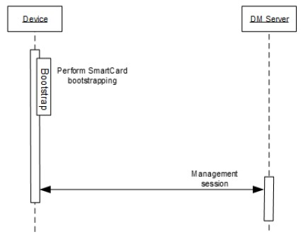
3. Client initiated bootstrap   
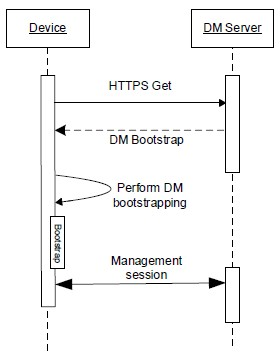
4. Server initiated bootstrap   
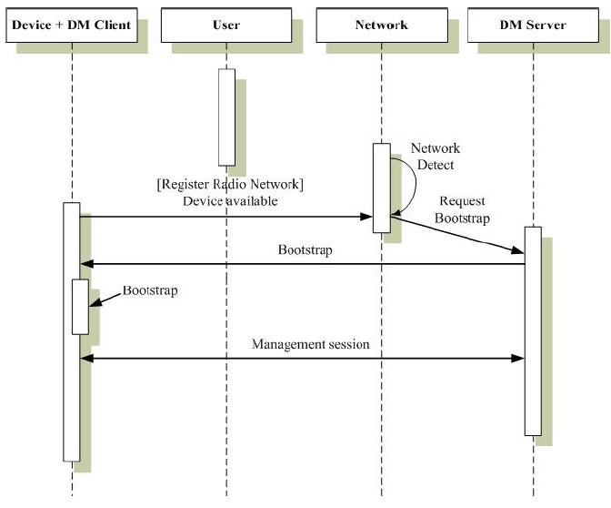

当成功引导启动之后，DM 客户端必须向服务器发送警报类型为“urn:oma:at:dm:2.0:BootstrapComplete”的警报

# 8. 安全相关
## 8.1. DM Notification 安全
DM Notification的安全性要求可能是多种多样的。本协议规定的认证基于SHA256-DIGEST，TIMESTAMP可以用作防止回复攻击。

## 8.2. DM 会话安全
DM协议不提供任何安全机制来保证DM会话的完整性和机密性，以及DM客户端和DM服务器之间的相互身份验证，但依赖于传输层安全机制。   
使用SSL 和TLS   
HTTPS：HTTP over SSL/TLS   

### 8.2.1. 认证
TLS支持使用多种身份验证机制，以允许客户端对服务器进行身份验证，反之亦然   
DM 服务器必须支持Basic Authentication、Digest Authentication、X.509 certificate   
DM 客户端必须支持Basic Authentication、X.509 certificate，可选支持Digest Authentication   
认证和授权控制出现在TLS握手的第一步

### 8.2.2. 机密性和完整性
机密性意味着应用程序数据在通过TCP传输之前经过加密。存在两种主要的加密类型：对称密钥（也称为共享密钥）和非对称密钥（也称为公钥或公私密钥）。TLS使用两种加密方法。   

如果X509证书模式不被支持，则应支持Pre-Shared Keys mode (PSK-TLS)   

证书认证要求如下：

• The DM Server SHALL support X509 certificate and PSK-TLS [RFC4279]   
• The DM client SHALL support at least one of the following modes:   
1. X509 certificate   
2. PSK-TLS   

• The DM Server and the DM Client SHALL support TLS 1.1 [RFC4346]   
• The DM Server and the DM Client SHOULD support TLS 1.0 [RFC4279] or SHOULD support TLS 1.2 [RFC5246]   
• The DM Client SHALL check that the DM Server is using TLS1.0 [RFC4279] or TLS 1.1 [RFC4346]  or TLS 1.2 [RFC5246] before accepting the session establishment   
• A session SHALL NOT take place over mechanism weaker than TLS1.0 [RFC4279]   

• The DM Server SHALL support the following Cipher Suites when using an PSK-TLS mode:
1. TLS_PSK_WITH_AES_128_GCM_SHA256   
2. TLS_DHE_PSK_WITH_AES_128_GCM_SHA256   
3. TLS_RSA_PSK_WITH_AES_128_GCM_SHA256   
4. TLS_PSK_WITH_AES_128_CBC_SHA256   
5. TLS_DHE_PSK_WITH_AES_128_CBC_SHA256   
6. TLS_RSA_PSK_WITH_AES_128_CBC_SHA256   
7. TLS_ECDHE_PSK_WITH_AES_128_CBC_SHA256   

• The DM Client SHALL support at least one of the following Cipher Suites when using an PSK-TLS mode:   
1. TLS_PSK_WITH_AES_128_GCM_SHA256   
2. TLS_DHE_PSK_WITH_AES_128_GCM_SHA256   
3. TLS_RSA_PSK_WITH_AES_128_GCM_SHA256   
4. TLS_PSK_WITH_AES_128_CBC_SHA256   
5. TLS_DHE_PSK_WITH_AES_128_CBC_SHA256   
6. TLS_RSA_PSK_WITH_AES_128_CBC_SHA256   
7. TLS_ECDHE_PSK_WITH_AES_128_CBC_SHA256   

• The DM Server SHALL support the following Cipher Suites when using X509 mode:   
1. TLS_ECDHE_ECDSA_WITH_AES_128_GCM_SHA256   
2. TLS_DHE_RSA_WITH_AES_128_GCM_SHA256   
3. TLS_RSA_WITH_AES_128_GCM_SHA256   
4. TLS_ECDHE_ECDSA_WITH_AES_128_CBC_SHA256   
5. TLS_DHE_RSA_WITH_AES_128_CBC_SHA256   
6. TLS_RSA_WITH_AES_128_CBC_SHA256   

• The DM Client SHALL support at least one of the following Cipher Suites when using X509 mode:   
1. TLS_ECDHE_ECDSA_WITH_AES_128_GCM_SHA256   
2. TLS_DHE_RSA_WITH_AES_128_GCM_SHA256   
3. TLS_RSA_WITH_AES_128_GCM_SHA256   
4. TLS_ECDHE_ECDSA_WITH_AES_128_CBC_SHA256   
5. TLS_DHE_RSA_WITH_AES_128_CBC_SHA256   
6. TLS_RSA_WITH_AES_128_CBC_SHA256   


## 8.3. 引导启动 安全
引导启动是一个敏感的过程，可能涉及双方之间的沟通，而之前彼此之间没有任何关系或了解。在这方面，安全非常重要。引导消息的接收者需要知道信息来源正确，并且在发送过程中没有被篡改。发送方还希望端到端的保密性，以防止窃听者冒充，因为窃听者可以看到包含访问DM服务器凭据的引导消息的内容。

重要的是，DM客户端只接受来自授权DM服务器的引导命令。

### 8.3.1. 传输
使用TSL保证机密传输

### 8.3.2. smartcard
智能卡提供安全机制来传输和存储引导消息信息

### 8.3.3. 依赖于网络的安全

### 8.3.4. 认证和授权
在引导过程中，DM客户端和DM服务器必须执行相互身份验证。用于保护引导消息传输的关键材料存储在DM Account MO的<x>/Auth/Bootstrap节点下，任何其他不充当引导服务器的DM服务器都无法更改

# 9. 委托访问控制机制
访问控制机制确保只有授权的DM服务器才能在MO实例上调用DM命令。访问控制机制的设计原则如下：   
1. DM Bootstrap包含请求由DM服务器管理的MOID列表（DM Account MO中的Permissions/<x>/MOID节点）。接受此DM引导并不意味着DM服务器可以立即管理已配置MOID的MO实例。要管理已配置MOID的特定MO实例，DM服务器必须获得MO实例的权限。DM客户端必须确保DM服务器不会管理MOID未在引导时设置的管理对象   
2. 默认情况下，MO实例的创建者（即DM服务器，在设备上本地运行的应用程序）自动获得新MO实例的独占完全权限   
3. 访问权限在MO实例库上分配，并强制授权执行针对该实例中包含的节点的DM命令。   

DM客户端必须使用委派访问控制MO 向DM 服务器公开DM服务器可以访问的MO实例和相关访问权限。

DM服务器必须支持访问控制机制。

DM客户端应支持访问控制机制；如果DM客户端不支持访问控制机制，DM客户端必须向每个引导的DM服务器授予所有MO实例的完全权限。

# 10. 管理对象缓存机制
当DM 服务器从DM 客户端检索MO 数据时，管理对象缓存机制能够减少网络流量和降低响应延迟。   
DM 客户端能够在本地存储一份拷贝的MO 数据，如果满足某些条件（缓存命中），则对同一MO的后续请求可以引用缓存数据   
DM服务器应该支持这种机制。DM客户端可能支持这种机制。   

## 10.1. 缓存验证器
缓存验证器是为本地缓存提供新鲜度信息的实体。缓存验证器的典型示例是时间戳或不透明标识符，如HTTP ETag头   

只能缓存MO实例，这些MO实例称为“可缓存MO实例”：可缓存MO实例的选择过程不在本规范的范围内。对于每个可缓存的MO实例，DM客户端必须分配一个“缓存验证器”，该验证器必须在每次MO实例发生更改时更新。

缓存验证是检查缓存副本是否有效或过时的过程：如果与本地缓存相比，整个MO实例未被修改，则缓存验证必须返回true；否则，缓存验证必须返回false。

尽管缓存验证器已分配给可缓存MO实例，但缓存验证器可用于针对可缓存MO实例中任何节点的所有读取操作（即GET/HPUT/HPOST）。例如，如果GET命令的ClientURI以可缓存MO实例中的叶节点为目标，则可以在cv字段中提供MO实例的缓存验证器，如果整个MO实例未修改，DM服务器将收到“304未修改”。

ClientURI中的cv字段为可缓存MO实例提供缓存验证器   

## 10.2. 请求与响应的缓存
下面介绍缓存机制流的DM服务器部分。  

步骤1：DM服务器想要请求一个由ClientURI标识的MO数据。

步骤2a：如果DM服务器知道包含ClientURI目标节点的MO实例的缓存验证器，DM服务器应该将cv字段添加到ClientURI。ClientURI中的cv字段为MO实例提供缓存验证程序。

步骤2b：如果DM服务器不知道MO实例的缓存验证器，则DM服务器不应在ClientURI中包含cv字段。

下面介绍缓存机制流的DM客户端部分。

步骤1：DM客户端接收一个DM命令，请求一个由ClientURI标识的MO数据。

步骤2a：如果ClientURI没有cv字段，DM客户端必须返回请求的MO数据。如果ClientURI以可缓存的MO实例为目标（即ClientURI以MO实例的根节点为目标），则DM客户端还应返回该MO实例的缓存验证程序。

步骤2b：如果ClientURI具有cv字段，则DM客户端必须运行缓存验证过程：

− 如果缓存验证过程返回true，DM客户端必须返回“304未修改”，并且不得发送请求的MO数据

− 如果缓存验证过程返回false，DM客户端必须返回请求的MO数据。如果ClientURI以可缓存的MO实例为目标（即ClientURI以MO实例的根节点为目标），则DM客户端还应返回该MO实例的缓存验证程序。

# 11. DM 2.0标准管理对象
## 11.1. DevInfo Management Object
DM 服务器和DM 客户端都必须支持该MO   
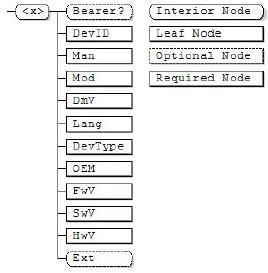

|Name|Description|Status|Occurrence|Format|Min.Access Type|
|---|---|---|---|---|---|
|< x>|根节点,"urn:oma:mo:oma-dm-dmacc:1.2"|Required|One|node|Get|
|Bearer|一种可选的内部节点，其中存储与承载（CDMA等）相关的项目。其他标准可以强制使用此子树|Optional|ZeroOrOne|node|Get|
|DevID|设备ID，可以用IMEI、ESN、MEID、UUID|Required|One|chr|Get|
|Man|制造商标识|Required|One|chr|Get|
|Mod|模块标识|Required|One|chr|Get|
|DmV|OMA 设备管理版本标识|Required|One|chr|Get|
|Lang|语言|Required|One|chr|Get|
|DevType|设备类型，例如手机、平板|Required|One|chr|Get|
|OEM|设备的原始制造商|Required|One|chr|Get|
|FwV|设备的固件版本|Required|One|chr|Get|
|SwV|设备的软件版本|Required|One|chr|Get|
|HwV|设备的硬件版本|Required|One|chr|Get|
|Ext|用于供应商扩展|Optional|One|node|Get|

## 11.2. DM Account Management Object
DM 服务器和DM 客户端都必须支持该MO   
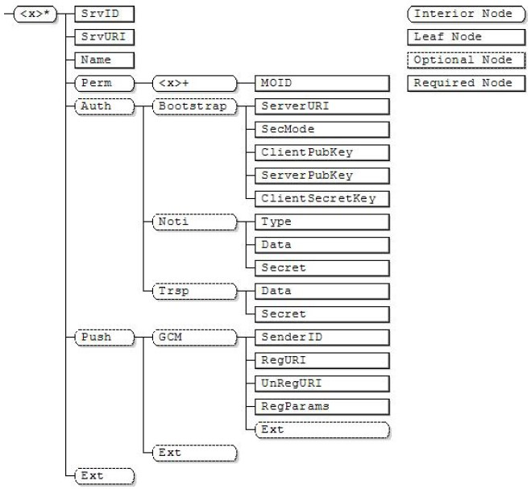  
|Name|Description|Status|Occurrence|Format|Min.Access Type|
|---|---|---|---|---|---|
|< x>|根节点,"urn:oma:mo:oma-dm-dmacc:1.2"|Required|ZeroOrMore|node|Get|
|SrvID|此节点为管理会话中使用的管理服务器指定服务器标识符。此标识符在DM客户端中必须是唯一的|Required|One|chr|Get|
|SrvURI|此节点指定DM客户端必须连接的DM服务器端点，以便启动DM会话。它必须编码为URI|Required|One|chr|Get|
|Name|此节点指定管理服务器的用户可显示名称|Required|One|chr|Get|
|Perm|此内部节点是仅在引导过程中提供的权限相关信息的父节点。诸如用户之类的参与者可以基于该信息拒绝引导消息。此节点和所有子节点不得在DM客户端中公开|Required|One|node|No Get|
|Perm/<.x>|此节点将特定MOID的权限相关信息分组|Required|OneOrMore|node|No Get|
|Perm/<.x>/MOID|此节点指定此组的MOID|Required|One|chr|No Get|
|Auth|此内部节点是由DM服务器管理的身份验证的父节点|Optional|One|node|Get|
|Auth/Bootstrap|该内部节点是父节点，其中存储了密钥材料和机密数据，用于与充当引导服务器的DM服务器建立SSL/TLS会话。如果存在此节点：DM客户端必须使用子节点中指定的数据来执行所有必要的功能，以确保DM服务器身份验证。DM服务器应该使用子节点中指定的数据来执行所有必要的功能，以确保DM客户端身份验证。 DM客户端必须使用子节点中指定的数据来执行授权。如果此节点不存在，则引导安全的凭据必须通过本规范范围之外的另一种机制传递|Optional|One|node|Get|
|Auth/Bootstrap/ServerURI|此节点指定了充当引导服务器的DM服务器的URI|Required|One|chr|Get|
|Auth/Bootstrap/SecMode|此节点指定SSL/TLS的安全模式。|Required|One|bin|Get|
|Auth/Bootstrap/ClientPubKey|此内部是DM客户端证书（X.509证书模式）或PSK标识（PSK模式）的占位符。|Required|One|bin|No Get|
|Auth/Bootstrap/ServerPubKey|此内部是DM服务器证书（X.509证书模式）或PSK标识（PSK模式）的占位符。|Required|One|bin|No Get|
|Auth/Bootstrap/ClientSecretKey|该内部是DM客户端密钥（PSK模式下的预共享密钥或X.509模式下的私钥）的占位符。|Required|One|bin|No Get|
|Auth/Noti|此内部节点是用于DM通知的凭据的父节点。如果显示了此内部节点，并且在DM通知中指定了SHA256-DIGEST选项，则DM客户端必须使用SHA256-DIGEST选项对DM通知进行身份验证|Optional|One|node|Get|
|Auth/Noti/Type|此节点指定身份验证类型。|Required|One|int|Get|
|Auth/Noti/Data|此节点指定与<.x>/Auth/Noti/type节点指示的身份验证类型相关的身份验证数据。|Required|One|bin|Get|
|Auth/Noti/Secret|此节点指定与<.x>/Auth/Noti/type节点指示的身份验证类型相关的身份验证密钥。|Required|One|bin|Get|
|Auth/Trsp|此内部节点是传输层用于保护DM会话的凭据的父节点。如果存在此节点，DM客户端必须使用传输层安全机制的子节点中指定的凭据。如果此节点不存在，则必须通过范围外机制传递传输层安全的凭据|Optional|One|node|Get|
|Auth/Trsp/Data|此节点指定用于传输层安全的身份验证数据。例如，该节点可以存储DM客户端的证书或公钥，用于传输安全。|Required|One|bin|Get|
|Auth/Trsp/Secret|此节点指定用于传输层安全的身份验证密钥。例如，该节点可以存储DM客户端的私钥，用于传输安全。|Required|One|bin|No Get|
|Push|此节点是平台或供应商特定推送机制的占位符节点。|Optional|One|node|Get|
|Push/GCM|此节点是GCM推送机制配置的占位符节点|Optional|One|node|Get|
|Push/GCM/SenderID|此节点包含用于标识服务的发件人ID[GCM]|Required|One|chr|Get|
|Push/GCM/RegURI|此节点包含一个URI，DM客户端在接收到register[GCM]事件后必须在该URI中注册自身|Required|One|chr|Get|
|Push/GCM/UnRegURI|此节点包含一个URI，一旦收到UnRegister[GCM]事件，DM客户端就会在该URI中注销自身。|Required|One|chr|Get|
|Push/GCM/RegParams|此节点包含DM客户端在注册和注销期间必须使用的其他注册参数。如果此字符串存在，则必须将其编码为URI查询组件[RFC3986]。|Required|One|chr|Get|
|Push/GCM/Ext|此内部节点用于特定于供应商的扩展，以存储与设备相关的信息|Optional|One|node|Get|
|Push/Ext|此内部节点用于特定于供应商的扩展，以存储与设备相关的信息|Optional|One|node|Get|
|Ext|此内部节点用于特定于供应商的扩展，以存储与设备相关的信息|Optional|One|node|Get|

## Delegation Access Control MO
。。。

## Session Information Management Object
。。。