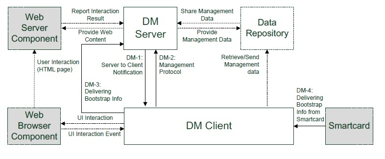
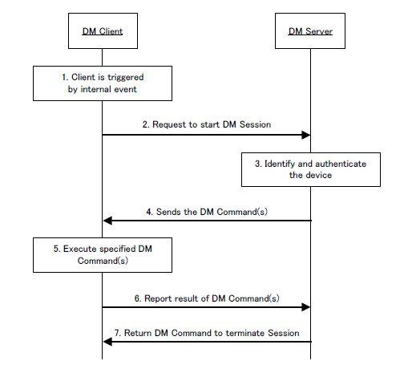
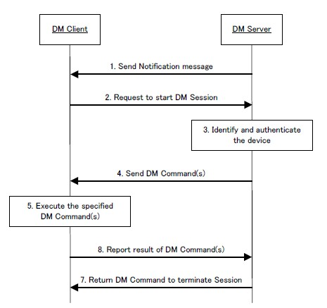
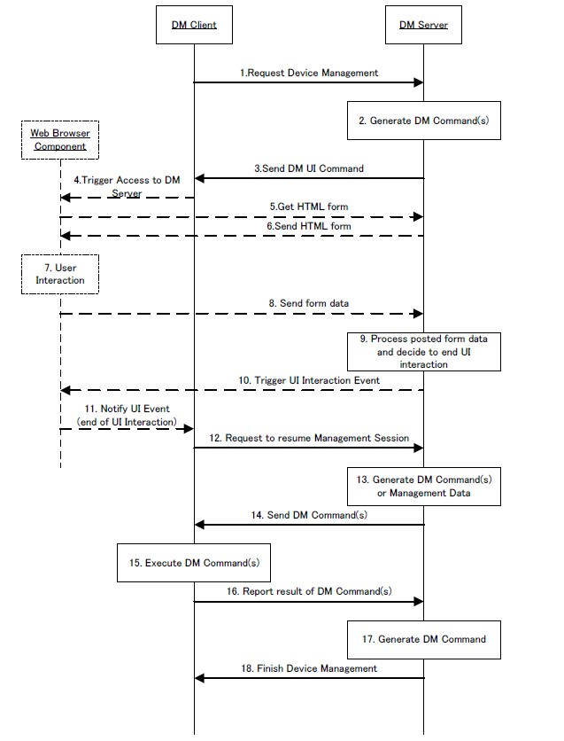
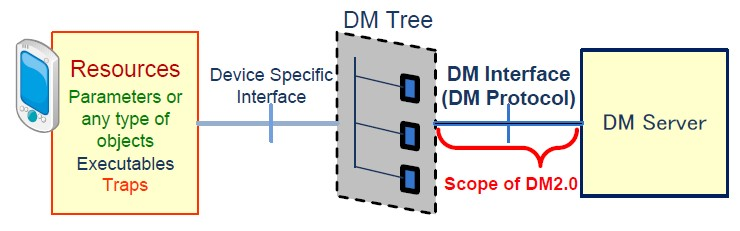

# 1. OMA
OMA-Open Mobile Alliance 开放移动联盟   
https://technical.openmobilealliance.org/index.html

## 1.1. OMA DM
OMA DM Device Management

### 1.1.1. DM AD
DM AD Device Management Architecture
管理机构对被管理设备进行管理。
1. 设置设备的初始配置信息
2. 更新设置设备信息
3. 获取设备信息
4. 处理设备生成的事件   

通用需求   
特定需求   
供应商参数   

在无线环境中，设备管理协议的关键要素是需要高效、有效地解决设备的特性，包括低带宽和高延迟，并通过无线远程支持这些管理操作。

#### 1.1.1.1. 架构图

1. DM Client   
   被管理的设备
2. DM Serve   
   管理设备的服务器
3. Web Server Component   
   Web服务器组件是一个可选的逻辑服务器，负责交付Web内容，以便与设备上的Web浏览器组件进行UI交互。DM服务器可以使用Web浏览器组件请求DM客户端访问该组件。DM服务器还可以从该组件接收UI交互的结果。该组件可选。
4. Web Browser Component   
   Web浏览器组件是一个可选的逻辑组件，负责为DM客户端提供UI交互功能。DM Client可能会触发Web浏览器来处理Web服务器组件提供的Web内容。该组件可选。
   说明：此组件可以使用独立的web浏览器应用程序实现，或者浏览器窗口可以作为web浏览器组件实现，作为DM客户端应用程序的一部分。
5. Data Repository   
   数据存储库是一个逻辑服务器，DM客户端可以通过使用HTTP方法或其他传输协议来检索和发送管理数据。DM服务器可以与该实体交换管理数据

#### 1.1.1.2. 安全性考虑
   如果一个DM客户端是由一个恶意的DM服务器配置的，那么这个设备就有可能被破坏。如果恶意DM客户端由DM服务器配置，则该DM客户端的数据可能会传播到网络中
   1. 在DM服务器和DM客户端之间提供相互身份验证
   2. 支持数据存储库和DM客户端之间的相互身份验证
   3. 不允许未经授权从DM服务器访问DM客户端
   4. 不允许未经授权从DM客户端访问DM服务器
   5. 在DM服务器和DM客户端之间提供安全通信通道
   6. 支持数据存储库和DM客户端之间的安全通信通道

#### 1.1.1.3. 客户端启动会话
      
   1. DM客户端由内部事件触发，如定时定时器
   2. DM客户端向DM服务器发送启动客户端启动会话的请求
   3. DM服务器识别并验证设备
   4. DM服务器向设备发送DM命令
   5. DM客户端执行指定的DM命令
   6. DM客户端报告DM命令操作的结果
   7. DM服务器向设备返回DM命令以终止管理会话

#### 1.1.1.4. 服务器启动会话
   
   1. DM服务器向DM客户端发送通知消息
   2. DM客户端启动服务器启动的会话
   3. DM服务器识别并验证设备
   4. DM服务器向设备发送DM命令
   5. DM客户端执行指定的DM命令
   6. DM客户端报告DM命令操作的结果
   7. DM服务器返回DM命令以终止管理会话

#### 1.1.1.5. UI-Web
   
   1. DM客户端向DM服务器发送启动管理会话的请求
   2. DM服务器在内部生成DM命令
   3. DM服务器发送要在设备上执行的DM命令
   4. DM客户端触发Web浏览器在内部访问DM服务器
   5. Web浏览器请求获取用于UI交互的HTML表单文档
   6. DM服务器向Web浏览器发送HTML表单文档
   7. Web浏览器在内部与用户进行UI交互
   8. Web浏览器将表单数据发送到DM服务器
   9. DM服务器处理已发布的表单数据，并决定结束UI交互
   10. DM服务器触发Web浏览器以通知UI交互事件
   11. Web浏览器将UI交互事件通知给DM客户端
   12. DM客户端请求恢复管理会话
   13. DM服务器在内部生成DM命令
   14. DM服务器发送要在设备上执行的DM命令
   15. DM客户端执行指定的DM命令操作
   16. DM客户端报告DM命令操作的结果
   17. DM服务器在内部生成DM命令
   18. DM服务器向设备发送DM命令以完成管理会话

### 1.1.2. DM RD
   DM RD Device Management Requirements
   设备管理的一组功能需求   
   1. 在设备中设置初始配置信息
   2. 设备中持久信息的后续安装和更新
   3. 从设备中检索管理信息
   4. 处理设备产生的事件和警报

#### 1.1.2.1. 设备管理发布发布说明
   
   Device Management（DM）2.0 提供了一个平台无关的协议，允许服务器远程管理设备。DM旨在以平台无关的格式通过HTTP传输协议和通知协议进行操作

#### 1.1.2.2. 端到端服务描述
   DM 2.0 基于RESTful体系结构。该协议通过重用广泛部署的标准基础技术（如HTTP和JSON数据表示），允许更简单地实现DM客户端和DM服务器

#### 1.1.2.3. 需求
##### 1.1.2.3.1. 功能
|Label|Description|
|-----|-----------|
|DM-HLF-001 | 指定DM客户端公开支持的管理对象类型的机制|
|DM-HLF-002 | 支持用户界面功能的网络浏览器或网络浏览器组件|
|DM-HLF-003 | 支持单独交付管理数据和管理命令的机制|
|DM-HLF-004 | 支持在同一消息中传递管理命令和管理数据|
|DM-HLF-005 | 支持用于设备管理的HTTP GET、POST和PUT操作|
|DM-HLF-006 | 支持提供启动引导所需信息的机制|
|DM-HLF-007 | 支持操作DM管理树的接口|
|DM-HLF-008 | 提供一种机制，用于发现客户端支持的可选DM功能|

##### 1.1.2.3.2. 安全
|Label|Description|
|-----|-----------|
|DM-SEC-001 | 支持身份验证、授权、完整性和保密性|
|DM-SEC-002 | 在DM服务器和DM客户端之间提供安全通信通道|
|DM-SEC-003 | 支持数据存储库和DM客户端之间的安全通信通道|

##### 1.1.2.3.3. 认证
|Label|Description|
|-----|-----------|
|DM-AT-001 | 在DM服务器和DM客户端之间提供相互认证|
|DM-AT-002 | 支持数据存储库和DM客户端之间的相互认证|

##### 1.1.2.3.4. 授权
|Label|Description|
|-----|-----------|
|DM-AZ-001 | 支持一种机制，将访问控制管理权与数据管理权分开|
|DM-AZ-002 | 不允许未经授权从DM客户端访问DM服务器|
|DM-AZ-003 | 不允许未经授权从DM服务器访问DM客户端|

##### 1.1.2.3.5. 管理和配置
|Label|Description|
|-----|-----------|
|DM-ADM-001 | 允许DM服务器在多个设备上使用相同的DM帐户|

##### 1.1.2.3.6. 互操作性
|Label|Description|
|-----|-----------|
|DM-INT-001 | 支持使用MIME类型识别管理数据的格式|
|DM-INT-002 | 指定用于交付管理对象的JSON格式|
|DM-INT-003 | 允许服务器在不知道管理对象位置的情况下管理设备|
|DM-INT-004 | 允许在单独的DDF文件中描述支持的管理对象|
|DM-INT-005 | 支持设计用于OMA DM 1的现有管理对象|

#### 1.1.2.4. 总体系统要求
|Label|Description|
|-----|-----------|
|DM-SYS-001 | 允许服务器的无状态实现|

