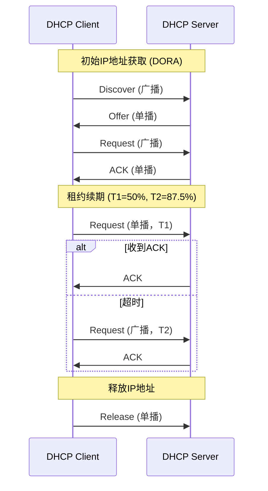

# 简介
DHCP（Dynamic Host Configuration Protocol，动态主机配置协议），前身是BOOTP协议，是一个局域网的网络协议，使用UDP协议工作，统一使用两个IANA分配的端口：67（服务器端），68（客户端）。

# 报文
1. Discover   
DHCP客户端在请求IP地址时并不知道DHCP服务器的位置，因此DHCP客户端会在本地网络内以广播方式发送Discover请求报文，以发现网络中的DHCP服务器。所有收到Discover报文的DHCP服务器都会发送应答报文，DHCP客户端据此可以知道网络中存在的DHCP服务器的位置。

2. Offer   
DHCP服务器收到Discover报文后，就会在所配置的地址池中查找一个合适的IP地址，加上相应的租约期限和其他配置信息（如网关、DNS服务器等），构造一个Offer报文，发送给DHCP客户端，告知用户本服务器可以为其提供IP地址。但这个报文只是告诉DHCP客户端可以提供IP地址，最终还需要客户端通过ARP来检测该IP地址是否重复。

3. Request   
DHCP客户端可能会收到很多Offer请求报文，所以必须在这些应答中选择一个。通常是选择第一个Offer应答报文的服务器作为自己的目标服务器，并向该服务器发送一个广播的Request请求报文，通告选择的服务器，希望获得所分配的IP地址。另外，DHCP客户端在成功获取IP地址后，在地址使用租期达到50%时，会向DHCP服务器发送单播Request请求报文请求续延租约，如果没有收到ACK报文，在租期达到87.5%时，会再次发送广播的Request请求报文以请求续延租约。

4. ACK   
DHCP服务器收到Request请求报文后，根据Request报文中携带的用户MAC来查找有没有相应的租约记录，如果有则发送ACK应答报文，通知用户可以使用分配的IP地址。

5. NAK   
如果DHCP服务器收到Request请求报文后，没有发现有相应的租约记录或者由于某些原因无法正常分配IP地址，则向DHCP客户端发送NAK应答报文，通知用户无法分配合适的IP地址。

6. Release   
当DHCP客户端不再需要使用分配IP地址时（一般出现在客户端关机、下线等状况）就会主动向DHCP服务器发送RELEASE请求报文，告知服务器用户不再需要分配IP地址，请求DHCP服务器释放对应的IP地址。

7. Decline   
DHCP客户端收到DHCP服务器ACK应答报文后，通过地址冲突检测发现服务器分配的地址冲突或者由于其他原因导致不能使用，则会向DHCP服务器发送Decline请求报文，通知服务器所分配的IP地址不可用，以期获得新的IP地址。

8. Inform   
DHCP客户端如果需要从DHCP服务器端获取更为详细的配置信息，则向DHCP服务器发送Inform请求报文；DHCP服务器在收到该报文后，将根据租约进行查找到相应的配置信息后，向DHCP客户端发送ACK应答报文。目前基本上不用了。

# DHCP流程

DHCP客户端与服务器之间的交互遵循典型的“四次握手”过程，如下图所示：

**说明**：
1. **发现阶段（Discover）**：客户端广播Discover报文，寻找可用的DHCP服务器。
2. **提供阶段（Offer）**：服务器响应Offer报文，提供IP地址等配置信息。
3. **请求阶段（Request）**：客户端广播Request报文，正式请求使用该IP地址。
4. **确认阶段（ACK）**：服务器发送ACK报文，确认租约生效。

租约续期过程中，客户端在租期达到50%（T1）时尝试单播续租，若失败则在87.5%（T2）时广播续租请求。

当客户端不再需要IP地址时，可发送Release报文主动释放。

