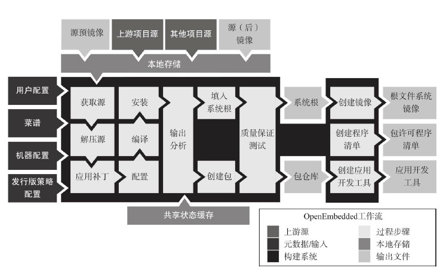
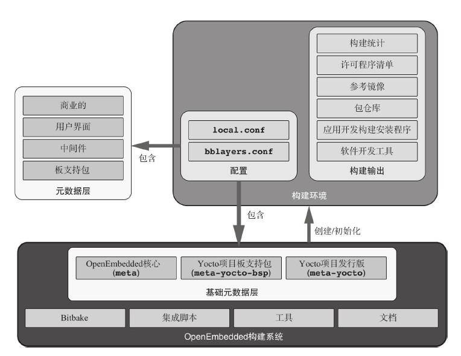
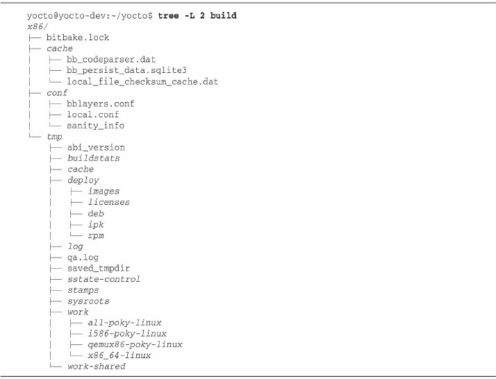

# 1. 构建开源软件包

## 1.1. 获取
获取源代码。

## 1.2. 解压
解压源代码。

## 1.3. 补丁
针对缺陷修复和增加的功能应用补丁。   
Quilt补丁管理系统

## 1.4. 配置
依据环境准备构建过程。   
GNU构建系统，又称为Autotools，Autotools是一套目标为使源代码软件包可以移植到很多类UNIX系统的工具，Autotools从一些列具有特殊源代码体特征的输入文件中创建configure脚本。通过一系列处理步骤，configure创建了特别用于目标系统的makefile

## 1.5. 构建
编译和连接。   
make、cmake、qmake

## 1.6. 安装
复制二进制和辅助文件到它们的目标目录。

## 1.7. 打包
为在其他系统上安装而打包二进制和辅助文件。

# 2. OpenEmbedded工作流

bitbake 完全不建立工作流。工作流和其配置是被元数据定义的。   

## 2.1. 元数据文件
元数据文件被划分为两个类别：配置文件和菜谱

### 2.1.1. 配置文件
配置文件包含简单变量赋值形式的全局构建系统设置。bitbake在全局数据字典中维护变量设定，并且它们可以在任何元数据文件中被访问到。变量可以被设置在配置文件中并且被另外的配置文件覆盖。   
bitbake区分多个不同类型的配置文件，但是都有相同的文件扩展名.conf

#### 2.1.1.1. bitbake 主配置文件 bitbake.cof
bitbake 期望这个文件存在于它的元数据搜索路径下列出的所有目录中。这个文件包含所有默认配置设置。其他配置文件和菜谱根据它们的特定需求而覆盖这个文件中的一些变量设置   
文件bitbake.conf是OpenEnbedded核心元数据层的部分，并且可以在那个层的conf配置文件子目录中找到   

#### 2.1.1.2. 层配置文件 layer.conf
OpenEndded构建系统使用层来组织元数据。层本质上是目录和文件的层级结构。每个层都有自己的名字为layer.conf的配置文件，该文件包含了针对这个层的菜谱文件的路径设置和文件模式。文件layer.conf可以在层的conf子目录中找到。

#### 2.1.1.3. 构建环境层配置 bblayer.conf
构建环境需要告诉碧塔巴克它需要什么层来针对它的构建过程。文件bblayer.conf提供bitbake关于什么层要包含在构建过程中以及在哪里找到文件路径的信息。每个构建环境有自己的bblayer.conf文件，它可以在构建环境的ocnf子目录中找到。

#### 2.1.1.4. 构建环境配置 local.conf
构建环境的本地配置是通过名为local.conf包含应用到特定构建环境的设置，例如下载位置、构建输出和其他文件的路径；针对目标系统的配置设置，例如目标机器、包管理系统以及分发策略和其他设置。文件local.conf可以在构建环境conf子目录中找到。  

#### 2.1.1.5. 发行版配置 <distribution-name>.conf
发行版配置文件包含反映应用到由OpenEmbedded构建系统构建的特殊发行版的策略的变量设置   
对于Poky参考发行版，默认的镜像名字也是Poky，它的配置设置包含在名为poky.conf文件中。发行版策略设置通常包含工具链、C库和发行版名字等。发行版通过设置在构建环境的local.conf文件中的变量DISTRO来被选择   
发行版配置文件通常在定义发行版的层(例如meta-yocto层)的conf/distro子目录中找到。

#### 2.1.1.6. 机器配置 <machine-name>.conf
OpenEmbedded工作流最强力的特性之一是它能够严格区分构建过程中依赖于特殊硬件系统、机器和其架构的部分和不依赖的部分。   
这个架构的主要部分由机器配置文件组成，该文件包含由构建需要机器特定适配的软件包的菜谱引用的机器相关性的变量设置。机器配置文件是以机器命名的，并且可以在板支持包层的conf/machine子目录中找到。

### 2.1.2. 菜谱
bitbake菜谱形成构建系统的核心，因为它们定义针对软件包的工作流。以.bb文件扩展名标识   
菜谱包含简单的变量复制和以可执行元数据（executable metadata）形式存在的构建指令，构建指令本质上是执行过程步骤的函数。   
与配置文件相反，所有在菜谱中做出的变量赋值都是仅仅本地于菜谱的。虽然菜谱通常引用在配置文件中做出的变量设置并且有时为了它们的目的而覆盖变量设置，但是所有设置都是保持本地于菜谱的。   
在调整仅仅一些特定于软件包的部分时重复性地复制相同的菜谱将导致大量多余的努力。因此，BitBake提供了类的概念——一种简单的允许菜谱可以容易地在通用工作流中共享的继承机制。类可以被任何BitBake层所定义并且被它们的.bbclass文件扩展所识别出来。   
另外的针对菜谱、促进重用的BitBake机制是追加文件（append files）——通过它们的.bbappend文件扩展而被识别出来。追加文件通常由构建在其他层之上的层根据针对它们的特殊需求来优化那些层中包含的菜谱。在大部分情况下，它们会覆盖变量设置或者修改变量设置。追加文件拥有和从其他它们正在追加的层来的核心菜谱相同的基础文件名。   

## 2.2. 工作流过程步骤
1. 源获取
2. 源解压和打补丁
3. 配置、编译和安装
   安装步骤是使用pseudo命令来执行的，它允许特殊文件的创建和被正确设置的属主、属组以及其他等权限。   
4. 输出分析和打包
5. 镜像创建
	哪些包被安装进镜像，是由集合了针对基于定义的需求集的工作系统的功能集的镜像菜谱决定的。例如，最小镜像可能包含仅仅足够启动带有最少基础应用集合的命令行操作的包，而带有图形用户界面的镜像可能包含X服务器和许多其他应用包。镜像创建是由core-image类处理的，其中，它评估变量IMAGE_INSTALL来判断要包含在镜像中的包的列表。
6. 软件开发工具包生成
	作为格外的步骤，它不是标准构建过程的一部分

# 3. OpenEmbedded构建系统架构
包含三个基础组件：构建系统、构建环境、元数据层    

构建系统总是要包含元数据层，它提供菜谱和配置文件。当你用构建系统的oe-init-build-env脚本创建构建环境的时候，脚本自动设置包含了3个基础层的conf/bblayers.conf文件：meta、meta-yocto-bsp和metayocto。这些基础层足够来构建标准的Poky参考发行版   

## 3.1. 构建系统结构

目录bitbake包含包括了BitBake文档和man页面的doc子目录。   
目录documentation包含针对Poky构建系统的文档。   
以meta开头的目录都是元数据层。   
meta：OpenEmbedded核心元数据层

## 3.2. 构建环境结构

新创建的构建环境仅仅包含conf子目录和2个文件：bblayers.conf和local.conf。   
文件bblayers.conf包含用于构建环境的层设置。在这个文件中最重要的变量是BBLAYERS，它是空格分隔的、到所有该构建环境包含的层的路径列表。   
其他目录和文件是在构建过程中被创建的。所有的构建输出被放进tmp子目录。可以通过设置在环境的conf/local.conf文件中的TMPDIR变量来配置这个目录。tmp子目录如下：   
1. buildstats：这个子目录存储根据构建目标和目标被构建时的日期/时间戳组织的构建统计。
2. cache：当BitBake初步解析元数据时，它分析依赖性和表达式。解析过程的结果被写入缓存。只要元数据没有改变，BitBake在后续运行时直接从这个缓存获取元数据信息。
3. deploy：针对部署的构建输出，例如目标文件系统镜像、包仓库和许可信息，被包含在deploy子目录中。
4. log：你可以在此找到由cooker进程创建的BitBake日志信息。
5. sstate-control：这个子目录包含用于根据架构/目标和任务组织的共享状态缓存的程序清单文件。
6. stamps：BitBake把针对每个任务、根据架构/目标组织的完成标签和签名数据以及包名放在这个子目录中。
7. sysroots：这个子目录包含根据架构/目标组织的根文件系统。
8. work：在这个目录中，BitBake创建根据架构/目标组织的、它在这里构建实际软件包的子目录。
9. work-shared：这个子目录和work类似，但是针对共享的软件包。

## 3.3. 元数据层结构

元数据层是分组和组织菜谱、类、配置文件和其他元数据到逻辑实体中的容器。层通常构建在其他层之上并且彼此互相扩展。OpenEmbedded核心层形成了针对Poky构建系统的层架构的基础。