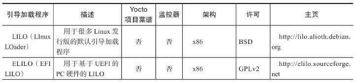
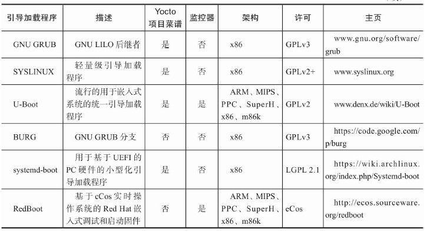

# Linux
GNU/Linux是用于操作系统的更加恰当的名字，而当仅仅指的是内核时，Linux是合适的。

# Linux系统的剖析

Linux操作系统可以被划分成两个级别，内核空间以及用户或应用空间。   
所有内核代码都是在非受限制或者特权的模式[1]中被执行的。在这种模式下，架构的指令集的所有指令都可以被执行。相反，应用代码是在受限制或者用户的模式中被执行的。在这个模式下，直接访问硬件的指令——输入/输出（Input/Output，I/O）指令——或者其他可以改变机器状态的指令是不被允许的。对特定内存区域的访问通常也是被限制的。   

# 引导加载程序
引导加载程序被划分成两类：引导器（loader）和监控器（monitor）。   

在前一个情况下，引导加载程序仅仅提供仅有的功能性来初始化硬件和加载操作系统。在后一个情况下，引导加载程序也包含用户可以通过其与引导加载程序交互的命令行接口，它可以用于硬件配置、再编程（reprogramming）、初始化、测试以及其他任务。

## 引导加载程序的角色
引导加载程序通常仅仅初始化对操作系统内核启动来说必要的硬件。所有其他的硬件和外设是在稍后的启动过程阶段由操作系统本身初始化的。一旦操作系统内核控制了硬件，它可能重新初始化最初由引导加载程序所设置的硬件组件。

## Linux引导加载程序

# 内核
操作系统的内核的两个主要功能：   
1. 管理计算机资源
2. 允许其他程序执行和访问资源

## 主要Linux内核子系统
1. 架构
2. 设备驱动
3. 内存管理
4. 虚拟文件系统
5. 进程管理
6. 网络栈
7. 进程间通信
8. 系统调用接口

## Linux内核启动
在引导加载程序已经复制Linux内核镜像进入内存之后，它把控制传给是内核镜像的前新增部分的启动加载器（bootstrap loader）。为了节省空间，内核镜像通常是压缩的，并且为内核创建恰当的执行环境、解压内核、在内存中重定位内核、然后传递控制给内核是启动加载器的职责。

启动加载器直接把控制传给在模块中的内核进入点，对大部分架构来说，它是head.o。   
1. 验证正确的架构和CPU
2. 检测CPU类型和功能性，例如硬件浮点型能力
3. 启用CPU的内存管理单元并且创建内存页的初始表
4. 建立基础的错误报告和处理
5. 切换到在main.c中的非架构特定的内核启动函数start_kernel()

在执行了基础套的内核初始化之后，start_kernel()函数调用rest_init()，它派生第一个内核线程。这个线程是通过将函数kernel_init()作为第一个参数调用kernel_thread()而派生的。这个函数称为init线程。此时，有两个线程正在执行：start_kernel()和kernel_init()。前者启动调度器然后在cpu_idle()函数中无限循环。后者成为init()线程，即是带有进程ID（PID）为1的所有用户空间进程的父进程。   

在最后，kernel_init()启动第一个用户空间应用。   

# 用户空间
用户空间是所有运行在操作系统的内核之外并且包含所有库和应用程序的代码。用户空间提供了系统所需要的用来服务其预想目的的所有功能性。

