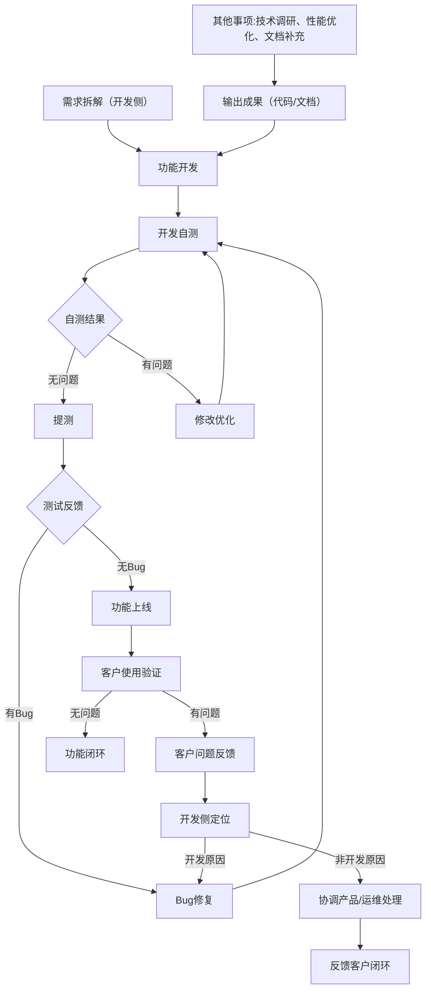
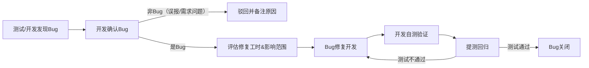
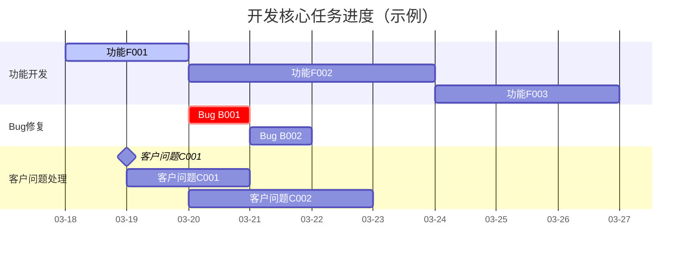

# 项目开发管理手册（开发人员专用）

**适用对象**：开发人员   
**核心重点**：聚焦功能开发、Bug解决、客户问题、其他开发相关事项，非核心管理内容概略呈现   
**设计目标**：直观可视、流程清晰，适配开发人员日常跟进习惯，轻量化管理，无需冗余操作   

## 一、项目基础信息（概略）

仅保留开发必备基础信息，无需详细展开

|项目相关|核心内容（简洁填写）|
|---|---|
|项目名称|__________|
|源码路径|例如：git@github.com:xxx/xxx-project.git|
|编译命令|前端：npm install && npm run build | 后端：mvn clean package（按需修改）|
|核心里程碑|1. 开发完成：______ 2. 测试完成：______ 3. 上线：______|
## 二、开发核心总流程（可视化）

清晰呈现开发全链路，聚焦核心环节，适配开发人员跟进逻辑

## 三、功能开发管理（核心模块）

### 3.1 功能开发清单（直观跟踪）

|功能ID|功能名称|优先级|负责人|预估工时|依赖项|开发状态|备注（开发相关）|
|---|---|---|---|---|---|---|---|
|F001|__________|高/中/低|__________|____h|无/某功能ID|待开发/开发中/自测中/已提测|例如：需兼容多浏览器/对接某接口|
|F002|__________|高/中/低|__________|____h|无/某功能ID|待开发/开发中/自测中/已提测|__________|
|F003|__________|高/中/低|__________|____h|无/某功能ID|待开发/开发中/自测中/已提测|__________|
### 3.2 开发规范（精简核心）

- 分支管理：功能开发基于dev分支，命名规则：feature/功能ID-功能简述（例：feature/F001-用户登录）

- 提交规范：git commit -m "feat/F001: 完成登录接口对接"（feat=功能开发，fix=Bug修复）

- 提测要求：完成单元测试（覆盖率≥80%）、无控制台报错、核心逻辑闭环

## 四、Bug解决管理（核心模块）

### 4.1 Bug清单（按优先级排序）

|Bug ID|问题描述（简洁）|严重程度|提测人|负责人|处理状态|修复截止时间|根因分析（开发侧）|
|---|---|---|---|---|---|---|---|
|B001|__________|高/中/低|__________|__________|待修复/修复中/已修复/已验证|____-__-__|例如：参数未校验/逻辑漏洞/兼容问题|
|B002|__________|高/中/低|__________|__________|待修复/修复中/已修复/已验证|____-__-__|__________|
### 4.2 Bug处理流程（可视化）

## 五、客户问题管理（核心模块）

### 5.1 客户问题清单

|问题ID|客户名称|问题描述（简洁）|紧急程度|对接人|开发负责人|处理状态|解决进度|反馈客户时间|
|---|---|---|---|---|---|---|---|---|
|C001|__________|__________|紧急/一般/低|__________|__________|定位中/处理中/已解决/已反馈|xx%|____-__-__|
|C002|__________|__________|紧急/一般/低|__________|__________|定位中/处理中/已解决/已反馈|xx%|____-__-__|
### 5.2 客户问题响应规范（开发侧）

- 紧急问题：1小时内响应，8小时内给出临时解决方案，24小时内彻底解决并反馈

- 一般问题：4小时内响应，3个工作日内解决并反馈

- 低优先级问题：1个工作日内响应，评估后纳入迭代计划，按计划解决并反馈

## 六、其他事项（开发相关）

涵盖技术调研、性能优化、文档补充等非核心但必要的开发相关事项，简洁跟踪

|事项类型|事项描述|负责人|完成状态|截止时间|备注（开发相关）|
|---|---|---|---|---|---|
|技术调研|例如：调研Excel导出组件性能|__________|待办/进行中/已完成|____-__-__|例如：对比3个主流组件|
|性能优化|例如：优化登录接口响应速度|__________|待办/进行中/已完成|____-__-__|例如：目标响应时间≤100ms|
|文档补充|例如：完善接口开发文档|__________|待办/进行中/已完成|____-__-__|例如：覆盖所有核心接口|
## 七、开发进度可视化（甘特图）

快速查看核心任务进度，适配开发人员时间管理习惯

## 八、使用说明（开发人员专用）

- 核心维护：重点更新「功能开发、Bug解决、客户问题、其他事项」四大模块，每日同步状态

- 可视化支持：流程图、甘特图可在VSCode、Typora、GitLab等支持mermaid的编辑器中直接渲染

- 轻量化原则：非核心信息（项目背景、部署流程等）无需补充，避免冗余，聚焦开发本身

- 可扩展性：可根据项目规模，新增功能/Bug/客户问题行，无需修改整体结构
> （注：文档部分内容可能由 AI 生成）