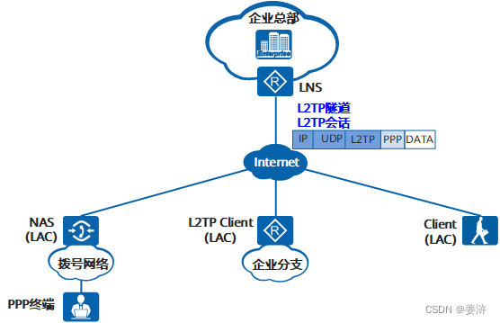
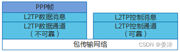
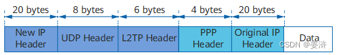
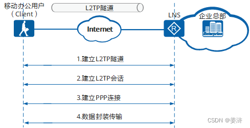
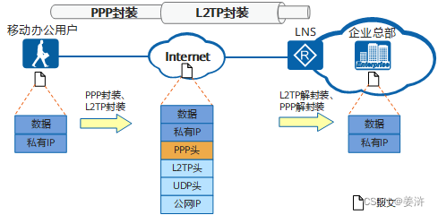
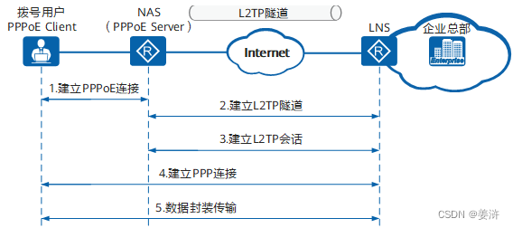
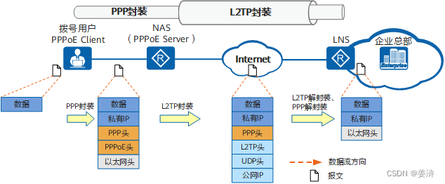
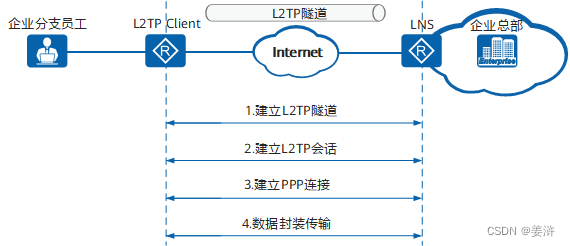
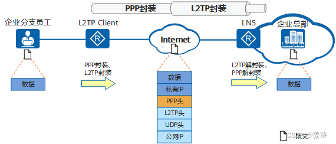
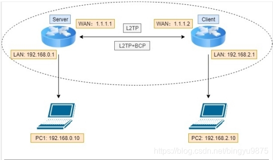

# 概念
二层隧道协议L2TP（Layer 2 Tunneling Protocol）是虚拟私有拨号网VPDN（Virtual Private Dial-up Network）隧道协议的一种，它扩展了点到点协议[PPP](./../../知识体系/路由与交换/m-2-PPP.md)（Point-to-Point Protocol）的应用，是应用于远程办公场景中为出差员工远程访问企业内网资源提供接入服务的一种重要VPN技术。   
   

## PPP 终端
L2TP应用中，PPP终端指发起拨号，将数据封装为PPP类型的设备，如远程用户PC、企业分支网关等均可作为PPP终端。   

## NAS
NAS网络接入服务器（Network Access Server）主要由ISP维护，用于连接拨号网络，是距离PPP终端地理位置最近的接入点。NAS用于传统的拨号网络中，ISP在NAS上部署LAC，可为远程拨号用户提供L2TP服务，和企业总部建立隧道连接。   
--这里来讲， ppp 终端并不知道 L2TP 隧道的存在，只需要通过 ppp 拨号到 NAS，建立 ppp 链路用于传输 网络层及以上的的报文，由 NAS 进行转发。   

## LAC
L2TP访问集中器LAC是交换网络上具有PPP和L2TP协议处理能力的设备。LAC根据PPP报文中所携带的用户名或者域名信息，和LNS建立L2TP隧道连接，将PPP协商延展到LNS。   
在不同的组网环境中，LAC可以是不同的设备：   
1. NAS-Initiated场景：在传统的拨号网络中，ISP在NAS上部署LAC，或在企业分支的以太网络中，为PPP终端配备网关设备，网关作为PPPoE服务器，同时部署为LAC。
2. L2TP Client-Initiated场景：企业分支在网关设备配置可以主动向LNS发起L2TP隧道连接请求的L2TP Client，不需要远端系统拨号触发，L2TP Client为LAC。
3. Client-Initiated场景：出差人员使用PC或移动终端接入Internet，在PC或移动终端上使用L2TP拨号软件，则PC或移动终端终端为LAC。

## LNS
L2TP网络服务器LNS是终止PPP会话的一端，通过LNS的认证，PPP会话协商成功，远程用户可以访问企业总部的资源。对L2TP协商，LNS是LAC的对端设备，即LAC和LNS建立了L2TP隧道；对PPP，LNS是PPP会话的逻辑终止端点，即PPP终端和LNS建立了一条点到点的虚拟链路。   
LNS位于企业总部私网与公网边界，通常是企业总部的网关设备。必要时，LNS还兼有网络地址转换（NAT）功能，对企业总部网络内的私有IP地址与公共IP地址进行转换。   

## 隧道和会话
在LAC和LNS的L2TP交互过程中存在两种类型的连接。   
1. 隧道（Tunnel）连接   
    L2TP隧道在LAC和LNS之间建立，一对LAC和LNS可以建立多个L2TP隧道，一个L2TP隧道可以包含多个L2TP会话。   
2. 会话（Session）连接   
    L2TP会话发生在隧道连接成功之后，L2TP会话承载在L2TP隧道之上，每个L2TP会话对应一个PPP会话，PPP会话的数据帧通过L2TP会话所在的L2TP隧道传输。   

# 原理
L2TP协议包含两种类型的消息，控制消息和数据消息，消息的传输在LAC和LNS之间进行。L2TP协议通过这两种消息，扩展了PPP的应用。   
1. 控制消息   
    用于L2TP隧道和会话连接的建立、维护和拆除。在控制消息的传输过程中，使用消息丢失重传和定时检测隧道连通性等机制来保证控制消息传输的可靠性，支持对控制消息的流量控制和拥塞控制。   
2. 数据消息   
用于封装PPP数据帧并在隧道上传输。数据消息是不可靠的传输，不重传丢失的数据报文，不支持对数据消息的流量控制和拥塞控制。   

控制消息承载在L2TP控制通道上，控制通道实现了控制消息的可靠传输，将控制消息封装在L2TP报头内，再经过IP网络传输。   
数据消息携带PPP帧承载在不可靠的数据通道上，对PPP帧进行L2TP封装，再经过IP网络传输。   

   

L2TP协议使用UDP端口1701，这个端口号仅用于初始隧道的建立。L2TP隧道发起方任选一个空闲端口向接收方的1701端口发送报文；接收方收到报文后，也任选一个空闲端口，给发起方的选定的端口回送报文。至此，双方的端口选定，并在隧道连通的时间内不再改变。   

# 报文
L2TP报文进行了多次封装，比原始报文多出38个字节（如果需要携带序列号信息，则比原始报文多出42个字节），封装后报文的长度可能会超出接口的MTU值，而L2TP协议本身不支持报文分片功能，这时需要设备支持对IP报文的分片功能。当L2TP报文长度超出发送接口的MTU值时，在发送接口进行报文分片处理，接收端对收到分片报文进行还原，重组为L2TP报文。   

   

# 场景
## Client-Initiated场景
   
   

## NAS-Initiated场景
   
   

## L2TP Client-Initiated场景
   
   

# BCP (Point-to-Point Protocol (PPP) Bridging Control Protocol (BCP))
基于PPP链路，能够把双方子网的网络桥接。   

   

1. PC1和PC2，是同网段IP，则子网掩码可以设置为24；
2. 如果PC1和PC2，是不同网段的IP，则子网掩码必须设置为相同，如16；

