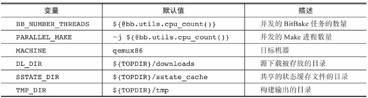

# 1. 启动第一个Yocto项目构建

## 1.1. 设置构建主机
Ubuntu

```
sudo apt-get install gawk wget git-core diffstat unzip texinfo gcc-multilib build-essential chrpath socat libsdl1.2-dev xterm
```

## 1.2. 安装Poky
下载Poky发布版本
https://www.yoctoproject.org/downloads

```
mkdir yocto
cd Yocto
tar xvfj poky-<codename>-release.tar.bz2
```

## 1.3. 配置构建环境
```
source <pokypath>/oe-init-build-env <builddir>
```
### 1.3.1. 构建环境的主要配置文件
conf/local.conf


## 1.4. 编译构建
```
bitbake core-image-sato
```