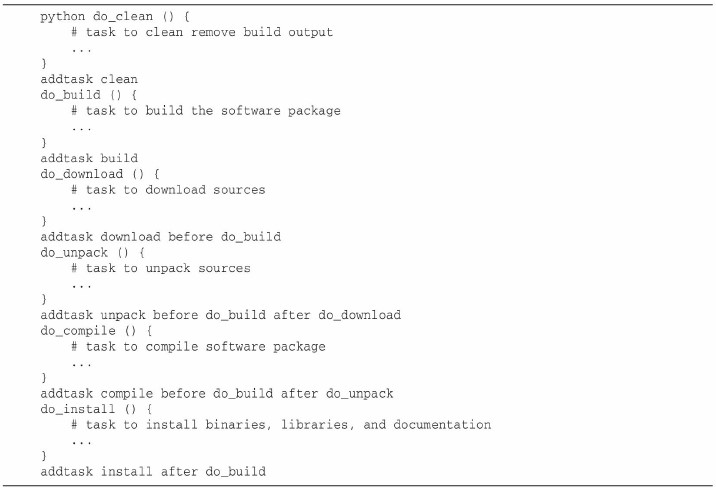
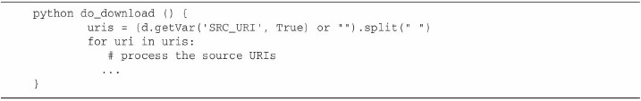

# 1. bitbake 简介
bitbake是类似make的构建工具。bitbake元数据文件类似make的makefiles文件。   
bitbake是OpenEmbedded构建系统的核心组件，是Yocto和OpenEmbedded共同维护的Yocto项目的子项目。   

# 2. bitbake 执行
1. 工作目录中寻找conf/bblayers.conf配置文件，文件内的BBLAYERS变量指向构建环境中的层   
2. 寻找每一层都包含名为conf/layer.conf的文件，其目的是正确设置变量BBPATH、BBFILES以使得bitbake可以找到该层中包含的菜谱、类和配置文件   
BBPATH：BitBake使用这个变量来在名为classes的子目录中定位类（.bbclass文件）和在名为conf的子目录中定位配置文件（.conf文件）以及子目录等。   
BBFILES：这个变量包含针对菜谱文件的、带有通配符的路径列表。   
BBFILE_COLLECTIONS：包含已配置层的名字的列表。   
·BBFILE_PATTERN：告诉BitBake如何从BBFILES的这一层中定位菜谱文件的正则表达式。   
BBFILE_PRIORITY：向包含在该层中的菜谱赋予优先级。   
3. 寻找配置文件conf/bitbake.conf，其提供了构建系统设置。   
4. 定位和解析所有类，至少一个包含在文件base.bbclass中的base类必须存在以使得BitBake正确地操作。这个类提供了基本的功能和任务，包括默认的build任务。   

# 3. bitbake元数据
1. 变量：变量被赋予值和等价于值的表达式。
2. 可执行元数据：可执行元数据是嵌入在菜谱和类中的由BitBake在菜谱的上下文中执行的函数和任务。

## 3.1. 组织分类
1. 配置文件（.conf）：放在配置文件中的元数据是全局的并且影响所有引用它们的菜谱。
2. 菜谱文件（.bb）：菜谱包含描述特定软件包以及如何构建该软件包的元数据。
3. 类文件（.bbclass）：类文件提供一种简单的、用于菜谱共享相同构建指令的继承机制。
4. 追加文件（.bbappend）：追加文件是菜谱文件的扩展。
5. 包含文件（.inc）：通过使用include和require指令，任何元数据文件可以包含其他文件。

## 3.2. 语法
### 3.2.1. 注释
使用#来注释
### 3.2.2. 变量
BitBake变量是无类型的。BitBake把所有赋给变量的值都视作字符串。   

#### 3.2.2.1. 变量名
BitBake变量名可能包含大写和小写字母、数字以及特殊字符：下划线（_）、连接符（-）、逗号（,）、加号（+）和波浪号（～）。它们也可以以任何这些字符开头。

#### 3.2.2.2. 变量范围
在配置文件（也就是，以.conf结尾的文件）中定义的变量是全局的并且在所有菜谱中可见。在菜谱中定义的变量是仅仅本地于菜谱的。菜谱由它们自己的名字空间，在菜谱中被赋值的全局变量仅仅当BitBake处理那个菜谱的时候才保持该值。

#### 3.2.2.3. 变量赋值
所有BitBake变量赋值都是带有包围值的成对分隔符的字符串字面量。分隔符要么是双引号（"）要么是单引号（'）。   
1. 直接赋值 =
2. 默认赋值 ?=
3. 弱默认赋值 ??=

#### 3.2.2.4. 变量扩展
1. 直接变量扩展
2. python变量扩展

#### 3.2.2.5. 变量追加和前新增 Prepending
1. 带空格的追加（+=）和前新增（=+）
2. 不带空格的追加（.=）和前新增（=.）
3. 使用_append和_prepend操作符追加和前新增

#### 3.2.2.6. 去除 _remove

#### 3.2.2.7. 条件变量赋值
1. 条件变量设置
2. 条件追加和前新增

## 3.3. 包含
元数据文件可以包含其他元数据文件以允许共享的设置。常见的用例是构建相同软件包的不同版本的菜谱。   

BitBake提供2个针对可选包含和必须包含的包含指令：   
1. include optional.inc
2. required mandatory.inc

## 3.4. 继承
通过类，BitBake提供了简单的继承机制。类可以被菜谱、追加文件和其他类用inherit指令来继承。   

类是带有.bbclass文件名后缀的、被放置进元数据层的classes子目录中的元数据文件。指令inherit仅仅使用类名，它是不带后缀的类文件名的基名称。它仅仅可以用在菜谱、追加文件和其他类文件中。   

## 3.5. 可执行元数据
菜谱、追加文件和类可以包含可执行元数据的定义。可执行元数据是BitBake可以执行的shell或者Python函数。   
BitBake把可执行元数据和变量等同对待：函数名是和代表被赋予的值的函数代码一起存储在数据字典中的。结果就是，函数可以像普通变量一样被追加和前新增，并且可能有元数据的属性。   
定义在菜谱和追加文件中的元数据函数的范围是本地于特定文件的，而定义在类中的函数是全局的。

### 3.5.1. 任务


#### 3.5.1.1. 从shell函数中访问变量

可以从shell函数中读取变量和写变量。然而，写变量仅仅在shell脚本的范围内局部性地改变它的值。BPN是在do_install中被覆盖的BitBake变量。被覆盖的值仅仅对do_install函数有效

#### 3.5.1.2. 从python函数中访问变量

使用setVar和全局数据字典全局性地修改那个变量   

可以创建本地的数据字典副本，这样就不会全部修改变量
```
localdata = d.createCopy()
```

访问包含值列表的变量   

代码从数据字典中获取变量SRC_URI，它是空格分隔的URI字符串。然后它使用split操作符把字符串拆分成字符串数组。如果没有在数据字典中找到变量SRC_URI，那么术语or""返回空的字符串以使代码具有故障保护能力。

### 3.5.2. 追加和前新增函数
类似变量，可以使用_append和_prepend操作符追加和前新增函数   
追加和前新增可用于shell和Python函数。   

使用追加和前新增函数   

最后效果等效为   


## 3.6. 元数据属性
所有BitBake元数据（也就是，变量以及函数）可以有属性（attribute），或者被称为标识（flag）。   

BitBake元数据语法通过将括号（[]）中的属性名添加到变量和函数名来提供设置属性：
```
VAR[flag] = "flagvalue"
```

可以从Python函数中使用BitBake数据字典方法getVarFlag和setVarFlag来读取和写属性的值   


## 3.7. 元数据名(键)扩展
扩展也可以被应用到元数据名。实际的扩展发生在数据处理过程的正结尾，紧接在条件赋值、追加和前新增之前。   
```
A${B} = "foo"
B = "2"
A2 = "bar"
```

变量A2包含foo，因为表达式A${B}="foo"的完全赋值直到表达式A2="bar"之后的解析过程的结尾才被判断。

# 4. 源下载
BitBake通过它的fetcher架构提供了必要的框架。在BitBake术语中，获取是取得源文件的过程。来自BitBake fetch2库（bitbake/lib/bb/fetch2）的Python Fetch类
## 使用Fetch类


## 获取器实现
1. 本地文件获取器
本地文件获取器的实现可以在文件bitbake/lib/bb/fetch2/local.py中找到。   

2. HTTP/HTTPS/FTP 获取器
BitBake默认使用GNU Wget实用程序来提供对这些协议的获取器实现。然而命令，包括任何命令行选项，都可以通过设置
FETCHCMD_wget变量来指定。   

3. SFTP获取器
支持HTTP/HTTPS/FTP 获取器相同的参数。   

4. Git获取器
5. Git子模块获取器
Git子模块获取器的实现可以在文件bitbake/lib/bb/fetch2/gitsm.py中找到。

6. Subversion（SVN）获取器
7. 并发版本系统（Concurrent Versions System，CVS）获取器
8. 其他

## 镜像
BitBake首先检查由DL_DIR指定的本地下载目录，是否在SRC_URI中提供的文件已经被下载了。如果已经被下载了，它跳过访问任何上游和镜像站点，并且使用在DL_DIR中的文件。如果一些文件是存在的，另外一些不存在，那么BitBake增量地下载文件。如果SRC_URI是源代码控制管理系统，那么它验证在DL_DIR中的正确分支和标签，并且根据需要最终更新它们。

# 依赖处理
## 配置
bitbake文件名
<package name>_<package version>_<package vevision>.bb   

例：nano_2.2.6_r0.bb   
bitbake解析文件名并且对应设置变量PN、PV、PR
PN = "nano"   
PV = "2.2.6"   
PR = "r0"   

## 声明依赖
菜谱通过分别向DEPENDS和RDEPENDS变量增加它们所依赖的包名来声明构建依赖和运行时依赖。   

## 多个提供器
通过符号配置，多个包可能满足其另一个包的构建或运行时依赖。   
通过PREFERRED_PROVIDER变量，你可以选择BitBake构建的提供的包。   


# 版本选择
默认情况下，BitBake总是选择构建包的最新版本的菜谱，正如PV变量所指示的。然而，你可以通过指定PREFERRED_VERSION变量来覆盖默认行为。   

有时，版本号是由额外信息所追加的，例如Git标签或者一个次版本号。在这个情况下，你通过向版本字符串增加百分号（%）来告诉BitBake。   

菜谱可能设置DEFAULT_PREFERENCE变量来指示比它版本号更低或者更高的优先级。对于DEFAULT_PREFERENCE的默认值是5。   

# 默认元数据
## 变量
### 内部获取的变量
1. FILE 到BitBake正在处理的文件的完整路径。
2. LAYERDIR 当BitBake处理那一层时，它把这个变量设置为到当前层的目录的完整路径。
3. TOPDIR BitBake设置这个变量为到你已经执行了BitBake的所在目录的完整路径。

### 项目特定的变量
1. BBFILES 空格分隔的针对菜谱的路径列表。
2. BBLAYERS 当BitBake处理那一层时，它把这个变量设置为到当前层的目录的完整路径。
3. BBPATH BitBake使用这个变量在一个名为classes的子目录中定位类（.bbclass文件）、在一个名为conf的子目录中定位配置文件（.conf文件）以及在其他子目录中定位文件。变量包含一个由冒号（：）分隔的目录路径列表。

### 标准运行时变量
1. B 到BitBake构建一个源包所在的目录的完整路径。
2. BUILD_ARCH 构建主机的CPU架构。
3. CACHE 到用于元数据缓存的目录的完整路径，它通常存在于构建环境的内部：CACHE=${TOPDIR}/cache。
4. CVSDIR 到BitBake检出CVS仓库所在目录的完整路径。
5. D 到一个任务（例如一个安装任务或者一个镜像创建任务）放置其输出的所在目录的完整路径。
6. DEPENDS 这个变量用一个空格分隔的包名来描述包依赖性。
7. DEPLOY_DIR 到BitBake放置所有用于部署的文件所在的基础目录的完整路径，例如目标镜像、包源和许可程序清单（license manifest）。
8. DEPLOY_DIR_IMAGE 到BitBake复制目标二进制镜像所在目录的完整路径。
9. DL_DIR 到下载目录的完整路径。
10. FILE_DIRNAME 到包含BitBake正在处理的文件的目录的路径。
11. FILESDIR 到BitBake寻找本地文件所在目录的完整路径。
12. FILESPATH 这个变量包含一个冒号分隔的、BitBake的本地获取器为了匹配本地文件所搜索的完整目录路径列表。
13. GITDIR 到BitBake检出Git仓库所在目录的完整路径。
14. MKTEMPCMD BitBake用来创建临时文件的命令。
15. MKTEMPDIRCMD BitBake用来创建临时目录的命令。
16. OVERRIDES 冒号分隔的条件覆盖的优先级列表。
17. P 用横线（-）连接的包名、版本：P="${PN}-${PV}"。
18. PERSISTENT_DIR 到BitBake持久存储文件所在目录的完整路径。
19. PF 用横线（-）连接的包名、版本和修订：PF="${PN}-${PV}-${PR}"。
20. PN 从菜谱文件名获取的包名。
21. PR 从菜谱名获取的或者显式设置的包修订。
22. PROVIDES 空格分隔的、声明一个包提供了什么的名字列表。
23. PV 从菜谱文件名获取的或者显式设置的包版本。
24. S 到BitBake放置已解压文件所在目录的完整路径。
25. SRC_URI 为源包下载URI。
26. SRCREV 用于从源代码控制管理系统下载所用的源修订。
27. SVNDIR 到BitBake检出Subversion仓库所在目录的完整路径。
28. T 到一个BitBake处理一个包菜谱时存储临时文件（例如任务代码和任务日志）的所在目录的完整路径。
29. TARGET_ARCH 针对BitBake正在构建的CPU架构。
30. TMPBASE 到一个BitBake使用MKTMPCMD和MKTEMPDIRCMD命令来创建临时文件和目录的所在目录的完整路径。
31. TMPDIR 到BitBake放置所有构建输出（例如包构建、根文件系统阶段、镜像和包源）的顶级目录的完整路径。
32. WORKDIR 到BitBake构建一个包并且存储所有与包的构建过程相关的日志信息的目录的路径。


