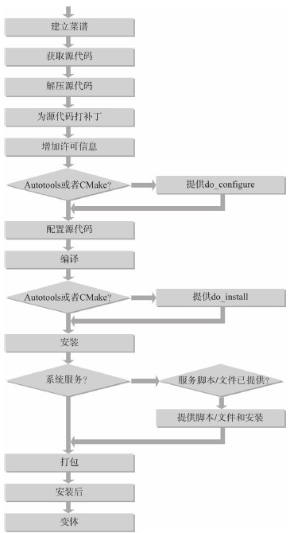
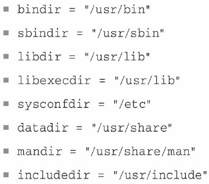

# 菜谱布局
菜谱名字遵循惯例 <packagename>_<version>-<revision>.bb   

## 描述性元数据
1. SUMMARY 摘要
2. DESCRIPTION 描述
3. AUTHOR 作者
4. HOMEPAGE 主页
5. BUGTRACKER 缺陷追踪

## 包管理元数据
1. SECTION 部分
2. PRIORITY 优先级
	2.1. standard
	2.2. required
	2.3. optional
	2.4. extra

## 许可元数据
1. LICENSE 许可
2. LIC_FILES_CHECKSUM 校验

## 继承指令和包含
这部分包含用于菜谱从类继承功能性的继承指令。它也包括包含（include）和要求（require）语句以在语句的位置上直接插入其他文件。

## 构建元数据
1. PROVIDES 提供
2. DEPENDS 依赖
3. PN 包名
4. PV 包版本
5. PR 包修订
6. SRC_URI 源码地址
7. SRCDATE 源码日期
8. S 在构建环境中的、构建系统把未解压的源代码放在其中的目录位置。
9. B 在构建环境中的、构建系统把在构建中创建的对象放入其中的目录位置。
10. FILESEXTRAPATHS 扩展用于由FILESPATH定义的额外本地文件的构建系统的搜索路径。
11. PACKAGECONFIG 这个变量允许在构建时启用和禁用软件包的特性。
12. EXTAR_OECONF 额外的configure脚本选项。
13. EXTAR_OEMAKE 用于GNU Make的额外选项。
14. EXTRA_OECMAKE 用于CMake的额外选项。
15. LDFLAGS 传到链接器的选项。
16. PACKAGE_ARCH 定义软件包的架构。

## 打包元数据
菜谱的这个元数据部分定义构建输出如何使用包管理器被打包进不同的包中。打包发生在软件已经被构建并且被安装进包构建目录本地的根文件系统结构之后。   
1. PACKAGES 这个变量是在打包过程中被创建的包的空格分隔列表。
2. FILES FILES变量定义被放进特定包中的目录和文件的列表。
3. PACKAGE_BEFORE_PN 这个变量让你在最终的包名被创建前简单地增加包。
4. PACKAGE_DEBUG_SPLIT_STYLE 这个变量决定当${PN}-dgb包被创建时如何拆分二进制和调试对象。
5. PACKAGESPLITFUNCS 这个变量定义执行包拆分的函数的列表。

## 任务覆盖、前新增和追加
在这一部分，菜谱覆盖任务、向任务前新增（prepend）和追加以重新定义、变更或者扩展默认行为。   

## 变体/类扩展
这个部分简单地包含BBCLASSEXTEND变量以创建例如包的原生或者软件开发工具包构建的变体。

## 运行时元数据
1. RDEPENDS 该包在运行时所依赖的，为了该包正确运转而必须被安装的包列表。
2. RRECOMMENDS 与RDEPENDS类似但是指示弱依赖性，因为这些包对于正在被构建的包不是必不可少的。
3. RSUGGESTS 与RRECOMMENDS类似，但是从即使这些包是可用的但是包管理器也不安装它们的这个意义上来说，其甚至更加弱。
4. RPROVIDES 用于运行时配置的包名别名列表。
5. RCONFLICTS 冲突包的名字列表。
6. RREPLACES 这个包替代的包的名字列表。

# 写新菜谱

do_install相关的目录   

## 设置系统服务

# 菜谱例子 **********

## 基于C

## 基于makefile

## 基于Cmake

## 基于GNU Autotools

## 外部构建软件包

# devtool工具套件

