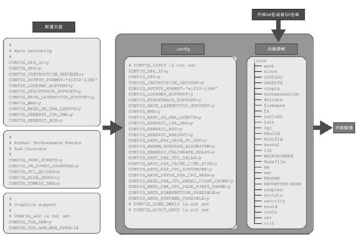

# 内核配置
Linux内核提供了它自己的配置系统，通常被称为kconfig。kconfig本质上是以树结构组织的配置数据库。所有配置选项合并进位于内核源树的顶级目录中的单一文件.config。   
.config文件通常是被自动化地创建的，它要么是来自默认平台配置文件，要么是来自用于特定系统的现有配置文件。如果你希望编辑它，那么Linux内核配置系统提供了用于它的菜单编辑器。这些编辑器也识别配置设置的依赖性（dependency）和互依赖性（interdependency）。   

## 菜单配置
Yocto项目的内核菜谱通过调用命令来提供make menuconfig的功能性。   
```
bitbake -c menuconfig <kernel-recipe>
```

## 配置片段


# 内核补丁
用菜谱应用补丁到内核源和用菜谱为一般软件包应用补丁没有不同。如果你已经有被格式化过的补丁文件，那么简单地提供文件并且增加它到用于内核菜谱的追加文件的SRC_URI。   
步骤如下：   
1. 改变到内核源目录
2. 增加/修改内核源文件
3. 组织和提交变更
4. 创建补丁文件
5. 移动补丁文件到创建的层
6. 创建配置片段
7. 增加配置片段和补丁到菜谱
8. 构建内核

# 内核菜谱
Poky发行版指定了如何用提供了必要指令的菜谱像类似构建任何其他软件包一样构建Linux内核。   

## 从一个Linux内核树构建
1. 从一个Linux内核tar包构建


2. 从Linux内核Git仓库构建
3. 应用配置设置和补丁
4. 使用入树配置文件


## 从Yocto项目内核仓库构建

# 树外模块
构建系统提供了module类，它包含用于构建树外模块的大部分逻辑。
## 开发内核模块
## 创建用于第三方模块的菜谱
## 把模块包含在根文件系统中
## 模块自动加载

# 设备树
