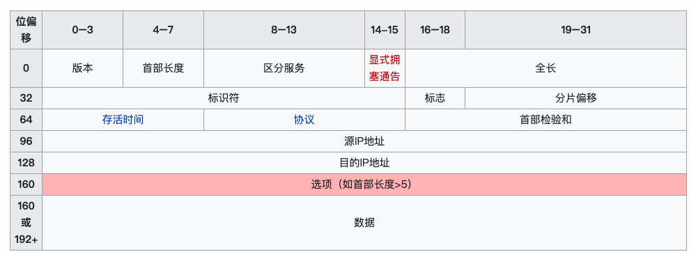
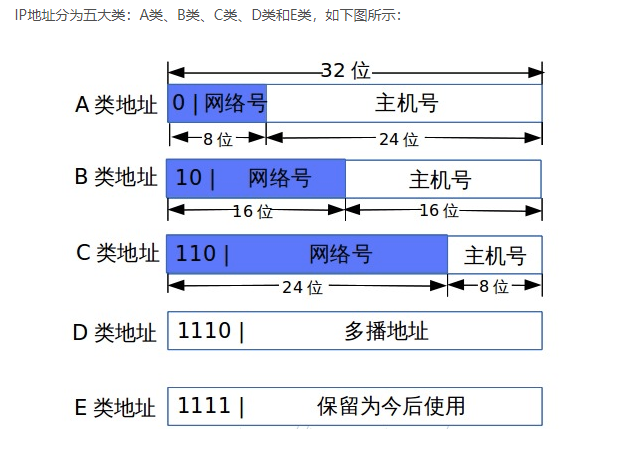
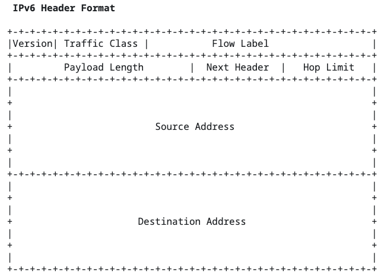
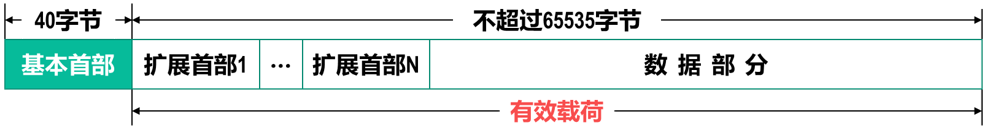

# IPV4
## IPV4简介
IPv4（Internet Protocol version 4）是网际协议的第四个修订版本，也是该协议第一个被广泛部署和使用的版本。其在1981年9月由IETF发布的RFC791中被描述，是一种面向无连接的协议，可以在使用分组交换的链路层（如以太网）上运行。在数据传输方面，IPv4协议会尽最大努力交付数据包，但不能保证所有数据包能够成功到达目的地，或者按照正确的顺序到达，这些方面由上层的传输协议（如TCP协议）处理。   

## IPV4报文
IPv4报文的最大长度是65,535字节，这个长度是由IP报文中的16位总长度字段决定的，下图为IPv4报文的结构：   
   
IPv4报文的最大长度是65,535字节，这个长度是由IP报文中的16位总长度字段决定的。该字段的最大值是65535，因为它是一个16位无符号整数，所以IP报文的最大长度不能超过该值。   
需要注意的是，在实际情况下，IP报文的长度通常会受到网络设备（如路由器、防火墙等）和网络链路的限制，另外，由于网络传输存在MTU(Maximum Transmission Unit)的限制，实际上能够传输的最大数据长度通常不会超过MTU值，一般为1500个字节左右，因此实际传输的IP报文长度可能会比最大长度小得多。   
网络传输MTU(Maximum Transmission Unit)大小并不是固定的，它的大小取决于底层网络传输协议和网络设备的配置。不同的网络传输协议和设备可能会有不同的MTU大小限制。   
以太网是最常见的网络传输协议之一，其MTU大小通常为1500字节。在以太网上传输的数据包如果超过1500字节，就会被分割成多个小块进行传输。其他网络传输协议的MTU大小可能会有所不同，例如PPP协议的MTU大小通常为1480字节，ATM网络的MTU大小通常为48字节等。   
此外，MTU还受到网络设备的配置影响。例如，路由器和交换机等网络设备可以通过配置MTU大小来优化网络传输效率和减少延迟。在实际应用中，为了保证网络传输的稳定性和效率，需要根据具体的网络环境和需求来设置MTU大小，并进行必要的优化和调整。   

## IPV4地址
### 类别
   
A类地址范围：1.0.0.0—126.0.0.0    
B类地址范围：128.0.0.0—191.255.0.0   
C类地址范围：192.0.0.0—223.255.255.0   
D类地址范围：224.0.0.0—239.255.255.255   
E类地址范围：240.0.0.0—255.255.255.254   

### 单播
每次只有两个实体相互通信，发送端和接收端都是唯一确定的。   
在IPv4网络中，0.0.0.0到223.255.255.255属于单播地址。   

### 组播
IP组播是一种通过使用一个组播地址将数据在同一时间以高效的方式发往处于TCP/IP网络上的多个接收者的协议。此外，它还常用来与RTP等音视频协议相结合。   
组播报文的目的地址使用D类IP地址（224.0.0.0～239.255.255.255）。   

### 广播
以太网和IPv4网都用全1的地址表示广播，分别是ff:ff:ff:ff:ff:ff和255.255.255.255。   

### 任播
在任播中，在网络位址和网络节点之间存在一对多的关系：每一个位址对应一群接收节点，但在任何给定时间，只有其中之一可以接收到传送端来的资讯。   
任播通信从目标群中选择一台最符合网络条件的主机作为目标主机发送消息 。所被选中的那台特定主机将返回一个单播信号，随后发送端主机会只跟这台主机进行通信   

### 内网IP
10/8 地址范围：10.0.0.0——10.255.255.255   
172.16/12 地址范围：172.16.0.0——172.31.255.255   
192.168/16地址范围：192.168.0.0——192.168.255.255   

# IPV6
## IPV6简介
IPv6地址总长度为128比特位(16字节)，分为8组(每组2个字节)，每组以4个十六进制数形式表示，组间用冒号分隔。例如：FC00:0000:130F:0000:0000:09C0:876A:130B   
因为IPv6地址使用128位（16字节）表示，其可以支持约3.4×10²³（2^128）个唯一地址。这个数量比IPv4地址空间（43亿个地址）大得多，可以满足未来数十年互联网的发展需求。   

## IPV6报文
IPv6数据报首部长度为固定的40字节，在IPv6中所有的扩展首部并不属于IPv6数据报的首部，扩展首部与其后面的数据部分合起来构成有效载荷。   

## IPV6地址获取
### 有状态获取Stateful
通过DHCPv6方式获得IPv6地址   

有状态：可控、可管理。在网络中存在一个IP地址管理者，它能够识别客户端，根据不同的客户端，分配对应的IPv6地址，客户端与服务端之间需要维护IP地址的租期及续约。目前实现这种效果的，就是DHCPv6协议，IP地址管理者就是DHCPv6 Server   

#### 有状态DHCPv6
IPv6地址、其他参数(如DNS)均通过DHCPv6获取   

#### 无状态DHCPv6
IPv6地址依然通过路由通告RA方式生成，其他参数(如DNS)通过DHCPv6获取   

### 无状态获取Stateless
根据路由通告报文RA(Router Advertisement)包含的prefix前缀信息自动配置IPv6地址，组成方式是Prefix + (EUI64 or 随机)。Stateless也可以称为SLAAC(Stateless address autoconfiguration)   

无状态：不可控、难管理。在网络中只有网关，没有IP地址管理者。因此无人去识别客户端，每个客户端根据网关发送的相同的RA报文内容，自行配置IPv6地址   

### RA报文flag
#### A flag
Autonomous flag(简称A flag)：表示是否配置无状态IP。   

#### M flag
Managed flag(简称M flag)：表示是否配置有状态IP。   

#### O flag
Other flag(简称O flag)：表示是否通过DHCPv6获得除IP以外的其他参数(如DNS列表)。   
