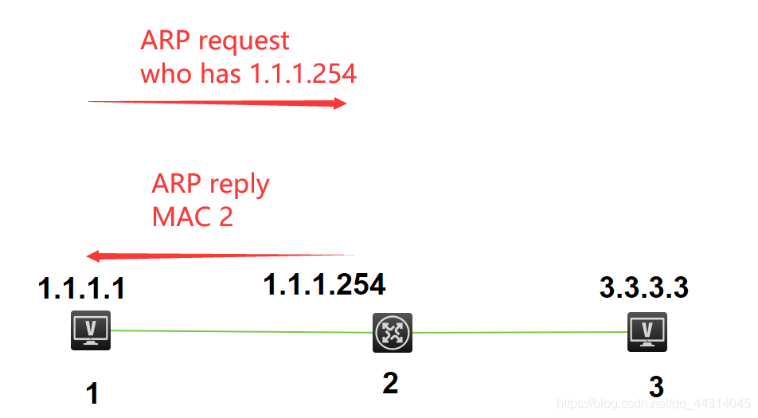

# ARP简介
地址解析协议，即ARP（Address Resolution Protocol），是根据IP地址获取物理地址的一个TCP/IP协议。   
协议在发送数据包时，首先要封装第三层（IP地址）和第二层 （MAC地址）的报头, 但协议只知道目的节点的IP地址，不知道其物理地址，又不能跨第二、三层，所以得用ARP的服务拿到MAC地址。   

# ARP工作过程
假设主机A和B在同一个网段，主机A要向主机B发送信息，具体的地址解析过程如下：   
1. 主机A首先查看自己的ARP缓存表，确定其中是否包含有主机B对应的ARP表项。如果找到了对应的MAC地址，则主机A直接利用ARP表中的MAC地址，对IP数据包进行帧封装，并将数据包发送给主机B。   
2. 如果主机A在ARP表中找不到对应的MAC地址，则将缓存该数据报文，然后以广播方式发送一个ARP请求报文。ARP请求报文中的发送端IP地址和发送端MAC地址为主机A的IP地址和MAC地址，目标IP地址和目标MAC地址为主机B的IP地址和全0的MAC地址。由于ARP请求报文以广播方式发送，该网段上的所有主机都可以接收到该请求，但只有被请求的主机（即主机B）会对该请求进行处理。   
3. 主机B比较自己的IP地址和ARP请求报文中的目标IP地址，当两者相同时进行如下处理：将ARP请求报文中的发送端（即主机A）的IP地址和MAC地址存入自己的ARP表中。之后以单播方式发送ARP响应报文给主机A，其中包含了自己的MAC地址。   
4. 主机A收到ARP响应报文后，将主机B的MAC地址加入到自己的ARP表中以用于后续报文的转发，同时将IP数据包进行封装后发送出去。   

当主机A和主机B不在同一网段时，主机A就会先向网关发出ARP请求，ARP请求报文中的目标IP地址为网关的IP地址。当主机A从收到的响应报文中获得网关的MAC地址后，将报文封装并发给网关。如果网关没有主机B的ARP表项，网关会广播ARP请求，目标IP地址为主机B的IP地址，当网关从收到的响应报文中获得主机B的MAC地址后，就可以将报文发给主机B；如果网关已经有主机B的ARP表项，网关直接把报文发给主机B。   

# ARP表
网络设备一般都有一个ARP缓存（ARP Cache），ARP缓存用来存放IP地址和MAC地址的关联信息。在发送数据前，设备会先查找ARP缓存表。如果缓存表中存在对方设备的MAC地址，则直接采用该MAC地址来封装帧，然后将帧发送出去。如果缓存表中不存在相应的信息，则通过发送ARP request报文来获得它。学习到的IP地址和MAC地址的映射关系会被放入ARP缓存表中存放一段时间。在有效期内，设备可以直接从这个表中查找目的MAC地址来进行数据封装，而无需进行ARP查询。过了这段有效期，ARP表现会被自动删除。如果目标设备位于其他网络则源设备会在ARP缓存表中查找网关的MAC地址，然后将数据发送给网关，网关再把数据转发给目的设备。   

## 动态ARP表
动态ARP表项由ARP协议通过ARP报文自动生成和维护，可以被老化，可以被新的ARP报文更新，可以被静态ARP表项覆盖。每个动态ARP缓存项的潜在生命周期是10分钟。新加到缓存中的项目带有时间戳，如果某个项目添加后2分钟内没有再使用，则此项目过期并从ARP缓存中删除；如果某个项目已在使用，则又收到2分钟的生命周期；如果某个项目始终在使用，则会另外收到2分钟的生命周期，一直到10分钟的最长生命周期。   

## 静态ARP表
静态ARP表项通过手工配置和维护，不会被老化，不会被动态ARP表项覆盖。直到重新启动计算机为止。   
静态ARP表项分为短静态ARP表项和长静态ARP表项。   
在配置长静态ARP表项时，除了配置IP地址和MAC地址项外，还必须配置该ARP表项所在VLAN和出接口。长静态ARP表项可以直接用于报文转发。   
在配置短静态ARP表项时，只需要配置IP地址和MAC地址项。如果出接口是三层以太网接口，短静态ARP表项可以直接用于报文转发；如果出接口是VLAN虚接口，短静态ARP表项不能直接用于报文转发，当要发送IP数据包时，先发送ARP请求报文，如果收到的响应报文中的源IP地址和源MAC地址与所配置的IP地址和MAC地址相同，则将接收ARP响应报文的接口加入该静态ARP表项中，之后就可以用于IP数据包的转发。   

# 免费ARP
免费 ARP（Gratuitous ARP）包是一种特殊的ARP请求，它并非期待得到IP对应的 MAC 地址，而是当主机启动的时候，发送一个 Gratuitous ARP请求，即请求自己的IP地址的MAC地址。   
1. 该类型报文起到一个宣告作用。它以广播的形式将数据包发送出去，不需要得到回应，只为了告诉其他计算机自己的IP地址和MAC地址。   
2. 可用于检测IP地址冲突。当一台主机发送了免费ARP请求报文后，如果收到了ARP响应报文，则说明网络内已经存在使用该IP地址的主机。   
3. 可用于更新其他主机的ARP缓存表。如果该主机更换了网卡，而其他主机的ARP缓存表仍然保留着原来的MAC地址。这时，可以发送免费的 ARP数据包。其他主机收到该数据包后，将更新ARP缓存表，将原来的 MAC地址替换为新的MAC地址。   

# ARP代理
当局域网内部主机发起跨网段的ARP请求时，出口路由器/网关设备将自身MAC地址回复该请求时，这个过程称为代理ARP。   
   
地址解析协议工作在一个网段中，而代理ARP（Proxy ARP，也被称作混杂ARP（Promiscuous ARP））工作在不同的网段间，其一般被像路由器这样的设备使用，用来代替处于另一个网段的主机回答本网段主机的ARP请求。   

# 跨网段ARP中正常ARP与代理ARP区别
不管是那个形式的ARP，不同网段都是要查网关的MAC地址，代理ARP不会告诉你是他充当了你的网关，而是直接告诉你，他就算你要找的那个目的地，而正常ARP就在你知道他是网关的前提下，你直接找这个网关来帮你转发数据   

## 正常ARP跨网段
PC设置了网关，PC在访问不同网段的时候，PC就直接会去找网关发送的是同网段的数据包，在发送和接受数据包的时候，要找的IP地址对应的MAC地址都是这个网关的MAC地址   
   

## 代理ARP跨网段
PC没有设置网关，在和不同网段通信的时候，直接发送ARP广播包，直接询问目的网段，而这时，最近一个网关路由器充当一个代理的功能，回应自己的MAC地址给他，前提是这个路由器有ARP代理的功能   
