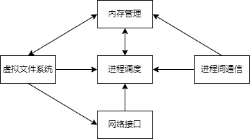
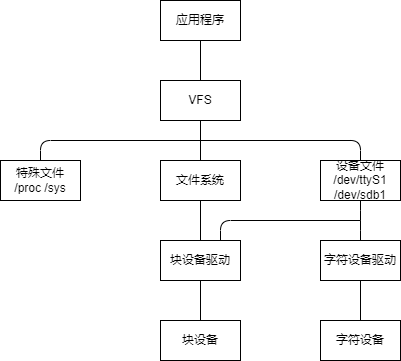
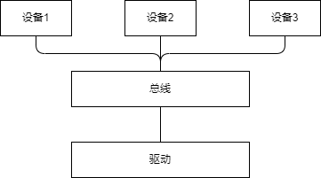
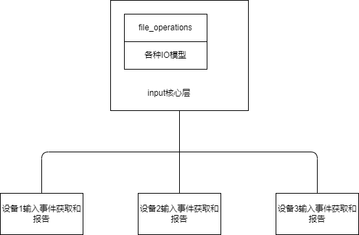
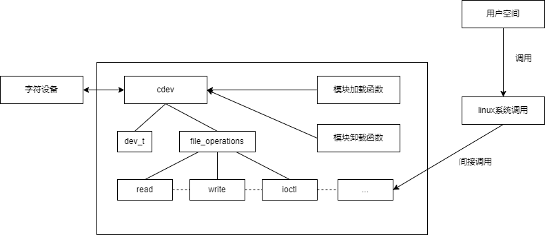
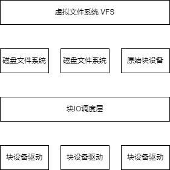
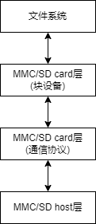
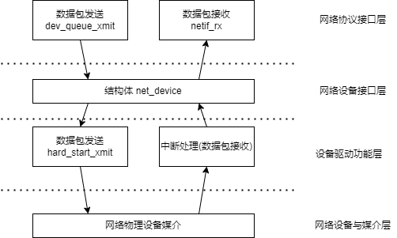
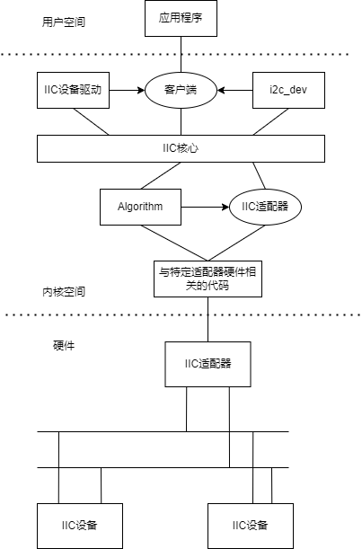
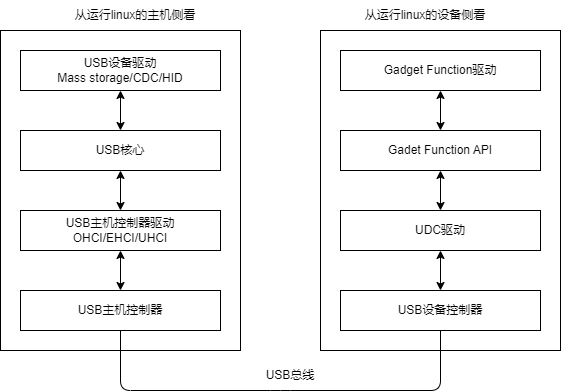

# 驱动基础
## 内核
### linux内核组成部分
linux内核主要由进程调度SCHED、内存管理MM、虚拟文件系统VFS、网络接口NET、进程间通信IPC组成。   
   

## 文件系统
文件系统与设备驱动关系   

## 并发

## 阻塞与非阻塞io

## 异步通知与异步io

## 中断与时钟

## 内存与io访问

## 驱动软件架构
linux设备和驱动的分离   
   

linux驱动的分层   
   

## 设备树
### DTS
文件.dts是一种ASCII文本格式的设备树描述   
.dtsi类似于C语言的头文件   

### DTC
dtc是将.dts编译为dtb的工具   

### DTB
文件.dtb是.dts被dtc编译后的二进制格式的设备树描述    

# 驱动分类
## 字符设备驱动
字符设备驱动结构   

## 块设备驱动
linux块设备子系统   
   

linuxMMC子系统   
   

## 网络设备驱动
网络设备驱动体系结构   
   

## IIC设备驱动
IIC体系结构   
   

## USB设备驱动
USB设备驱动结构   
   
