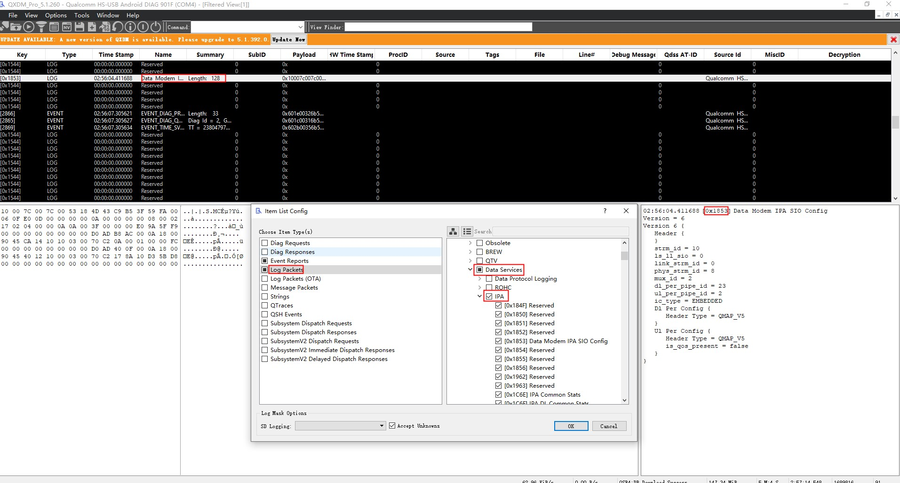

# 1. 介绍
## 1.1. 功能
IPA IP accelerator   
modem IPA是一个独立的硬件块，可以从MPSS和APSS访问。它取代了上一代移动数据modem（MDM）芯片组的A2 PER块。   

1. 创建从modem子系统到应用程序和外围接口的直接硬件路径
2. 执行解密
3. 执行IP数据包过滤、路由和头添加和删除
4. 聚合和非聚合RNDI
5. 执行网络地址转换（NAT）
6. 卸载Wi-Fi移动热点
7. 支持XLAT（RFC 6877）
8. 桥接以太网

## 1.2. modem IPA 系统结构
   

# 2. IPA 功能 Hexagon
## 2.1. Hexagon IPA 驱动特点
以下是Hexagon IPA 驱动的特点   
1. 代替了以前MDMs使用的A2 PER驱动   
2. 通过IPA管理WWAN/Hexagon上的所有数据路径   

以下是Hexagon IPA 驱动的功能   
1. 管理 IPA<--> Hexagon BAM 管道
2. 管理WAN DL 过滤/路由表
3. 管理RmNet/MBIM调用的标头插入表
4. 管理RmNet/MBIM呼叫的UL 过滤/路由表
5. 管理解密规则表
6. 基于活动的IPA时钟选择
7. IPA调试支持
8. 数据/控制路径统计记录
9. RmNet或MBIM调用上的端到端流控制
10. 通过高通调制解调器接口（QMI）进行驱动程序间通信
11. 使用IPA过滤来卸载以下UL软件路径中的包检查用例
    1. DHCP/IP片段数据包
    2. Qos 匹配
    3. 数据包优先级(TCP ACK)
    4. IPv6前缀比较

## 2.2. 使能IPA log packages

### 2.2.1. IPA_STATS
    Log code – 0x184F
    Description – 包含所有 IPA 驱动程序统计信息快照的定期日志

### 2.2.2. IPA_IPLFTR_STATS
    Log code – 0x1850
    Description – 包含所有 IPA 驱动程序筛选器命中统计信息快照的定期日志

### 2.2.3. IPA_SIO_CFG
    Log code – 0x1853
    Description – 建立新的QMI调用时事件触发的日志;捕获 SIO 配置。例如，聚合参数

### 2.2.4. IPA_WAN_CFG
    Log code – 0x1854
    Description – 启动新持有者时触发的事件日志;捕获持有者配置。例如，启用了 DPL

### 2.2.5. IPA_FLTR_TBL_UPDATE
    Log code – 0x1855
    Description – 添加新的过滤规则时事件触发的日志;转储新的筛选器表

### 2.2.6. IPA_RTNG_TBL_UPDATE
    Log code – 0x1856
    Description – 添加新路由规则时事件触发的日志;转储新路由表

## 2.3. 分析IPA_STATS日志数据包
    IPA_STATS日志数据包包含以下部分：
    CFG – IPA 驱动程序维护顶级配置信息
    CTL – IPA 驱动程序维护所有 CTL 统计信息
    DL – IPA 驱动程序维护所有 DL 统计信息
    UL – IPA 驱动程序维护所有 UL 统计数据
    MHI – IPA 驱动程序维护所有 MHI 统计信息

## 2.4. 分析IPA下载警告统计
    IPA DL警告统计信息如下：
    p_drop_excep_pkts–IPA驱动程序由于IP异常而丢弃的数据包数
    p_drop_excep_bytes–IPA驱动程序由于IP异常而丢弃的字节数
    p_drop_holb_pkts–QMI呼叫断开时IPA驱动程序清除的数据包数
    p_drop_holb_bytes–QMI呼叫断开时IPA驱动程序清除的字节数
    num_ooo_frag_drops–超时后丢弃的IPv4无序片段数
    num_desc_pipe_full–由于硬件BAM描述符队列已满，IPA驱动程序无法将DL数据包编程到IPA硬件的次数
    num_imm_cmd_buf_full–因为硬件立即命令队列已满，IPA驱动程序无法将DL数据包编程到IPA的次数num_pdcp_wm_dne_pkts–pdcp中丢弃的数据包的累积数量→IPA水印由于队列溢出
    num_pdcp_wm_dne_bytes–pdcp中丢弃的累积字节数→IPA水印由于队列溢出
    num_sio_wm_dne_pkts–DS中丢弃的数据包的累积数量→IPA水印到期队列溢出
    num_sio_wm_dne_bytes–DS中丢弃的累积字节数→IPA水印由于队列溢出
    num_ds_wm_dne_pkts–IPA中丢弃的数据包的累积数量→DS水印到期排队溢出（已过滤或未桥接数据）
    num_ds_wm_dne_bytes–IPA中丢弃的累积字节数→DS水印由于队列溢出（已过滤或未桥接数据）

## 2.5. 分析IPA上传警告统计
    以下是各种IPA DL警告统计信息：
    p_drop_pkts–IPA驱动程序丢弃的数据包数
    p_drop_bytes–IPA驱动程序丢弃的字节数
    p_drop_excep_pkts–IPA驱动程序由于IP异常而丢弃的数据包数
    num_sio_wm_dne_pkts–IPA中丢弃的数据包数→队列导致的DS水印溢流
    num_sio_wm_dne_bytes–IPA中丢弃的字节数→队列导致的DS水印溢流

## 2.6. 分析IPA_SIO_CFG log 包
    以下是重要的日志包参数：
    DL_PER_CFG–显示为外围管道上的调用协商的DL聚合参数
    Header type–QMAP、QMAPv3、MBIM等
    max_aggr_pkts–聚合最大数据包限制
    max_aggr_bytes–聚合最大字节限制

    UL_PER_CFG–显示为外围管道上的调用协商的UL聚合参数
    Header type–QMAP、QMAPv3、MBIM等
    max_aggr_pkts–聚合最大数据包限制
    max_aggr_bytes–聚合最大字节限制

## 2.7. 使能IPA 事件报告
    以下是IPA事件报告：
    IPA_DROP_PKT_DL
    事件代码–0x09F9
    描述–每当数据包在DL中丢失时引发的事件；在事件中捕获丢弃原因和数据包长度

    IPA_DROP_PKT_UL
    事件代码–0x09FA
    描述–每当在事件中捕获数据包时引发的事件

# 3. IPA 功能 Arm Cortex-A7
    Arm Cortex-A7 IPA 软件特点
    硬件加电初始化
    IPA共享内存管理
    Hexagon IPA驱动 IPC通信
    数据路径配置
    管理WLAN和USB端点上的LAN/WAN过滤
    管理去往LAN客户端的数据包路由
    管理NAT表
    管理（与Hexagon IPA驱动程序一起）与调制解调器数据路径之间的数据包路由
    通过外围设备设置BAM到BAM和/或BAM到SYS模式数据路径
    通过软件数据路径的IPA进行数据传输
    省电
    与外围驱动器协调IPA时钟选通
    选择（独立）通过RPM开启/关闭IPA时钟

## 3.1. 在Arm Cortex-A7 上使能IPA packets log

### 3.1.1. 内核dmesg log
    adb shell dmesg | tee dmesg_log.txt

### 3.1.2. IPA log
    cat /sys/kernel/debug/ipa/hdr – 显示在IPA中注册的标头
    cat /sys/kernel/debug/ipa/ip4_rt – 显示IPA中的IPv4路由规则
    cat /sys/kernel/debug/ipa/ip4_flt – 显示IPA中的IPv4筛选规则
    cat /sys/kernel/debug/ipa/ip6_rt – 显示IPA中的IPv6路由规则
    cat /sys/kernel/debug/ipa/ip6_flt – 在IPA中显示IPv6筛选规则
    cat /sys/kernel/debug/ipa/stats – 显示IPA统计信息
    cat /sys/kernel/debug/ipa/msg – 显示WLAN发送到IPA的消息
    cat /sys/kernel/debug/ipa/ip4_nat – 显示IPA NAT表
    cat /sys/kernel/debug/ipa/wstats – 显示WLAN呼叫的IPA统计信息

### 3.1.3. 从Cortex-A7收集一般信息
    ifconfig
    route –n
    brctl show
    conntrack –L

### 3.1.4. 从A7收集TCPDUMP
    tcpdump -i bridge0 -w bridge0.pcap

### 3.1.5. 要手动启动IPACM并从启动中获取完整的IPACM日志
    1. Power on the device
        a. adb shell or in serial port – serial port is used when issue is related to USB cable plug-in/out operation.
        b. cd etc/init.d
        c. mv start_ipacm_le start_ipacm_le_bk – disables the Daemon mode
        d. reboot
        e. ps -ef – ensures IPACM is not running
        f. adb shell or in serial port
        g. cd /usr
        h. ipacm > ipacm_log.txt & – issue this command to start IPACM and write to file under /usr
    2. Run IPACM before bringing up any interface

### 3.1.6. 收集资源管理器日志详细驱动程序操作
    mount -t debugfs none /sys/kernel/debug/
    klogd -c 8
    echo "file ipa_rm.c +p" > /sys/kernel/debug/dynamic_debug/control
    echo "file ipa_rm_resource.c +p" > /sys/kernel/debug/dynamic_debug/control
    echo "file ipa_client.c +p" > /sys/kernel/debug/dynamic_debug/control
    echo "file ipa_utils.c +p" > /sys/kernel/debug/dynamic_debug/control
    echo "file ipa_rm_dependency_graph.c +p" > /sys/kernel/debug/dynamic_debug/control
    Then collect dmesg log
    cat /sys/kernel/debug/ipa/rm_stats – prints all producer resources, their consumers’dependencies, and states.

### 3.1.7. 收集ECM_IPA 驱动日志详细驱动程序操作
    mkdir /d
    mount -t debugfs none /d
    echo "module ecm_ipa +pmflt" > /d/dynamic_debug/control
    cat /d/ecm_ipa/outstanding – Current outstanding counter (this shows how many Tx [Device→Host] packets were not proceeded by hardware)

### 3.1.8. 收集RNDIS_IPA 驱动日志详细驱动程序操作
    mkdir /d
    mount -t debugfs none /d
    echo "module rndis_ipa +pmflt" > /d/dynamic_debug/control
    cat /d/rndis_ipa/outstanding – Current outstanding counter (this shows how many Tx [Device→Host] packets were not proceeded by hardware)
    
### 3.1.9. 要收集系留桥驱动日志
    mount -t debugfs none /sys/kernel/debug 
    echo 'file teth_bridge.c +p' > /sys/kernel/debug/dynamic_debug/control

### 3.1.10. IPA 输出统计描述
    cat /sys/kernel/debug/ipa/stats
        sw_tx – 从A7发送的ECM/RNDIS数据包数
        hw_tx – 从A7发送的QMAP数据包数
        tx_compl – 接收到的发送完成数
        wan_rx – 在A7从Hexagon接收的数据包数
        stat_compl – 硬件路径上来自ECM/RNDIS/WLAN的数据包数
        lan_aggr_close – 在LAN Rx管道上关闭聚合的次数
        wan_aggr_close – 在WAN Rx管道上关闭聚合的次数
        act_clnt – 应用程序处理器端IPA时钟的向上选择数
        con_clnt_bmap – 连接客户端的位图；位n对应于EP n
        lan_rx_excp[0: IPA_EXCP_DEAGGR] – 反聚集异常数
        lan_rx_excp[2: IPA_EXCP_IP] – 非IP数据包异常数
        lan_rx_excp[3: IPA_EXCP_IHL] – 错误IP数据包标头长度异常数
        lan_rx_excp[4: IPA_EXCP_FRAG_MISS] – 片段未命中异常数
        lan_rx_excp[5: IPA_EXCP_SW] – 软件异常数
        lan_rx_excp[6: IPA_EXCP_NAT] – NAT异常数
        lan_rx_excp[7: IPA_EXCP_NONE] – 实际发送到应用程序处理器的LAN Rx数据包数

### 3.1.11. WLAN 输出统计描述
    cat /sys/kernel/debug/ipa/wstats
    Client IPA_CLIENT_WLAN1_PROD statistics
        Avail FIFO Desc – 可用的自由可用的描述符数
        Rx Pkts Rcvd – WLAN驱动程序发送到IPA的数据包
        Rx Pkts Status Rcvd – UL中从IPA硬件接收的状态数据包
        Rx DH Rcvd – WLAN发送的数据描述符
        Rx DH Processed – IPA处理的数据描述符
        Rx DH Sent Back – 数据描述符从IPA发送回WLAN驱动程序进行回收
        Rx Pkt Leak – 未从IPA硬件接收到状态的数据包，这会导致内存泄漏
        Rx DP Fail – 数据包无法从IPA驱动程序传输到IPA硬件
    Client IPA_CLIENT_WLANx_CONS statistics
        Tx Pkts Received – 从IPA硬件接收的数据包
        Tx Pkts Sent – IPA发送到WLAN的数据包
        Tx Pkts Dropped – IPA丢弃的数据包
    All WLAN consumer pipes statistics
        Tx Comm Buff Allocated – 以DL为单位分配的缓冲区总数
        Tx Comm Buff Avail – DL中可用的空缓冲区
        Total Tx Pkts Freed – 循环缓冲区计数

