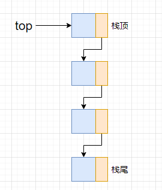
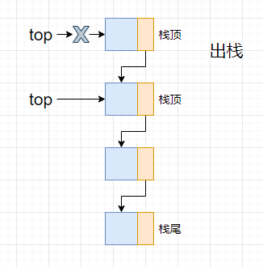
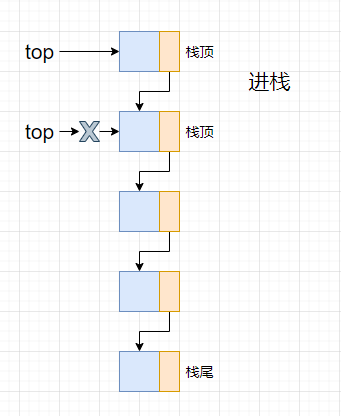
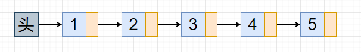
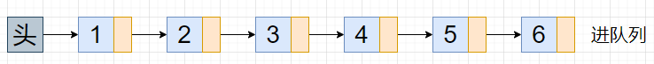
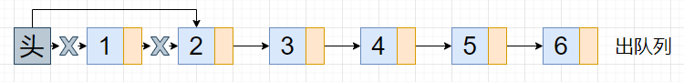

## 栈
栈是仅限于在表尾进行插入和删除操作的线性表

>链栈

>出栈

>入栈

* 栈的应用：四则运算表达式求值

后缀表达式：所有的符号都是在要运算数字的后面出现
>后缀表达式计算结果    
规则：从左到右遍历表达式的每个数字和符号，遇到数字就进栈，遇到是符号，就将处于栈顶数字及栈顶下一个数字这两个数字出栈，进行运算（栈顶数字位于运算符右端，栈顶下一个数字位于运算符左端），运算结果进栈，一直到最终获得结果

>中缀表达式转后缀表达式   
规则：从左到右遍历中缀表达式的每个数字和符号，若是数字就输出，即成为后缀表达式的一部分；若是符号，这个符号先不入栈，然后判断个符号与栈顶符号的优先级，是右括号或优先级不高于栈顶符号，则栈中元素依次出栈输出，并将当前符号进栈，一直到最终输出后缀表达式为止

## 队列
队列是只允许在一端进行插入操作，而另一端进行删除操作的线性表

>链队列

>入队列

>出队列

